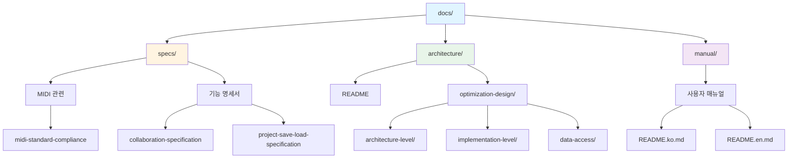
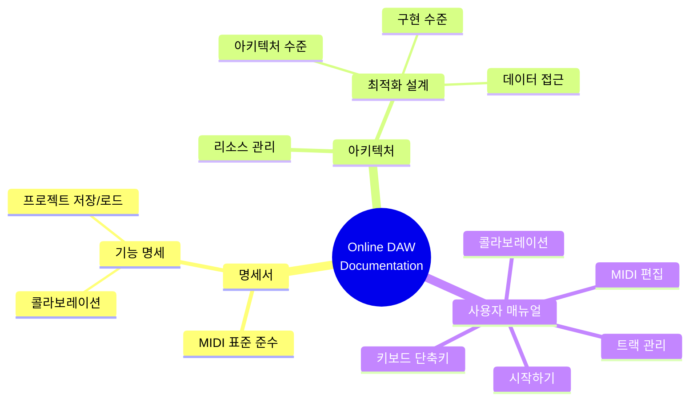

# Online DAW 문서

**Document Version**: 1.0  
**Software Version**: 0.1.0  
**Last Updated**: 2026-01-14

---

이 폴더는 Online DAW 프로젝트의 모든 문서를 포함합니다.

## 폴더 구조

### `/specs`
프로젝트 구현 명세서 및 표준 준수 문서

#### MIDI 관련
- `midi-standard-compliance.ko.md` - MIDI 표준 준수 스펙 (한국어)
- `midi-standard-compliance.en.md` - MIDI Standard Compliance Specification (English)

#### 기능 명세서
- `collaboration-specification.ko.md` - 콜라보레이션 기능 명세서 (서버 API, P2P 통신, 예외 처리 포함) (한국어)
- `collaboration-specification.en.md` - Collaboration Feature Specification (English)
- `project-save-load-specification.ko.md` - 프로젝트 저장/로드 명세서 (한국어)
- `project-save-load-specification.en.md` - Project Save/Load Specification (English)

### `/architecture`
시스템 아키텍처 및 설계 문서

#### 주요 문서
- [`README.ko.md`](./architecture/README.ko.md) - 아키텍처 문서 개요 (한국어)
- [`README.en.md`](./architecture/README.en.md) - Architecture Documentation Overview (English)

#### 최적화 설계
- [`optimization-design/index.ko.md`](./architecture/optimization-design/index.ko.md) - 성능 최적화 기법 카테고리별 정리 (한국어)
  - **아키텍처 수준**: 렌더링 아키텍처, 리소스 관리
  - **구현 수준**: 오디오 재생, UI, 데이터 접근 최적화

### `/manual`
사용자 매뉴얼 및 가이드 문서

#### 사용자 매뉴얼
- [`README.ko.md`](./manual/README.ko.md) - 사용자 매뉴얼 (한국어)
  - 시작하기, 기본 조작, 키보드 단축키
  - MIDI 편집, 트랙 관리, 재생 및 녹음
  - 프로젝트 저장/로드, 콜라보레이션, 문제 해결
- [`README.en.md`](./manual/README.en.md) - User Manual (English)

---

## 문서 작성 규칙

1. **언어**: 한국어와 영어 버전 모두 제공 (가능한 경우)
2. **형식**: Markdown (.md)
3. **버전 관리**: 문서 상단에 버전 정보 명시
4. **링크**: 상대 경로 사용

---

## 문서 카테고리별 설명

### 명세서 (Specifications)
기능의 동작 방식, API, 프로토콜 등을 명확히 정의한 문서입니다.
- MIDI 표준 준수 사항
- 파일 포맷 정의
- API 스펙
- 프로토콜 정의

### 아키텍처 문서 (Architecture)
시스템의 구조, 설계 결정, 최적화 기법 등을 설명한 문서입니다.
- 모듈 경계 및 의존성
- 최적화 기법
- 리소스 관리

---

## 관련 문서

### 프로젝트 루트
- `README.md` - 프로젝트 개요 (English)
- `README.ko.md` - 프로젝트 개요 (한국어)

---

## 테스트

- `npm run test:unit`: 템포맵 기반 시간 변환, SMF export 동일 tick 이벤트 정렬 등 핵심 정합성 테스트
- `npm run test:midi-all`: 기존 MIDI 관련 회귀 테스트

---

**Document Version**: 1.0  
**Software Version**: 0.1.0  
**Last Updated**: 2026-01-14
