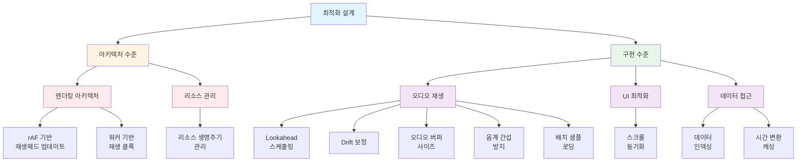

# 아키텍처 문서

**Document Version**: 1.0  
**Software Version**: 0.1.0  
**Last Updated**: 2026-01-14

---

## 문서 구조

### 최적화 설계
- [`optimization-design/index.ko.md`](./optimization-design/index.ko.md) - 성능 최적화 기법 카테고리별 정리
  - **아키텍처 수준**: 렌더링 아키텍처 최적화
  - **구현 수준**: 오디오 재생, UI, 데이터 접근 최적화

---

## 최적화 설계 문서

최적화 설계 문서는 카테고리별로 분리되어 있습니다:

### 아키텍처 수준 최적화
- [rAF 기반 재생헤드 업데이트](./optimization-design/architecture-level/raf-playback-head.md)
- [워커 기반 재생 클록](./optimization-design/architecture-level/worker-playback-clock.md)

### 구현 수준 최적화

#### 오디오 재생 최적화
- [Lookahead 스케줄링](./optimization-design/implementation-level/lookahead-scheduling.md)
- [Drift 보정 시스템](./optimization-design/implementation-level/drift-correction.md)
- [조절 가능한 오디오 버퍼 사이즈](./optimization-design/implementation-level/audio-buffer-size.md)
- [같은 음계 간섭 방지](./optimization-design/implementation-level/pitch-class-interference-prevention.md)
- [배치 샘플 로딩](./optimization-design/implementation-level/batch-sample-loading.md)

#### UI 최적화
- [MIDI 에디터 스크롤 동기화](./optimization-design/implementation-level/scroll-synchronization.md)

#### 데이터 접근 최적화
- [데이터 인덱싱](./optimization-design/data-access/indexing.md)
- [시간 변환 캐싱](./optimization-design/data-access/timing-cache.md)

---

## 관련 문서

### 기타
- [`../reference/audio-buffer-size-specification.ko.md`](../reference/audio-buffer-size-specification.ko.md) - 버퍼 사이즈 스펙 (한국어)
- [`../reference/audio-buffer-size-specification.en.md`](../reference/audio-buffer-size-specification.en.md) - 버퍼 사이즈 스펙 (English)

---

**Document Version**: 1.0  
**Software Version**: 0.1.0  
**Last Updated**: 2026-01-14

