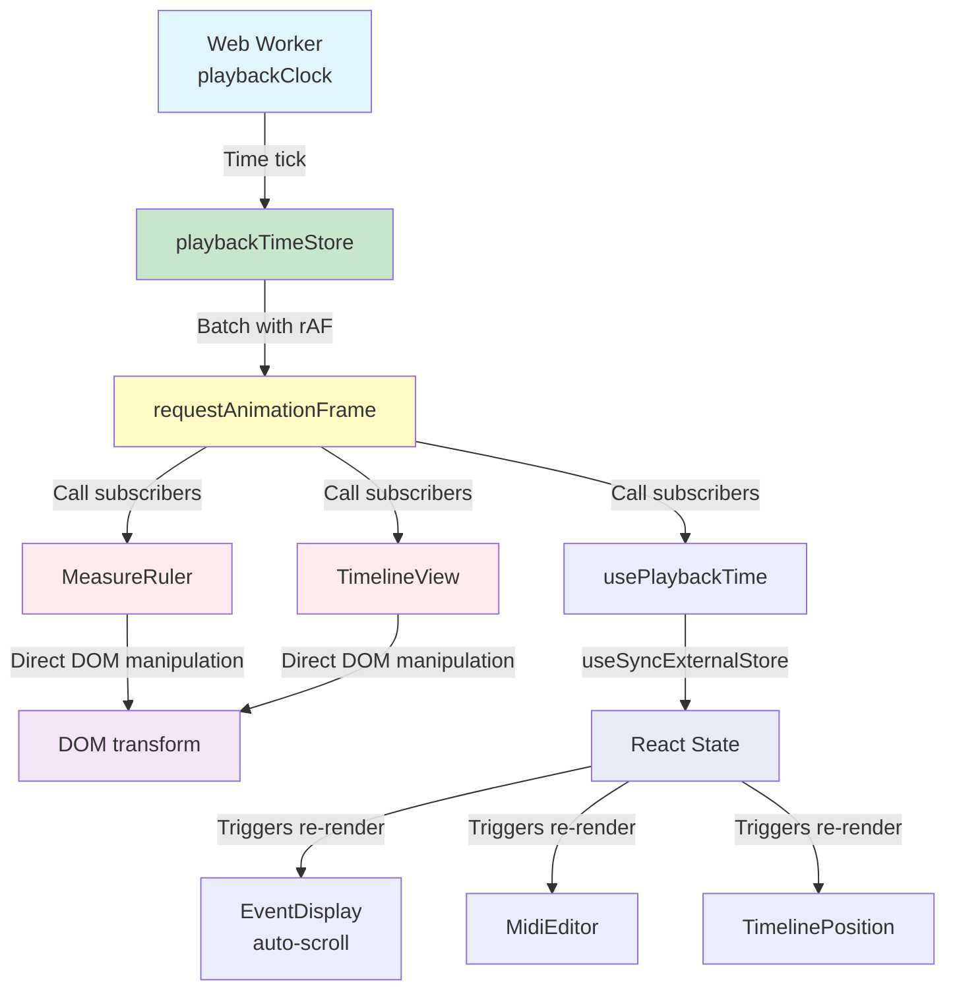
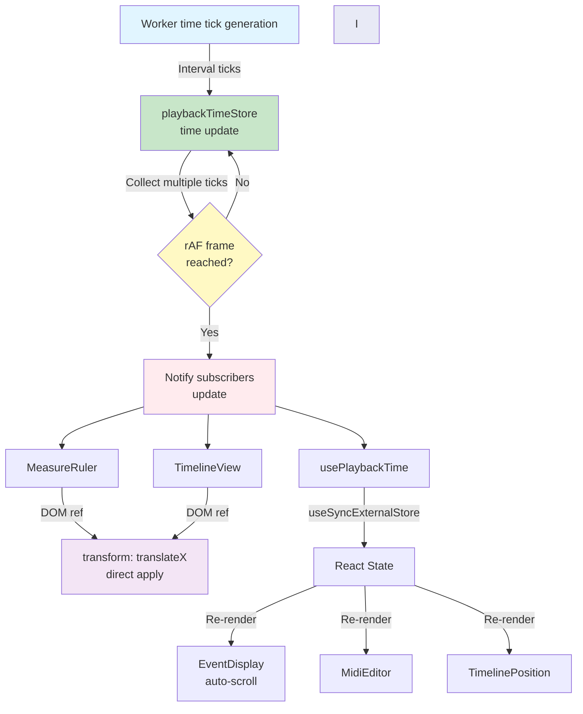

# rAF-based Playback Head Update

**Document Version**: 1.0  
**Software Version**: 0.1.0  
**Last Updated**: 2026-01-14

**Category**: Architecture Level - Rendering Architecture

---

## Overview

An optimization technique that separates React render paths from playback head updates to reduce main thread load and prevent frame drops.

---

## Design Goals

- Separate React render paths from playback head updates
- Reduce main thread load and prevent frame drops
- Stable playback head updates even with large track lists

---

## Implementation Location

- `src/utils/playbackTimeStore.ts`: Playback time store and rAF management
- `src/hooks/usePlaybackTime.ts`: React hook (for state updates)
- `src/components/EventDisplay/MeasureRuler.tsx`: Direct DOM manipulation for playback head
- `src/components/EventDisplay/TimelineView.tsx`: Direct DOM manipulation for playback head
- `src/components/EventDisplay/EventDisplay.tsx`: Uses `usePlaybackTime` for auto-scroll

---

## Architecture Features

### Render Path Separation
Separates React state updates from direct DOM manipulation to prevent unnecessary re-renders.

### Data Flow

```mermaid
sequenceDiagram
    participant Worker as Web Worker<br/>(playbackClock)
    participant Store as playbackTimeStore
    participant RAF as requestAnimationFrame
    participant Component as MeasureRuler<br/>EventDisplay
    participant DOM as DOM Element
    participant React as React State
    
    Worker->>Store: Playback time tick<br/>(subscribePlaybackClock)
    Note over Store: Internal time update<br/>(collect multiple ticks)
    Store->>RAF: Batch with rAF frame<br/>call subscribers
    RAF->>Component: Time update notification
    Component->>DOM: transform: translateX()<br/>direct apply (using ref)
    Note over Component,React: Components with direct<br/>DOM manipulation operate<br/>without React re-renders
    Note over React: usePlaybackTime hook uses<br/>useSyncExternalStore and<br/>triggers re-render every tick
    Component-.->|uses usePlaybackTime| React
```

### Architecture Structure



1. Worker passes playback time ticks via `subscribePlaybackClock`
2. `playbackTimeStore` updates internal time → batches with rAF and calls subscribers
3. MeasureRuler / TimelineView directly apply `transform: translateX()` to DOM ref (no React re-render)
4. `usePlaybackTime` hook uses `useSyncExternalStore` and triggers re-render every tick. Components using it (`EventDisplay`, `MidiEditor`, `TimelinePosition`) are continuously updated during playback

### Module Responsibilities
- `playbackTimeStore`: Operates as an independent time management module
- Components: Update playback head position via direct DOM manipulation

---

## Operation



### 1. Receive Time Ticks from Worker
The worker generates playback time ticks at set intervals and passes them to `playbackTimeStore`.

### 2. Batch Updates with rAF
`playbackTimeStore` batches multiple ticks with rAF frames and passes them to subscribers.
This reduces unnecessary updates and aligns with browser rendering cycles.

### 3. Direct DOM Manipulation
Components like `MeasureRuler` and `TimelineView` directly apply `transform: translateX()` via DOM ref instead of React state updates. This enables smooth playback head updates without React re-renders.

### 4. React State Update (usePlaybackTime)
The `usePlaybackTime` hook subscribes to `playbackTimeStore` using `useSyncExternalStore`, triggering re-renders every tick. Components using this hook (`EventDisplay` for auto-scroll, `MidiEditor`, `TimelinePosition`) are continuously updated during playback.

---

## Performance Optimization Hints

### CSS Optimization
- Apply CSS `will-change: transform` (`.playhead` element)
- Utilize GPU acceleration for layer separation

### Visibility Range Optimization
- Control display with `opacity` and `pointer-events` when out of view
- Prevent unnecessary rendering

---

## Effects

### Performance Improvement
- Significantly reduced re-render frequency even with large track lists during playback
- Mitigated frame drops/freezing
- Reduced periodic freezing regardless of buffer size changes

### User Experience
- Smooth playback head movement
- Stable playback even with large projects

---

## Related Documents

- [`Worker-based Playback Clock`](./worker-playback-clock.en.md)

---

**Last Updated**: 2026-01-14

