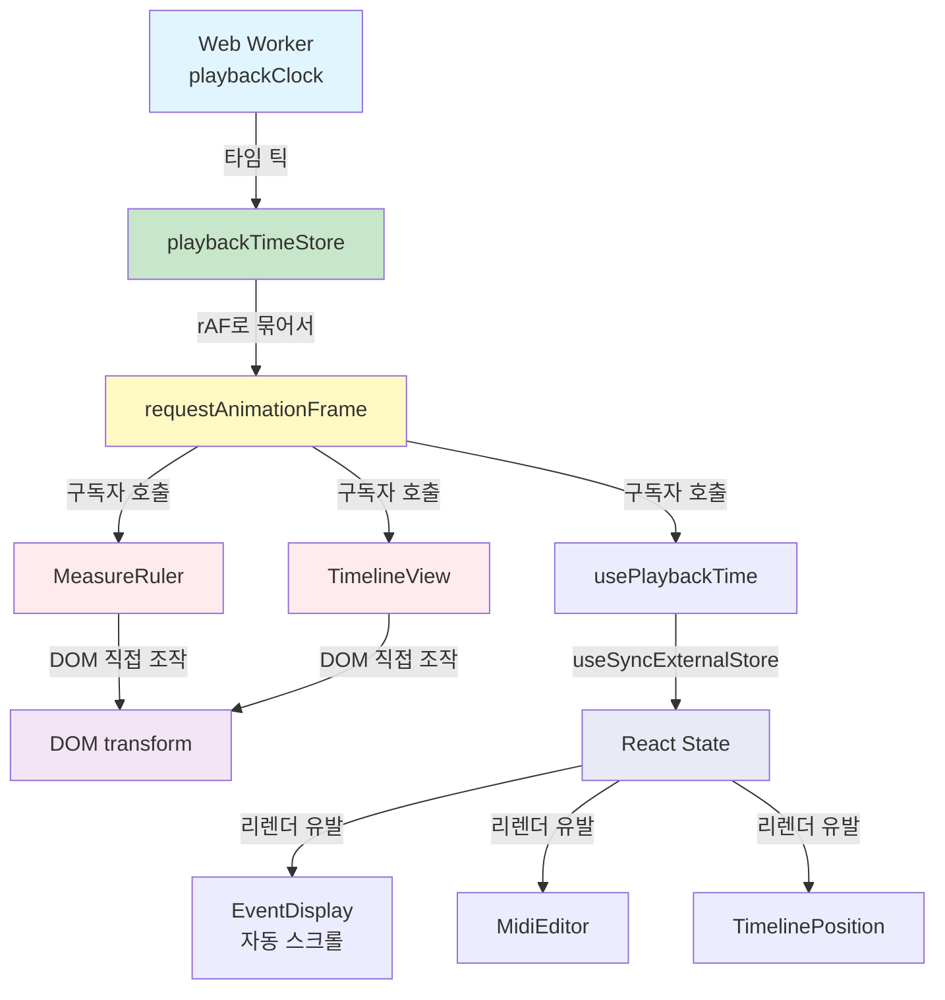
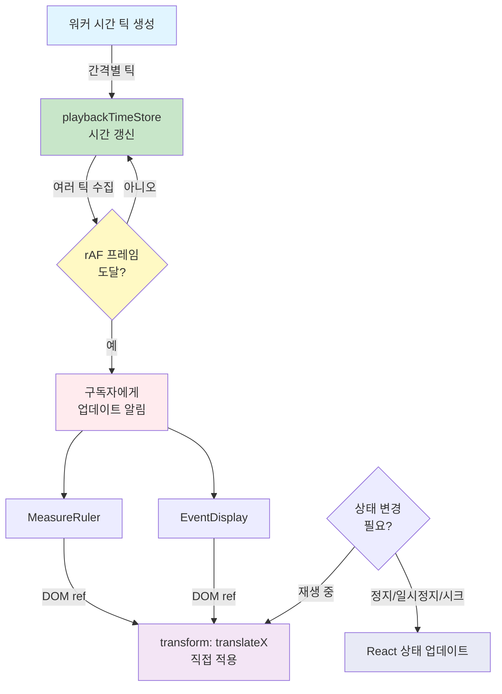

# rAF 기반 재생헤드 업데이트

**Document Version**: 1.0  
**Software Version**: 0.1.0  
**Last Updated**: 2026-01-14

**카테고리**: 아키텍처 수준 - 렌더링 아키텍처

---

## 개요

React 렌더 경로와 재생헤드 업데이트를 분리하여 메인 스레드 부하를 감소시키고 프레임 드랍을 방지하는 최적화 기법입니다.

---

## 설계 목표

- React 렌더 경로와 재생헤드 업데이트 분리
- 메인 스레드 부하 감소 및 프레임 드랍 방지
- 대형 트랙 리스트에서도 안정적인 재생헤드 업데이트

---

## 구현 위치

- `src/utils/playbackTimeStore.ts`: 재생 시간 저장소 및 rAF 관리
- `src/hooks/usePlaybackTime.ts`: React 훅 (상태 업데이트용)
- `src/components/EventDisplay/MeasureRuler.tsx`: 재생헤드 DOM 직접 조작
- `src/components/EventDisplay/TimelineView.tsx`: 재생헤드 DOM 직접 조작
- `src/components/EventDisplay/EventDisplay.tsx`: 자동 스크롤용 `usePlaybackTime` 사용

---

## 아키텍처 특징

### 렌더링 경로 분리
React 상태 업데이트와 DOM 직접 조작을 분리하여 불필요한 리렌더링을 방지합니다.

### 데이터 흐름

```mermaid
sequenceDiagram
    participant Worker as Web Worker<br/>(playbackClock)
    participant Store as playbackTimeStore
    participant RAF as requestAnimationFrame
    participant Component as MeasureRuler<br/>EventDisplay
    participant DOM as DOM Element
    participant React as React State
    
    Worker->>Store: 재생 타임 틱 전달<br/>(subscribePlaybackClock)
    Note over Store: 내부 시간 갱신<br/>(여러 틱 수집)
    Store->>RAF: rAF 프레임으로 묶어서<br/>구독자 호출
    RAF->>Component: 시간 업데이트 알림
    Component->>DOM: transform: translateX()<br/>직접 적용 (ref 사용)
    Note over Component,React: DOM 직접 조작 컴포넌트는<br/>React 리렌더 없이 동작
    Note over React: usePlaybackTime 훅은<br/>useSyncExternalStore로<br/>매 tick마다 리렌더 유발
    Component-.->|usePlaybackTime 사용| React
```

### 아키텍처 구조



1. 워커가 `subscribePlaybackClock`로 재생 타임 틱 전달
2. `playbackTimeStore`가 내부 시간 갱신 → rAF로 묶어서 구독자 호출
3. MeasureRuler / TimelineView는 DOM ref에 `transform: translateX()` 직접 적용 (React 리렌더 없음)
4. `usePlaybackTime` 훅은 `useSyncExternalStore`로 매 tick마다 리렌더를 유발하며, 이를 사용하는 컴포넌트들(`EventDisplay`, `MidiEditor`, `TimelinePosition`)은 재생 중에도 계속 업데이트됨

### 모듈 책임
- `playbackTimeStore`: 독립적인 시간 관리 모듈로 동작
- 컴포넌트: DOM 직접 조작으로 재생헤드 위치 업데이트

---

## 동작 방식



### 1. 워커에서 시간 틱 수신
워커가 설정된 간격으로 재생 시간 틱을 생성하여 `playbackTimeStore`에 전달합니다.

### 2. rAF로 묶어서 업데이트
`playbackTimeStore`는 여러 틱을 rAF 프레임으로 묶어서 구독자에게 전달합니다.
이를 통해 불필요한 업데이트를 줄이고 브라우저 렌더링 주기에 맞춥니다.

### 3. DOM 직접 조작
`MeasureRuler`와 `TimelineView` 같은 컴포넌트는 React 상태 업데이트 대신 DOM ref를 통해 직접 `transform: translateX()`를 적용합니다. 이를 통해 React 리렌더 없이 부드러운 재생헤드 업데이트가 가능합니다.

### 4. React 상태 갱신 (usePlaybackTime)
`usePlaybackTime` 훅은 `useSyncExternalStore`를 사용하여 `playbackTimeStore`를 구독하며, 매 tick마다 리렌더를 유발합니다. 이 훅을 사용하는 컴포넌트들(`EventDisplay`의 자동 스크롤, `MidiEditor`, `TimelinePosition`)은 재생 중에도 계속 업데이트됩니다.

---

## 성능 최적화 힌트

### CSS 최적화
- CSS `will-change: transform` 적용 (`.playhead` 요소)
- GPU 가속을 활용하여 레이어 분리

### 가시 범위 최적화
- 가시 범위 벗어나면 `opacity`와 `pointer-events`로 표시 제어
- 불필요한 렌더링 방지

---

## 효과

### 성능 개선
- 재생 중 대형 트랙 리스트에서도 리렌더 빈도 대폭 감소
- 프레임 드랍/멈춤 현상 완화
- 버퍼 사이즈 변경과 무관하게 일정 주기 멈춤 감소

### 사용자 경험
- 부드러운 재생헤드 움직임
- 대형 프로젝트에서도 안정적인 재생

---

## 관련 문서

- [`워커 기반 재생 클록`](./worker-playback-clock.ko.md)

---

**Last Updated**: 2026-01-14

