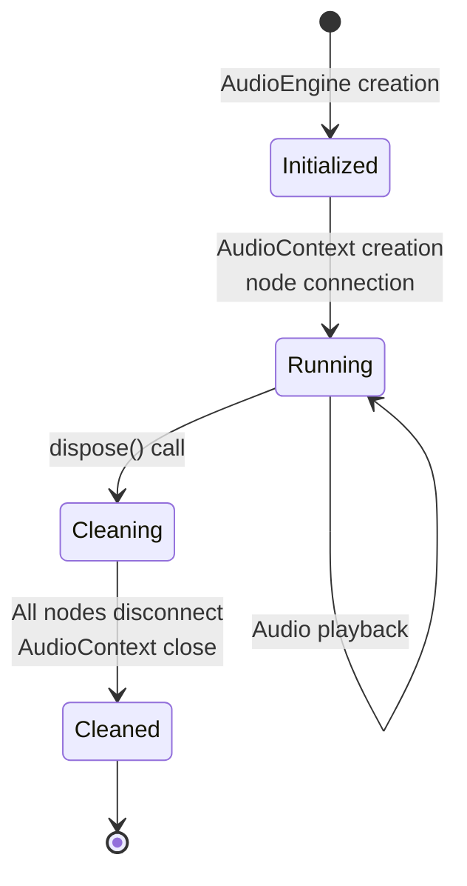
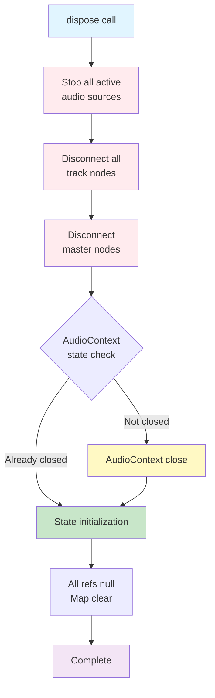
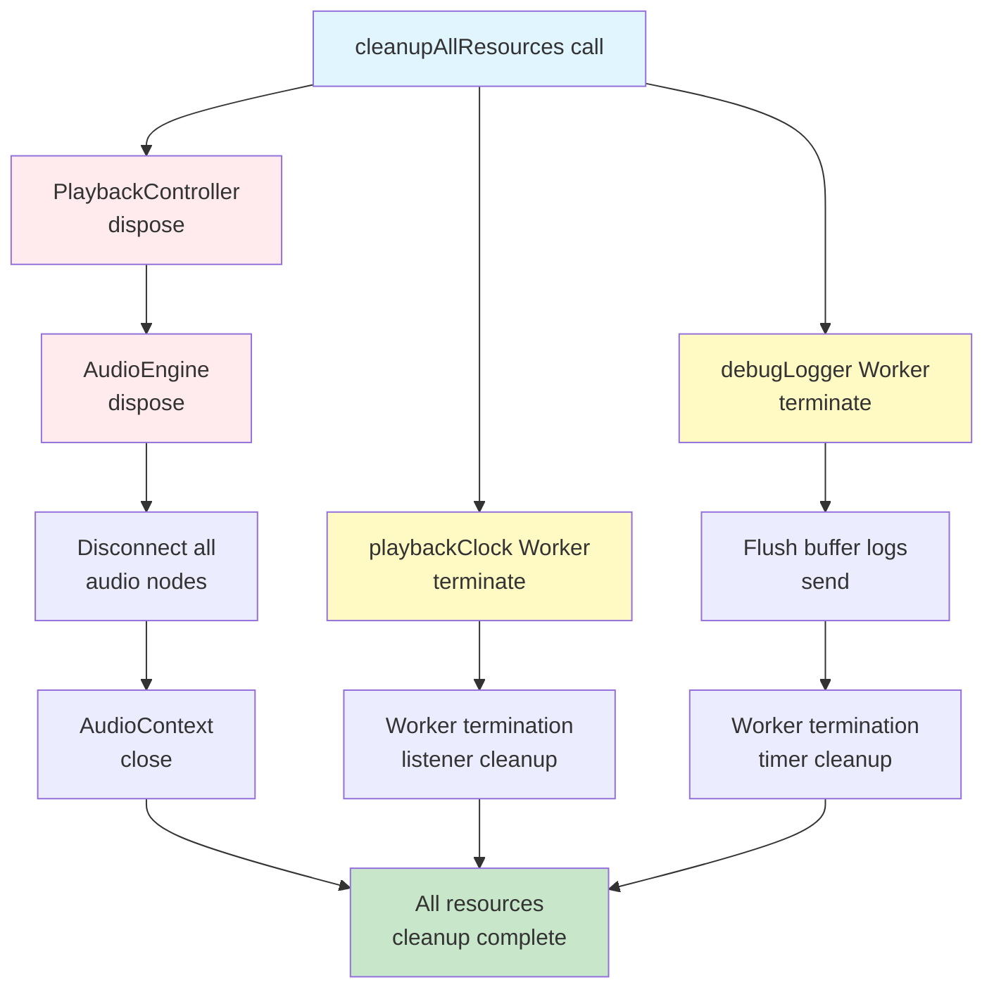
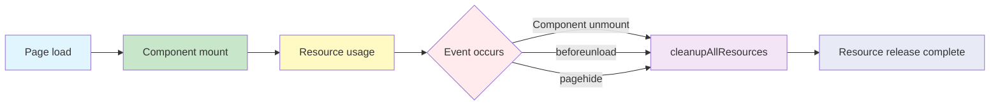

# Resource Lifecycle Management

**Document Version**: 1.0  
**Software Version**: 0.1.0  
**Last Updated**: 2026-01-14

**Category**: Architecture Level - Resource Management

---

## Overview

An optimization technique that systematically manages the lifecycle of audio engines and Web Workers to prevent memory leaks and ensure stability during page transitions.

---

## Goals

- Prevent memory leaks through complete AudioEngine resource release
- Prevent resource leaks through Worker instance cleanup
- Stable resource release during page transitions
- Logging control appropriate for development/production environments

---

## Implementation Location

- `src/core/audio/AudioEngine.ts`: dispose method
- `src/core/audio/PlaybackController.ts`: dispose method
- `src/utils/playbackClock.ts`: Worker termination API
- `src/utils/debugLogger.ts`: Worker termination API and logging switch
- `src/utils/resourceCleanup.ts`: Global cleanup function
- `src/pages/DawPage.tsx`: Cleanup call on page transition
- `src/components/MidiEditor/MidiEditor.tsx`: Cleanup on component unmount

---

## AudioEngine Lifecycle Management

### Lifecycle Flow



### dispose() Method

A method that cleans up and releases all AudioEngine resources.

#### Implementation



```typescript
async dispose(): Promise<void> {
  // 1. Stop all active audio sources
  this.stopAll();

  // 2. Disconnect all track nodes
  for (const trackNodes of this.trackNodes.values()) {
    trackNodes.gain.disconnect();
    trackNodes.leftAnalyser.disconnect();
    trackNodes.rightAnalyser.disconnect();
    trackNodes.splitter.disconnect();
  }
  this.trackNodes.clear();

  // 3. Disconnect master nodes
  this.masterGain?.disconnect();
  this.masterSplitter?.disconnect();
  this.masterLeftAnalyser?.disconnect();
  this.masterRightAnalyser?.disconnect();

  // 4. Close AudioContext
  if (this.context && this.context.state !== 'closed') {
    await this.context.close();
  }

  // 5. State initialization
  this.context = null;
  this.masterGain = null;
  // ... All refs null, Map clear
}
```

#### Features

- **Async processing**: Returns `Promise<void>` to wait for AudioContext closure
- **Error handling**: Only outputs warning logs on disconnect/close failure and continues
- **Complete cleanup**: All audio nodes, AudioContext, state initialization

#### Usage Location

- `MidiEditor.tsx`: Called in `useEffect` cleanup on component unmount
- `PlaybackController.ts`: dispose method of singleton instance (called in global cleanup)

### PlaybackController Lifecycle Management

PlaybackController is managed as a singleton instance and includes an internal AudioEngine.

#### dispose() Method

```typescript
async dispose(): Promise<void> {
  // Stop playback
  this.isPlaying = false;
  this.startToken += 1;
  
  // Clear schedule timer
  this.clearScheduleTimer();
  
  // Stop all audio sources
  this.engine.stopAll();
  
  // Release AudioEngine resources
  await this.engine.dispose();
  
  // State initialization
  this.scheduledUntil = 0;
  this.events = [];
  this.eventIndex = 0;
  this.projectSnapshot = null;
}
```

#### Features

- Stop playback and clear schedule timer
- Call internal AudioEngine dispose
- State initialization
- Called from global cleanup function

---

## Worker Lifecycle Management

### playbackClock Worker

Manages the lifecycle of the Worker that manages the playback clock.

#### Termination API

```typescript
export function terminatePlaybackClockWorker(): void {
  if (worker) {
    try {
      worker.terminate();
    } catch (error) {
      console.warn('[playbackClock] Error terminating worker:', error);
    }
    worker = null;
  }
  
  // Clear listeners
  listeners.clear();
  
  // Reset failure flag (to allow recreation)
  workerFailed = false;
}
```

#### Features

- Worker instance termination (`worker.terminate()`)
- Remove all listeners (`listeners.clear()`)
- Reset failure flag to allow recreation

### debugLogger Worker

Manages the lifecycle of the Worker that handles debug logging.

#### Termination API

```typescript
export async function terminateDebugLoggerWorker(flushBuffer = true): Promise<void> {
  // Send remaining logs in buffer (optional)
  if (flushBuffer && buffer.length > 0) {
    await flush();
  }
  
  // Clear timer
  if (flushTimer !== null) {
    clearTimeout(flushTimer);
    flushTimer = null;
  }
  
  // Terminate Worker
  if (worker) {
    try {
      worker.terminate();
    } catch (error) {
      console.warn('[debugLogger] Error terminating worker:', error);
    }
    worker = null;
  }
  
  // State initialization
  buffer = [];
  isFlushing = false;
  workerFailed = false;
}
```

#### Features

- Send remaining logs in buffer (optional, default: true)
- Clear timer
- State initialization
- Reset failure flag to allow recreation

---

## Global Resource Cleanup

### cleanupAllResources() Function

A global function that cleans up all resources at once.

#### Implementation Location

`src/utils/resourceCleanup.ts`

#### Resource Cleanup Flow



#### Function

```typescript
export async function cleanupAllResources(): Promise<void> {
  // 1. PlaybackController dispose (includes AudioEngine)
  await playbackController.dispose();
  
  // 2. Terminate playbackClock Worker
  terminatePlaybackClockWorker();
  
  // 3. Terminate debugLogger Worker (send remaining logs in buffer)
  await terminateDebugLoggerWorker(true);
}
```

#### Features

- **Unified management**: Clean up all resources in one place
- **Error handling**: Continue cleaning up other resources even if some fail
- **Async processing**: Wait for async operations of AudioEngine and debugLogger Worker

#### Call Timing

1. **Page unmount**: `useEffect` cleanup in `DawPage.tsx`
2. **Browser events**: `beforeunload`, `pagehide` event listeners

---

## Logging System Improvements

### Environment-based Logging Settings

Logging is disabled by default in production environments.

#### Implementation

```typescript
// Environment-based logging settings
const isProduction = import.meta.env?.MODE === 'production' || import.meta.env?.PROD === true;
let loggingEnabled = !isProduction; // Enabled in development, disabled in production
```

#### Features

- Vite statically replaces `import.meta.env` during production builds
- Minimize overhead with early return at runtime
- Code is included but not executed, minimizing performance impact

### Runtime Logging Control

Logging can be enabled/disabled at runtime from developer tools.

#### API

```typescript
// Enable/disable logging
setLoggingEnabled(enabled: boolean): void

// Check current logging status
isLoggingEnabled(): boolean
```

#### Features

- Runtime logging control
- Worker termination and buffer cleanup when logging is disabled
- Can be temporarily enabled for debugging purposes even in production

---

## Cleanup on Page Transition

### Resource Cleanup Timing



### React Component Unmount

Clean up resources when components unmount in `DawPage.tsx`.

```typescript
useEffect(() => {
  return () => {
    // Release resources on component unmount
    void cleanupAllResources();
  };
}, []);
```

### Browser Events

Also clean up resources on page exit/hide.

```typescript
useEffect(() => {
  const handleBeforeUnload = () => {
    void cleanupAllResources();
  };
  
  const handlePageHide = () => {
    void cleanupAllResources();
  };

  window.addEventListener('beforeunload', handleBeforeUnload);
  window.addEventListener('pagehide', handlePageHide);

  return () => {
    window.removeEventListener('beforeunload', handleBeforeUnload);
    window.removeEventListener('pagehide', handlePageHide);
  };
}, []);
```

#### Features

- `beforeunload`: Release resources before page exit
- `pagehide`: Release resources when page is hidden (important on mobile, etc.)
- Called without waiting for completion since it's an async function (for urgent page transitions)

---

## Performance Improvement Effects

### Memory Management

- **Memory leak prevention**: Remove memory leaks through AudioEngine and Worker cleanup
- **Resource release**: All resources are safely released on page transitions
- **Reusable**: Resources can be recreated by resetting failure flags

### Stability

- **Page transition stability**: Prevent errors during page transitions through resource release
- **Error handling**: Continue cleaning up other resources even if some fail
- **Complete cleanup**: All audio nodes, Workers, timers cleaned up

### Developer Experience

- **Logging control**: Automatic environment-based settings and runtime control
- **Debugging efficiency**: Can temporarily enable logging for debugging purposes even in production

---

## Related Documents

- [`Data Indexing`](../data-access/indexing.en.md)
- [`Timing Conversion Caching`](../data-access/timing-cache.en.md)

---

**Last Updated**: 2026-01-14

