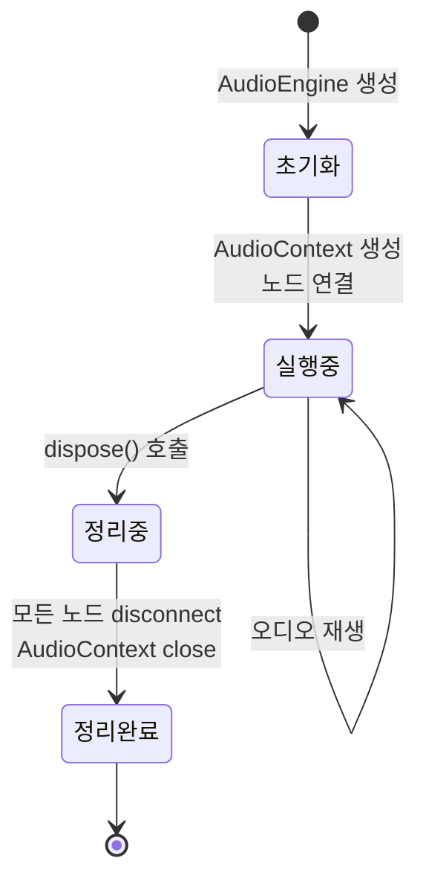
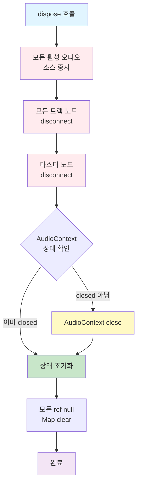
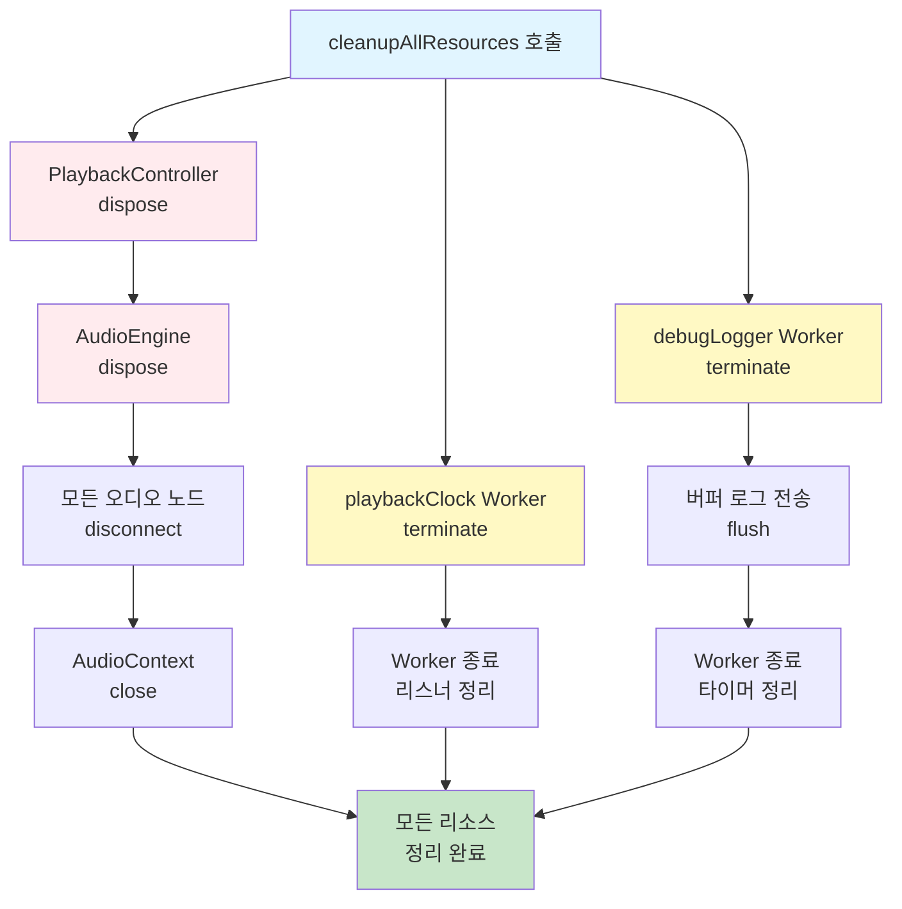

# 리소스 생명주기 관리

**Document Version**: 1.0  
**Software Version**: 0.1.0  
**Last Updated**: 2026-01-14

**카테고리**: 아키텍처 수준 - 리소스 관리

---

## 개요

오디오 엔진과 Web Worker의 생명주기를 체계적으로 관리하여 메모리 누수를 방지하고 페이지 전환 시 안정성을 확보한 최적화 기법입니다.

---

## 목표

- AudioEngine 리소스 완전 해제로 메모리 누수 방지
- Worker 인스턴스 정리로 리소스 누수 방지
- 페이지 전환 시 안정적인 리소스 해제
- 개발/프로덕션 환경에 맞는 로깅 제어

---

## 구현 위치

- `src/core/audio/AudioEngine.ts`: dispose 메서드
- `src/core/audio/PlaybackController.ts`: dispose 메서드
- `src/utils/playbackClock.ts`: Worker 종료 API
- `src/utils/debugLogger.ts`: Worker 종료 API 및 로깅 스위치
- `src/utils/resourceCleanup.ts`: 전역 cleanup 함수
- `src/pages/DawPage.tsx`: 페이지 전환 시 cleanup 호출
- `src/components/MidiEditor/MidiEditor.tsx`: 컴포넌트 언마운트 시 cleanup

---

## AudioEngine 생명주기 관리

### 생명주기 흐름



### dispose() 메서드

AudioEngine의 모든 리소스를 정리하고 해제하는 메서드입니다.

#### 구현 내용



```typescript
async dispose(): Promise<void> {
  // 1. 모든 활성 오디오 소스 중지
  this.stopAll();

  // 2. 모든 트랙 노드 disconnect
  for (const trackNodes of this.trackNodes.values()) {
    trackNodes.gain.disconnect();
    trackNodes.leftAnalyser.disconnect();
    trackNodes.rightAnalyser.disconnect();
    trackNodes.splitter.disconnect();
  }
  this.trackNodes.clear();

  // 3. 마스터 노드 disconnect
  this.masterGain?.disconnect();
  this.masterSplitter?.disconnect();
  this.masterLeftAnalyser?.disconnect();
  this.masterRightAnalyser?.disconnect();

  // 4. AudioContext 종료
  if (this.context && this.context.state !== 'closed') {
    await this.context.close();
  }

  // 5. 상태 초기화
  this.context = null;
  this.masterGain = null;
  // ... 모든 ref null, Map clear
}
```

#### 특징

- **비동기 처리**: `Promise<void>` 반환으로 AudioContext 종료 대기
- **에러 처리**: disconnect/close 실패 시 경고 로그만 출력하고 계속 진행
- **완전한 정리**: 모든 오디오 노드, AudioContext, 상태 초기화

#### 사용 위치

- `MidiEditor.tsx`: 컴포넌트 언마운트 시 `useEffect` cleanup에서 호출
- `PlaybackController.ts`: 싱글톤 인스턴스의 dispose 메서드 (전역 cleanup에서 호출)

### PlaybackController 생명주기 관리

PlaybackController는 싱글톤 인스턴스로 관리되며, 내부 AudioEngine을 포함합니다.

#### dispose() 메서드

```typescript
async dispose(): Promise<void> {
  // 재생 중지
  this.isPlaying = false;
  this.startToken += 1;
  
  // 스케줄 타이머 정리
  this.clearScheduleTimer();
  
  // 모든 오디오 소스 중지
  this.engine.stopAll();
  
  // AudioEngine 리소스 해제
  await this.engine.dispose();
  
  // 상태 초기화
  this.scheduledUntil = 0;
  this.events = [];
  this.eventIndex = 0;
  this.projectSnapshot = null;
}
```

#### 특징

- 재생 중지 및 스케줄 타이머 정리
- 내부 AudioEngine dispose 호출
- 상태 초기화
- 전역 cleanup 함수에서 호출됨

---

## Worker 생명주기 관리

### playbackClock Worker

재생 클럭을 관리하는 Worker의 생명주기를 관리합니다.

#### 종료 API

```typescript
export function terminatePlaybackClockWorker(): void {
  if (worker) {
    try {
      worker.terminate();
    } catch (error) {
      console.warn('[playbackClock] Error terminating worker:', error);
    }
    worker = null;
  }
  
  // 리스너 정리
  listeners.clear();
  
  // 실패 플래그 리셋 (재생성 가능하도록)
  workerFailed = false;
}
```

#### 특징

- Worker 인스턴스 종료 (`worker.terminate()`)
- 모든 리스너 제거 (`listeners.clear()`)
- 실패 플래그 리셋으로 재생성 가능

### debugLogger Worker

디버그 로깅을 처리하는 Worker의 생명주기를 관리합니다.

#### 종료 API

```typescript
export async function terminateDebugLoggerWorker(flushBuffer = true): Promise<void> {
  // 버퍼에 남은 로그 전송 (선택적)
  if (flushBuffer && buffer.length > 0) {
    await flush();
  }
  
  // 타이머 정리
  if (flushTimer !== null) {
    clearTimeout(flushTimer);
    flushTimer = null;
  }
  
  // Worker 종료
  if (worker) {
    try {
      worker.terminate();
    } catch (error) {
      console.warn('[debugLogger] Error terminating worker:', error);
    }
    worker = null;
  }
  
  // 상태 초기화
  buffer = [];
  isFlushing = false;
  workerFailed = false;
}
```

#### 특징

- 버퍼에 남은 로그 전송 (선택적, 기본값: true)
- 타이머 정리
- 상태 초기화
- 실패 플래그 리셋으로 재생성 가능

---

## 전역 리소스 Cleanup

### cleanupAllResources() 함수

모든 리소스를 한 번에 정리하는 전역 함수입니다.

#### 구현 위치

`src/utils/resourceCleanup.ts`

#### 리소스 정리 흐름



#### 기능

```typescript
export async function cleanupAllResources(): Promise<void> {
  // 1. PlaybackController dispose (AudioEngine 포함)
  await playbackController.dispose();
  
  // 2. playbackClock Worker 종료
  terminatePlaybackClockWorker();
  
  // 3. debugLogger Worker 종료 (버퍼에 남은 로그 전송)
  await terminateDebugLoggerWorker(true);
}
```

#### 특징

- **통합 관리**: 모든 리소스를 한 곳에서 정리
- **에러 처리**: 일부 리소스 정리 실패해도 다른 리소스 정리는 계속 진행
- **비동기 처리**: AudioEngine과 debugLogger Worker의 비동기 작업 대기

#### 호출 시점

1. **페이지 언마운트**: `DawPage.tsx`의 `useEffect` cleanup
2. **브라우저 이벤트**: `beforeunload`, `pagehide` 이벤트 리스너

---

## 로깅 시스템 개선

### 환경별 로깅 설정

프로덕션 환경에서는 기본적으로 로깅을 비활성화합니다.

#### 구현

```typescript
// 환경별 로깅 설정
const isProduction = import.meta.env?.MODE === 'production' || import.meta.env?.PROD === true;
let loggingEnabled = !isProduction; // 개발 환경에서는 활성화, 프로덕션에서는 비활성화
```

#### 특징

- Vite가 프로덕션 빌드 시 `import.meta.env`를 정적으로 교체
- 런타임에서 early return으로 오버헤드 최소화
- 코드는 포함되지만 실행되지 않아 성능 영향 최소

### 런타임 로깅 제어

개발자 도구에서 런타임에 로깅을 활성화/비활성화할 수 있습니다.

#### API

```typescript
// 로깅 활성화/비활성화
setLoggingEnabled(enabled: boolean): void

// 현재 로깅 상태 확인
isLoggingEnabled(): boolean
```

#### 특징

- 런타임에 로깅 제어 가능
- 로깅 비활성화 시 Worker 종료 및 버퍼 정리
- 프로덕션 환경에서도 디버깅 목적으로 임시 활성화 가능

---

## 페이지 전환 시 정리

### 리소스 정리 시점


### React 컴포넌트 언마운트

`DawPage.tsx`에서 컴포넌트 언마운트 시 리소스를 정리합니다.

```typescript
useEffect(() => {
  return () => {
    // 컴포넌트 언마운트 시 리소스 해제
    void cleanupAllResources();
  };
}, []);
```

### 브라우저 이벤트

페이지 종료/숨김 시에도 리소스를 정리합니다.

```typescript
useEffect(() => {
  const handleBeforeUnload = () => {
    void cleanupAllResources();
  };
  
  const handlePageHide = () => {
    void cleanupAllResources();
  };

  window.addEventListener('beforeunload', handleBeforeUnload);
  window.addEventListener('pagehide', handlePageHide);

  return () => {
    window.removeEventListener('beforeunload', handleBeforeUnload);
    window.removeEventListener('pagehide', handlePageHide);
  };
}, []);
```

#### 특징

- `beforeunload`: 페이지 종료 전 리소스 해제
- `pagehide`: 페이지 숨김 시 리소스 해제 (모바일 등에서 중요)
- 비동기 함수이므로 완료를 기다리지 않고 호출 (페이지 전환이 급한 경우 대비)

---

## 성능 개선 효과

### 메모리 관리

- **메모리 누수 방지**: AudioEngine 및 Worker 정리로 메모리 누수 제거
- **리소스 해제**: 페이지 전환 시 모든 리소스가 안전하게 해제됨
- **재사용 가능**: 실패 플래그 리셋으로 리소스 재생성 가능

### 안정성

- **페이지 전환 안정성**: 리소스 해제로 페이지 전환 시 오류 방지
- **에러 처리**: 일부 리소스 정리 실패해도 다른 리소스 정리는 계속 진행
- **완전한 정리**: 모든 오디오 노드, Worker, 타이머 정리

### 개발 경험

- **로깅 제어**: 환경별 자동 설정 및 런타임 제어
- **디버깅 효율성**: 프로덕션 환경에서도 필요 시 로깅 활성화 가능

---

## 관련 문서

- [`데이터 인덱싱`](../data-access/indexing.ko.md)
- [`시간 변환 캐싱`](../data-access/timing-cache.ko.md)

---

**Last Updated**: 2026-01-14

