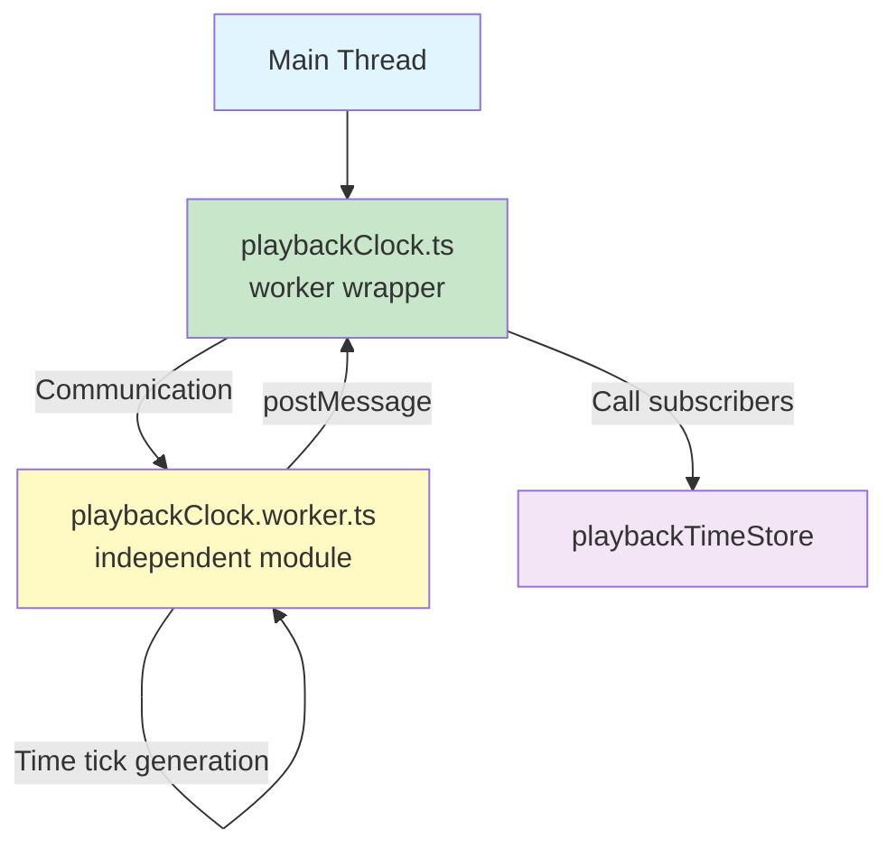
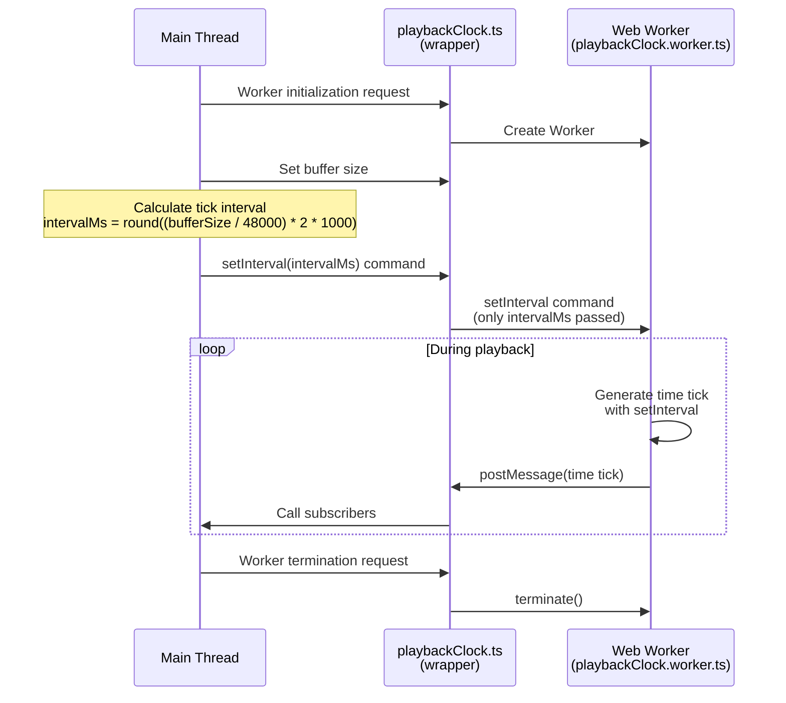

# Worker-based Playback Clock

**Document Version**: 1.0  
**Software Version**: 0.1.0  
**Last Updated**: 2026-01-14

**Category**: Architecture Level - Rendering Architecture

---

## Overview

An optimization technique that separates the main thread from time generation logic to create independent time ticks and reduce main thread load.

---

## Design Goals

- Separate main thread from time generation logic
- Reduce main thread load through independent time tick generation
- Flexible scheduling based on buffer size

---

## Implementation Location

- `src/workers/playbackClock.worker.ts`: Worker internal time generation logic
- `src/utils/playbackClock.ts`: Worker wrapper and main thread communication
- `src/components/Toolbar/TransportControls.tsx`: Buffer size-based interval calculation
- `src/constants/ui.ts`: `AUDIO_BUFFER_CONSTANTS` definition

---

## Architecture Features

### Thread Separation


Web Worker independently generates time ticks to reduce main thread CPU usage.

### Module Boundaries



`playbackClock.worker.ts` operates as an independent time generation module.

### Buffer Size Integration
Adjusts tick intervals based on buffer size to provide flexible scheduling.

---

## Operation



### 1. Worker Initialization
Create a worker from the main thread and register a message receiver listener.

### 2. Time Tick Generation
Use `setInterval` inside the worker to generate time ticks at set intervals.

### 3. Tick Interval Calculation

```mermaid
graph LR
    A[Buffer Size<br/>64-2048] --> B[Main Thread<br/>Calculation]
    C[Sample Rate<br/>48000 Hz] --> B
    D[Periods<br/>2] --> B
    B --> E[intervalMs =<br/>round((bufferSize / 48000) * 2 * 1000)]
    E --> F[setInterval command<br/>pass intervalMs]
    F --> G[Worker<br/>apply setInterval]
    
    style A fill:#e1f5ff
    style B fill:#c8e6c9
    style E fill:#fff9c4
    style F fill:#ffebee
    style G fill:#f3e5f5
```

Tick interval calculation is performed on the main thread, and only the calculated `intervalMs` is passed to the worker:

**Main Thread (TransportControls.tsx)**:
```typescript
const intervalMs = Math.round(
  (bufferSize / AUDIO_BUFFER_CONSTANTS.SAMPLE_RATE) * 
  AUDIO_BUFFER_CONSTANTS.PERIODS * 1000
);
setPlaybackClockInterval(intervalMs);
```

**Worker (playbackClock.worker.ts)**:
The worker uses the `intervalMs` received from the main thread to set `setInterval`.

- `bufferSize`: Audio buffer size (64, 128, 256, 512, 1024, 2048)
- `SAMPLE_RATE`: Sample rate (48000 Hz, defined in `AUDIO_BUFFER_CONSTANTS`)
- `PERIODS`: Number of periods (2, defined in `AUDIO_BUFFER_CONSTANTS`)

### 4. Pass to Main Thread
Pass time ticks to the main thread via `postMessage`.

---

## Effects

### Performance Improvement
- Reduced main thread CPU usage
- Secured independence of time generation logic
- Flexible scheduling based on buffer size adjustment

### User Experience
- Main thread can focus on other tasks (UI updates, etc.)
- Stable time tick generation

---

## Related Documents

- [`rAF-based Playback Head Update`](./raf-playback-head.en.md)
- [`Adjustable Audio Buffer Size`](../implementation-level/audio-buffer-size.en.md)

---

**Last Updated**: 2026-01-14

