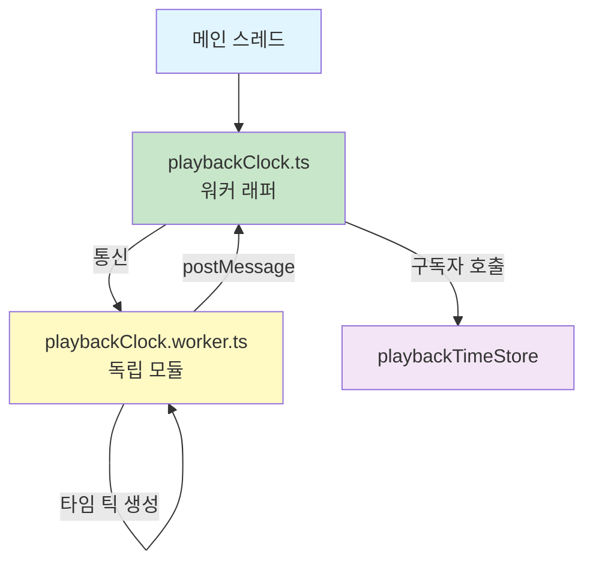
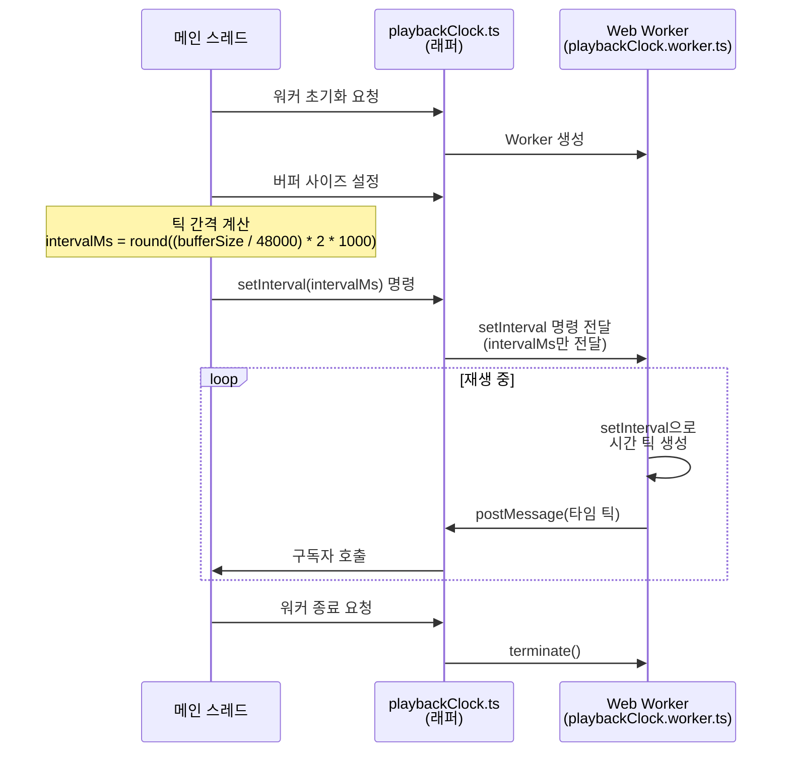

# 워커 기반 재생 클록

**Document Version**: 1.0  
**Software Version**: 0.1.0  
**Last Updated**: 2026-01-14

**카테고리**: 아키텍처 수준 - 렌더링 아키텍처

---

## 개요

메인 스레드와 시간 생성 로직을 분리하여 독립적인 시간 틱을 생성하고, 메인 스레드 부하를 감소시키는 최적화 기법입니다.

---

## 설계 목표

- 메인 스레드와 시간 생성 로직 분리
- 독립적인 시간 틱 생성으로 메인 스레드 부하 감소
- 버퍼 사이즈에 따른 유연한 스케줄링

---

## 구현 위치

- `src/workers/playbackClock.worker.ts`: 워커 내부 시간 생성 로직
- `src/utils/playbackClock.ts`: 워커 래퍼 및 메인 스레드 통신
- `src/components/Toolbar/TransportControls.tsx`: 버퍼 사이즈 기반 interval 계산
- `src/constants/ui.ts`: `AUDIO_BUFFER_CONSTANTS` 정의

---

## 아키텍처 특징

### 스레드 분리


Web Worker에서 독립적으로 시간 틱을 생성하여 메인 스레드의 CPU 사용량을 감소시킵니다.

### 모듈 경계



`playbackClock.worker.ts`가 독립적인 시간 생성 모듈로 동작합니다.

### 버퍼 사이즈 연동
버퍼 사이즈에 따라 틱 간격을 조절하여 유연한 스케줄링을 제공합니다.

---

## 동작 방식



### 1. 워커 초기화
메인 스레드에서 워커를 생성하고 메시지 수신 리스너를 등록합니다.

### 2. 시간 틱 생성
워커 내부에서 `setInterval`을 사용하여 설정된 간격으로 시간 틱을 생성합니다.

### 3. 틱 간격 계산

```mermaid
graph LR
    A[버퍼 사이즈<br/>64-2048] --> B[메인 스레드<br/>계산]
    C[샘플 레이트<br/>48000 Hz] --> B
    D[주기 수<br/>2] --> B
    B --> E[intervalMs =<br/>round((bufferSize / 48000) * 2 * 1000)]
    E --> F[setInterval 명령<br/>intervalMs 전달]
    F --> G[워커<br/>setInterval 적용]
    
    style A fill:#e1f5ff
    style B fill:#c8e6c9
    style E fill:#fff9c4
    style F fill:#ffebee
    style G fill:#f3e5f5
```

틱 간격 계산은 메인 스레드에서 수행되며, 계산된 `intervalMs`만 워커로 전달됩니다:

**메인 스레드 (TransportControls.tsx)**:
```typescript
const intervalMs = Math.round(
  (bufferSize / AUDIO_BUFFER_CONSTANTS.SAMPLE_RATE) * 
  AUDIO_BUFFER_CONSTANTS.PERIODS * 1000
);
setPlaybackClockInterval(intervalMs);
```

**워커 (playbackClock.worker.ts)**:
워커는 메인 스레드로부터 받은 `intervalMs`를 그대로 사용하여 `setInterval`을 설정합니다.

- `bufferSize`: 오디오 버퍼 크기 (64, 128, 256, 512, 1024, 2048)
- `SAMPLE_RATE`: 샘플 레이트 (48000 Hz, `AUDIO_BUFFER_CONSTANTS`에서 정의)
- `PERIODS`: 주기 수 (2, `AUDIO_BUFFER_CONSTANTS`에서 정의)

### 4. 메인 스레드로 전달
`postMessage`를 통해 시간 틱을 메인 스레드로 전달합니다.

---

## 효과

### 성능 개선
- 메인 스레드 CPU 사용량 감소
- 시간 생성 로직의 독립성 확보
- 버퍼 사이즈 조절에 따른 유연한 스케줄링

### 사용자 경험
- 메인 스레드가 다른 작업(UI 업데이트 등)에 집중 가능
- 안정적인 시간 틱 생성

---

## 관련 문서

- [`rAF 기반 재생헤드 업데이트`](./raf-playback-head.ko.md)
- [`조절 가능한 오디오 버퍼 사이즈`](../implementation-level/audio-buffer-size.ko.md)

---

**Last Updated**: 2026-01-14

