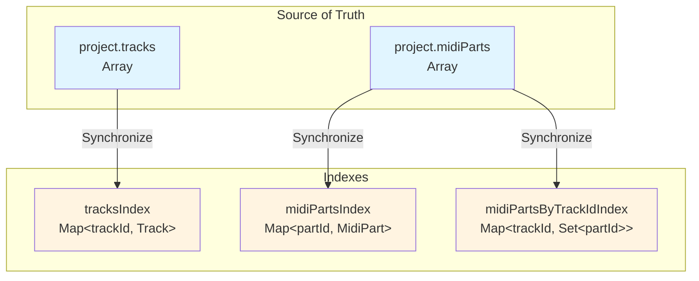
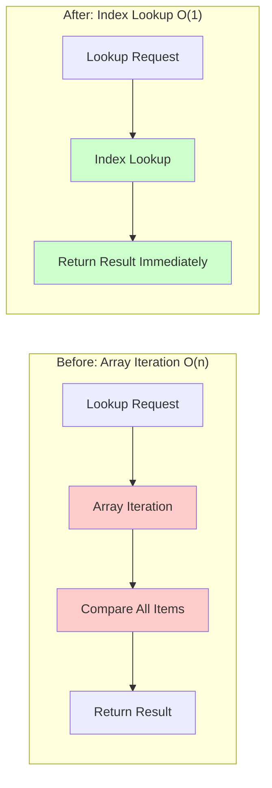
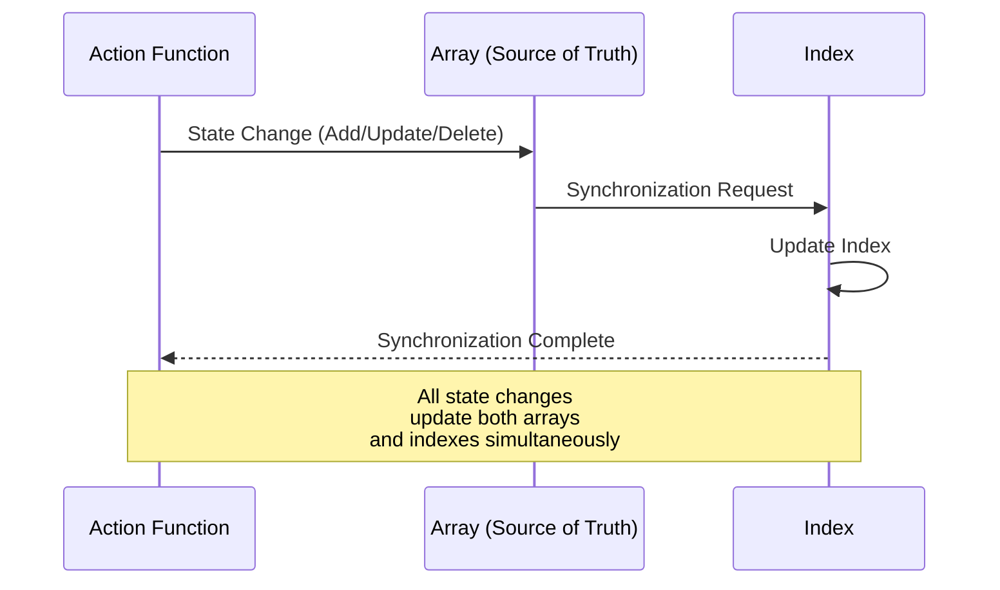

# Data Indexing

**Document Version**: 1.0  
**Software Version**: 0.1.0  
**Last Updated**: 2026-01-14

**Category**: Implementation Level - Data Access Optimization

---

## Overview

An optimization technique that introduces Map-based indexes to project state management to improve data lookup performance to O(1).

---

## Goals

- Improve track/part lookup performance from O(n) → O(1)
- Improve track-specific part lookup performance from O(n) → O(k) (k is the number of parts in that track)
- Fast lookup response time even in large-scale projects

---

## Implementation Location

- `src/store/projectState.ts`: Index structure and management
- `src/store/actions/trackActions.ts`: Track actions (using indexes)
- `src/store/midiPartActions.ts`: MIDI part actions (using indexes)
- `src/store/actions/noteActions.ts`: Note actions (using indexes)
- `src/store/selectors.ts`: Selectors (some use indexes, see below)

---

## Index Structure

### Index Storage
```typescript
const tracksIndex = new Map<string, Track>();  // trackId -> Track
const midiPartsIndex = new Map<string, MidiPart>();  // partId -> MidiPart
const midiPartsByTrackIdIndex = new Map<string, Set<string>>();  // trackId -> Set<partId>
```

### Index Structure Diagram



### Features
- Maintained alongside arrays: Track arrays maintain order, indexes are for lookups
- Arrays are source of truth: All state changes synchronize both arrays and indexes
- Internal only: Indexes are managed only within `projectState.ts`

---

## Index Management

### Initialization/Rebuild
- `rebuildIndexes(project: Project)`: Rebuild all indexes from project arrays
  - Automatically executed when `setProject()` is called
  - Automatically executed when `restoreProjectFromSnapshot()` is called
  - Automatically executed when `updateProjectImmutable()` is called

### Track Index Management
- `addTrackToIndex(track: Track)`: Add to track index
- `removeTrackFromIndex(trackId: string)`: Remove from track index (also cleans up related part indexes)

### MIDI Part Index Management
- `addMidiPartToIndex(part: MidiPart)`: Add to part index (also updates track-specific index)
- `removeMidiPartFromIndex(partId: string)`: Remove from part index (also cleans up track-specific index)
- `updateMidiPartInIndex(partId, oldPart, newPart)`: Update part index (synchronizes track-specific index when trackId changes)

### Lookup Functions (for external access)
- `findTrackById(trackId: string)`: Track lookup (O(1))
- `findMidiPartById(partId: string)`: MIDI part lookup (O(1))
- `findMidiPartsByTrackId(trackId: string)`: Track-specific part list lookup (O(k), k is the number of parts in that track)

### Data Lookup Flow Comparison



---

## Synchronization on State Changes

Indexes are automatically synchronized on all state changes:

### State Change Synchronization Flow



### Track Related
- `addTrackToProject()`: Add to array + add to index
- `removeTrackFromProject()`: Filter array + remove from index

### MIDI Part Related
- `addMidiPartToProject()`: Add to array + add to index
- `removeMidiPartFromProject()`: Filter array + remove from index
- `removeMultipleMidiPartsFromProject()`: Filter array + remove each part from index
- `updateMidiPart()`: Synchronize track-specific index when trackId changes

---

## Migrated Code

### trackActions.ts
- `findTrack()`: Uses index
- `removeTrack()`: Uses index for track-specific part lookup

### midiPartActions.ts
- `findMidiPart()`: Uses index
- `removeMidiPart()`: Uses index
- `removeMultipleMidiParts()`: Uses index
- `updateMultipleMidiParts()`: Uses index + updates index when trackId changes
- `mergeMidiParts()`: Uses index
- `cloneMidiPart()`: Uses index
- `cloneMultipleMidiParts()`: Uses index
- `splitMidiPart()`: Uses index

### noteActions.ts
- Internal `findMidiPart()` function: Uses index

### selectors.ts

**Selectors using indexes (O(1)):**
- `selectTrackByIdFromCurrent(trackId)`: Lookup track from current project (uses index)
- `selectMidiPartFromCurrent(partId)`: Lookup MIDI part from current project (uses index)

**General selectors (O(n), no index usage):**
- `selectTrackById(project, trackId)`: Lookup track from project object (uses array `.find`)
- `selectMidiPart(project, partId)`: Lookup MIDI part from project object (uses array `.find`)

**Note:**
General selectors receive a project object as a parameter, so they cannot directly use indexes. Indexes are managed internally in `projectState.ts`, and only the `FromCurrent` version selectors that access the current project state use indexes.

---

## UI Component Optimization

React components also use index functions to improve rendering performance.

### Optimized Components

#### EventDisplay.tsx
- **Before**: `project.midiParts.find(p => p.id === partId)` - O(n) array iteration
- **After**: `findMidiPartById(partId)` - O(1) index lookup
- **Before**: `currentParts.filter(part => part.trackId === track.id)` - O(n) filtering
- **After**: `findMidiPartsByTrackId(track.id)` - O(k) track-specific index lookup
- **Additional improvement**: Removed unused `midiParts` variable

#### TimelineView.tsx
- **Before**: Received `midiParts` prop for rendering
- **After**: Removed `midiParts` prop, direct access via index functions
- **Before**: `.filter()` call for track-specific part filtering
- **After**: Uses `findMidiPartsByTrackId()`

#### Inspector.tsx
- **Before**: `project.tracks.find(t => t.id === trackId)` - O(n) array iteration
- **After**: `findTrackById(trackId)` - O(1) index lookup
- **Additional improvement**: Removed `project.tracks` from `useMemo` dependency array (prevents unnecessary recalculation)

#### MidiEditor.tsx
- **Before**: `currentProject.midiParts.find(p => p.id === partId)` - O(n) array iteration
- **After**: `findMidiPartById(partId)` - O(1) index lookup

### Optimization Effects

#### Rendering Performance Improvement
- **Reduced data access time**: O(n) → O(1) lookup for immediate response
- **Reduced unnecessary re-renders**: 
  - Individual item lookups are unaffected even when `project.tracks` or `project.midiParts` change entirely
  - `useMemo` dependency optimization prevents unnecessary recalculation

#### Code Quality Improvement
- **Minimized dependencies**: No need to pass entire arrays as props
- **Clear intent**: Index function usage makes "lookup by ID" intent clear
- **Improved maintainability**: Removed duplicate `.find()` patterns

---

## Performance Improvement Effects

| Operation | Complexity | Effect |
|-----------|------------|--------|
| Track lookup by ID | O(1) | Immediate lookup |
| MIDI part lookup by ID | O(1) | Immediate lookup |
| Track-specific part lookup | O(k) | Iterate only parts in that track (k << n) |

### Example Scenario
With 1000 parts, 50 in one track:
- Track-specific part lookup: 1000 comparisons → 1 index lookup + 50 iterations = **approximately 20x faster**

### UI Rendering Scenarios
- **Hovered part display in event display**: O(1) lookup every frame
- **Track-specific part rendering in timeline view**: Number of tracks × O(k) lookup (k is the number of parts in that track)
- **Selected track display in inspector**: Immediate O(1) lookup
- **Part change detection in MIDI editor**: Fast response with O(1) lookup

---

## Related Documents

- [`Timing Conversion Caching`](./timing-cache.en.md)
- [`docs/refactoring/p2-implementation-plan.md`](../../../refactoring/p2-implementation-plan.md)

---

**Last Updated**: 2026-01-14

