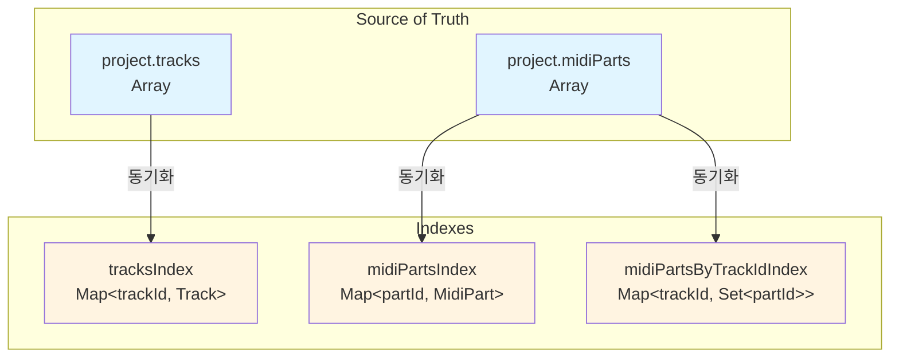
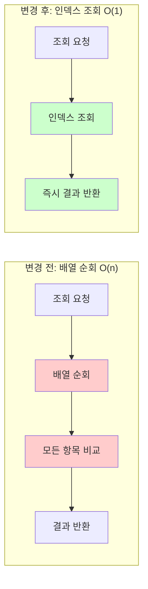
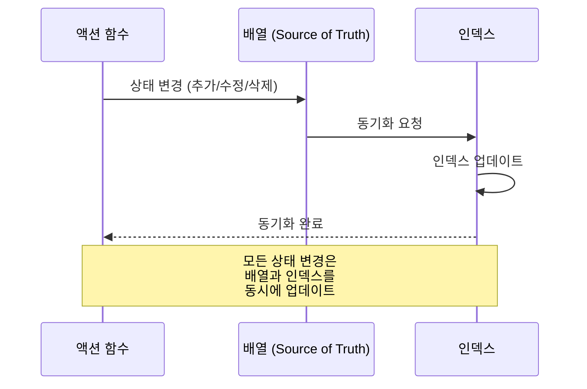

# 데이터 인덱싱

**Document Version**: 1.0  
**Software Version**: 0.1.0  
**Last Updated**: 2026-01-14

**카테고리**: 구현 수준 - 데이터 접근 최적화

---

## 개요

프로젝트 상태 관리에 Map 기반 인덱스를 도입하여 데이터 조회 성능을 O(1)로 개선한 최적화 기법입니다.

---

## 목표

- 트랙/파트 조회 성능 O(n) → O(1) 개선
- 트랙별 파트 조회 성능 O(n) → O(k) 개선 (k는 해당 트랙의 파트 수)
- 대규모 프로젝트에서도 빠른 조회 응답 시간

---

## 구현 위치

- `src/store/projectState.ts`: 인덱스 구조 및 관리
- `src/store/actions/trackActions.ts`: 트랙 액션 (인덱스 사용)
- `src/store/midiPartActions.ts`: MIDI 파트 액션 (인덱스 사용)
- `src/store/actions/noteActions.ts`: 노트 액션 (인덱스 사용)
- `src/store/selectors.ts`: 셀렉터 (일부 인덱스 사용, 아래 참조)

---

## 인덱스 구조

### 인덱스 저장소
```typescript
const tracksIndex = new Map<string, Track>();  // trackId -> Track
const midiPartsIndex = new Map<string, MidiPart>();  // partId -> MidiPart
const midiPartsByTrackIdIndex = new Map<string, Set<string>>();  // trackId -> Set<partId>
```

### 인덱스 구조 다이어그램



### 특징
- 배열과 병행 유지: 트랙 배열은 순서가 중요하므로 배열 유지, 인덱스는 조회용
- 배열이 source of truth: 모든 상태 변경 시 배열과 인덱스를 동기화
- 내부 전용: 인덱스는 `projectState.ts` 내부에서만 관리

---

## 인덱스 관리

### 초기화/재구축
- `rebuildIndexes(project: Project)`: 프로젝트 배열로부터 인덱스 전체 재구축
  - `setProject()` 호출 시 자동 실행
  - `restoreProjectFromSnapshot()` 호출 시 자동 실행
  - `updateProjectImmutable()` 호출 시 자동 실행

### 트랙 인덱스 관리
- `addTrackToIndex(track: Track)`: 트랙 인덱스에 추가
- `removeTrackFromIndex(trackId: string)`: 트랙 인덱스에서 제거 (관련 파트 인덱스도 정리)

### MIDI 파트 인덱스 관리
- `addMidiPartToIndex(part: MidiPart)`: 파트 인덱스에 추가 (트랙별 인덱스도 업데이트)
- `removeMidiPartFromIndex(partId: string)`: 파트 인덱스에서 제거 (트랙별 인덱스도 정리)
- `updateMidiPartInIndex(partId, oldPart, newPart)`: 파트 인덱스 업데이트 (trackId 변경 시 트랙별 인덱스 동기화)

### 조회 함수 (외부 접근용)
- `findTrackById(trackId: string)`: 트랙 조회 (O(1))
- `findMidiPartById(partId: string)`: MIDI 파트 조회 (O(1))
- `findMidiPartsByTrackId(trackId: string)`: 트랙별 파트 목록 조회 (O(k), k는 해당 트랙의 파트 수)

### 데이터 조회 플로우 비교



---

## 상태 변경 시 동기화

모든 상태 변경 시 인덱스가 자동으로 동기화됩니다:

### 상태 변경 동기화 플로우



### 트랙 관련
- `addTrackToProject()`: 배열 추가 + 인덱스 추가
- `removeTrackFromProject()`: 배열 필터링 + 인덱스 제거

### MIDI 파트 관련
- `addMidiPartToProject()`: 배열 추가 + 인덱스 추가
- `removeMidiPartFromProject()`: 배열 필터링 + 인덱스 제거
- `removeMultipleMidiPartsFromProject()`: 배열 필터링 + 각 파트 인덱스 제거
- `updateMidiPart()`: trackId 변경 시 트랙별 인덱스 동기화

---

## 마이그레이션된 코드

### trackActions.ts
- `findTrack()`: 인덱스 사용
- `removeTrack()`: 트랙별 파트 조회에 인덱스 사용

### midiPartActions.ts
- `findMidiPart()`: 인덱스 사용
- `removeMidiPart()`: 인덱스 사용
- `removeMultipleMidiParts()`: 인덱스 사용
- `updateMultipleMidiParts()`: 인덱스 사용 + trackId 변경 시 인덱스 업데이트
- `mergeMidiParts()`: 인덱스 사용
- `cloneMidiPart()`: 인덱스 사용
- `cloneMultipleMidiParts()`: 인덱스 사용
- `splitMidiPart()`: 인덱스 사용

### noteActions.ts
- 내부 `findMidiPart()` 함수: 인덱스 사용

### selectors.ts

**인덱스 사용 셀렉터 (O(1)):**
- `selectTrackByIdFromCurrent(trackId)`: 현재 프로젝트에서 트랙 조회 (인덱스 사용)
- `selectMidiPartFromCurrent(partId)`: 현재 프로젝트에서 MIDI 파트 조회 (인덱스 사용)

**일반 셀렉터 (O(n), 인덱스 미사용):**
- `selectTrackById(project, trackId)`: 프로젝트 객체를 받아 트랙 조회 (배열 `.find` 사용)
- `selectMidiPart(project, partId)`: 프로젝트 객체를 받아 MIDI 파트 조회 (배열 `.find` 사용)

**참고:**
일반 셀렉터는 프로젝트 객체를 파라미터로 받기 때문에 인덱스를 직접 사용할 수 없습니다. 인덱스는 `projectState.ts` 내부에서 관리되며, 현재 프로젝트 상태에 접근하는 `FromCurrent` 버전의 셀렉터만 인덱스를 사용합니다.

---

## UI 컴포넌트 최적화

React 컴포넌트에서도 인덱스 함수를 사용하여 렌더링 성능을 개선했습니다.

### 최적화된 컴포넌트

#### EventDisplay.tsx
- **변경 전**: `project.midiParts.find(p => p.id === partId)` - O(n) 배열 순회
- **변경 후**: `findMidiPartById(partId)` - O(1) 인덱스 조회
- **변경 전**: `currentParts.filter(part => part.trackId === track.id)` - O(n) 필터링
- **변경 후**: `findMidiPartsByTrackId(track.id)` - O(k) 트랙별 인덱스 조회
- **추가 개선**: 사용하지 않는 `midiParts` 변수 제거

#### TimelineView.tsx
- **변경 전**: `midiParts` prop을 받아서 렌더링에 사용
- **변경 후**: `midiParts` prop 제거, 인덱스 함수로 직접 접근
- **변경 전**: `.filter()` 호출로 트랙별 파트 필터링
- **변경 후**: `findMidiPartsByTrackId()` 사용

#### Inspector.tsx
- **변경 전**: `project.tracks.find(t => t.id === trackId)` - O(n) 배열 순회
- **변경 후**: `findTrackById(trackId)` - O(1) 인덱스 조회
- **추가 개선**: `useMemo` 의존성 배열에서 `project.tracks` 제거 (불필요한 재계산 방지)

#### MidiEditor.tsx
- **변경 전**: `currentProject.midiParts.find(p => p.id === partId)` - O(n) 배열 순회
- **변경 후**: `findMidiPartById(partId)` - O(1) 인덱스 조회

### 최적화 효과

#### 렌더링 성능 개선
- **데이터 접근 시간 단축**: O(n) → O(1) 조회로 즉시 응답
- **불필요한 재렌더링 감소**: 
  - `project.tracks`, `project.midiParts` 전체 변경 시에도 개별 항목 조회는 영향 없음
  - `useMemo` 의존성 최적화로 불필요한 재계산 방지

#### 코드 품질 개선
- **의존성 최소화**: 배열 전체를 prop으로 전달하지 않아도 됨
- **명확한 의도**: 인덱스 함수 사용으로 "ID로 조회" 의도가 명확해짐
- **유지보수성 향상**: 중복된 `.find()` 패턴 제거

---

## 성능 개선 효과

| 작업 | 복잡도 | 효과 |
|------|--------|------|
| 트랙 ID로 조회 | O(1) | 즉시 조회 |
| MIDI 파트 ID로 조회 | O(1) | 즉시 조회 |
| 트랙별 파트 조회 | O(k) | 해당 트랙의 파트만 순회 (k << n) |

### 예시 시나리오
파트 1000개, 한 트랙에 50개인 경우:
- 트랙별 파트 조회: 1000번 비교 → 1번 인덱스 조회 + 50번 순회 = **약 20배 빠름**

### UI 렌더링 시나리오
- **이벤트 디스플레이에서 호버된 파트 표시**: 매 프레임마다 O(1) 조회
- **타임라인 뷰에서 트랙별 파트 렌더링**: 트랙 수 × O(k) 조회 (k는 해당 트랙의 파트 수)
- **인스펙터에서 선택된 트랙 표시**: 즉시 O(1) 조회
- **MIDI 에디터에서 파트 변경 감지**: O(1) 조회로 빠른 응답

---

## 관련 문서

- [`시간 변환 캐싱`](./timing-cache.ko.md)
- [`docs/refactoring/p2-implementation-plan.md`](../../../refactoring/p2-implementation-plan.md)

---

**Last Updated**: 2026-01-14

