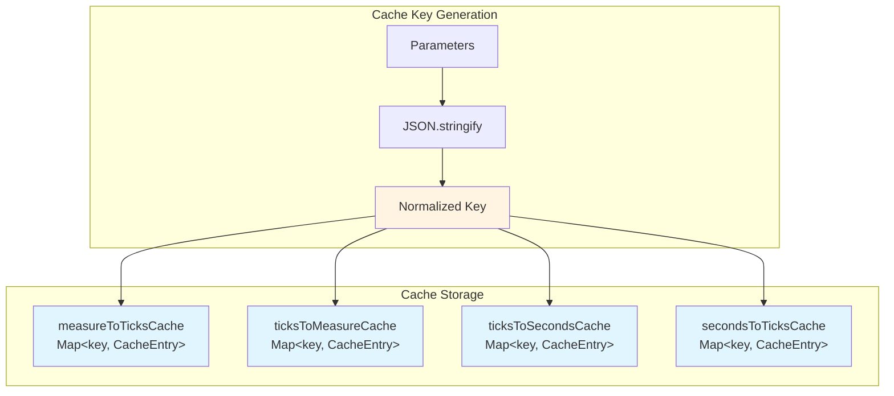
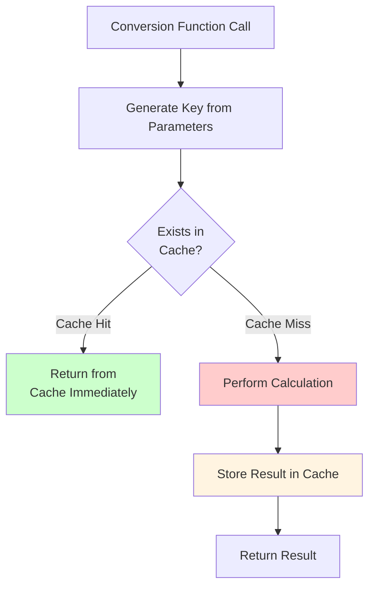
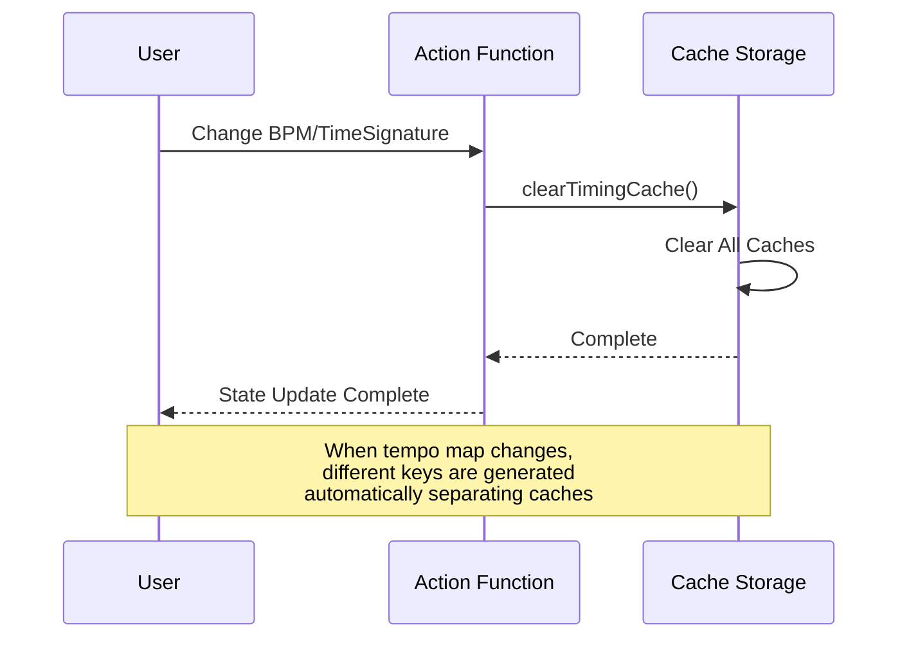

# Timing Conversion Caching

**Document Version**: 1.0  
**Software Version**: 0.1.0  
**Last Updated**: 2026-01-14

**Category**: Implementation Level - Data Access Optimization

---

## Overview

An optimization technique that caches the results of repetitive timing conversion calculations to improve performance.

---

## Goals

- Cache timing conversion results calculated repeatedly with the same parameters
- Eliminate repeated calculations during rendering
- Improve overall rendering performance

---

## Implementation Location

- `src/domain/timing/timingCache.ts`: Cache implementation
- `src/utils/midiTickUtils.ts`: Conversion functions with caching applied
- `src/store/projectActions.ts`: Cache invalidation logic (local changes)
- `src/core/sync/SyncManager.ts`: Cache invalidation logic (remote changes)

---

## Cache Structure

### Cache Storage
```typescript
const measureToTicksCache = new Map<string, CacheEntry<{ startTick: number; durationTicks: number }>>();
const ticksToMeasureCache = new Map<string, CacheEntry<{ measureStart: number; measureDuration: number }>>();
const ticksToSecondsCache = new Map<string, CacheEntry<{ startTime: number; duration: number }>>();
const secondsToTicksCache = new Map<string, CacheEntry<{ startTick: number; durationTicks: number }>>();
```

### Cache Structure Diagram



### Cache Key Generation
- Serialize parameters with `JSON.stringify()` to generate unique keys
- Include tempo map in key after normalization (sorting)
- Same parameter combinations always generate the same key

### Cache Entry
```typescript
interface CacheEntry<T> {
  value: T;
}
```

---

## Cache Functions

### Cached Conversion Functions
- `getCachedMeasureToTicks(measureStart, measureDuration, timeSignature, ppqn)`
- `getCachedTicksToMeasure(startTick, durationTicks, timeSignature, ppqn)`
- `getCachedTicksToSeconds(startTick, durationTicks, tempoMap, timeSignature, ppqn)`
- `getCachedSecondsToTicks(startTime, duration, tempoMap, timeSignature, ppqn)`

### Cache Management Functions
- `clearTimingCache()`: Clear all caches
- `getCacheStats()`: Return cache statistics (for debugging)

### Operation
1. Lookup with cache key
2. Return immediately if found in cache
3. Calculate, store in cache, and return if not found in cache

### Cache Hit/Miss Flow



---

## Caching Application

### Application Location
Caching applied to pure function versions in `src/utils/midiTickUtils.ts`:
- `measureToTicksPure()`: Uses `getCachedMeasureToTicks()`
- `ticksToMeasurePure()`: Uses `getCachedTicksToMeasure()`
- `ticksToSecondsPure()`: Uses `getCachedTicksToSeconds()`
- `secondsToTicksPure()`: Uses `getCachedSecondsToTicks()`

### Effects
- All timing conversion functions are automatically cached without changing existing code
- Conversion functions called 164 times across 27 files are optimized with caching

---

## Cache Invalidation

### Cache Invalidation Flow



### Automatic Invalidation
- Tempo map change: Different tempo maps generate different keys, automatically separating caches
- BPM change: `clearTimingCache()` executed when `updateBpm()` is called
- Time signature change: `clearTimingCache()` executed when `updateTimeSignature()` is called, but only when the value actually changes

### Invalidation Location

**Local Changes (`src/store/projectActions.ts`):**
- `updateBpm()`: Clear cache on BPM change
- `updateTimeSignature()`: Clear cache only when time signature value actually changes

**Remote Changes (`src/core/sync/SyncManager.ts`):**
- Clear cache when processing remote BPM changes
- Clear cache when processing remote time signature changes

---

## Performance Improvement Effects

### Caching Effects
- Recalculation with same parameters: 0% (on cache hit)
- First call: Perform calculation + store in cache
- Subsequent calls: Return immediately from cache

### Example Scenario
Repeated calls to `ticksToSecondsPure` with same parameters when rendering parts in `TimelineView`:
- First: Perform calculation
- Second and after: Return immediately from cache

### Expected Improvement Rate
- Repeated calculations during rendering: Expected improvement of approximately 50% or more
- Particularly effective when rendering the same part multiple times

---

## Usage Frequency

### Application Scope
- Timing conversion functions called 164 times across 27 files are cached
- Especially functions frequently called during UI rendering

### Main Usage Locations
- `TimelineView.tsx`: Time conversion when rendering parts
- `EventDisplay.tsx`: Part position calculation
- `MidiEditor.tsx`: Time conversion when rendering notes
- `MeasureRuler.tsx`: Measure marker calculation

---

## Related Documents

- [`Data Indexing`](./indexing.en.md)
- [`docs/refactoring/p2-implementation-plan.md`](../../../refactoring/p2-implementation-plan.md)

---

**Last Updated**: 2026-01-14

