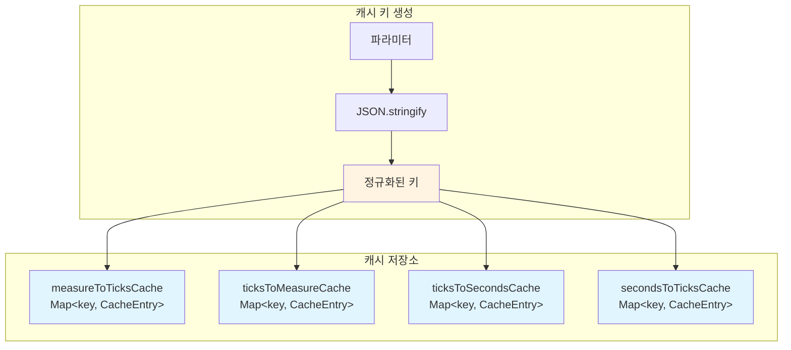
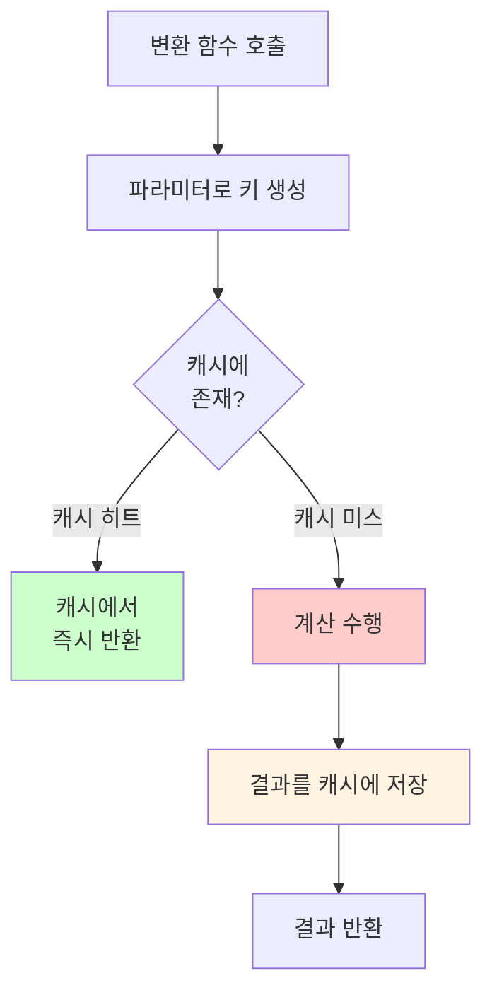
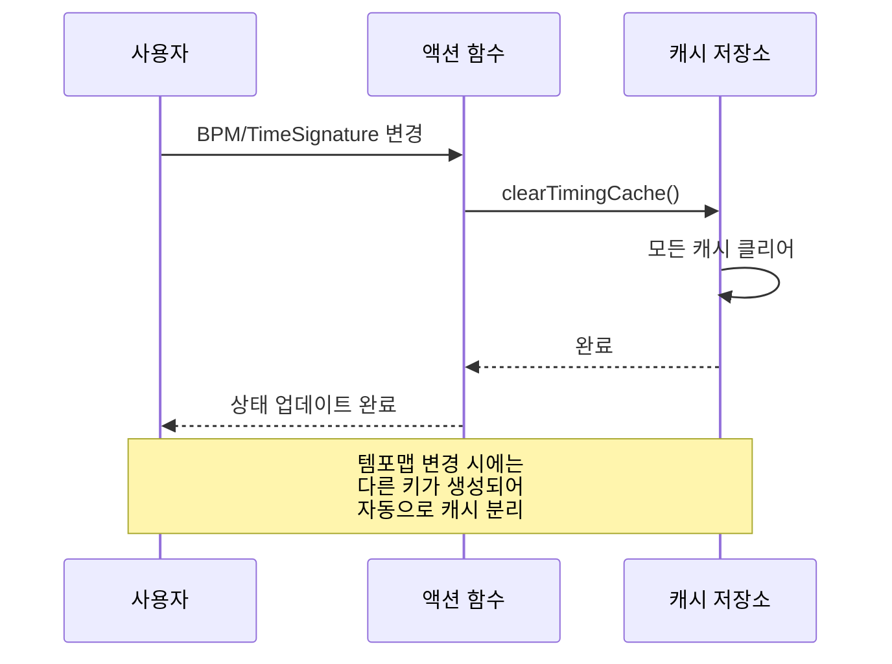

# 시간 변환 캐싱

**Document Version**: 1.0  
**Software Version**: 0.1.0  
**Last Updated**: 2026-01-14

**카테고리**: 구현 수준 - 데이터 접근 최적화

---

## 개요

반복적인 시간 변환 계산 결과를 캐싱하여 성능을 개선하는 최적화 기법입니다.

---

## 목표

- 동일 파라미터로 반복 계산되는 시간 변환 결과를 캐싱
- 렌더링 시 반복 계산 제거
- 전체적인 렌더링 성능 개선

---

## 구현 위치

- `src/domain/timing/timingCache.ts`: 캐시 구현
- `src/utils/midiTickUtils.ts`: 캐싱 적용된 변환 함수
- `src/store/projectActions.ts`: 캐시 무효화 로직 (로컬 변경)
- `src/core/sync/SyncManager.ts`: 캐시 무효화 로직 (원격 변경)

---

## 캐시 구조

### 캐시 저장소
```typescript
const measureToTicksCache = new Map<string, CacheEntry<{ startTick: number; durationTicks: number }>>();
const ticksToMeasureCache = new Map<string, CacheEntry<{ measureStart: number; measureDuration: number }>>();
const ticksToSecondsCache = new Map<string, CacheEntry<{ startTime: number; duration: number }>>();
const secondsToTicksCache = new Map<string, CacheEntry<{ startTick: number; durationTicks: number }>>();
```

### 캐시 구조 다이어그램



### 캐시 키 생성
- 파라미터를 `JSON.stringify()`로 직렬화하여 고유 키 생성
- 템포맵은 정규화(정렬)하여 키에 포함
- 동일한 파라미터 조합은 항상 같은 키 생성

### 캐시 엔트리
```typescript
interface CacheEntry<T> {
  value: T;
}
```

---

## 캐시 함수

### 캐시된 변환 함수
- `getCachedMeasureToTicks(measureStart, measureDuration, timeSignature, ppqn)`
- `getCachedTicksToMeasure(startTick, durationTicks, timeSignature, ppqn)`
- `getCachedTicksToSeconds(startTick, durationTicks, tempoMap, timeSignature, ppqn)`
- `getCachedSecondsToTicks(startTime, duration, tempoMap, timeSignature, ppqn)`

### 캐시 관리 함수
- `clearTimingCache()`: 모든 캐시 클리어
- `getCacheStats()`: 캐시 통계 정보 반환 (디버깅용)

### 동작 방식
1. 캐시 키로 조회
2. 캐시에 있으면 즉시 반환
3. 캐시에 없으면 계산하여 캐시에 저장 후 반환

### 캐시 히트/미스 플로우



---

## 캐싱 적용

### 적용 위치
`src/utils/midiTickUtils.ts`의 순수 함수 버전에 캐싱 적용:
- `measureToTicksPure()`: `getCachedMeasureToTicks()` 사용
- `ticksToMeasurePure()`: `getCachedTicksToMeasure()` 사용
- `ticksToSecondsPure()`: `getCachedTicksToSeconds()` 사용
- `secondsToTicksPure()`: `getCachedSecondsToTicks()` 사용

### 효과
- 기존 코드 변경 없이 모든 시간 변환 함수가 자동으로 캐싱됨
- 27개 파일에서 164번 호출되는 변환 함수들이 캐시로 최적화됨

---

## 캐시 무효화

### 캐시 무효화 플로우



### 자동 무효화
- 템포맵 변경: 다른 템포맵은 다른 키가 생성되어 자동으로 캐시 분리
- BPM 변경: `updateBpm()` 호출 시 `clearTimingCache()` 실행
- 타임 시그니처 변경: `updateTimeSignature()` 호출 시 값이 실제로 변경된 경우에만 `clearTimingCache()` 실행

### 무효화 위치

**로컬 변경 (`src/store/projectActions.ts`):**
- `updateBpm()`: BPM 변경 시 캐시 클리어
- `updateTimeSignature()`: 타임 시그니처 값이 실제로 변경된 경우에만 캐시 클리어

**원격 변경 (`src/core/sync/SyncManager.ts`):**
- 원격 BPM 변경 처리 시 캐시 클리어
- 원격 타임 시그니처 변경 처리 시 캐시 클리어

---

## 성능 개선 효과

### 캐싱 효과
- 동일 파라미터 재계산: 0% (캐시 히트 시)
- 첫 호출: 계산 수행 + 캐시 저장
- 이후 호출: 캐시에서 즉시 반환

### 예시 시나리오
`TimelineView`에서 파트 렌더링 시 같은 파라미터로 `ticksToSecondsPure` 반복 호출:
- 첫 번째: 계산 수행
- 두 번째 이후: 캐시에서 즉시 반환

### 예상 개선율
- 렌더링 시 반복 계산: 약 50% 이상 개선 예상
- 특히 동일한 파트를 여러 번 렌더링할 때 효과적

---

## 사용 빈도

### 적용 범위
- 27개 파일에서 164번 호출되는 시간 변환 함수가 캐싱됨
- 특히 UI 렌더링 시 빈번히 호출되는 함수들

### 주요 사용 위치
- `TimelineView.tsx`: 파트 렌더링 시 시간 변환
- `EventDisplay.tsx`: 파트 위치 계산
- `MidiEditor.tsx`: 노트 렌더링 시 시간 변환
- `MeasureRuler.tsx`: 마디 마커 계산

---

## 관련 문서

- [`데이터 인덱싱`](./indexing.ko.md)
- [`docs/refactoring/p2-implementation-plan.md`](../../../refactoring/p2-implementation-plan.md)

---

**Last Updated**: 2026-01-14

