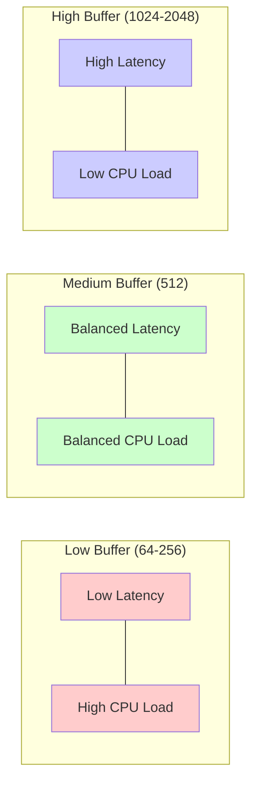
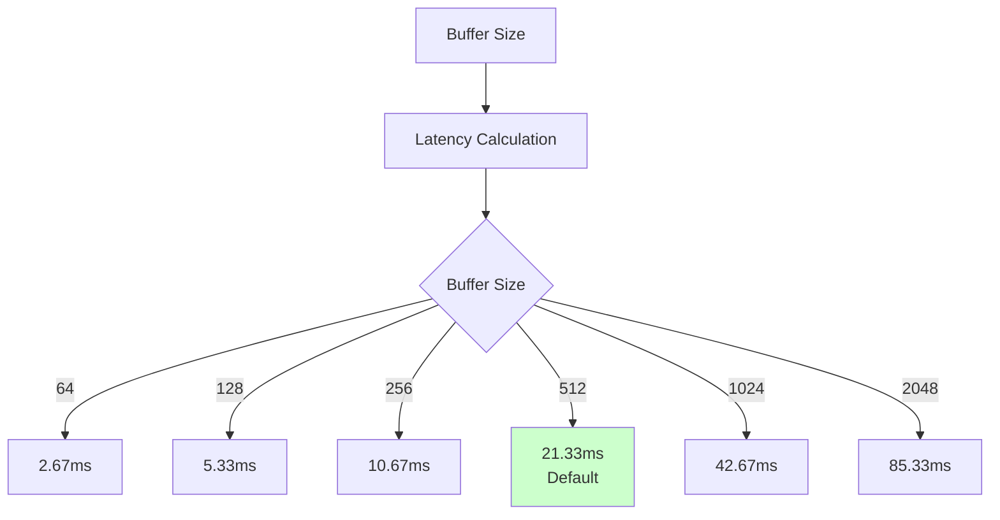

# Adjustable Audio Buffer Size

**Document Version**: 1.0  
**Software Version**: 0.1.0  
**Last Updated**: 2026-01-14

**Category**: Implementation Level - Audio Playback Optimization

---

## Overview

A feature that allows users to adjust the audio buffer size according to their system performance.

---

## Goals

- Users can adjust buffer size according to system performance
- Provide tradeoff between latency and CPU load

---

## Implementation Location

- `src/constants/ui.ts`: Constant definitions
- `src/store/uiStore.tsx`: State management
- `src/components/Toolbar/AudioBufferControl.tsx`: UI control
- `src/components/Toolbar/TransportControls.tsx`: Tick interval calculation

---

## Configuration Values

### Supported Buffer Sizes
- 64, 128, 256, 512, 1024, 2048 (powers of 2)
- Default: 512

### Other Constants
- Sample rate: 48000 Hz
- Periods: 2

### Buffer Size and Performance Tradeoff



---

## Tick Interval Calculation

```typescript
intervalMs = round((bufferSize / SAMPLE_RATE) * PERIODS * 1000)
```

### Calculation Examples
- Buffer size 512: `(512 / 48000) * 2 * 1000 ≈ 21.33ms`
- Buffer size 1024: `(1024 / 48000) * 2 * 1000 ≈ 42.67ms`

### Latency by Buffer Size



---

## Notes

### Current Status
- Currently only affects UI scheduling (AudioContext not implemented)
- Web Audio API uses fixed 128-frame render quantum

### Future Plans
- May be used as scheduling hint or removed when actual audio rendering is added in the future

---

## Effects

### Performance Tradeoff
- Low buffer (64-256):
  - Low latency
  - High CPU load
  - Recommended when system responsiveness is good

- Medium buffer (512):
  - Balanced latency and CPU load
  - Recommended as default

- High buffer (1024-2048):
  - High latency
  - Low CPU load
  - Recommended when system performance is low

### User Experience
- Flexible adjustment according to system performance
- Optimal settings possible for individual environments

---

## Related Documents

- [`docs/reference/audio-buffer-size-specification.en.md`](../../../reference/audio-buffer-size-specification.en.md)
- [`Worker-based Playback Clock`](../architecture-level/worker-playback-clock.en.md)

---

**Last Updated**: 2026-01-14

