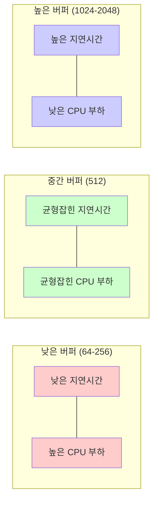
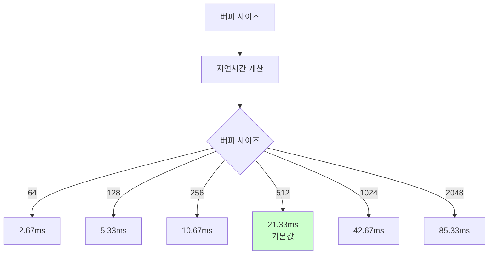

# 조절 가능한 오디오 버퍼 사이즈

**Document Version**: 1.0  
**Software Version**: 0.1.0  
**Last Updated**: 2026-01-14

**카테고리**: 구현 수준 - 오디오 재생 최적화

---

## 개요

사용자가 시스템 성능에 맞게 오디오 버퍼 사이즈를 조절할 수 있는 기능입니다.

---

## 목표

- 사용자가 시스템 성능에 맞게 버퍼 사이즈 조절 가능
- 지연시간과 CPU 부하 사이의 트레이드오프 제공

---

## 구현 위치

- `src/constants/ui.ts`: 상수 정의
- `src/store/uiStore.tsx`: 상태 관리
- `src/components/Toolbar/AudioBufferControl.tsx`: UI 컨트롤
- `src/components/Toolbar/TransportControls.tsx`: 틱 간격 계산

---

## 설정값

### 지원 버퍼 사이즈
- 64, 128, 256, 512, 1024, 2048 (2의 거듭제곱)
- 기본값: 512

### 기타 상수
- 샘플 레이트: 48000 Hz
- Periods: 2

### 버퍼 사이즈와 성능 트레이드오프



---

## 틱 간격 계산

```typescript
intervalMs = round((bufferSize / SAMPLE_RATE) * PERIODS * 1000)
```

### 계산 예시
- 버퍼 사이즈 512: `(512 / 48000) * 2 * 1000 ≈ 21.33ms`
- 버퍼 사이즈 1024: `(1024 / 48000) * 2 * 1000 ≈ 42.67ms`

### 버퍼 사이즈별 지연시간



---

## 주의사항

### 현재 상태
- 현재는 UI 스케줄링에만 영향 (AudioContext 미구현)
- Web Audio API는 고정 128-frame render quantum 사용

### 향후 계획
- 향후 실제 오디오 렌더링 추가 시 스케줄링 힌트로 사용하거나 제거 필요

---

## 효과

### 성능 트레이드오프
- 낮은 버퍼 (64-256):
  - 낮은 지연시간
  - 높은 CPU 부하
  - 시스템 응답성이 좋을 때 권장

- 중간 버퍼 (512):
  - 균형잡힌 지연시간과 CPU 부하
  - 기본값으로 권장

- 높은 버퍼 (1024-2048):
  - 높은 지연시간
  - 낮은 CPU 부하
  - 시스템 성능이 낮을 때 권장

### 사용자 경험
- 시스템 성능에 따른 유연한 조절
- 개인 환경에 맞는 최적 설정 가능

---

## 관련 문서

- [`docs/reference/audio-buffer-size-specification.ko.md`](../../../reference/audio-buffer-size-specification.ko.md)
- [`워커 기반 재생 클록`](../architecture-level/worker-playback-clock.ko.md)

---

**Last Updated**: 2026-01-14

