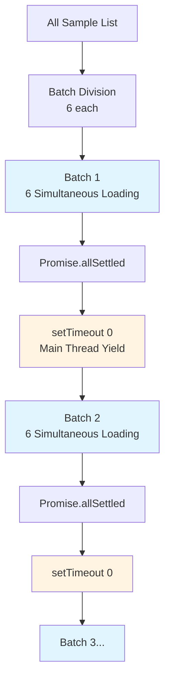
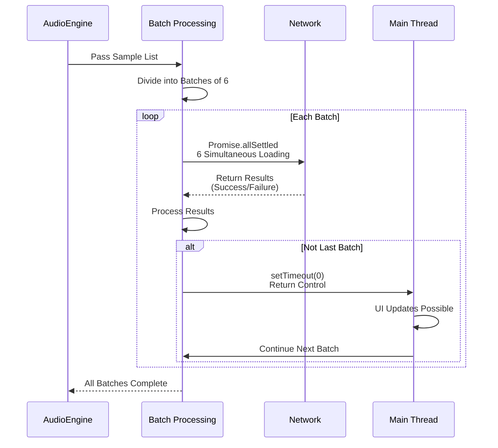

# Batch Sample Loading

**Document Version**: 1.0  
**Software Version**: 0.1.0  
**Last Updated**: 2026-01-14

**Category**: Implementation Level - Audio Playback Optimization

---

## Overview

An optimization technique that loads audio samples in batches to prevent main thread blocking during audio sample loading.

---

## Goals

- Prevent main thread blocking during audio sample loading
- Reduce initial loading time
- Continue even if some samples fail

---

## Implementation Location

- `src/core/audio/AudioEngine.ts`

---

## Algorithm

### Batch Size
Loads 6 samples simultaneously.

### Asynchronous Processing
Uses `Promise.allSettled` to continue even if some fail.

### Yield Between Batches
Uses `setTimeout(0)` to prevent main thread blocking.

### Batch Loading Structure Diagram



---

## Code Structure

```typescript
const batchSize = 6;
for (let i = 0; i < sampleUrls.length; i += batchSize) {
  const batch = sampleUrls.slice(i, i + batchSize);
  const results = await Promise.allSettled(batch.map(loadSample));
  
  if (i + batchSize < sampleUrls.length) {
    await new Promise((resolve) => setTimeout(resolve, 0));
  }
}
```

---

## Operation

### Batch Loading Flow



### 1. Sample List Batch Division
Divides the entire sample URL list into batches of 6.

### 2. Batch Unit Loading
Loads each batch simultaneously using `Promise.allSettled`.
- Continues even if some samples fail
- Returns results as array to check success/failure

### 3. Yield Between Batches
When a batch completes, returns control to the main thread using `setTimeout(0)`.
- UI updates and user input processing possible
- Prevents main thread blocking

### 4. Next Batch Processing
Repeats the above process until all batches are complete.

---

## Effects

### Performance Improvement
- Reduced initial loading time (parallel loading)
- Maintained main thread responsiveness

### Stability
- Continues even if some samples fail
- Prevents total loading failure

### User Experience
- UI remains responsive during loading
- Progress indication possible

---

## Related Documents

- [`src/core/audio/AudioEngine.ts`](../../../../src/core/audio/AudioEngine.ts)

---

**Last Updated**: 2026-01-14

