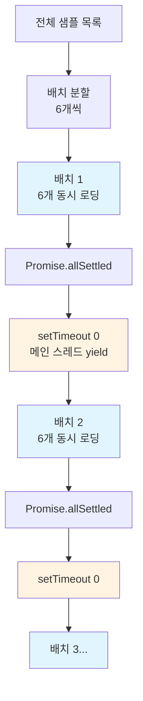
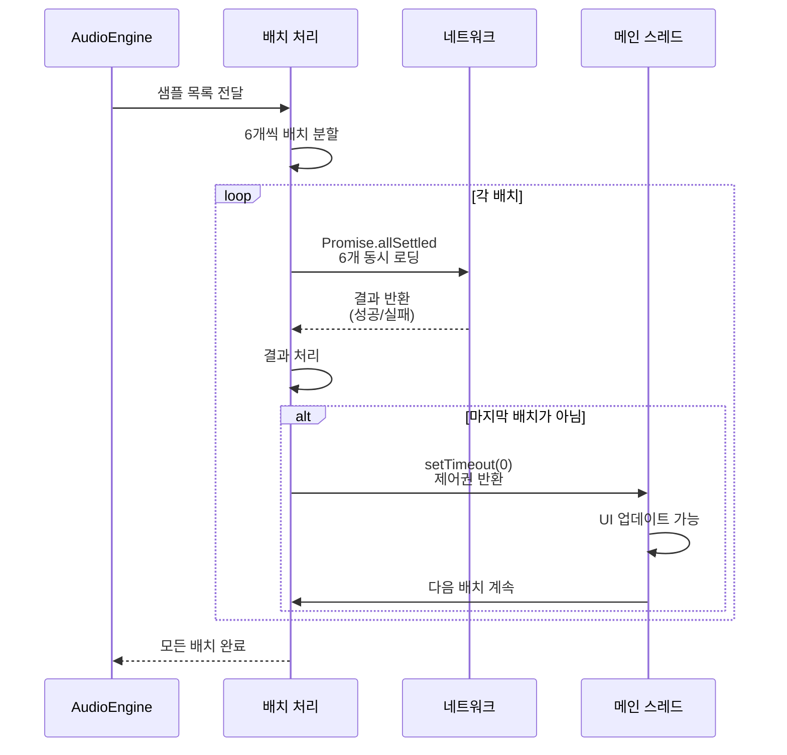
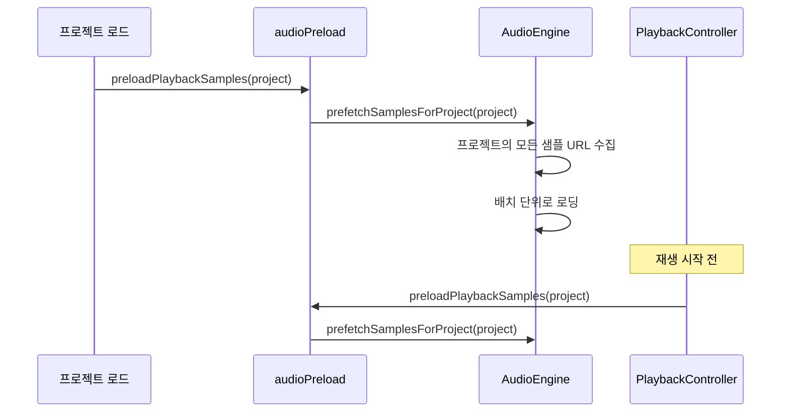

# 배치 샘플 로딩

**Document Version**: 1.0  
**Software Version**: 0.1.0  
**Last Updated**: 2026-01-14

**카테고리**: 구현 수준 - 오디오 재생 최적화

---

## 개요

오디오 샘플 로딩 시 메인 스레드 블로킹을 방지하기 위해 배치 단위로 로딩하고, 지연 로딩과 중복 로딩 방지를 통해 성능을 최적화하는 기법입니다.

---

## 목표

- 오디오 샘플 로딩 시 메인 스레드 블로킹 방지
- 초기 로딩 시간 단축
- 일부 샘플 실패 시에도 계속 진행
- 필요한 샘플만 지연 로딩 (Lazy Loading)
- 중복 로딩 방지 (pending map 사용)
- 프로젝트 기반 프리페치 (Prefetch)

---

## 구현 위치

- `src/core/audio/AudioEngine.ts`: 샘플 로딩 및 프리페치 로직
- `src/core/audio/PlaybackController.ts`: 재생 시작 전 프리페치
- `src/utils/audioPreload.ts`: 프로젝트 기반 프리페치 유틸리티
- `src/store/actions/trackActions.ts`: 트랙 추가/악기 변경 시 프리페치
- `src/store/projectState.ts`: 프로젝트 로드 시 프리페치

---

## 알고리즘

### 배치 크기
6개씩 동시 로딩합니다.

### 비동기 처리
`Promise.allSettled`를 사용하여 일부 실패해도 계속 진행합니다.

### 배치 간 yield
`setTimeout(0)`을 사용하여 메인 스레드 블로킹을 방지합니다.

### 배치 로딩 구조 다이어그램



---

## 코드 구조

```typescript
const batchSize = 6;
for (let i = 0; i < sampleUrls.length; i += batchSize) {
  const batch = sampleUrls.slice(i, i + batchSize);
  const results = await Promise.allSettled(batch.map(loadSample));
  
  if (i + batchSize < sampleUrls.length) {
    await new Promise((resolve) => setTimeout(resolve, 0));
  }
}
```

---

## 동작 방식

### 배치 로딩 플로우



### 1. 샘플 목록 배치 분할
전체 샘플 URL 목록을 6개씩 배치로 분할합니다.

### 2. 배치 단위 로딩
각 배치를 `Promise.allSettled`로 동시에 로딩합니다.
- 일부 샘플이 실패해도 나머지는 계속 진행
- 결과를 배열로 반환하여 성공/실패 여부 확인

### 3. 배치 간 yield
한 배치가 완료되면 `setTimeout(0)`으로 메인 스레드에 제어권을 반환합니다.
- UI 업데이트, 사용자 입력 처리 등이 가능
- 메인 스레드 블로킹 방지

### 4. 다음 배치 처리
모든 배치가 완료될 때까지 위 과정을 반복합니다.

---

## 지연 로딩 (Lazy Loading)

### 개요
필요한 샘플만 재생 시점에 로딩하여 초기 로딩 시간을 단축합니다.

### 동작 방식
- `scheduleNote()` 호출 시 샘플 버퍼 확인
- 버퍼가 없으면 `ensureSampleLoaded()` 호출하여 로딩
- 로딩 완료 후 재생

### 중복 로딩 방지
- `pendingSamples` Map을 사용하여 로딩 중인 샘플 추적
- 동일한 샘플이 여러 번 요청되어도 한 번만 로딩
- 로딩 완료 후 `sampleBuffers`에 저장

## 프리페치 (Prefetch)

### 프로젝트 기반 프리페치
- `prefetchSamplesForProject()`: 프로젝트의 모든 트랙에서 사용되는 샘플을 미리 로딩
- 프로젝트 로드 시 자동으로 프리페치 실행
- 트랙 추가/악기 변경 시에도 프리페치 실행

### 재생 시작 전 프리페치
- `PlaybackController`에서 재생 시작 전 `prefetchSamplesForProject()` 호출
- 재생 중단을 방지하기 위해 필요한 샘플을 미리 준비

### 프리페치 흐름


## 효과

### 성능 개선
- 초기 로딩 시간 단축 (병렬 로딩)
- 메인 스레드 응답성 유지
- 필요한 샘플만 로딩하여 네트워크 사용량 감소
- 중복 로딩 방지로 불필요한 네트워크 요청 제거

### 안정성
- 일부 샘플 실패 시에도 계속 진행
- 전체 로딩 실패 방지
- 재생 시작 전 프리페치로 재생 중단 방지

### 사용자 경험
- 로딩 중에도 UI가 반응함
- 진행 상황 표시 가능
- 재생 시작 시 즉시 재생 가능 (프리페치 덕분)

---

## 관련 문서

- [`src/core/audio/AudioEngine.ts`](../../../../src/core/audio/AudioEngine.ts)

---

**Last Updated**: 2026-01-14

