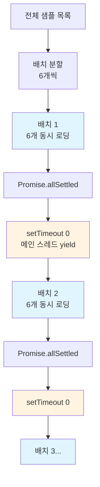
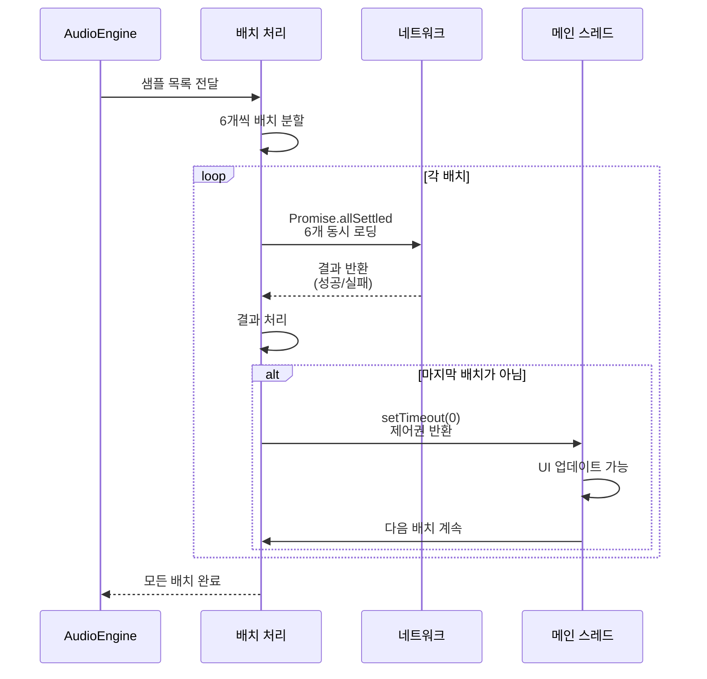

# 배치 샘플 로딩

**Document Version**: 1.0  
**Software Version**: 0.1.0  
**Last Updated**: 2026-01-14

**카테고리**: 구현 수준 - 오디오 재생 최적화

---

## 개요

오디오 샘플 로딩 시 메인 스레드 블로킹을 방지하기 위해 배치 단위로 로딩하는 최적화 기법입니다.

---

## 목표

- 오디오 샘플 로딩 시 메인 스레드 블로킹 방지
- 초기 로딩 시간 단축
- 일부 샘플 실패 시에도 계속 진행

---

## 구현 위치

- `src/core/audio/AudioEngine.ts`

---

## 알고리즘

### 배치 크기
6개씩 동시 로딩합니다.

### 비동기 처리
`Promise.allSettled`를 사용하여 일부 실패해도 계속 진행합니다.

### 배치 간 yield
`setTimeout(0)`을 사용하여 메인 스레드 블로킹을 방지합니다.

### 배치 로딩 구조 다이어그램



---

## 코드 구조

```typescript
const batchSize = 6;
for (let i = 0; i < sampleUrls.length; i += batchSize) {
  const batch = sampleUrls.slice(i, i + batchSize);
  const results = await Promise.allSettled(batch.map(loadSample));
  
  if (i + batchSize < sampleUrls.length) {
    await new Promise((resolve) => setTimeout(resolve, 0));
  }
}
```

---

## 동작 방식

### 배치 로딩 플로우



### 1. 샘플 목록 배치 분할
전체 샘플 URL 목록을 6개씩 배치로 분할합니다.

### 2. 배치 단위 로딩
각 배치를 `Promise.allSettled`로 동시에 로딩합니다.
- 일부 샘플이 실패해도 나머지는 계속 진행
- 결과를 배열로 반환하여 성공/실패 여부 확인

### 3. 배치 간 yield
한 배치가 완료되면 `setTimeout(0)`으로 메인 스레드에 제어권을 반환합니다.
- UI 업데이트, 사용자 입력 처리 등이 가능
- 메인 스레드 블로킹 방지

### 4. 다음 배치 처리
모든 배치가 완료될 때까지 위 과정을 반복합니다.

---

## 효과

### 성능 개선
- 초기 로딩 시간 단축 (병렬 로딩)
- 메인 스레드 응답성 유지

### 안정성
- 일부 샘플 실패 시에도 계속 진행
- 전체 로딩 실패 방지

### 사용자 경험
- 로딩 중에도 UI가 반응함
- 진행 상황 표시 가능

---

## 관련 문서

- [`src/core/audio/AudioEngine.ts`](../../../../src/core/audio/AudioEngine.ts)

---

**Last Updated**: 2026-01-14

