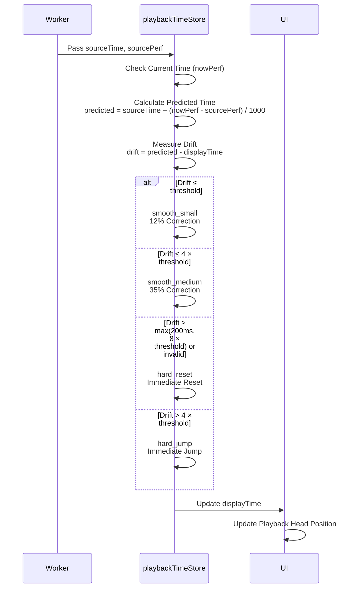

# Drift Correction System

**Document Version**: 1.0  
**Software Version**: 0.1.0  
**Last Updated**: 2026-01-14

**Category**: Implementation Level - Audio Playback Optimization

---

## Overview

A system that smoothly corrects timing differences between worker ticks and UI.

---

## Goals

- Smoothly correct timing differences between worker ticks and UI
- Improve smoothness of playback head movement
- Immediate correction for large timing errors

---

## Implementation Location

- `src/utils/playbackTimeStore.ts`

---

## Algorithm

### Prediction-based Time Calculation
```typescript
predicted = sourceTime + (nowPerf - sourcePerf) / 1000
```

### Step-by-step Correction Strategy
- **smooth_small**: Small drift (≤ threshold) corrected by 12%
- **smooth_medium**: Medium drift (≤ 4 × threshold) corrected by 35%
- **hard_jump**: Large drift (> 4 × threshold and < hard reset) immediately jumps
- **hard_reset**: Invalid display time or very large drift (≥ max(200ms, 8 × threshold)) immediately resets

### Drift Correction Strategy Diagram

```mermaid
graph TD
    A[Receive Worker Time] --> B[Calculate Predicted Time]
    B --> C[Measure Drift]
    C --> D{Drift<br/>Size?}
    
    D -->|≤ threshold| E[smooth_small<br/>12% Correction]
    D -->|≤ 4× threshold| F[smooth_medium<br/>35% Correction]
    D -->|> 4× threshold| G[hard_jump<br/>Immediate Jump]
    D -->|Invalid or ≥ max(200ms, 8× threshold)| H[hard_reset<br/>Immediate Reset]
    
    E --> I[Update Display Time]
    F --> I
    G --> I
    H --> I
    
    style E fill:#ccffcc
    style F fill:#fff4e1
    style G fill:#ffcccc
    style H fill:#ff9999
```

---

## Parameters

- Default threshold: 20ms (adjustable in developer panel)
- Correction ratio: 12% (small), 35% (medium)
- Log throttle: Once per 250ms

---

## Code Structure

```typescript
const predicted = sourceTime + (nowPerf - sourcePerf) / 1000;
const driftMs = (predicted - displayTime) * 1000;
const absDrift = Math.abs(driftMs);
const hardResetMs = Math.max(200, driftThresholdMs * 8);

if (!Number.isFinite(displayTime) || absDrift >= hardResetMs) {
  displayTime = predicted; // hard_reset
} else if (absDrift <= driftThresholdMs) {
  displayTime += (driftMs / 1000) * 0.12; // smooth_small
} else if (absDrift <= driftThresholdMs * 4) {
  displayTime += (driftMs / 1000) * 0.35; // smooth_medium
} else {
  displayTime = predicted; // hard_jump
}
```

---

## Operation

### Drift Correction Flow



### 1. Predicted Time Calculation
Calculates predicted time based on time received from worker and current time.

### 2. Drift Measurement
Measures the difference (drift) between predicted time and current display time.

### 3. Step-by-step Correction
Applies different correction strategies according to drift size:
- Small drift: Gradual correction (12%)
- Medium drift: Faster correction (35%)
- Large drift: Immediate jump
- Invalid or very large drift: Immediate reset

### 4. Display Time Update
Updates display time with corrected time.

---

## Effects

### Timing Synchronization
- Improved timing synchronization between worker and UI
- Improved smoothness of playback head movement

### User Experience
- Immediate correction for large timing errors
- Smooth playback head movement

---

## Related Documents

- [`Worker-based Playback Clock`](../architecture-level/worker-playback-clock.en.md)
- [`Adjustable Audio Buffer Size`](./audio-buffer-size.en.md)

---

**Last Updated**: 2026-01-14

