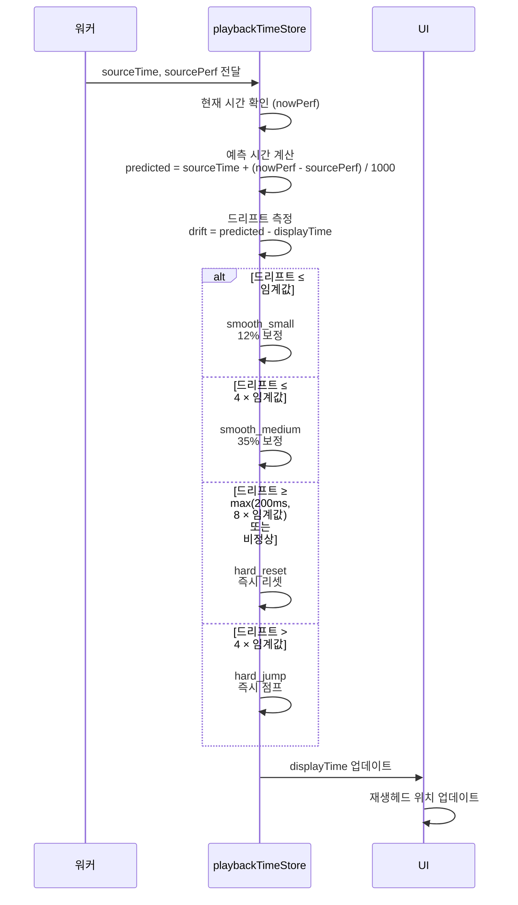

# Drift 보정 시스템

**Document Version**: 1.0  
**Software Version**: 0.1.0  
**Last Updated**: 2026-01-14

**카테고리**: 구현 수준 - 오디오 재생 최적화

---

## 개요

워커 틱과 UI 간의 타이밍 오차를 부드럽게 보정하는 시스템입니다.

---

## 목표

- 워커 틱과 UI 간의 타이밍 오차를 부드럽게 보정
- 재생헤드 움직임의 부드러움 향상
- 큰 타이밍 오차 시 즉각적인 보정

---

## 구현 위치

- `src/utils/playbackTimeStore.ts`

---

## 알고리즘

### 예측 기반 시간 계산
```typescript
predicted = sourceTime + (nowPerf - sourcePerf) / 1000
```

### 단계별 보정 전략
- **smooth_small**: 작은 드리프트(≤ 임계값)는 12% 보정
- **smooth_medium**: 중간 드리프트(≤ 4 × 임계값)는 35% 보정
- **hard_jump**: 큰 드리프트(> 4 × 임계값, hard reset 미만)는 즉시 점프
- **hard_reset**: 비정상 값 또는 매우 큰 드리프트(≥ max(200ms, 8 × 임계값)) 즉시 리셋

### 드리프트 보정 전략 다이어그램

```mermaid
graph TD
    A[워커 시간 수신] --> B[예측 시간 계산]
    B --> C[드리프트 측정]
    C --> D{드리프트<br/>크기?}
    
    D -->|≤ 임계값| E[smooth_small<br/>12% 보정]
    D -->|≤ 4× 임계값| F[smooth_medium<br/>35% 보정]
    D -->|> 4× 임계값| G[hard_jump<br/>즉시 점프]
    D -->|비정상 또는 ≥ max(200ms, 8× 임계값)| H[hard_reset<br/>즉시 리셋]
    
    E --> I[표시 시간 업데이트]
    F --> I
    G --> I
    H --> I
    
    style E fill:#ccffcc
    style F fill:#fff4e1
    style G fill:#ffcccc
    style H fill:#ff9999
```

---

## 파라미터

- 기본 임계값: 20ms (개발자 패널에서 조절 가능)
- 보정 비율: 12% (small), 35% (medium)
- 로그 스로틀: 250ms당 1회

---

## 코드 구조

```typescript
const predicted = sourceTime + (nowPerf - sourcePerf) / 1000;
const driftMs = (predicted - displayTime) * 1000;
const absDrift = Math.abs(driftMs);
const hardResetMs = Math.max(200, driftThresholdMs * 8);

if (!Number.isFinite(displayTime) || absDrift >= hardResetMs) {
  displayTime = predicted; // hard_reset
} else if (absDrift <= driftThresholdMs) {
  displayTime += (driftMs / 1000) * 0.12; // smooth_small
} else if (absDrift <= driftThresholdMs * 4) {
  displayTime += (driftMs / 1000) * 0.35; // smooth_medium
} else {
  displayTime = predicted; // hard_jump
}
```

---

## 동작 방식

### 드리프트 보정 플로우



### 1. 예측 시간 계산
워커에서 받은 시간과 현재 시간을 기반으로 예측 시간을 계산합니다.

### 2. 드리프트 측정
예측 시간과 현재 표시 시간 간의 차이(드리프트)를 측정합니다.

### 3. 단계별 보정
드리프트 크기에 따라 다른 보정 전략을 적용합니다:
- 작은 드리프트: 점진적 보정 (12%)
- 중간 드리프트: 보다 빠른 보정 (35%)
- 큰 드리프트: 즉시 점프
- 비정상 또는 매우 큰 드리프트: 즉시 리셋

### 4. 표시 시간 업데이트
보정된 시간을 표시 시간으로 업데이트합니다.

---

## 효과

### 타이밍 동기화
- 워커와 UI 간 타이밍 동기화 개선
- 재생헤드 움직임의 부드러움 향상

### 사용자 경험
- 큰 타이밍 오차 시 즉각적인 보정
- 부드러운 재생헤드 움직임

---

## 관련 문서

- [`워커 기반 재생 클록`](../architecture-level/worker-playback-clock.ko.md)
- [`조절 가능한 오디오 버퍼 사이즈`](./audio-buffer-size.ko.md)

---

**Last Updated**: 2026-01-14

