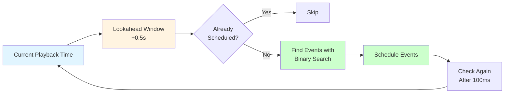
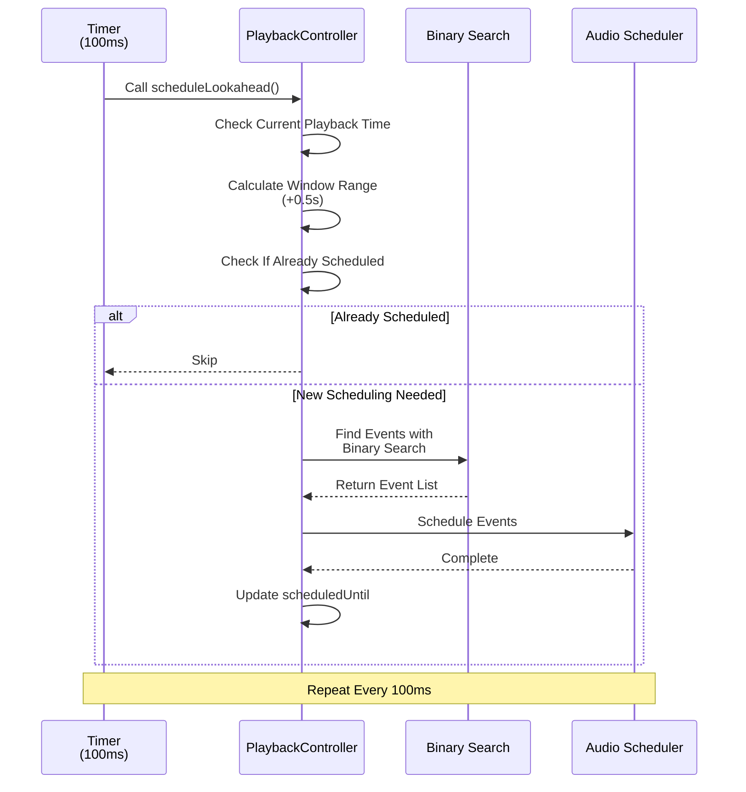

# Lookahead Scheduling

**Document Version**: 1.0  
**Software Version**: 0.1.0  
**Last Updated**: 2026-01-14

**Category**: Implementation Level - Audio Playback Optimization

---

## Overview

An optimization technique that pre-schedules audio events to ensure playback stability.

---

## Goals

- Pre-schedule audio events to ensure playback stability
- Distribute CPU load
- Prevent event loss

---

## Implementation Location

- `src/core/audio/PlaybackController.ts`

---

## Algorithm

### Lookahead Window
Pre-schedules notes 0.5 seconds ahead.

### Update Interval
Refreshes lookahead window every 100ms.

### Binary Search
Finds event index based on current playback time in O(log n).

### Lookahead Window Diagram

```mermaid
gantt
    title Lookahead Scheduling Window
    dateFormat X
    axisFormat %L ms
    
    section Playback Time
    Current Playback Time :0, 0
    
    section Scheduling Window
    Already Scheduled :0, 100
    New Scheduling :100, 400
    
    section Future
    Not Yet Scheduled :500, 100
```





---

## Code Structure

```typescript
const SCHEDULE_LOOKAHEAD_SECONDS = 0.5;
const SCHEDULE_INTERVAL_MS = 100;

private scheduleLookahead(): void {
  const playbackTime = getPlaybackTime();
  const windowEnd = playbackTime + SCHEDULE_LOOKAHEAD_SECONDS;
  if (windowEnd <= this.scheduledUntil) {
    return;
  }
  this.scheduleWindow(playbackTime, this.scheduledUntil, windowEnd);
  this.scheduledUntil = windowEnd;
}
```

---

## Operation

### Scheduling Flow



### 1. Check Current Playback Time
Sets lookahead window based on current playback time.

### 2. Determine Window Range
Sets range from current time to 0.5 seconds ahead as scheduling target.

### 3. Skip Already Scheduled Range
Does not re-schedule already scheduled ranges.

### 4. Schedule Events
Finds events within window range using binary search and schedules them.

### 5. Periodic Refresh
Repeats the above process every 100ms to maintain lookahead window.

---

## Effects

### Playback Stability
- Prevents audio event loss
- Improves playback stability

### Performance
- Distributes CPU load
- Efficient event search (O(log n))

---

## Related Documents

- [`Adjustable Audio Buffer Size`](./audio-buffer-size.en.md)

---

**Last Updated**: 2026-01-14

