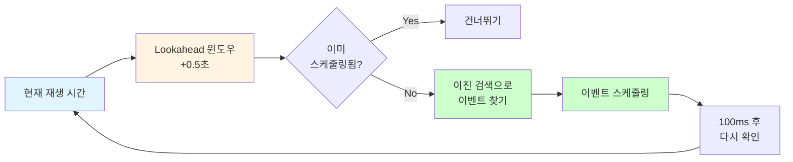
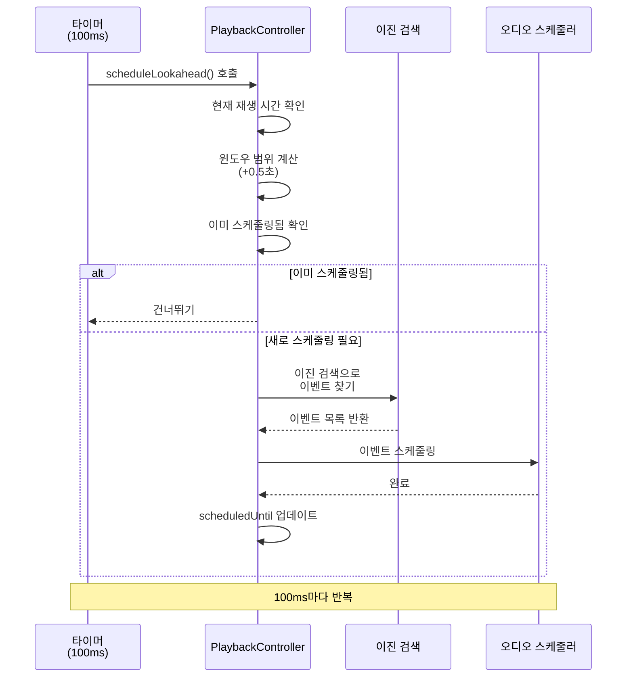

# Lookahead 스케줄링

**Document Version**: 1.0  
**Software Version**: 0.1.0  
**Last Updated**: 2026-01-14

**카테고리**: 구현 수준 - 오디오 재생 최적화

---

## 개요

오디오 이벤트를 미리 스케줄링하여 재생 안정성을 확보하는 최적화 기법입니다.

---

## 목표

- 오디오 이벤트를 미리 스케줄링하여 재생 안정성 확보
- CPU 부하 분산
- 이벤트 누락 방지

---

## 구현 위치

- `src/core/audio/PlaybackController.ts`

---

## 알고리즘

### Lookahead 윈도우
0.5초 앞의 노트를 미리 스케줄링합니다.

### 업데이트 간격
100ms마다 lookahead 윈도우를 갱신합니다.

### 이진 검색
현재 재생 시간 기준 이벤트 인덱스를 O(log n)으로 찾습니다.

### Lookahead 윈도우 다이어그램

```mermaid
gantt
    title Lookahead 스케줄링 윈도우
    dateFormat X
    axisFormat %L ms
    
    section 재생 시간
    현재 재생 시간 :0, 0
    
    section 스케줄링 윈도우
    이미 스케줄링됨 :0, 100
    새로 스케줄링 :100, 400
    
    section 미래
    아직 스케줄링 안됨 :500, 100
```





---

## 코드 구조

```typescript
const SCHEDULE_LOOKAHEAD_SECONDS = 0.5;
const SCHEDULE_INTERVAL_MS = 100;

private scheduleLookahead(): void {
  const playbackTime = getPlaybackTime();
  const windowEnd = playbackTime + SCHEDULE_LOOKAHEAD_SECONDS;
  if (windowEnd <= this.scheduledUntil) {
    return;
  }
  this.scheduleWindow(playbackTime, this.scheduledUntil, windowEnd);
  this.scheduledUntil = windowEnd;
}
```

---

## 동작 방식

### 스케줄링 플로우



### 1. 현재 재생 시간 확인
현재 재생 시간을 기준으로 lookahead 윈도우를 설정합니다.

### 2. 윈도우 범위 결정
현재 시간부터 0.5초 앞까지의 범위를 스케줄링 대상으로 설정합니다.

### 3. 이미 스케줄링된 범위 건너뛰기
이미 스케줄링된 범위는 다시 스케줄링하지 않습니다.

### 4. 이벤트 스케줄링
윈도우 범위 내의 이벤트를 이진 검색으로 찾아 스케줄링합니다.

### 5. 주기적 갱신
100ms마다 위 과정을 반복하여 lookahead 윈도우를 유지합니다.

---

## 효과

### 재생 안정성
- 오디오 이벤트 누락 방지
- 재생 안정성 향상

### 성능
- CPU 부하 분산
- 효율적인 이벤트 검색 (O(log n))

---

## 관련 문서

- [`조절 가능한 오디오 버퍼 사이즈`](./audio-buffer-size.ko.md)

---

**Last Updated**: 2026-01-14

