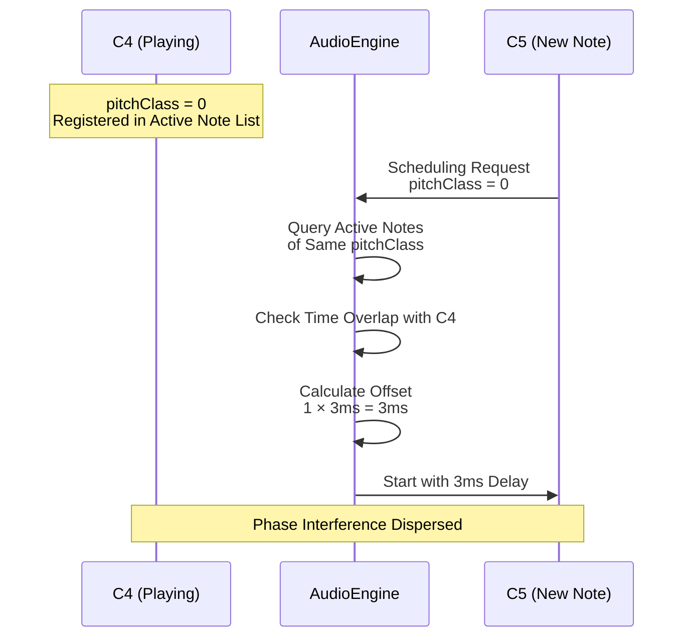

# Pitch Class Interference Prevention: Time Offset Application

**Document Version**: 1.0  
**Software Version**: 0.1.0  
**Last Updated**: 2026-01-14

**Category**: Implementation Level - Audio Playback Optimization

---

## Overview

Piano samples reuse the same sample across multiple octaves to reduce project size (pitch adjustment by changing `playbackRate`). This caused a problem where playing the same pitch class in different octaves simultaneously resulted in phase interference from audio derived from the same sample source, causing severe peaking.

This feature applies time offsets to disperse phase interference when notes of the same pitch class are played simultaneously.

---

## Goals

- Mitigate phase interference from audio derived from the same sample source
- Resolve peaking issues
- Maintain natural sound without pitch changes
- Allow users to adjust offset values as needed

---

## Implementation Location

- `src/core/audio/AudioEngine.ts`
  - `scheduleNote()`: Pitch class detection and offset application logic
  - `setPitchOffsetMaxMs()`: Maximum offset value setting
  - `activeNotesByPitchClass`: Active note tracking Map

- `src/store/uiStore.tsx`
  - `pitchOffsetMaxMs`: UI state management

- `src/components/Inspector/DeveloperPanel.tsx`
  - PITCH OFFSET control (developer menu)

---

## Algorithm

### 1. Pitch Class Calculation

Uses the remainder of MIDI note number divided by 12 to detect the same pitch class:

```typescript
const pitchClass = note.midi % 12; // 0-11 (C=0, C#=1, ..., B=11)
```

**Examples:**
- C4 (MIDI 60) → pitchClass = 0
- C5 (MIDI 72) → pitchClass = 0
- C6 (MIDI 84) → pitchClass = 0
- D4 (MIDI 62) → pitchClass = 2

### 2. Active Note Tracking

Tracks time ranges of currently playing notes for each pitch class:

```typescript
activeNotesByPitchClass: Map<number, Array<{
  startTime: number;
  endTime: number;
  source: AudioBufferSourceNode;
}>>
```

### 3. Overlapping Note Detection

When scheduling a new note, finds notes with overlapping time among active notes of the same pitch class:

```typescript
const overlappingNotes = activeNotes.filter(active => 
  baseAudioStartTime < active.endTime && 
  baseAudioStartTime + outputDuration > active.startTime
);
```

### 4. Time Offset Calculation and Application

If there are overlapping notes, applies offset proportional to the number of overlapping notes:

```typescript
if (overlappingNotes.length > 0) {
  const offsetSeconds = (overlappingNotes.length * this.pitchOffsetMaxMs) / 1000;
  audioStartTime = baseAudioStartTime + offsetSeconds;
}
```

**Offset Calculation Formula:**
```
offsetSeconds = (overlappingNotes.length × pitchOffsetMaxMs) / 1000
```

### 5. Active Note Registration and Cleanup

Adds to active note list when note starts, and automatically removes when note ends:

```typescript
// When note starts
activeNotes.push({
  startTime: audioStartTime,
  endTime: audioStartTime + outputDuration,
  source: source,
});

// When note ends (onended callback)
const index = notes.findIndex(n => n.source === source);
if (index !== -1) {
  notes.splice(index, 1);
}
```

---

## Operation Examples

### Example 1: Basic Case (pitchOffsetMaxMs = 3ms)

**Scenario**: C4 playing, C5 starts

1. C4 is playing (pitchClass = 0)
2. C5 start attempt (pitchClass = 0)
3. `overlappingNotes.length = 1`
4. `offsetSeconds = (1 × 3) / 1000 = 0.003s = 3ms`
5. **Result**: C5 starts 3ms delayed from original start time

### Example 2: Cumulative Offset (pitchOffsetMaxMs = 3ms)

**Scenario**: C4, C5 playing, C6 starts

1. C4, C5 are playing (both pitchClass = 0)
2. C6 start attempt (pitchClass = 0)
3. `overlappingNotes.length = 2`
4. `offsetSeconds = (2 × 3) / 1000 = 0.006s = 6ms`
5. **Result**: C6 starts 6ms delayed from original start time

### Example 3: Different Pitch Class (No Offset)

**Scenario**: C4 playing, D4 starts

1. C4 is playing (pitchClass = 0)
2. D4 start attempt (pitchClass = 2)
3. `overlappingNotes.length = 0` (different pitch class)
4. **Result**: No offset, normal start

### Operation Example Visualization



---

## Features

### Advantages

1. **Phase Interference Mitigation**: Temporally disperses phase interference from audio derived from the same sample source
2. **No Pitch Change**: Maintains natural sound without changing timbre
3. **Cumulative Offset**: Automatically accumulates offset when multiple notes play simultaneously for stronger dispersion effect
4. **Adjustable**: Maximum offset value adjustable in developer menu (0-20ms)

### Limitations

1. **Piano Only**: No offset for drums and other instruments
2. **Time Delay**: Note start may be delayed as offset increases (max 20ms)
3. **Overlap-based Detection**: Notes are treated as simultaneous if their playback time ranges overlap, even with slight timing differences

---

## User Settings

### Developer Menu Access

Click the theme button 10 times to open the developer menu.

### PITCH OFFSET Control

- **Location**: Developer Menu → PITCH OFFSET
- **Range**: 0-20ms
- **Default**: 3ms
- **Unit**: Milliseconds (ms)

### Recommended Settings

- **Default Use**: 3ms (default)
- **Severe Interference**: 5-10ms
- **Maximum Dispersion**: 10-20ms (chords may appear awkward)
- **Disable**: 0ms

---

## Implementation Details

### AudioEngine Changes

#### Instance Variables

```typescript
private pitchOffsetMaxMs: number = 3; // Default: 3ms

// Active note tracking for same pitch class detection
private activeNotesByPitchClass = new Map<number, Array<{
  startTime: number;
  endTime: number;
  source: AudioBufferSourceNode;
}>>();
```

#### Methods

```typescript
/**
 * Set maximum time offset for pitch class interference prevention
 * @param maxMs - Maximum time offset (milliseconds, 0-20 range)
 */
setPitchOffsetMaxMs(maxMs: number): void {
  this.pitchOffsetMaxMs = Math.max(0, Math.min(20, Math.floor(maxMs)));
}
```

#### scheduleNote Logic

```typescript
// Pitch class detection and time offset application (piano only)
let audioStartTime = baseAudioStartTime;
if (keySample.type === 'piano' && this.pitchOffsetMaxMs > 0) {
  const pitchClass = note.midi % 12;
  const activeNotes = this.activeNotesByPitchClass.get(pitchClass) || [];
  
  // Check notes overlapping with current time range
  const overlappingNotes = activeNotes.filter(active => 
    baseAudioStartTime < active.endTime && 
    baseAudioStartTime + outputDuration > active.startTime
  );
  
  // Apply offset if there are overlapping notes
  if (overlappingNotes.length > 0) {
    const offsetSeconds = (overlappingNotes.length * this.pitchOffsetMaxMs) / 1000;
    audioStartTime = baseAudioStartTime + offsetSeconds;
  }
}
```

### UI State Management

#### uiStore Addition

```typescript
export interface UIState {
  // ...
  pitchOffsetMaxMs: number; // Maximum time offset for pitch class interference prevention (milliseconds)
  // ...
}

// Action
| { type: 'SET_PITCH_OFFSET_MAX_MS'; payload: number }

// Reducer
case 'SET_PITCH_OFFSET_MAX_MS': {
  const nextValue = Number.isFinite(action.payload) 
    ? Math.max(0, Math.min(20, Math.floor(action.payload))) 
    : initialState.pitchOffsetMaxMs;
  return { ...state, pitchOffsetMaxMs: nextValue };
}
```

### DeveloperPanel UI

```typescript
<div className={styles.row}>
  <span className={styles.label}>PITCH OFFSET</span>
  <div className={styles.field}>
    <input
      className={styles.input}
      type="number"
      min={0}
      max={20}
      step={1}
      value={ui.pitchOffsetMaxMs}
      onChange={handlePitchOffsetChange}
    />
    <span className={styles.unit}>ms</span>
  </div>
</div>
```

---

## Performance Considerations

### Time Complexity

- **Pitch class calculation**: O(1)
- **Overlapping note search**: O(n) (n = number of active notes of same pitch class)
- **Active note registration/removal**: O(1) (Map lookup) + O(n) (array removal)

Since the number of active notes of the same pitch class is generally small (usually 1-3), performance impact is minimal.

### Memory Usage

- **Active note tracking**: Maximum 12 pitch classes × average active note count
- Each note information: Approximately 24 bytes (startTime, endTime, source reference)
- Total memory: Approximately hundreds of bytes (negligible)

---

## Test Scenarios

### Scenario 1: Same Pitch Class Simultaneous Playback

1. Play C4
2. Play C5 simultaneously
3. **Expected Result**: C5 starts 3ms delayed, no peaking

### Scenario 2: Multiple Octaves Simultaneous Playback

1. Play C4, C5
2. Play C6 simultaneously
3. **Expected Result**: C6 starts 6ms delayed, no peaking

### Scenario 3: Different Pitch Class Simultaneous Playback

1. Play C4
2. Play D4 simultaneously
3. **Expected Result**: No offset, normal start

### Scenario 4: Offset Disabled

1. Set PITCH OFFSET to 0ms
2. Play C4, C5 simultaneously
3. **Expected Result**: No offset, same as before (peaking may occur)

---

## Related Documents

- [`REFACTORING_EVALUATION.md`](../../../../REFACTORING_EVALUATION.md) - Pitch class interference prevention section
- [`docs/architecture/optimization-design/implementation-level/audio-buffer-size.en.md`](./audio-buffer-size.en.md) - Audio buffer size optimization
- [`docs/architecture/optimization-design/implementation-level/lookahead-scheduling.en.md`](./lookahead-scheduling.en.md) - Lookahead scheduling

---

## Future Improvement Ideas

1. **Dynamic Offset Adjustment**: Automatically adjust offset according to interference intensity
2. **Other Instrument Support**: Review applicability to drums and other instruments
3. **Phase Analysis**: Analyze actual phase interference to automatically calculate optimal offset value
4. **Preview Support**: Apply offset when clicking piano keys

---

**Last Updated**: 2026-01-14

