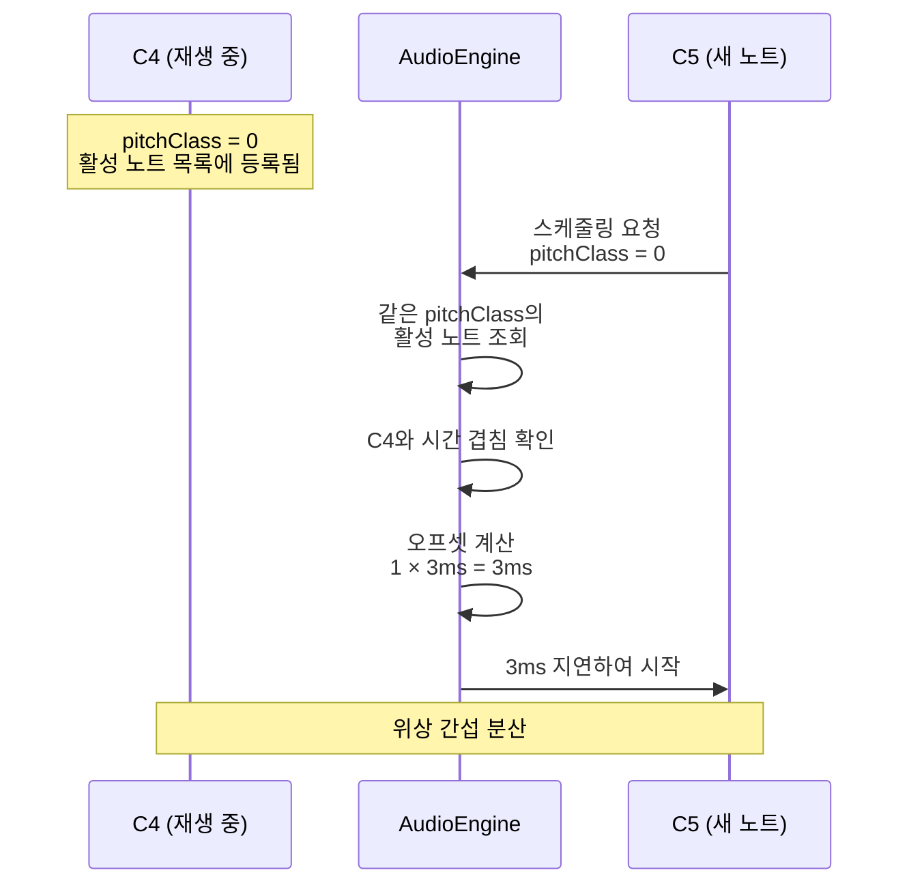

# 같은 음계 간섭 방지: 시간 오프셋 적용

**Document Version**: 1.0  
**Software Version**: 0.1.0  
**Last Updated**: 2026-01-14

**카테고리**: 구현 수준 - 오디오 재생 최적화

---

## 개요

피아노 샘플은 프로젝트 크기를 줄이기 위해 같은 샘플을 여러 옥타브에서 재사용합니다 (`playbackRate`를 변경하여 피치 조정). 이로 인해 같은 음계를 다른 옥타브에서 동시에 연주할 때 같은 샘플 소스에서 파생된 오디오가 위상 간섭을 일으켜 심각한 피크(peaking)가 발생하는 문제가 있었습니다.

이 기능은 시간 오프셋(time offset)을 적용하여 같은 음계의 노트가 동시에 재생될 때 위상 간섭을 분산시킵니다.

---

## 목표

- 같은 샘플 소스에서 파생된 오디오의 위상 간섭 완화
- 피크 문제 해결
- 피치 변경 없이 자연스러운 사운드 유지
- 사용자가 필요에 따라 오프셋 값 조절 가능

---

## 구현 위치

- `src/core/audio/AudioEngine.ts`
  - `scheduleNote()`: 같은 음계 감지 및 오프셋 적용 로직
  - `setPitchOffsetMaxMs()`: 최대 오프셋 값 설정
  - `activeNotesByPitchClass`: 활성 노트 추적 Map

- `src/store/uiStore.tsx`
  - `pitchOffsetMaxMs`: UI 상태 관리

- `src/components/Inspector/DeveloperPanel.tsx`
  - PITCH OFFSET 컨트롤 (개발자 메뉴)

---

## 알고리즘

### 1. Pitch Class 계산

MIDI 노트 번호를 12로 나눈 나머지를 사용하여 같은 음계를 감지합니다:

```typescript
const pitchClass = note.midi % 12; // 0-11 (C=0, C#=1, ..., B=11)
```

**예시:**
- C4 (MIDI 60) → pitchClass = 0
- C5 (MIDI 72) → pitchClass = 0
- C6 (MIDI 84) → pitchClass = 0
- D4 (MIDI 62) → pitchClass = 2

### 2. 활성 노트 추적

각 pitch class별로 현재 재생 중인 노트의 시간 범위를 추적합니다:

```typescript
activeNotesByPitchClass: Map<number, Array<{
  startTime: number;
  endTime: number;
  source: AudioBufferSourceNode;
}>>
```

### 3. 겹치는 노트 감지

새로운 노트를 스케줄링할 때, 같은 pitch class의 활성 노트 중 시간이 겹치는 노트를 찾습니다:

```typescript
const overlappingNotes = activeNotes.filter(active => 
  baseAudioStartTime < active.endTime && 
  baseAudioStartTime + outputDuration > active.startTime
);
```

### 4. 시간 오프셋 계산 및 적용

겹치는 노트가 있으면, 겹치는 노트의 개수에 비례하여 오프셋을 적용합니다:

```typescript
if (overlappingNotes.length > 0) {
  const offsetSeconds = (overlappingNotes.length * this.pitchOffsetMaxMs) / 1000;
  audioStartTime = baseAudioStartTime + offsetSeconds;
}
```

**오프셋 계산 공식:**
```
offsetSeconds = (overlappingNotes.length × pitchOffsetMaxMs) / 1000
```

### 5. 활성 노트 등록 및 정리

노트 시작 시 활성 노트 목록에 추가하고, 노트 종료 시 자동으로 제거합니다:

```typescript
// 노트 시작 시
activeNotes.push({
  startTime: audioStartTime,
  endTime: audioStartTime + outputDuration,
  source: source,
});

// 노트 종료 시 (onended 콜백)
const index = notes.findIndex(n => n.source === source);
if (index !== -1) {
  notes.splice(index, 1);
}
```

---

## 동작 예시

### 예시 1: 기본 케이스 (pitchOffsetMaxMs = 3ms)

**시나리오**: C4 재생 중, C5 시작

1. C4가 재생 중 (pitchClass = 0)
2. C5 시작 시도 (pitchClass = 0)
3. `overlappingNotes.length = 1`
4. `offsetSeconds = (1 × 3) / 1000 = 0.003초 = 3ms`
5. **결과**: C5는 원래 시작 시간에서 3ms 지연되어 시작

### 예시 2: 누적 오프셋 (pitchOffsetMaxMs = 3ms)

**시나리오**: C4, C5 재생 중, C6 시작

1. C4, C5가 재생 중 (둘 다 pitchClass = 0)
2. C6 시작 시도 (pitchClass = 0)
3. `overlappingNotes.length = 2`
4. `offsetSeconds = (2 × 3) / 1000 = 0.006초 = 6ms`
5. **결과**: C6는 원래 시작 시간에서 6ms 지연되어 시작

### 예시 3: 다른 음계 (오프셋 없음)

**시나리오**: C4 재생 중, D4 시작

1. C4가 재생 중 (pitchClass = 0)
2. D4 시작 시도 (pitchClass = 2)
3. `overlappingNotes.length = 0` (다른 pitch class)
4. **결과**: 오프셋 없음, 정상 시작

### 동작 예시 시각화



---

## 특징

### 장점

1. **위상 간섭 완화**: 같은 샘플 소스에서 파생된 오디오의 위상 간섭을 시간적으로 분산
2. **피치 변경 없음**: 음색을 변경하지 않고 자연스러운 사운드 유지
3. **누적 오프셋**: 여러 노트가 동시에 재생될 때 자동으로 오프셋이 누적되어 더 강한 분산 효과
4. **조절 가능**: 개발자 메뉴에서 최대 오프셋 값 조절 가능 (0-20ms)

### 제한사항

1. **피아노만 적용**: 드럼 등 다른 악기는 오프셋 없음
2. **시간 지연**: 오프셋이 클수록 노트 시작이 지연될 수 있음 (최대 20ms)
3. **겹침 기반 감지**: 재생 시간 구간이 겹치면 시간 차이가 있어도 동시에 재생되는 것으로 처리됨

---

## 사용자 설정

### 개발자 메뉴 접근

테마 버튼을 10번 클릭하여 개발자 메뉴를 열 수 있습니다.

### PITCH OFFSET 컨트롤

- **위치**: 개발자 메뉴 → PITCH OFFSET
- **범위**: 0-20ms
- **기본값**: 3ms
- **단위**: 밀리초 (ms)

### 권장 설정

- **기본 사용**: 3ms (기본값)
- **심한 간섭**: 5-10ms
- **최대 분산**: 10-20ms (코드가 어색해 보일 수 있음)
- **비활성화**: 0ms

---

## 구현 세부사항

### AudioEngine 변경사항

#### 인스턴스 변수

```typescript
private pitchOffsetMaxMs: number = 3; // 기본값: 3ms

// 같은 음계 감지를 위한 활성 노트 추적
private activeNotesByPitchClass = new Map<number, Array<{
  startTime: number;
  endTime: number;
  source: AudioBufferSourceNode;
}>>();
```

#### 메서드

```typescript
/**
 * 같은 음계 간섭 방지를 위한 최대 시간 오프셋 설정
 * @param maxMs - 최대 시간 오프셋 (밀리초, 0-20 범위)
 */
setPitchOffsetMaxMs(maxMs: number): void {
  this.pitchOffsetMaxMs = Math.max(0, Math.min(20, Math.floor(maxMs)));
}
```

#### scheduleNote 로직

```typescript
// 같은 음계 감지 및 시간 오프셋 적용 (피아노만)
let audioStartTime = baseAudioStartTime;
if (keySample.type === 'piano' && this.pitchOffsetMaxMs > 0) {
  const pitchClass = note.midi % 12;
  const activeNotes = this.activeNotesByPitchClass.get(pitchClass) || [];
  
  // 현재 시간 범위에 겹치는 노트 확인
  const overlappingNotes = activeNotes.filter(active => 
    baseAudioStartTime < active.endTime && 
    baseAudioStartTime + outputDuration > active.startTime
  );
  
  // 겹치는 노트가 있으면 오프셋 적용
  if (overlappingNotes.length > 0) {
    const offsetSeconds = (overlappingNotes.length * this.pitchOffsetMaxMs) / 1000;
    audioStartTime = baseAudioStartTime + offsetSeconds;
  }
}
```

### UI 상태 관리

#### uiStore 추가

```typescript
export interface UIState {
  // ...
  pitchOffsetMaxMs: number; // 같은 음계 간섭 방지를 위한 최대 시간 오프셋 (밀리초)
  // ...
}

// 액션
| { type: 'SET_PITCH_OFFSET_MAX_MS'; payload: number }

// 리듀서
case 'SET_PITCH_OFFSET_MAX_MS': {
  const nextValue = Number.isFinite(action.payload) 
    ? Math.max(0, Math.min(20, Math.floor(action.payload))) 
    : initialState.pitchOffsetMaxMs;
  return { ...state, pitchOffsetMaxMs: nextValue };
}
```

### DeveloperPanel UI

```typescript
<div className={styles.row}>
  <span className={styles.label}>PITCH OFFSET</span>
  <div className={styles.field}>
    <input
      className={styles.input}
      type="number"
      min={0}
      max={20}
      step={1}
      value={ui.pitchOffsetMaxMs}
      onChange={handlePitchOffsetChange}
    />
    <span className={styles.unit}>ms</span>
  </div>
</div>
```

---

## 성능 고려사항

### 시간 복잡도

- **Pitch class 계산**: O(1)
- **겹치는 노트 검색**: O(n) (n = 같은 pitch class의 활성 노트 수)
- **활성 노트 등록/제거**: O(1) (Map 조회) + O(n) (배열에서 제거)

일반적으로 같은 pitch class의 활성 노트 수는 많지 않으므로 (보통 1-3개), 성능 영향은 미미합니다.

### 메모리 사용

- **활성 노트 추적**: 최대 12개 pitch class × 평균 활성 노트 수
- 각 노트 정보: 약 24바이트 (startTime, endTime, source 참조)
- 전체 메모리: 약 수백 바이트 수준 (무시 가능)

---

## 테스트 시나리오

### 시나리오 1: 같은 음계 동시 연주

1. C4를 재생
2. C5를 동시에 재생
3. **기대 결과**: C5가 3ms 지연되어 시작, 피크 없음

### 시나리오 2: 여러 옥타브 동시 연주

1. C4, C5를 재생
2. C6를 동시에 재생
3. **기대 결과**: C6가 6ms 지연되어 시작, 피크 없음

### 시나리오 3: 다른 음계 동시 연주

1. C4를 재생
2. D4를 동시에 재생
3. **기대 결과**: 오프셋 없음, 정상 시작

### 시나리오 4: 오프셋 비활성화

1. PITCH OFFSET을 0ms로 설정
2. C4, C5를 동시에 재생
3. **기대 결과**: 오프셋 없음, 기존과 동일 (피크 발생 가능)

---

## 관련 문서

- [`REFACTORING_EVALUATION.md`](../../../../REFACTORING_EVALUATION.md) - 같은 음계 간섭 방지 섹션
- [`docs/architecture/optimization-design/implementation-level/audio-buffer-size.ko.md`](./audio-buffer-size.ko.md) - 오디오 버퍼 사이즈 최적화
- [`docs/architecture/optimization-design/implementation-level/lookahead-scheduling.ko.md`](./lookahead-scheduling.ko.md) - Lookahead 스케줄링

---

## 향후 개선 아이디어

1. **동적 오프셋 조절**: 간섭 강도에 따라 자동으로 오프셋 조절
2. **다른 악기 지원**: 드럼 등 다른 악기에도 적용 가능한지 검토
3. **위상 분석**: 실제 위상 간섭을 분석하여 최적 오프셋 값 자동 계산
4. **프리뷰 지원**: 피아노 키 클릭 시에도 오프셋 적용

---

**Last Updated**: 2026-01-14

