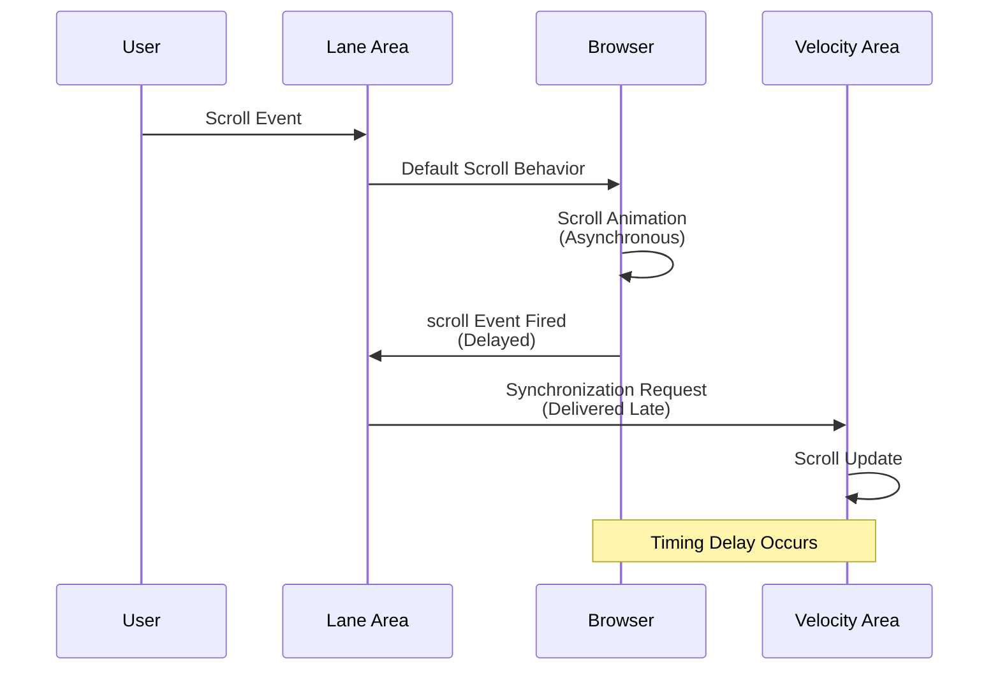
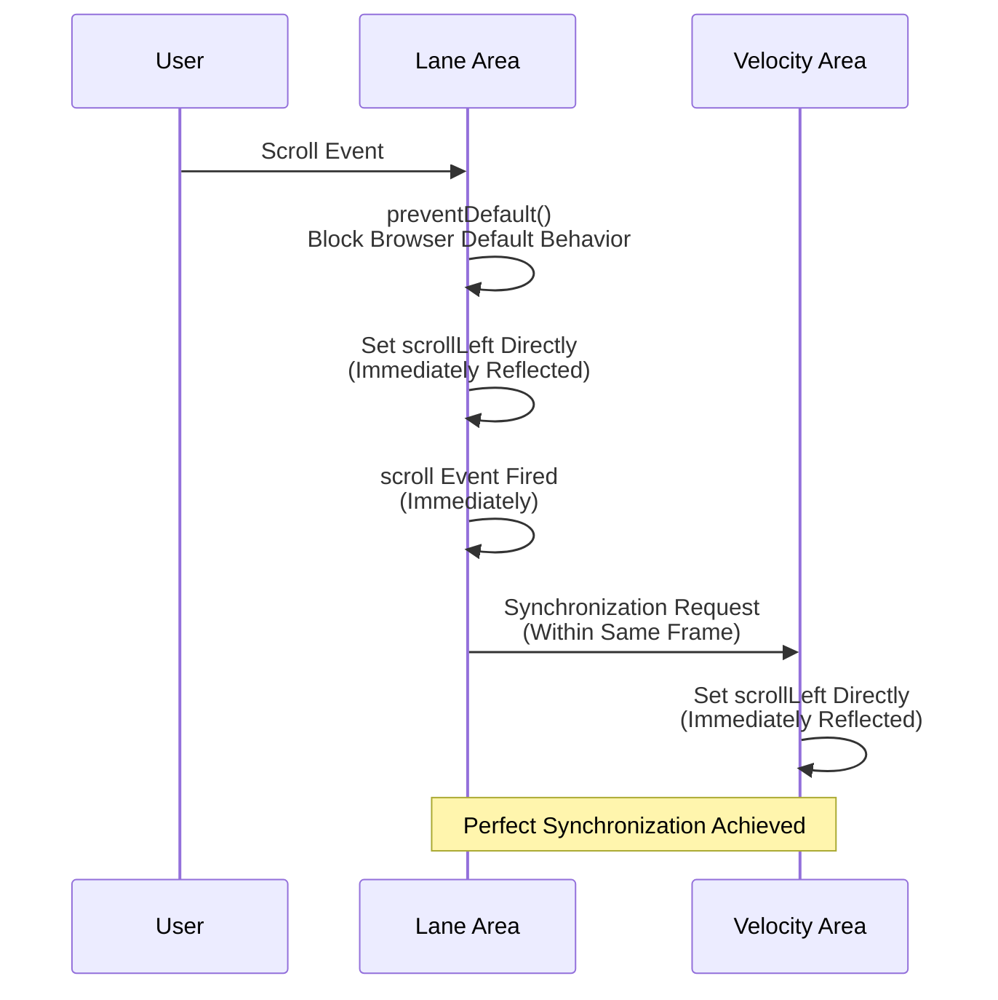

# MIDI Editor Scroll Synchronization

**Document Version**: 1.0  
**Software Version**: 0.1.0  
**Last Updated**: 2026-01-14

**Category**: Implementation Level - UI Optimization

---

## Overview

An optimization technique that immediately synchronizes horizontal scrolling between the lane area and velocity area in the MIDI editor.

---

## Goals

- Immediately synchronize horizontal scrolling between lane area and velocity area
- Eliminate timing delays caused by browser default scroll behavior
- Provide consistent user experience

---

## Implementation Location

- `src/components/MidiEditor/PianoRoll.tsx`
  - `onWheel` handler of `pianoRollContainerRef`
- `src/components/MidiEditor/EditorFooter.tsx`
  - `onWheel` handler of `velocityGraphAreaRef`

---

## Problem Situation

### Previous Behavior
- Scroll in velocity area: `preventDefault()` in `onWheel` blocks browser default behavior, then immediately sets scroll programmatically → perfect synchronization
- Scroll in lane area: Regular wheel/horizontal wheel relies on browser default behavior → timing delay due to scroll animation → velocity area synchronizes late

### Issues
- Scroll synchronization delay between lane area and velocity area
- Inconsistent user experience

### Previous Behavior Problem Diagram



---

## Optimization Method

### Lane Area Optimization
Modified lane area's `onWheel` handler to match velocity area for horizontal scroll:
1. Intercept horizontal wheel input (`deltaX` or `Shift+wheel`) with `preventDefault()`
2. Keep vertical scroll (plain `deltaY`) as browser default behavior
3. Set `scrollLeft` directly to trigger immediate synchronization

### Optimized Behavior Diagram



---

## Code Structure

```typescript
onWheel={(e) => {
  // Only handle horizontal scroll programmatically
  const delta = e.deltaX !== 0 ? e.deltaX : (e.shiftKey ? e.deltaY : 0);
  if (delta === 0) return; // allow vertical scroll to behave normally
  
  e.preventDefault();  // Block browser default behavior
  e.stopPropagation();
  
  const container = pianoRollContainerRef.current;
  if (!container) return;
  
  const scrollLeftBefore = container.scrollLeft;
  const maxScrollLeft = container.scrollWidth - container.clientWidth;
  const nextScrollLeft = Math.max(0, Math.min(scrollLeftBefore + delta, maxScrollLeft));
  container.scrollLeft = nextScrollLeft;  // Direct setting (immediately reflected)
}}
```

---

## Technical Background

### Limitations of Browser Default Scroll
- Browser default scroll is asynchronous and may include animation effects
- `scroll` event may fire late
- Delay in synchronization between two areas

### Advantages of Programmatic Scroll
- Setting `scrollLeft` directly reflects immediately
- `scroll` event also fires immediately
- Synchronization handlers between two areas execute within the same frame, achieving perfect synchronization

---

## Effects

### User Experience
- Perfect scroll synchronization between lane area and velocity area
- Eliminated delays caused by browser scroll animation
- Consistent user experience (same response regardless of which area is scrolled)

### Technical Effects
- Immediate scroll reflection
- Synchronization within same frame

---

## Related Documents

- [`src/components/MidiEditor/PianoRoll.tsx`](../../../../src/components/MidiEditor/PianoRoll.tsx)
- [`src/components/MidiEditor/EditorFooter.tsx`](../../../../src/components/MidiEditor/EditorFooter.tsx)

---

**Last Updated**: 2026-01-14

