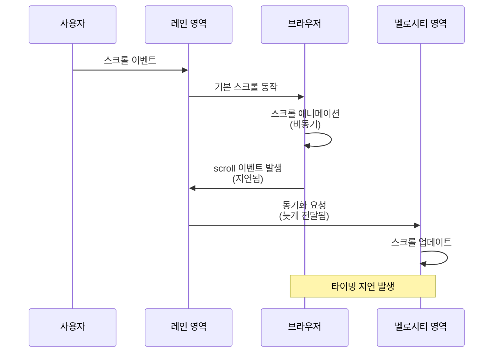
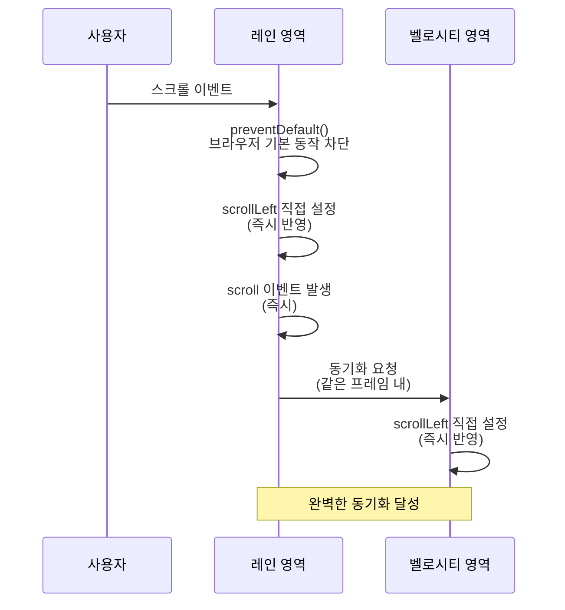

# MIDI 에디터 스크롤 동기화

**Document Version**: 1.0  
**Software Version**: 0.1.0  
**Last Updated**: 2026-01-14

**카테고리**: 구현 수준 - UI 최적화

---

## 개요

MIDI 에디터의 레인 영역과 벨로시티 영역의 가로 스크롤을 즉시 동기화하는 최적화 기법입니다.

---

## 목표

- 레인 영역과 벨로시티 영역의 가로 스크롤을 즉시 동기화
- 브라우저 기본 스크롤 동작으로 인한 타이밍 지연 제거
- 일관된 사용자 경험 제공

---

## 구현 위치

- `src/components/MidiEditor/PianoRoll.tsx`
  - `pianoRollContainerRef`의 `onWheel` 핸들러
- `src/components/MidiEditor/EditorFooter.tsx`
  - `velocityGraphAreaRef`의 `onWheel` 핸들러

---

## 문제 상황

### 이전 동작
- 벨로시티 영역에서 스크롤: `onWheel`에서 `preventDefault()`로 브라우저 기본 동작 차단 후 프로그래밍 방식으로 즉시 스크롤 설정 → 완벽한 동기화
- 레인 영역에서 스크롤: 일반 휠/가로 휠은 브라우저 기본 동작에 의존 → 스크롤 애니메이션으로 인한 타이밍 지연 → 벨로시티 영역이 늦게 동기화됨

### 문제점
- 레인 영역과 벨로시티 영역의 스크롤 동기화 지연
- 사용자 경험의 불일치

### 이전 동작의 문제점 다이어그램



---

## 최적화 방법

### 레인 영역 최적화
레인 영역의 `onWheel` 핸들러를 가로 스크롤 중심으로 수정:
1. 가로 스크롤 입력(`deltaX` 또는 `Shift+휠`)만 `preventDefault()`로 가로채기
2. 세로 스크롤(일반 `deltaY`)은 브라우저 기본 동작 유지
3. `scrollLeft`를 직접 설정하여 즉시 동기화

### 최적화된 동작 다이어그램



---

## 코드 구조

```typescript
onWheel={(e) => {
  // 가로 스크롤만 프로그래밍 방식으로 처리
  const delta = e.deltaX !== 0 ? e.deltaX : (e.shiftKey ? e.deltaY : 0);
  if (delta === 0) return; // 세로 스크롤은 기본 동작 유지
  
  e.preventDefault();  // 브라우저 기본 동작 차단
  e.stopPropagation();
  
  const container = pianoRollContainerRef.current;
  if (!container) return;
  
  const scrollLeftBefore = container.scrollLeft;
  const maxScrollLeft = container.scrollWidth - container.clientWidth;
  const nextScrollLeft = Math.max(0, Math.min(scrollLeftBefore + delta, maxScrollLeft));
  container.scrollLeft = nextScrollLeft;  // 직접 설정 (즉시 반영)
}}
```

---

## 기술적 배경

### 브라우저 기본 스크롤의 한계
- 브라우저 기본 스크롤은 비동기적이고 애니메이션 효과가 포함될 수 있음
- `scroll` 이벤트 발생 시점이 늦어질 수 있음
- 두 영역 간 동기화에 지연 발생

### 프로그래밍 방식 스크롤의 장점
- `scrollLeft`를 직접 설정하면 즉시 반영됨
- `scroll` 이벤트도 즉시 발생
- 두 영역 간 동기화 핸들러가 같은 프레임 내에서 실행되어 완벽한 동기화 달성

---

## 효과

### 사용자 경험
- 레인 영역과 벨로시티 영역의 스크롤이 완벽하게 동기화
- 브라우저 스크롤 애니메이션으로 인한 지연 제거
- 일관된 사용자 경험 제공 (어느 영역에서 스크롤해도 동일한 반응)

### 기술적 효과
- 즉각적인 스크롤 반영
- 동일 프레임 내 동기화

---

## 관련 문서

- [`src/components/MidiEditor/PianoRoll.tsx`](../../../../src/components/MidiEditor/PianoRoll.tsx)
- [`src/components/MidiEditor/EditorFooter.tsx`](../../../../src/components/MidiEditor/EditorFooter.tsx)

---

**Last Updated**: 2026-01-14

