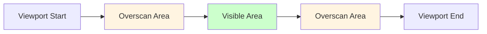

# Timeline Visible Range Rendering Optimization

**Document Version**: 1.0  
**Software Version**: 0.1.0  
**Last Updated**: 2026-01-23

**Category**: Implementation Level - Rendering Optimization

---

## Overview

An optimization technique that renders only visible areas and overscan regions in the timeline to provide smooth performance even with large projects.

---

## Goals

- Skip rendering of elements not visible on screen
- Smooth scrolling experience through overscan
- Maintain stable performance even with large projects

---

## Implementation Location

- `src/components/EventDisplay/EventDisplay.tsx`: Visible range calculation and scroll logic
- `src/components/EventDisplay/TimelineView.tsx`: Skip rendering parts/notes outside visible range
- `src/components/EventDisplay/MeasureRuler.tsx`: Render only measure markers in visible range
- `src/hooks/useEventDisplayData.ts`: Project subscription control

---

## Algorithm

### Visible Range Calculation

```typescript
const overscan = viewportWidth * overscanMultiplier;
const startPx = Math.max(0, scrollLeftPx - overscan);
const endPx = scrollLeftPx + viewportWidth + overscan;
const startTimeSec = startTime + startPx / pixelsPerSecond;
const endTimeSec = startTime + endPx / pixelsPerSecond;
```

### Overscan Multiplier

- Default: 1.0x (render additional area equal to viewport width)
- Range: 0-2x (adjustable in developer panel)
- Purpose: Pre-render off-screen areas for smooth scrolling transitions

### Visible Range Diagram



---

## Rendering Optimization

### Measure Marker Rendering

- Uses `calculateMeasureMarkersInRange()` to calculate only measures in visible range
- Measures outside visible range are not rendered

### Clip/Part Rendering

- `TimelineView` compares each part's start/end time with visible range
- Parts that don't overlap with visible range are skipped

### Note Rendering

- MIDI editor also renders only notes in visible range using the same method
- `useMidiEditorData` hook includes overscan when calculating `visibleNotes`

---

## Scroll Optimization

### Virtual Scroll

- Content moves via `transform: translateX()` based on `bottomScrollbar`
- Uses `virtualScrollLeftRef` to track scroll position
- Scroll events are throttled with rAF

### Auto Scroll

- Automatically scrolls based on playhead position during playback
- Considers auto-scroll position when calculating visible range
- Optimized auto-scroll trigger conditions and behavior

---

## Project Subscription Control

### Subscription Toggle

- `SUB PROJ [ON|OFF]`: Project change subscription toggle (developer panel)
- When off, note/clip/track changes may not be reflected in timeline
- Can be used for performance experiments

### Subscription Logic

```typescript
subscribeProjectChanges((event) => {
  if (event.type === 'track' || event.type === 'midiPart' || 
      event.type === 'timeSignature' || event.type === 'bpm') {
    setUpdateCounter(prev => prev + 1);
  }
});
```

---

## Playhead Optimization

### Playhead Rendering Removal

- Playhead rendering removed from `EventDisplay`
- Only `MeasureRuler` renders playhead (direct DOM manipulation)

### Playhead Extension

- `extendPlayhead` option: Playhead that extends below ruler
- `playheadExtendPx`: Extension pixel count (default: 1200px)
- `DawPage` applies `extendPlayhead`, adjusts related z-index/overflow

---

## Performance Effects

### Rendering Performance

- Skipping rendering of elements outside visible range reduces initial rendering time
- Maintains stable frame rate even with large projects

### Memory Usage

- Elements not rendered are not created in DOM, reducing memory usage

### Scroll Performance

- Virtual scroll and rAF throttling provide smooth scrolling experience

---

## Configuration

### Developer Panel Settings

- **OVERSCAN (x)**: Timeline rendering overscan multiplier (0-2x, 0.05x steps)
- **SUB PROJ [ON|OFF]**: Project change subscription toggle

---

## Notes

### Changes

- Playhead rendering moved from `EventDisplay` to `MeasureRuler`
- Scroll logic changed to `bottomScrollbar`-based
- Overscan multiplier applied to visible range calculation

### Future Improvements

- Optimize visible range calculation
- Dynamic overscan multiplier adjustment
- Virtualized note rendering

---

**Created**: 2026-01-23  
**Version**: 1.0  
**Status**: Current

