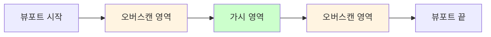

# 타임라인 가시 범위 렌더링 최적화

**Document Version**: 1.0  
**Software Version**: 0.1.0  
**Last Updated**: 2026-01-23

**카테고리**: 구현 수준 - 렌더링 최적화

---

## 개요

타임라인에서 화면에 보이는 영역과 오버스캔 영역만 렌더링하여 대용량 프로젝트에서도 부드러운 성능을 제공하는 최적화 기법입니다.

---

## 목표

- 화면에 보이지 않는 요소의 렌더링 스킵
- 오버스캔을 통한 부드러운 스크롤 경험
- 대용량 프로젝트에서도 안정적인 성능 유지

---

## 구현 위치

- `src/components/EventDisplay/EventDisplay.tsx`: 가시 범위 계산 및 스크롤 로직
- `src/components/EventDisplay/TimelineView.tsx`: 가시 범위 밖 파트/노트 렌더링 스킵
- `src/components/EventDisplay/MeasureRuler.tsx`: 가시 범위 내 마디 마커만 렌더링
- `src/hooks/useEventDisplayData.ts`: 프로젝트 구독 제어

---

## 알고리즘

### 가시 범위 계산

```typescript
const overscan = viewportWidth * overscanMultiplier;
const startPx = Math.max(0, scrollLeftPx - overscan);
const endPx = scrollLeftPx + viewportWidth + overscan;
const startTimeSec = startTime + startPx / pixelsPerSecond;
const endTimeSec = startTime + endPx / pixelsPerSecond;
```

### 오버스캔 배율

- 기본값: 1.0배 (뷰포트 너비만큼 추가 렌더링)
- 범위: 0-2배 (개발자 패널에서 조정 가능)
- 목적: 스크롤 시 부드러운 전환을 위해 화면 밖 영역도 미리 렌더링

### 가시 범위 다이어그램



---

## 렌더링 최적화

### 마디 마커 렌더링

- `calculateMeasureMarkersInRange()` 함수를 사용하여 가시 범위 내 마디만 계산
- 가시 범위 밖 마디는 렌더링하지 않음

### 클립/파트 렌더링

- `TimelineView`에서 각 파트의 시작/끝 시간을 가시 범위와 비교
- 가시 범위와 겹치지 않는 파트는 렌더링 스킵

### 노트 렌더링

- MIDI 에디터에서도 동일한 방식으로 가시 범위 내 노트만 렌더링
- `useMidiEditorData` 훅에서 `visibleNotes` 계산 시 오버스캔 포함

---

## 스크롤 최적화

### 가상 스크롤 (Virtual Scroll)

- `bottomScrollbar` 기반으로 실제 컨텐츠는 `transform: translateX()`로 이동
- `virtualScrollLeftRef`를 사용하여 스크롤 위치 추적
- 스크롤 이벤트는 rAF로 스로틀링

### 오토스크롤

- 재생 중 플레이헤드 위치에 따라 자동 스크롤
- 가시 범위 계산 시 오토스크롤 위치 고려
- 오토스크롤 트리거 조건 및 동작 최적화

---

## 프로젝트 구독 제어

### 구독 토글

- `SUB PROJ [ON|OFF]`: 프로젝트 변경 구독 토글 (개발자 패널)
- 끄면 노트/클립/트랙 변경이 타임라인에 반영되지 않을 수 있음
- 성능 실험 목적으로 사용 가능

### 구독 로직

```typescript
subscribeProjectChanges((event) => {
  if (event.type === 'track' || event.type === 'midiPart' || 
      event.type === 'timeSignature' || event.type === 'bpm') {
    setUpdateCounter(prev => prev + 1);
  }
});
```

---

## 플레이헤드 최적화

### 플레이헤드 렌더링 제거

- `EventDisplay`에서 플레이헤드 렌더링 제거
- `MeasureRuler`에서만 플레이헤드 렌더링 (DOM 직접 조작)

### 플레이헤드 확장

- `extendPlayhead` 옵션: ruler 아래로 연장되는 playhead
- `playheadExtendPx`: 확장 픽셀 수 (기본값: 1200px)
- `DawPage`에서 `extendPlayhead` 적용, 관련 z-index/overflow 조정

---

## 성능 효과

### 렌더링 성능

- 가시 범위 밖 요소 렌더링 스킵으로 초기 렌더링 시간 단축
- 대용량 프로젝트에서도 안정적인 프레임 레이트 유지

### 메모리 사용량

- 렌더링되지 않는 요소는 DOM에 생성되지 않아 메모리 사용량 감소

### 스크롤 성능

- 가상 스크롤과 rAF 스로틀링으로 부드러운 스크롤 경험

---

## 설정

### 개발자 패널 설정

- **OVERSCAN (x)**: 타임라인 렌더링 오버스캔 배율 (0-2배, 0.05배 단위)
- **SUB PROJ [ON|OFF]**: 프로젝트 변경 구독 토글

---

## 참고사항

### 변경 사항

- 플레이헤드 렌더링이 `EventDisplay`에서 제거되고 `MeasureRuler`로 이동
- 스크롤 로직이 `bottomScrollbar` 기반으로 변경
- 가시 범위 계산에 오버스캔 배율 적용

### 미래 개선 사항

- 가시 범위 계산 최적화
- 동적 오버스캔 배율 조정
- 가상화된 노트 렌더링

---

**작성일**: 2026-01-23  
**버전**: 1.0  
**상태**: 최신

