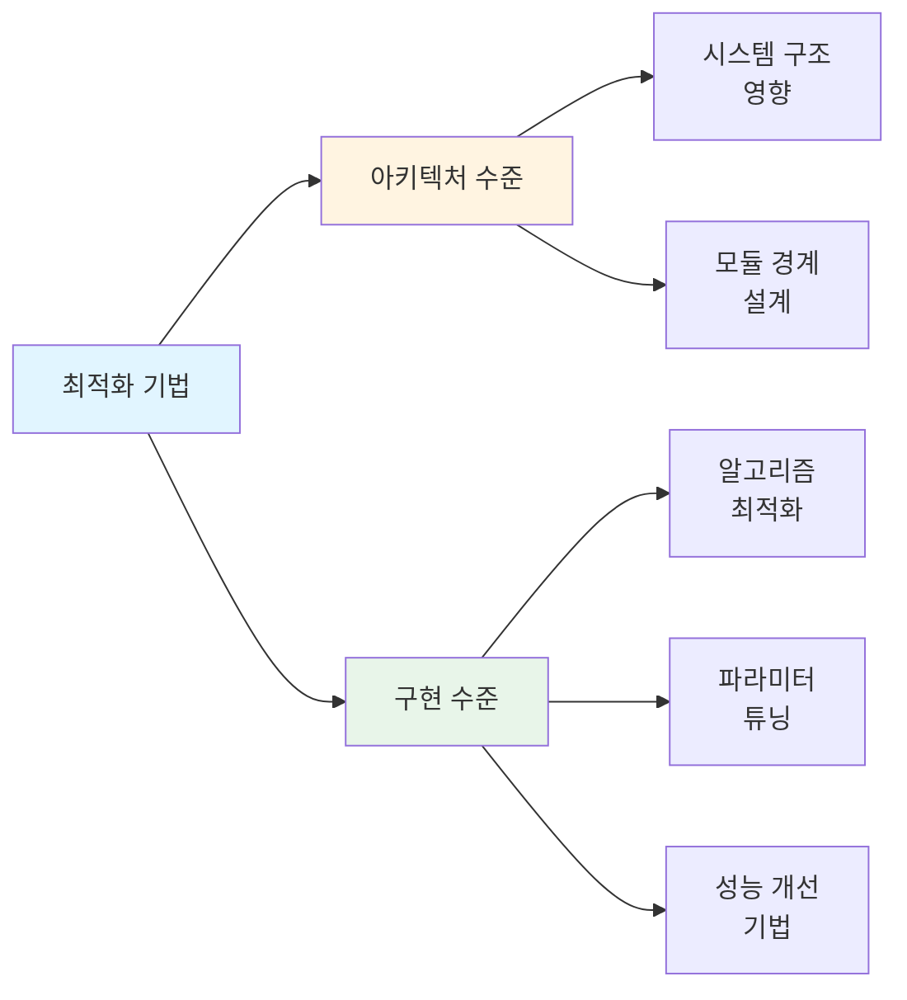
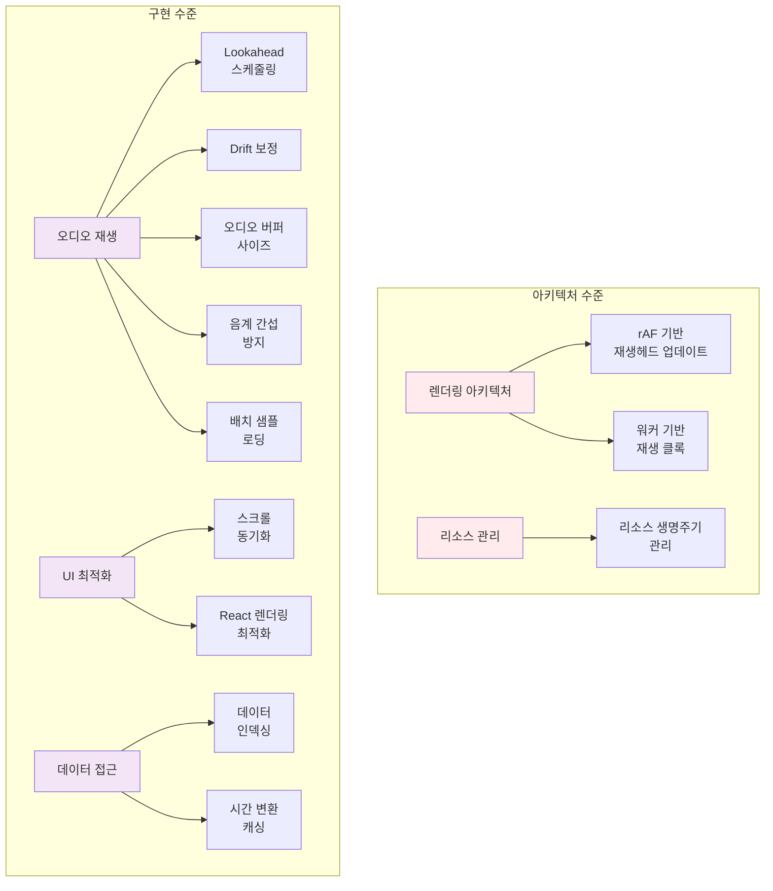

# 최적화 설계 문서

**Document Version**: 1.0  
**Software Version**: 0.1.0  
**Last Updated**: 2026-01-14

---

## 개요

이 문서는 Online DAW 프로젝트에서 사용된 성능 최적화 기법들을 카테고리별로 정리합니다.
각 최적화 기법은 아키텍처 수준과 구현 수준으로 구분되며, 목적에 따라 세부 카테고리로 분류됩니다.

---

## 최적화 수준 분류

### 아키텍처 수준 (Architecture Level)
시스템 구조와 모듈 경계에 영향을 미치는 설계 결정

### 구현 수준 (Implementation Level)
구체적인 알고리즘, 파라미터 튜닝, 성능 개선 기법

---

## 문서 구조

### 아키텍처 수준 최적화

#### 렌더링 아키텍처
- [rAF 기반 재생헤드 업데이트](./architecture-level/raf-playback-head.md)
  - React 렌더 경로와 재생헤드 업데이트 분리
  - 메인 스레드 부하 감소 및 프레임 드랍 방지

- [워커 기반 재생 클록](./architecture-level/worker-playback-clock.md)
  - 메인 스레드와 시간 생성 로직 분리
  - 독립적인 시간 틱 생성으로 메인 스레드 부하 감소

#### 리소스 관리
- [리소스 생명주기 관리](./architecture-level/resource-lifecycle-management.md)
  - AudioEngine 및 Worker의 체계적인 생명주기 관리
  - 메모리 누수 방지 및 페이지 전환 시 안정성 확보
  - 환경별 로깅 제어 및 런타임 로깅 스위치

### 구현 수준 최적화

#### 오디오 재생 최적화
- [Lookahead 스케줄링](./implementation-level/lookahead-scheduling.md)
  - 오디오 이벤트를 미리 스케줄링하여 재생 안정성 확보

- [Drift 보정 시스템](./implementation-level/drift-correction.md)
  - 워커 틱과 UI 간의 타이밍 오차를 부드럽게 보정

- [조절 가능한 오디오 버퍼 사이즈](./implementation-level/audio-buffer-size.md)
  - 재생 클럭 tick 간격 조절 (Web Audio API 버퍼 크기는 고정 128 프레임)
  - UI에서 audioBufferSize 설정으로 재생 타이밍 정밀도 조절

- [같은 음계 간섭 방지](./implementation-level/pitch-class-interference-prevention.md)
  - 같은 샘플 소스에서 파생된 오디오의 위상 간섭을 시간 오프셋으로 분산

- [배치 샘플 로딩](./implementation-level/batch-sample-loading.md)
  - 오디오 샘플 로딩 시 메인 스레드 블로킹 방지

#### UI 최적화
- [MIDI 에디터 스크롤 동기화](./implementation-level/scroll-synchronization.md)
  - 레인 영역과 벨로시티 영역의 가로 스크롤을 즉시 동기화

- [React 컴포넌트 렌더링 최적화](./data-access/indexing.md#ui-컴포넌트-최적화)
  - 인덱스 함수를 활용한 데이터 접근 최적화
  - useMemo 의존성 최적화로 불필요한 재계산 방지

#### 데이터 접근 최적화
- [데이터 인덱싱](./data-access/indexing.md)
  - Map 기반 인덱스를 사용한 O(1) 조회 성능
  - UI 컴포넌트에서 인덱스 함수 활용으로 렌더링 성능 개선

- [시간 변환 캐싱](./data-access/timing-cache.md)
  - 반복적인 시간 변환 계산 결과 캐싱

---

## 최적화 효과 요약

### 성능 개선
- 재생 중 리렌더 빈도 대폭 감소
- 프레임 드랍/멈춤 현상 완화
- CPU 사용량 감소 (워커 분리)
- 메인 스레드 응답성 향상
- 데이터 조회 성능 O(n) → O(1)
- 시간 변환 계산 캐싱으로 반복 계산 제거
- UI 컴포넌트 렌더링 시 데이터 접근 시간 단축
- 불필요한 재렌더링 감소 (useMemo 의존성 최적화)

### 리소스 관리
- 메모리 누수 방지 (AudioEngine 및 Worker 정리)
- 페이지 전환 시 안정적인 리소스 해제
- 환경별 로깅 제어 (프로덕션에서 자동 비활성화)

### 사용자 경험 개선
- 부드러운 재생헤드 움직임
- 대형 프로젝트에서도 안정적인 재생
- 시스템 성능에 따른 유연한 조절
- MIDI 에디터에서 레인 영역과 벨로시티 영역의 완벽한 스크롤 동기화
- 빠른 데이터 조회 응답 시간
- 이벤트 디스플레이, 타임라인 뷰, 인스펙터 등에서 즉시 데이터 접근
- 페이지 전환 시 안정적인 동작 (리소스 누수 없음)
- 프로덕션 환경에서 최적화된 성능 (로깅 오버헤드 제거)

---

## 관련 문서

### 최적화 관련
- [`docs/refactoring/p2-implementation-plan.md`](../../refactoring/p2-implementation-plan.md) - P2 실행 계획서

### 아키텍처 문서
- [`docs/architecture/module-boundaries.md`](../module-boundaries.md) - 모듈 경계 설계
- [`docs/architecture/README.md`](../README.md) - 아키텍처 문서 개요

### 기타 관련 문서
- [`docs/reference/audio-buffer-size-specification.ko.md`](../../reference/audio-buffer-size-specification.ko.md) - 버퍼 사이즈 스펙

---

## 향후 개선 아이디어

### 아키텍처 수준
- EventDisplay 가상화 (뷰포트 범위만 렌더)
- MIDI 클립 레이아웃 계산을 Web Worker로 이동

### 구현 수준
- 동적 lookahead 윈도우 크기 조절
- 드리프트 보정 알고리즘 파라미터 자동 튜닝
- 샘플 로딩 우선순위 큐
- LRU 캐시 도입으로 캐시 크기 제한

---

**Last Updated**: 2026-01-14

