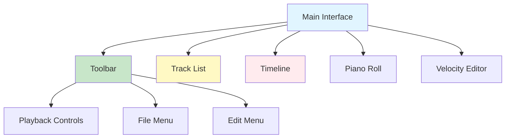
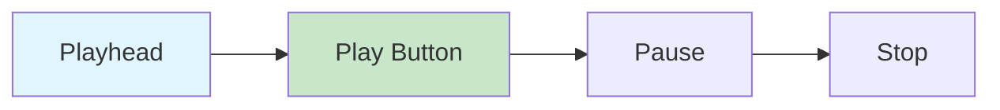

# Online DAW User Manual

**Document Version**: 1.0  
**Software Version**: 0.1.0  
**Last Updated**: 2026-01-14

---

## Table of Contents

1. [Getting Started](#getting-started)
2. [Basic Operations](#basic-operations)
3. [Keyboard Shortcuts](#keyboard-shortcuts)
4. [MIDI Editing](#midi-editing)
5. [Track Management](#track-management)
6. [Playback and Recording](#playback-and-recording)
7. [Project Save/Load](#project-saveload)
8. [Collaboration](#collaboration)
9. [Troubleshooting](#troubleshooting)

---

## Getting Started

### System Requirements

- **Browser**: Chrome, Firefox, Edge, Safari (latest version)
- **Internet Connection**: Required for collaboration features
- **Audio Device**: Speakers or headphones

### First Launch

1. Open Online DAW in your browser
2. A new project is automatically created
3. You can start working by adding tracks

---

## Basic Operations

### Interface Layout

### Mouse Operations

- **Click**: Select
- **Drag**: Move
- **Double Click**: Enter MIDI part edit mode
- **Right Click**: Context menu
- **Wheel Scroll**: Zoom or scroll

---

## Keyboard Shortcuts

### Global Shortcuts

| Shortcut | Function | Description |
|----------|----------|-------------|
| `Space` | Play/Pause | Toggle playback |
| `R` | Toggle Recording | Turn recording mode on/off |
| `Q` | Toggle Quantize | Turn quantize setting on/off |
| `N` | Toggle Metronome | Turn metronome on/off |
| `F` | Toggle Auto Scroll | Turn auto scroll on/off during playback |
| `M` | Toggle Track Mute | Mute/unmute selected track |
| `S` | Toggle Track Solo | Solo/unsolo selected track |
| `Delete` / `Backspace` | Delete Selected Clip | Delete selected MIDI part |
| `Ctrl+Z` / `Cmd+Z` | Undo | Undo last action |
| `Ctrl+Y` / `Ctrl+Shift+Z` / `Cmd+Y` / `Cmd+Shift+Z` | Redo | Redo undone action |
| `Ctrl+D` / `Cmd+D` | Duplicate Clip | Duplicate selected MIDI part at its end position |
| `Enter` | Merge Clips | Merge 2 or more selected clips on the same track |
| `3` | Toggle Split Mode | Turn clip split mode on/off |
| `4` | Toggle Merge Mode | Turn clip merge mode on/off |
| `1` | Exit Mode | Exit Split/Merge mode |
| `Alt` | Activate Split Mode | Activate split mode while Alt key is held |

### MIDI Editor Shortcuts

Shortcuts available when the MIDI editor is open.

| Shortcut | Function | Description |
|----------|----------|-------------|
| `Ctrl+Z` / `Cmd+Z` | Undo | Undo from note edit history |
| `Ctrl+Y` / `Ctrl+Shift+Z` / `Cmd+Y` / `Cmd+Shift+Z` | Redo | Redo from note edit history |
| `Ctrl+D` / `Cmd+D` | Duplicate Note/Sustain | Duplicate selected note or sustain pedal at its end position |
| `Delete` / `Backspace` | Delete Note/Sustain | Delete selected note or sustain pedal |
| `Enter` | Merge Notes | Merge 2 or more selected notes |
| `Ctrl+Q` / `Cmd+Q` | Quantize | Quantize selected notes or sustain pedals |
| `←` / `→` | Move Note | Move selected note by one beat left/right |
| `↑` / `↓` | Change Pitch | Move selected note by one semitone up/down |
| `V` | Velocity Color Mode | Activate velocity color mode while V key is held |
| `Esc` | Deselect / Close Editor | Deselect notes if any are selected, otherwise close editor |
| `3` | Toggle Split Mode | Turn note split mode on/off |
| `4` | Toggle Merge Mode | Turn note merge mode on/off |
| `1` | Exit Mode | Exit Split/Merge mode |

**Note**: 
- Shortcuts do not work when input fields, text areas, buttons, selects, etc. have focus.
- When the MIDI editor is open, some global shortcuts are prioritized as MIDI editor shortcuts.

---

## MIDI Editing

### MIDI Part Editing

#### Opening a Part
- **Double-click** a MIDI part on the timeline to open the MIDI editor.

#### Selecting Parts
- **Click**: Select single part
- **Ctrl+Click** / **Cmd+Click**: Select multiple parts
- **Drag**: Range selection

#### Moving Parts
- **Drag** selected parts to move them.

#### Resizing Parts
- **Drag** the ends of a part to adjust its length.

#### Splitting Parts (Split)
1. Press `3` to activate Split mode
2. Click at the position to split
3. Or hold `Alt` key and drag to split

#### Merging Parts (Merge)
1. Select 2 or more parts on the same track
2. Press `Enter` or press `4` to activate Merge mode and click

#### Duplicating Parts
1. Select a part
2. Press `Ctrl+D` / `Cmd+D`
3. The part is duplicated at its end position

### Note Editing

#### Adding Notes
1. Click at the desired position in the MIDI editor
2. Drag to adjust note length

#### Selecting Notes
- **Click**: Select single note
- **Ctrl+Click** / **Cmd+Click**: Select multiple notes
- **Drag**: Range selection

#### Moving Notes
- **Drag**: Drag selected notes to move them
- **Arrow Keys**: Move selected notes by one beat (`←` / `→`) or one semitone (`↑` / `↓`)

#### Adjusting Note Length
- **Drag** the ends of a note to adjust its length

#### Changing Note Pitch
- **Drag** a note up/down to change its pitch
- Or use `↑` / `↓` keys on selected notes

#### Adjusting Note Velocity
- **Drag** the velocity bar in the velocity editor to adjust
- Hold `V` key to activate velocity color mode for visual feedback

#### Duplicating Notes
1. Select notes
2. Press `Ctrl+D` / `Cmd+D`
3. Notes are duplicated at their end positions

#### Merging Notes
1. Select 2 or more notes
2. Press `Enter`
3. Selected notes are merged into one

#### Splitting Notes (Split)
1. Press `3` to activate Split mode
2. Click at the position to split the note

#### Deleting Notes
1. Select notes
2. Press `Delete` or `Backspace`

### Quantize

Quantize aligns notes to exact grid positions.

#### Global Quantize Setting
- Press `Q` to turn quantize setting on/off
- When quantize is on, newly added notes are automatically aligned

#### Quantizing Selected Notes
1. Select notes in the MIDI editor
2. Press `Ctrl+Q` / `Cmd+Q`
3. Selected notes are aligned to the grid

### Sustain Pedal

#### Adding Sustain Pedal
1. Select the "Sustain" tab next to the velocity tab in the MIDI editor
2. Click at the desired position to add a sustain pedal range

#### Editing Sustain Pedal
- **Drag** sustain pedal ranges to move them or adjust their length

#### Duplicating Sustain Pedal
1. Select sustain pedal ranges
2. Press `Ctrl+D` / `Cmd+D`
3. Ranges are duplicated at their end positions

#### Quantizing Sustain Pedal
1. Select sustain pedal ranges
2. Press `Ctrl+Q` / `Cmd+Q`

#### Deleting Sustain Pedal
1. Select sustain pedal ranges
2. Press `Delete` or `Backspace`

---

## Track Management

### Adding Tracks

1. Click the "Add Track" button in the toolbar
2. Enter track name and select instrument

### Selecting Tracks

- Click a track in the track list to select it
- Selected track is highlighted

### Track Settings

#### Volume Adjustment
- Adjust the volume slider in the track list
- Or enter a value in the track panel

#### Panning Adjustment
- Adjust the pan knob in the track list
- Or enter a value in the track panel (-1.0 ~ 1.0)

#### Adding Effects
1. Click the "Effects" button in the track panel
2. Select desired effect:
   - **EQ**: Equalizer
   - **Delay**: Delay
   - **Reverb**: Reverb
3. Adjust effect parameters

### Track Mute/Solo

#### Mute
- Click the mute button in the track list
- Or select a track and press `M` key

#### Solo
- Click the solo button in the track list
- Or select a track and press `S` key

**Note**: 
- When solo is activated, other tracks are automatically muted
- Mute button does not work when another track is in solo state

### Deleting Tracks

1. Select a track
2. Right-click to open context menu
3. Select "Delete"

---

## Playback and Recording

### Playback Controls

#### Play
- **Click Play Button** or press `Space` key
- Playhead moves along the timeline
- All tracks at current position are played

#### Pause
- **Click Pause Button** or press `Space` key
- Playback pauses and current position is maintained

#### Stop
- **Click Stop Button**
- Playback stops and playhead moves to start

#### Position Movement
- **Click Timeline**: Move playhead to clicked position

### Metronome

- Press `N` key to turn metronome on/off
- When metronome is on, sound plays in sync with the beat during playback

### Auto Scroll

- Press `F` key to turn auto scroll on/off
- When auto scroll is on, timeline automatically scrolls to follow the playhead during playback

### Recording

- Press `R` key to turn recording mode on/off
- **Note**: Recording feature is not fully implemented in the current version. MIDI notes are edited directly with mouse and keyboard.

---

## Project Save/Load

### Saving Project

1. Click the "Save" button in the toolbar
2. Enter filename (default: `project`)
3. The following files are downloaded:
   - `{filename}.json`: Project data (track settings, effects, etc.)
   - `{filename}.mid`: MIDI file (Standard MIDI File format)

### Loading Project

1. Click the "Open" button in the toolbar
2. Select a JSON file
3. Project is loaded

**Warning**: Loading a project replaces current work. Unsaved work may be lost.

---

## Collaboration

### Starting Host Session

1. Click the "Host" button in the toolbar
2. Room code is generated and displayed
3. Click "Allow Join" button to allow participants to join
4. Share room code with participants

### Joining Participant Session

1. Click the "Join" button in the toolbar
2. Enter room code received from host
3. Confirm warning message if there is ongoing work
4. After joining, host's project state is synchronized

### Synchronized Items

- ✅ Track settings (volume, panning, effects)
- ✅ MIDI parts (create, delete, move, resize)
- ✅ MIDI notes (add, delete, modify)
- ✅ Timing (BPM, time signature)
- ❌ Master channel settings (independent per client)

### Ending Session

- **Host**: Click "Stop Hosting" button
- **Participant**: Click "Leave" button

**Note**: Sessions automatically expire after 6 hours.

---

## Troubleshooting

### Audio Not Playing

1. Check browser audio permissions
2. Check system volume
3. Check track volume
4. Refresh browser

### Project Not Loading

1. Check file format (ensure it's a `.json` file)
2. Check if file is not corrupted
3. Check error messages in browser console

### Collaboration Connection Failure

1. Check internet connection
2. Verify room code is correct
3. Check if host has activated "Allow Join"
4. Check firewall settings

### Performance Issues

1. Clear browser cache
2. Close other tabs/programs
3. Update browser
4. Check hardware acceleration is enabled

---

## Performance Optimizations

### Timeline Rendering Optimization

- **Visible Range Rendering**: Only renders visible areas and overscan regions to improve performance
- **Virtual Scroll**: Uses virtual scrolling for smooth scrolling even with large projects
- **Playhead Optimization**: Playback head is separated into a dedicated component that updates without React re-renders

### Audio Sample Loading Optimization

- **Lazy Loading**: Only loads necessary samples to reduce initial loading time
- **Duplicate Loading Prevention**: Prevents duplicate loading of the same samples
- **Prefetch**: Preloads necessary samples before playback starts

### MIDI Editor Performance Improvements

- **Playhead Separation**: Playback head is separated into a dedicated component to improve performance
- **Memoization**: Frequently calculated values are memoized to prevent unnecessary recalculations

---

## Additional Resources

- [Project Specification](../specs/project-save-load-specification.ko.md)
- [Collaboration Specification](../specs/collaboration-specification.ko.md)
- [MIDI Standard Compliance](../specs/midi-standard-compliance.ko.md)

---

**Created**: 2026-01-14  
**Version**: 1.0  
**Status**: Initial version
