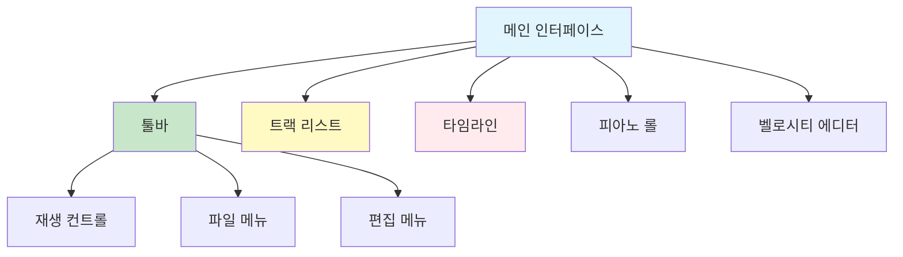

# Online DAW 사용자 매뉴얼

**Document Version**: 1.0  
**Software Version**: 0.1.0  
**Last Updated**: 2026-01-14

---

## 목차

1. [시작하기](#시작하기)
2. [기본 조작](#기본-조작)
3. [키보드 단축키](#키보드-단축키)
4. [MIDI 편집](#midi-편집)
5. [트랙 관리](#트랙-관리)
6. [재생 및 녹음](#재생-및-녹음)
7. [프로젝트 저장/로드](#프로젝트-저장로드)
8. [콜라보레이션](#콜라보레이션)
9. [문제 해결](#문제-해결)

---

## 시작하기

### 시스템 요구사항

- **브라우저**: Chrome, Firefox, Edge, Safari (최신 버전)
- **인터넷 연결**: 콜라보레이션 기능 사용 시 필요
- **오디오 장치**: 스피커 또는 헤드폰

### 첫 실행

1. 브라우저에서 Online DAW를 엽니다
2. 새 프로젝트가 자동으로 생성됩니다
3. 트랙을 추가하여 작업을 시작할 수 있습니다

---

## 기본 조작

### 인터페이스 구성

### 마우스 조작

- **클릭**: 선택
- **드래그**: 이동
- **더블 클릭**: MIDI 파트 편집 모드 진입
- **우클릭**: 컨텍스트 메뉴
- **휠 스크롤**: 확대/축소 또는 스크롤

---

## 키보드 단축키

### 전역 단축키

| 단축키 | 기능 | 설명 |
|--------|------|------|
| `Space` | 재생/일시정지 | 재생 중이면 일시정지, 일시정지 중이면 재생 |
| `R` | 녹음 토글 | 녹음 모드 켜기/끄기 |
| `Q` | 퀀타이즈 토글 | 퀀타이즈 설정 켜기/끄기 |
| `N` | 메트로놈 토글 | 메트로놈 켜기/끄기 |
| `F` | 오토스크롤 토글 | 재생 시 자동 스크롤 켜기/끄기 |
| `M` | 트랙 뮤트 토글 | 선택된 트랙 뮤트 켜기/끄기 |
| `S` | 트랙 솔로 토글 | 선택된 트랙 솔로 켜기/끄기 |
| `Delete` / `Backspace` | 선택된 클립 삭제 | 선택된 MIDI 파트 삭제 |
| `Ctrl+Z` / `Cmd+Z` | 실행 취소 | 마지막 작업 취소 |
| `Ctrl+Y` / `Ctrl+Shift+Z` / `Cmd+Y` / `Cmd+Shift+Z` | 다시 실행 | 취소한 작업 다시 실행 |
| `Ctrl+D` / `Cmd+D` | 클립 복제 | 선택된 MIDI 파트를 끝나는 지점에 복제 |
| `Enter` | 클립 병합 | 같은 트랙에 선택된 2개 이상의 클립 병합 |
| `3` | Split 모드 토글 | 클립 분할 모드 켜기/끄기 |
| `4` | Merge 모드 토글 | 클립 병합 모드 켜기/끄기 |
| `1` | 모드 종료 | Split/Merge 모드 종료 |
| `Alt` | Split 모드 활성화 | Alt 키를 누르고 있는 동안 Split 모드 활성화 |

### MIDI 에디터 단축키

MIDI 에디터가 열려있을 때 사용 가능한 단축키입니다.

| 단축키 | 기능 | 설명 |
|--------|------|------|
| `Ctrl+Z` / `Cmd+Z` | 실행 취소 | 노트 편집 히스토리에서 실행 취소 |
| `Ctrl+Y` / `Ctrl+Shift+Z` / `Cmd+Y` / `Cmd+Shift+Z` | 다시 실행 | 노트 편집 히스토리에서 다시 실행 |
| `Ctrl+D` / `Cmd+D` | 노트/서스테인 복제 | 선택된 노트 또는 서스테인 페달을 끝나는 지점에 복제 |
| `Delete` / `Backspace` | 노트/서스테인 삭제 | 선택된 노트 또는 서스테인 페달 삭제 |
| `Enter` | 노트 병합 | 선택된 2개 이상의 노트 병합 |
| `Ctrl+Q` / `Cmd+Q` | 퀀타이즈 | 선택된 노트 또는 서스테인 페달 퀀타이즈 |
| `←` / `→` | 노트 이동 | 선택된 노트를 한 박자씩 좌우 이동 |
| `↑` / `↓` | 피치 변경 | 선택된 노트를 한 음씩 위아래 이동 |
| `V` | 벨로시티 컬러 모드 | V 키를 누르고 있는 동안 벨로시티 컬러 모드 활성화 |
| `Esc` | 선택 해제 / 에디터 닫기 | 노트 선택이 있으면 해제, 없으면 에디터 닫기 |
| `3` | Split 모드 토글 | 노트 분할 모드 켜기/끄기 |
| `4` | Merge 모드 토글 | 노트 병합 모드 켜기/끄기 |
| `1` | 모드 종료 | Split/Merge 모드 종료 |

**참고**: 
- 입력 필드, 텍스트 영역, 버튼, select 등에 포커스가 있으면 단축키가 작동하지 않습니다.
- MIDI 에디터가 열려있을 때는 전역 단축키 중 일부가 MIDI 에디터 단축키로 우선 처리됩니다.

---

## MIDI 편집

### MIDI 파트 편집

#### 파트 열기
- 타임라인에서 MIDI 파트를 **더블 클릭**하면 MIDI 에디터가 열립니다.

#### 파트 선택
- **클릭**: 단일 파트 선택
- **Ctrl+클릭** / **Cmd+클릭**: 다중 파트 선택
- **드래그**: 범위 선택

#### 파트 이동
- 선택한 파트를 **드래그**하여 이동합니다.

#### 파트 리사이즈
- 파트의 양쪽 끝을 **드래그**하여 길이를 조정합니다.

#### 파트 분할 (Split)
1. `3` 키를 눌러 Split 모드를 활성화합니다
2. 분할할 위치를 클릭합니다
3. 또는 `Alt` 키를 누르고 있는 동안 드래그하여 분할합니다

#### 파트 병합 (Merge)
1. 같은 트랙에 있는 2개 이상의 파트를 선택합니다
2. `Enter` 키를 누르거나 `4` 키를 눌러 Merge 모드를 활성화한 후 클릭합니다

#### 파트 복제
1. 파트를 선택합니다
2. `Ctrl+D` / `Cmd+D` 키를 누릅니다
3. 파트가 끝나는 지점에 복제됩니다

### 노트 편집

#### 노트 추가
1. MIDI 에디터에서 원하는 위치를 클릭합니다
2. 드래그하여 노트 길이를 조정합니다

#### 노트 선택
- **클릭**: 단일 노트 선택
- **Ctrl+클릭** / **Cmd+클릭**: 다중 노트 선택
- **드래그**: 범위 선택

#### 노트 이동
- **드래그**: 선택한 노트를 드래그하여 이동
- **화살표 키**: 선택한 노트를 한 박자씩 이동 (`←` / `→`) 또는 한 음씩 이동 (`↑` / `↓`)

#### 노트 길이 조정
- 노트의 양쪽 끝을 **드래그**하여 길이를 조정합니다

#### 노트 피치 변경
- 노트를 위아래로 **드래그**하여 피치를 변경합니다
- 또는 선택한 노트에서 `↑` / `↓` 키를 사용합니다

#### 노트 속도(Velocity) 조정
- 벨로시티 에디터에서 노트의 속도 바를 **드래그**하여 조정합니다
- `V` 키를 누르고 있는 동안 벨로시티 컬러 모드가 활성화되어 시각적으로 확인할 수 있습니다

#### 노트 복제
1. 노트를 선택합니다
2. `Ctrl+D` / `Cmd+D` 키를 누릅니다
3. 노트가 끝나는 지점에 복제됩니다

#### 노트 병합
1. 2개 이상의 노트를 선택합니다
2. `Enter` 키를 누릅니다
3. 선택한 노트들이 하나로 병합됩니다

#### 노트 분할 (Split)
1. `3` 키를 눌러 Split 모드를 활성화합니다
2. 분할할 노트의 위치를 클릭합니다

#### 노트 삭제
1. 노트를 선택합니다
2. `Delete` 또는 `Backspace` 키를 누릅니다

### 퀀타이즈

퀀타이즈는 노트를 정확한 그리드 위치로 정렬합니다.

#### 전역 퀀타이즈 설정
- `Q` 키를 눌러 퀀타이즈 설정을 켜고 끌 수 있습니다
- 퀀타이즈가 켜져있으면 새로 추가되는 노트가 자동으로 정렬됩니다

#### 선택 노트 퀀타이즈
1. MIDI 에디터에서 노트를 선택합니다
2. `Ctrl+Q` / `Cmd+Q` 키를 누릅니다
3. 선택한 노트가 그리드에 정렬됩니다

### 서스테인 페달 (Sustain Pedal)

#### 서스테인 페달 추가
1. MIDI 에디터에서 벨로시티 탭 옆의 "Sustain" 탭을 선택합니다
2. 원하는 위치를 클릭하여 서스테인 페달 범위를 추가합니다

#### 서스테인 페달 편집
- 서스테인 페달 범위를 **드래그**하여 이동하거나 길이를 조정할 수 있습니다

#### 서스테인 페달 복제
1. 서스테인 페달 범위를 선택합니다
2. `Ctrl+D` / `Cmd+D` 키를 누릅니다
3. 범위가 끝나는 지점에 복제됩니다

#### 서스테인 페달 퀀타이즈
1. 서스테인 페달 범위를 선택합니다
2. `Ctrl+Q` / `Cmd+Q` 키를 누릅니다

#### 서스테인 페달 삭제
1. 서스테인 페달 범위를 선택합니다
2. `Delete` 또는 `Backspace` 키를 누릅니다

---

## 트랙 관리

### 트랙 추가

1. 툴바의 "트랙 추가" 버튼을 클릭합니다
2. 트랙 이름과 악기를 선택합니다

### 트랙 선택

- 트랙 리스트에서 트랙을 클릭하여 선택합니다
- 선택된 트랙은 하이라이트됩니다

### 트랙 설정

#### 볼륨 조정
- 트랙 리스트에서 볼륨 슬라이더를 조정합니다
- 또는 트랙 패널에서 수치를 입력합니다

#### 패닝 조정
- 트랙 리스트에서 패닝 노브를 조정합니다
- 또는 트랙 패널에서 수치를 입력합니다 (-1.0 ~ 1.0)

#### 이펙트 추가
1. 트랙 패널에서 "이펙트" 버튼을 클릭합니다
2. 원하는 이펙트를 선택합니다:
   - **EQ**: 이퀄라이저
   - **Delay**: 딜레이
   - **Reverb**: 리버브
3. 이펙트 파라미터를 조정합니다

### 트랙 뮤트/솔로

#### 뮤트
- 트랙 리스트에서 뮤트 버튼을 클릭합니다
- 또는 트랙을 선택한 후 `M` 키를 누릅니다

#### 솔로
- 트랙 리스트에서 솔로 버튼을 클릭합니다
- 또는 트랙을 선택한 후 `S` 키를 누릅니다

**참고**: 
- 솔로가 활성화되면 다른 트랙들이 자동으로 뮤트됩니다
- 다른 트랙이 솔로 상태일 때는 뮤트 버튼이 작동하지 않습니다

### 트랙 삭제

1. 트랙을 선택합니다
2. 우클릭하여 컨텍스트 메뉴를 엽니다
3. "삭제"를 선택합니다

---

## 재생 및 녹음

### 재생 컨트롤

#### 재생
- **재생 버튼 클릭** 또는 `Space` 키
- 재생 헤드가 타임라인을 따라 이동합니다
- 현재 위치의 모든 트랙이 재생됩니다

#### 일시정지
- **일시정지 버튼 클릭** 또는 `Space` 키
- 재생이 일시정지되고 현재 위치가 유지됩니다

#### 정지
- **정지 버튼 클릭**
- 재생이 정지되고 재생 헤드가 처음으로 이동합니다

#### 위치 이동
- **타임라인 클릭**: 재생 헤드를 클릭한 위치로 이동합니다

### 메트로놈

- `N` 키를 눌러 메트로놈을 켜고 끌 수 있습니다
- 메트로놈이 켜져있으면 재생 시 박자에 맞춰 소리가 재생됩니다

### 오토스크롤

- `F` 키를 눌러 오토스크롤을 켜고 끌 수 있습니다
- 오토스크롤이 켜져있으면 재생 시 재생 헤드 위치에 따라 타임라인이 자동으로 스크롤됩니다

### 녹음

- `R` 키를 눌러 녹음 모드를 켜고 끌 수 있습니다
- **참고**: 현재 버전에서는 녹음 기능이 완전히 구현되지 않았습니다. MIDI 노트는 마우스와 키보드로 직접 편집합니다.

---

## 프로젝트 저장/로드

### 프로젝트 저장

1. 툴바의 "저장" 버튼을 클릭합니다
2. 파일명을 입력합니다 (기본값: `project`)
3. 다음 파일이 다운로드됩니다:
   - `{파일명}.json`: 프로젝트 데이터 (트랙 설정, 이펙트 등)
   - `{파일명}.mid`: MIDI 파일 (표준 MIDI 파일 형식)

### 프로젝트 로드

1. 툴바의 "열기" 버튼을 클릭합니다
2. JSON 파일을 선택합니다
3. 프로젝트가 로드됩니다

**주의**: 프로젝트를 로드하면 현재 작업이 대체됩니다. 저장하지 않은 작업은 손실될 수 있습니다.

---

## 콜라보레이션

### 호스트 세션 시작

1. 툴바의 "Host" 버튼을 클릭합니다
2. 룸 코드가 생성되어 표시됩니다
3. "Allow Join" 버튼을 클릭하여 참가자 조인을 허용합니다
4. 룸 코드를 참가자에게 공유합니다

### 참가자 세션 참여

1. 툴바의 "Join" 버튼을 클릭합니다
2. 호스트로부터 받은 룸 코드를 입력합니다
3. 진행 중인 작업이 있으면 경고 메시지를 확인합니다
4. 조인 후 호스트의 프로젝트 상태가 동기화됩니다

### 동기화되는 항목

- ✅ 트랙 설정 (볼륨, 패닝, 이펙트)
- ✅ MIDI 파트 (생성, 삭제, 이동, 리사이즈)
- ✅ MIDI 노트 (추가, 삭제, 수정)
- ✅ 타이밍 (BPM, 타임 시그니처)
- ❌ 마스터 채널 설정 (각 클라이언트 독립적)

### 세션 종료

- **호스트**: "Stop Hosting" 버튼을 클릭합니다
- **참가자**: "Leave" 버튼을 클릭합니다

**참고**: 세션은 6시간 후 자동으로 만료됩니다.

---

## 문제 해결

### 오디오가 재생되지 않음

1. 브라우저의 오디오 권한을 확인합니다
2. 시스템 볼륨을 확인합니다
3. 트랙 볼륨을 확인합니다
4. 브라우저를 새로고침합니다

### 프로젝트가 로드되지 않음

1. 파일 형식을 확인합니다 (`.json` 파일인지 확인)
2. 파일이 손상되지 않았는지 확인합니다
3. 브라우저 콘솔에서 에러 메시지를 확인합니다

### 콜라보레이션 연결 실패

1. 인터넷 연결을 확인합니다
2. 룸 코드가 올바른지 확인합니다
3. 호스트가 "Allow Join"을 활성화했는지 확인합니다
4. 방화벽 설정을 확인합니다

### 성능 문제

1. 브라우저 캐시를 삭제합니다
2. 다른 탭/프로그램을 종료합니다
3. 브라우저를 업데이트합니다
4. 하드웨어 가속이 활성화되어 있는지 확인합니다

---

## 추가 리소스

- [프로젝트 명세서](../specs/project-save-load-specification.ko.md)
- [콜라보레이션 명세서](../specs/collaboration-specification.ko.md)
- [MIDI 표준 준수](../specs/midi-standard-compliance.ko.md)

---

**작성일**: 2026-01-14  
**버전**: 1.0  
**상태**: 초기 버전
