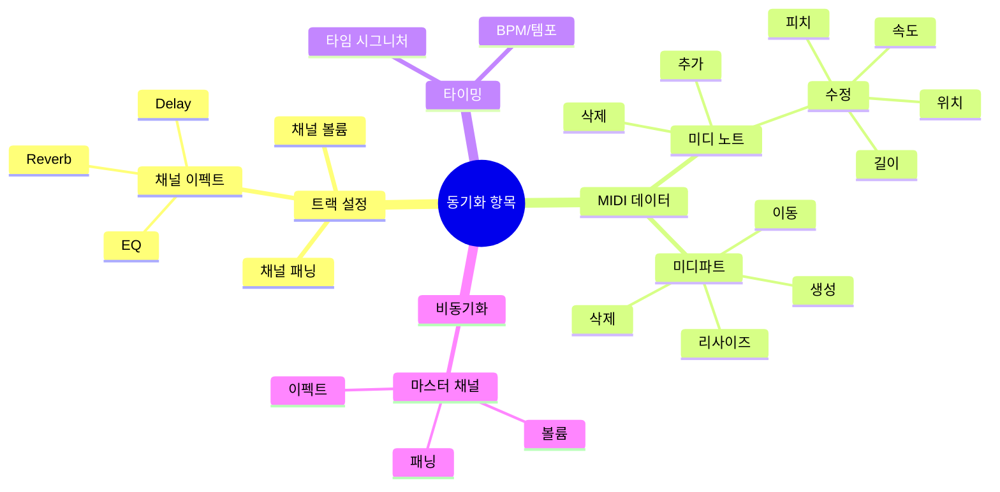
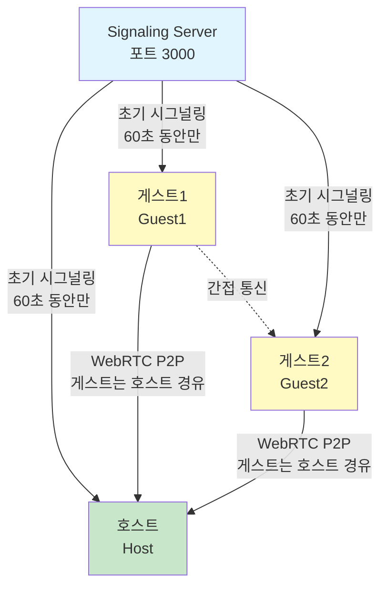
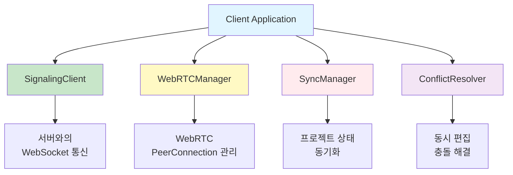
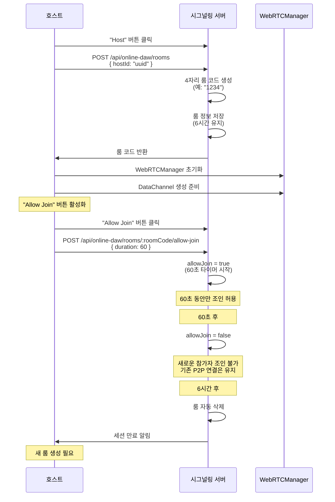
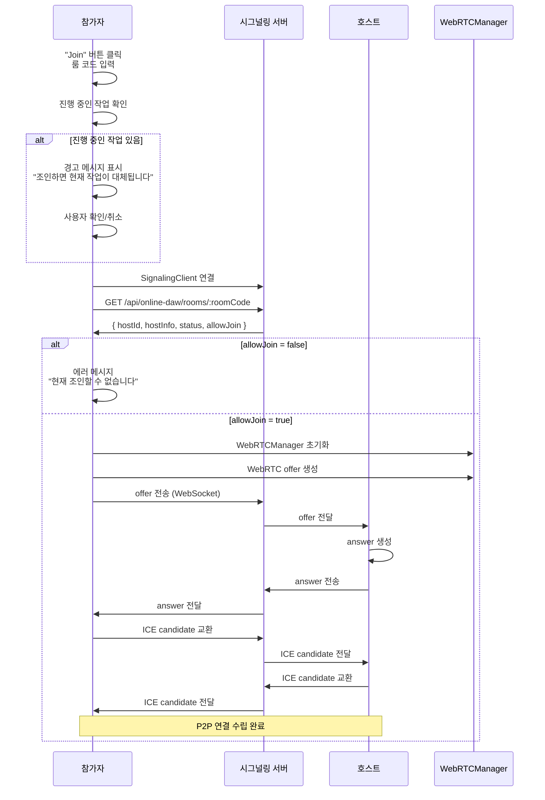
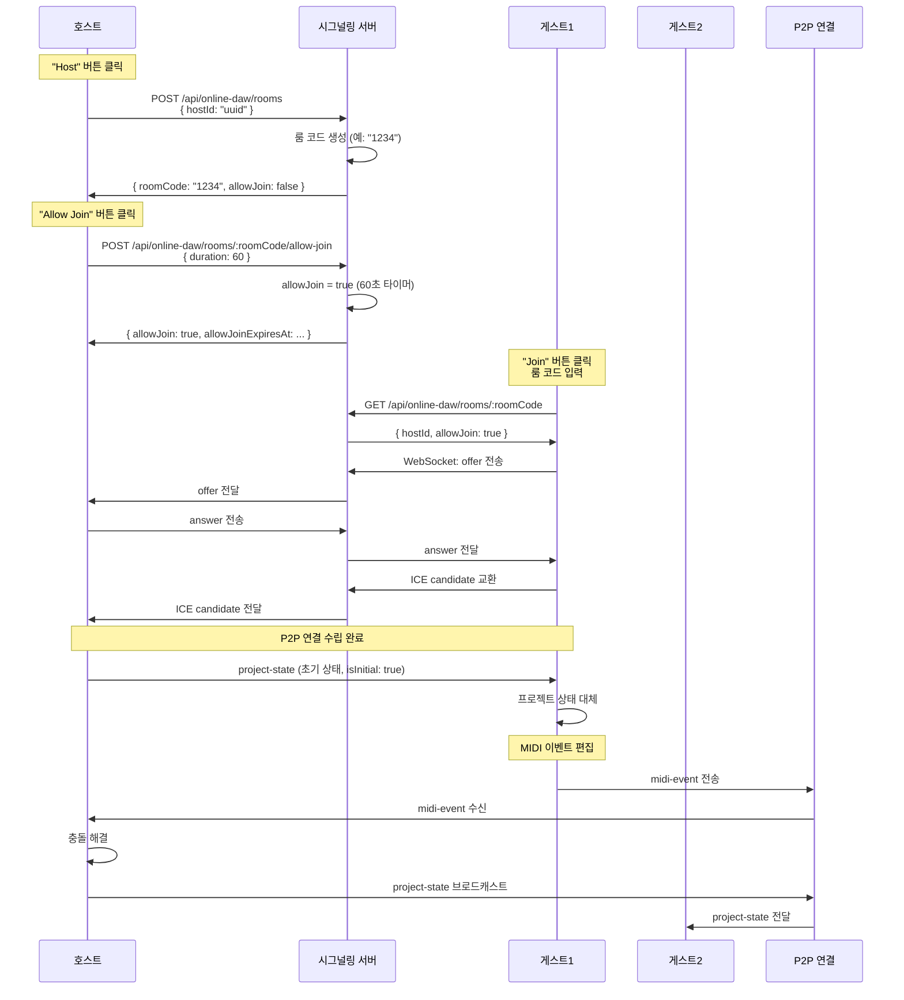
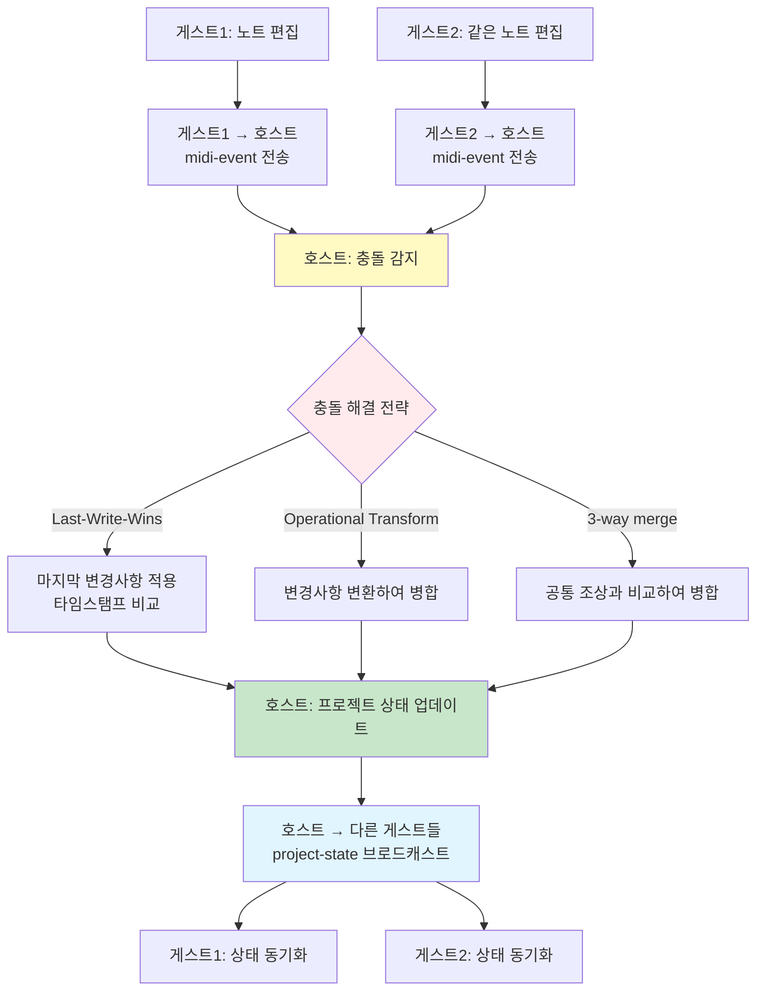

# 콜라보레이션 기능 명세서

**Document Version**: 1.0  
**Software Version**: 0.1.0  
**Last Updated**: 2026-01-14  
**서버 포트**: 3000

---

## 목차

1. [개요](#개요)
2. [아키텍처](#아키텍처)
3. [연결 플로우](#연결-플로우)
4. [프로토콜 정의](#프로토콜-정의)
5. [서버 API 스펙](#서버-api-스펙)
6. [클라이언트 구현](#클라이언트-구현)
7. [예외 상황 및 핸들링](#예외-상황-및-핸들링)
8. [보안 고려사항](#보안-고려사항)
9. [테스트 환경 구성](#테스트-환경-구성)
10. [개발 전략](#개발-전략)

---

## 개요

Online DAW의 콜라보레이션 기능은 **하이브리드 아키텍처**를 사용합니다:

- **초기 연결 단계**: 시그널링 서버(포트 3000)를 통해 호스트 정보 획득 및 WebRTC 시그널링
- **이후 통신**: WebRTC P2P 직접 통신으로 실시간 데이터 교환

### 주요 특징

- **서버 리소스 관리**: "Host" 클릭 시 룸 생성 (6시간 유지), "Allow Join"으로 60초 동안만 조인 허용
- **세션 시간 제한**: 6시간 후 서버 룸과 P2P 연결 모두 종료 (리소스 절약)
- **룸 코드 재사용**: 룸이 6시간 동안 유지되어 같은 룸 코드 재사용 가능
- **Star 토폴로지**: 게스트는 호스트를 경유해서 통신 (구현 단순, 중앙 집중식 동기화)
- **낮은 지연시간**: P2P 직접 통신으로 실시간 동기화
- **확장성**: 서버 없이 다수 참여 가능 (P2P 연결 수립 후)
- **보안**: 서버를 통한 데이터 중계 최소화

### 동기화되는 항목



콜라보레이션 세션에서 다음 항목들이 실시간으로 동기화됩니다:

1. **채널 볼륨** (track.volume): 각 트랙의 볼륨 레벨
2. **채널 패닝** (track.pan): 각 트랙의 패닝 위치 (-1.0 ~ 1.0)
3. **채널 이펙트** (track.effects): 각 트랙에 적용된 이펙트 (EQ, Delay, Reverb 등)
4. **미디파트** (project.midiParts): 미디파트의 생성, 삭제, 이동, 리사이즈 등
5. **미디 노트** (midiPart.notes): 노트의 추가, 삭제, 수정 (피치, 속도, 위치, 길이 등)
6. **박자/타임 시그니처** (timing.timeSigMap): 타임 시그니처 변경 이벤트
7. **BPM/템포** (timing.tempoMap): 템포 변경 이벤트

**참고**: 마스터 채널의 볼륨/패닝/이펙트는 동기화되지 않습니다. 각 클라이언트가 독립적으로 설정합니다.

---

## 아키텍처

### 전체 구조 (Star 토폴로지)



**통신 구조:**
- 초기 연결: 서버를 통한 시그널링 (60초 동안만)
- 이후 통신: Star 토폴로지 P2P (게스트 → Host → 다른 게스트)
- 서버 역할: 초기 시그널링만 담당, P2P 연결 수립 후 불필요

### 컴포넌트 구조



---

## 연결 플로우

### 1. 호스트 세션 시작



**상세 단계:**

1. 호스트가 "Host" 버튼 클릭
   - SignalingClient가 서버에 연결
   - 서버에 룸 등록 요청: `POST /api/online-daw/rooms` with `{ hostId: "uuid" }`
   - 서버가 비어있는 4자리 룸 코드 생성 및 반환 (예: "1234")
   - 서버가 룸 정보 저장 (6시간 유지)
   - 호스트가 룸 코드 수신 및 표시
   - 호스트가 WebRTCManager 초기화
   - 호스트가 DataChannel 생성 준비
   - "Allow Join" 버튼 활성화 (기본적으로 비활성 상태)

2. 호스트가 "Allow Join" 버튼 클릭
   - 서버에 조인 허용 요청: `POST /api/online-daw/rooms/:roomCode/allow-join` with `{ duration: 60 }`
   - 서버가 룸의 allowJoin 상태를 true로 설정 (60초 타이머 시작)
   - 60초 카운트다운 시작
   - 이 60초 동안만 참가자 조인 가능

3. 60초 후
   - 서버가 룸의 allowJoin 상태를 false로 변경
   - 새로운 참가자 조인 불가
   - 하지만 기존 P2P 연결은 계속 유지됨 (6시간 제한 전까지)
   - 참가자들은 계속 작업 가능
   - 호스트는 언제든지 "Allow Join" 버튼을 다시 클릭하여 조인 허용 상태로 만들 수 있음

4. 호스트가 다시 "Allow Join" 클릭 (만료 후 또는 만료 전)
   - 서버에 조인 허용 요청 (동일한 API)
   - 서버가 룸의 allowJoin 상태를 true로 설정 (60초 타이머 재시작)
   - 60초 카운트다운 재시작
   - 새로운 참가자 조인 가능

5. 룸 만료 경고 (서버에서 전송)
   - 30분 전: "Room will expire in 30 minutes. Please save your work."
   - 5분 전: "Room will expire in 5 minutes. Please save your work."
   - 1분 전: "Room will expire in 1 minute. Please save your work."

6. 6시간 후
   - 서버에서 룸 자동 삭제 (리소스 해제)
   - P2P 연결도 자동 종료 (리소스 절약)
   - 모든 참가자에게 세션 만료 알림
   - 호스트가 새 룸을 생성해야 재연결 가능

**중요 사항:**

1. **호스트가 다시 "Host" 버튼을 누르면:**
   - 이미 호스팅 중이면 기존 룸 유지 (새 룸 생성 안 함)
   - 같은 룸 코드 계속 사용

2. **서버 리소스 관리:**
   - "Host" 클릭 시 서버에 룸 생성 (6시간 유지)
   - 룸 코드는 6시간 동안 유지되어 재사용 가능
   - "Allow Join" 클릭 시 60초 동안만 조인 허용
   - 6시간 후 서버 룸과 P2P 연결 모두 자동 종료 (리소스 절약)
   - 재연결 필요 시 호스트가 새 룸 생성

3. **조인 허용 관리:**
   - "Allow Join" 버튼으로 60초 동안만 조인 허용
   - 60초 후 자동으로 조인 불가 상태로 변경
   - 호스트는 언제든지 "Allow Join" 버튼을 다시 클릭하여 조인 허용 상태로 만들 수 있음
   - 만료 후에도 호스트가 다시 클릭하면 즉시 조인 허용 상태로 전환 (60초 타이머 재시작)

4. **통신 구조:**
   - 룸 생성 후: 서버를 통한 시그널링 (6시간 동안 가능)
   - P2P 연결 수립 후: P2P 직접 통신 (Star 토폴로지)

### 2. 참가자 세션 참여



**상세 단계:**

1. 참가자가 "Join" 버튼 클릭 및 룸 코드 입력
2. 참가자가 진행 중인 작업이 있는지 확인
   - 진행 중인 작업이 있으면 경고 메시지 표시: "조인하면 현재 작업이 호스트의 프로젝트 상태로 대체됩니다. 계속하시겠습니까?"
   - 사용자가 확인하면 계속, 취소하면 중단
3. SignalingClient가 서버에 연결
4. 서버에서 호스트 정보 조회:
   - `GET /api/online-daw/rooms/:roomCode`
   - 응답: `{ hostId: "uuid", hostInfo: {...}, status: "active", allowJoin: true/false }`
5. 조인 허용 여부 확인:
   - allowJoin이 false이면 에러 메시지 표시: "현재 조인할 수 없습니다. 호스트가 'Allow Join'을 활성화해야 합니다."
   - allowJoin이 true이면 계속 진행
6. 참가자가 WebRTCManager 초기화
7. 참가자가 WebRTC offer 생성
8. 참가자가 서버를 통해 호스트에게 offer 전송:
   - WebSocket: `/api/online-daw/signaling`
   - `{ action: "signaling", type: "offer", from: "clientId", to: "hostId", data: {...} }`
9. 서버가 호스트에게 offer 전달 (WebSocket)
10. 호스트가 answer 생성 및 서버를 통해 참가자에게 전송
11. ICE candidate 교환 (서버를 통해)
11. WebRTC 연결 수립 완료 (Star 토폴로지)
12. 호스트가 현재 프로젝트 전체 상태를 참가자에게 전송:
    - type: 'project-state'
    - state: 전체 프로젝트 상태
    - version: 현재 버전
    - isInitial: true
13. 참가자가 호스트의 프로젝트 상태를 수신 및 적용 (기존 상태 덮어쓰기)
14. 이후 모든 통신은 P2P로 전환 (게스트 → Host → 다른 게스트)
```

**Star 토폴로지 통신:**
- 게스트1의 변경사항 → Host → 게스트2, 게스트3에게 브로드캐스트
- 게스트2의 변경사항 → Host → 게스트1, 게스트3에게 브로드캐스트
- 모든 게스트는 Host와만 직접 연결

### 3. P2P 통신 전환 및 서버 룸 만료

```
WebRTC 연결 수립 후:
- 프로젝트 상태 동기화: DataChannel을 통한 직접 전송 (Star 토폴로지)
- MIDI 이벤트: DataChannel을 통한 직접 전송
- 오디오 스트림: WebRTC MediaStream (필요시)

60초 후 조인 허용 만료:
- 서버에서 룸의 allowJoin 상태를 false로 변경
- 새로운 참가자 조인 불가
- 하지만 기존 P2P 연결은 계속 유지 (6시간 제한 전까지)
- 참가자들은 계속 작업 가능
- 호스트는 언제든지 "Allow Join" 버튼을 다시 클릭하여 조인 허용 상태로 만들 수 있음
- 호스트가 다시 클릭하면 즉시 조인 허용 상태로 전환 (60초 타이머 재시작)

룸 만료 경고 (서버에서 WebSocket으로 전송):
- 30분 전: "Room will expire in 30 minutes. Please save your work."
- 5분 전: "Room will expire in 5 minutes. Please save your work."
- 1분 전: "Room will expire in 1 minute. Please save your work."

6시간 후 세션 만료:
- 서버에서 룸 정보 삭제 (리소스 해제)
- P2P 연결도 자동 종료 (리소스 절약)
- 모든 참가자에게 세션 만료 알림
- 호스트가 새 룸을 생성해야 재연결 가능
- 작업 내용은 로컬에 저장되어 있으므로 손실 없음
```

### 4. 룸 나가기 동작

```
호스트가 룸에서 나가기:
- 호스트가 "Stop Hosting" 또는 "Leave" 클릭
- 서버에서 룸 삭제 요청
- 모든 게스트에게 룸 종료 알림
- 호스트의 프로젝트 상태는 유지됨 (로컬에 저장)
- P2P 연결 종료

게스트가 룸에서 나가기:
- 게스트가 "Leave" 클릭
- P2P 연결 종료
- 게스트의 프로젝트 상태를 초기 상태로 복원
- 호스트와 다른 게스트들은 계속 작업 가능
```

**통신 예시:**
```
게스트1이 MIDI 이벤트 추가
  ↓ (P2P 직접)
호스트가 수신 및 처리
  ↓ (P2P 직접)      ↓ (P2P 직접)
게스트2에게 브로드캐스트    게스트3에게 브로드캐스트
```

---

## 프로토콜 정의

### 시그널링 메시지 타입

#### 1. 룸 등록 (호스트 → 서버)

```typescript
interface RegisterRoomRequest {
  hostId: string;          // 호스트 고유 ID (UUID)
  metadata?: {
    hostName?: string;
    maxParticipants?: number;  // 기본값: 4
  };
}

interface RegisterRoomResponse {
  success: boolean;
  roomCode: string;        // 서버가 생성한 4자리 숫자 (0000-9999)
  hostId: string;
  expiresAt: number;       // 룸 만료 시간 (밀리초, 6시간 후)
  allowJoin: boolean;      // 조인 허용 여부 (초기값: false)
}
```

**참고:** 룸 코드는 서버에서 생성하여 반환합니다. 클라이언트는 룸 코드를 생성하지 않습니다.

#### 2. 룸 조회 (참가자 → 서버)

```typescript
interface GetRoomRequest {
  roomCode: string;
}

interface GetRoomResponse {
  success: boolean;
  room?: {
    roomCode: string;
    hostId: string;
    status: 'active' | 'inactive' | 'full';
    allowJoin: boolean;           // 조인 허용 여부
    allowJoinExpiresAt?: number;  // 조인 허용 만료 시간
    participantCount: number;
    maxParticipants: number;
    createdAt: number;
    expiresAt: number;            // 룸 만료 시간 (6시간 후)
  };
  error?: string;
}
```

#### 3. WebRTC 시그널링 메시지

```typescript
interface SignalingMessage {
  type: 'offer' | 'answer' | 'ice-candidate';
  from: string;            // 발신자 ID
  to: string;              // 수신자 ID (호스트 또는 참가자)
  roomCode: string;
  data: {
    // WebRTC offer/answer
    sdp?: RTCSessionDescriptionInit;
    // ICE candidate
    candidate?: RTCIceCandidateInit;
  };
  timestamp: number;
}
```

#### 4. P2P 데이터 메시지 (WebRTC DataChannel)

```typescript
// 프로젝트 상태 동기화
interface ProjectStateMessage {
  type: 'project-state';
  projectId: string;
  state: ProjectState;     // 프로젝트 전체 상태
  version: number;          // 버전 번호
  timestamp: number;
  isInitial?: boolean;     // 초기 상태인지 여부 (조인 시 true)
}

// 동기화되는 프로젝트 상태 항목:
// 1. 채널 볼륨 (track.volume)
// 2. 채널 패닝 (track.pan)
// 3. 채널 이펙트 (track.effects)
// 4. 미디파트 (project.midiParts)
// 5. 미디 노트 (midiPart.notes)
// 6. 박자/타임 시그니처 (timing.timeSigMap)
// 7. BPM/템포 (timing.tempoMap)

// MIDI 이벤트 동기화
interface MidiEventMessage {
  type: 'midi-event';
  event: MidiEvent;
  partId: string;
  trackId: string;
  timestamp: number;
}

// 파트 변경 동기화
interface PartChangeMessage {
  type: 'part-change';
  action: 'create' | 'update' | 'delete' | 'move';
  partId: string;
  data?: any;
  timestamp: number;
}

// 재생 상태 동기화
interface PlaybackStateMessage {
  type: 'playback-state';
  isPlaying: boolean;
  currentTick: number;
  timestamp: number;
}

// 룸 종료 알림 (호스트 → 게스트)
interface RoomClosedMessage {
  type: 'room-closed';
  message: string;
  timestamp: number;
}
```

---

## 서버 API 스펙

### 기본 정보

- **포트**: 3000
- **프로토콜**: WebSocket (시그널링), HTTP REST (룸 관리)
- **Base URL**: `http://localhost:3000` (개발), `https://api.onlinedaw.com` (프로덕션)

### REST API 엔드포인트

#### 1. 룸 등록 (호스트가 "Host" 클릭 시)

```
POST /api/online-daw/rooms
Content-Type: application/json

Request Body:
{
  "hostId": "uuid-here"
}

Response 200:
{
  "success": true,
  "roomCode": "1234",  // 서버가 생성한 비어있는 4자리 숫자
  "hostId": "uuid-here",
  "expiresAt": 1234567890123,  // 6시간 후 (21600000ms)
  "allowJoin": false  // 초기값: 조인 불가
}

Response 400:
{
  "success": false,
  "error": "No available room codes"  // 모든 룸 코드가 사용 중인 경우 (매우 드묾)
}

Response 200: (호스트가 이미 룸이 있는 경우)
{
  "roomCode": "1234",  // 기존 룸 코드 반환
  "hostId": "uuid",
  "status": "active",
  "allowJoin": false,
  "createdAt": 1234567890
}
```

**중요:**
- 룸 코드는 서버에서 생성하여 반환합니다
- 서버는 사용 가능한 4자리 숫자(0000-9999) 중 하나를 선택합니다
- 이미 사용 중인 룸 코드는 제외하고 할당합니다
- 룸은 6시간 동안 유지됩니다 (21600000ms)
- 초기 상태는 allowJoin: false (조인 불가)

#### 2. 룸 조회 (참가자가 조인 시)

```
GET /api/online-daw/rooms/:roomCode
Headers: { "X-Client-Id": "client-uuid" }  // 선택사항, 강퇴 확인용

Response 200:
{
  "roomCode": "1234",
  "hostId": "uuid-here",
  "status": "active",
  "allowJoin": true,  // 조인 허용 여부
  "allowJoinExpiresAt": 1234567950123,  // 조인 허용 만료 시간 (60초 후)
  "participantCount": 1,
  "maxParticipants": 4,
  "createdAt": 1234567890123,  // 룸 생성 시간 (강퇴 확인용)
  "expiresAt": 1234567890123  // 룸 만료 시간 (6시간 후)
}

Response 404:
{
  "success": false,
  "error": "Room not found"
}

Response 403:
{
  "success": false,
  "error": "Join not allowed",  // allowJoin이 false이거나 강퇴된 경우
  "message": "Host has not allowed joining." or "You have been kicked from this room."
}
```

**강퇴 확인:**
- 클라이언트 ID가 제공되면 서버가 강퇴 여부 확인
- 같은 룸 인스턴스에서 강퇴된 경우: 403 Forbidden
- 새 룸 인스턴스인 경우: 200 OK (룸 생성 시간으로 판단)

#### 2-1. 조인 허용 활성화 (호스트가 "Allow Join" 클릭 시)

**중요:** 호스트는 언제든지 이 API를 호출하여 조인 허용 상태로 만들 수 있습니다.
- 조인 허용이 만료된 후에도 다시 호출 가능
- 이미 조인 허용 상태인 경우 타이머가 재시작됨 (60초 연장)

```
POST /api/online-daw/rooms/:roomCode/allow-join
Headers: { "X-Host-Id": "uuid-here" }
Content-Type: application/json

Request Body:
{
  "duration": 60  // 조인 허용 시간 (초)
}

Response 200:
{
  "success": true,
  "allowJoin": true,
  "allowJoinExpiresAt": 1234567950123  // 현재 시간 + 60초
}

Response 403:
{
  "success": false,
  "error": "Unauthorized"  // 호스트가 아닌 경우
}
```

**동작:**
- 조인 허용이 만료된 상태에서 호출: 즉시 조인 허용 상태로 전환 (60초 타이머 시작)
- 이미 조인 허용 상태인 경우: 타이머가 재시작되어 60초 연장
- 호스트는 언제든지 이 API를 호출할 수 있음

#### 3. 룸 삭제 (호스트가 "Stop Hosting" 클릭 시, 또는 6시간 후 자동)

```
DELETE /api/online-daw/rooms/:roomCode
Headers: { "X-Host-Id": "uuid-here" }

Response 200:
{
  "success": true
}

Response 403:
{
  "success": false,
  "error": "Unauthorized"
}
```

**참고:** 6시간 후 서버 룸과 P2P 연결 모두 자동 종료됩니다. 리소스 절약을 위한 정책입니다.

#### 4. 참가자 강퇴 (호스트가 강퇴 버튼 클릭 시)

```
POST /api/online-daw/rooms/:roomCode/kick
Headers: { "X-Host-Id": "uuid-here" }
Content-Type: application/json

Request Body:
{
  "participantId": "guest-uuid"
}

Response 200:
{
  "success": true,
  "message": "Participant kicked"
}

Response 403:
{
  "success": false,
  "error": "Unauthorized"
}

Response 404:
{
  "success": false,
  "error": "Participant not found"
}
```

**참고:** 
- 강퇴된 참가자는 현재 룸 인스턴스에서만 재조인이 거부됩니다
- 같은 호스트가 같은 룸 코드로 새 룸을 만들면 참가 가능합니다
- 다른 호스트가 같은 룸 코드를 사용해도 참가 가능합니다
- 강퇴는 룸 인스턴스 기준이지, 룸 코드나 호스트 기준이 아닙니다

#### 5. 룸 만료 경고 (서버에서 자동 전송)

서버는 룸 만료 전에 WebSocket을 통해 경고 메시지를 전송합니다:

```
WebSocket 메시지 (서버 → 모든 클라이언트)
{
  "action": "room-expiring",
  "roomCode": "1234",
  "data": {
    "minutesLeft": 30  // 또는 5, 1
  }
}
```

**경고 시점:**
- 30분 전 (5시간 30분 경과)
- 5분 전 (5시간 55분 경과)
- 1분 전 (5시간 59분 경과)

### WebSocket API

#### 연결

```
ws://localhost:3000/api/online-daw/signaling
```

#### 메시지 형식

```typescript
// 클라이언트 → 서버
interface ClientToServerMessage {
  action: 'register' | 'join' | 'signaling' | 'leave';
  roomCode: string;
  clientId: string;
  data?: any;
}

// 서버 → 클라이언트
interface ServerToClientMessage {
  action: 'registered' | 'joined' | 'signaling' | 'error' | 'room-closed' | 'kicked' | 'allow-join-expired' | 'room-expiring' | 'room-session-expired';
  roomCode: string;
  data?: {
    minutesLeft?: number;  // 룸 만료까지 남은 시간 (분)
    roomCreatedAt?: number;  // 룸 생성 시간 (강퇴 확인용)
    [key: string]: any;
  };
  error?: string;
}
```

#### 메시지 플로우



**1. 호스트 등록**
```json
// 클라이언트 → 서버
{
  "action": "register",
  "roomCode": "1234",
  "clientId": "host-uuid",
  "data": {
    "role": "host"
  }
}

// 서버 → 클라이언트
{
  "action": "registered",
  "roomCode": "1234",
  "data": {
    "status": "active"
  }
}
```

**2. 참가자 참여**
```json
// 클라이언트 → 서버
{
  "action": "join",
  "roomCode": "1234",
  "clientId": "client-uuid",
  "data": {
    "role": "participant"
  }
}

// 서버 → 클라이언트
{
  "action": "joined",
  "roomCode": "1234",
  "data": {
    "hostId": "host-uuid",
    "status": "active"
  }
}
```

**3. 시그널링 메시지 전달**
```json
// 참가자 → 서버 → 호스트
{
  "action": "signaling",
  "roomCode": "1234",
  "clientId": "client-uuid",
  "data": {
    "type": "offer",
    "to": "host-uuid",
    "sdp": {...}
  }
}
```

---

## 클라이언트 구현

### 1. SignalingClient

```typescript
class SignalingClient {
  private ws: WebSocket | null = null;
  private roomCode: string | null = null;
  private clientId: string;
  
  constructor(serverUrl: string) {
    this.clientId = generateUUID();
  }
  
  // 룸 등록 (호스트) - 서버에서 룸 코드 생성 (6시간 유지)
  async registerRoom(hostId: string): Promise<string>  // 룸 코드 반환
  
  // 조인 허용 활성화 (호스트) - 언제든지 호출 가능
  // 만료 후에도 다시 호출하면 즉시 조인 허용 상태로 전환
  async allowJoin(roomCode: string, duration: number): Promise<void>
  
  // 참가자 강퇴 (호스트)
  async kickParticipant(roomCode: string, participantId: string): Promise<void>
  
  // 룸 참여 (참가자)
  async joinRoom(roomCode: string): Promise<HostInfo>
  
  // 시그널링 메시지 전송
  sendSignalingMessage(message: SignalingMessage): void
  
  // 시그널링 메시지 수신 콜백 등록
  onSignalingMessage(callback: (message: SignalingMessage) => void): void
  
  // 연결 종료
  disconnect(): void
}
```

### 2. WebRTCManager

**호스트 측 (Star 토폴로지):**

```typescript
class HostWebRTCManager {
  private peerConnections = new Map<string, RTCPeerConnection>(); // 게스트별 연결
  private dataChannels = new Map<string, RTCDataChannel>();
  
  constructor(iceServers: RTCConfiguration) {
    // 호스트는 여러 게스트와 연결 관리
  }
  
  // 게스트 추가 (offer 수신 시)
  async addGuest(guestId: string, offer: RTCSessionDescriptionInit): Promise<RTCSessionDescriptionInit>
  
  // 게스트 연결 완료 시 콜백
  onGuestConnected(callback: (guestId: string) => void): void
  
  // 게스트에게 메시지 브로드캐스트
  broadcastToOthers(senderId: string, message: P2PMessage): void
  
  // 모든 게스트에게 메시지 브로드캐스트
  broadcastToAll(message: P2PMessage): void
  
  // 특정 게스트에게 메시지 전송
  sendToGuest(guestId: string, message: P2PMessage): void
  
  // 게스트 연결 해제
  removeGuest(guestId: string): void
}
```

**게스트 측:**

```typescript
class GuestWebRTCManager {
  private peerConnection: RTCPeerConnection | null = null;
  private dataChannel: RTCDataChannel | null = null;
  
  constructor(iceServers: RTCConfiguration) {
    // 게스트는 호스트와만 연결
  }
  
  // 호스트와 연결 (offer 생성)
  async connectToHost(hostId: string): Promise<RTCSessionDescriptionInit>
  
  // 호스트에게 메시지 전송
  sendToHost(message: P2PMessage): void
  
  // 호스트로부터 메시지 수신 콜백
  onMessageFromHost(callback: (message: P2PMessage) => void): void
  
  // 연결 종료
  disconnect(): void
}
```

### 3. SyncManager

**호스트 측:**

```typescript
class HostSyncManager {
  private webRTCManager: HostWebRTCManager;
  private projectState: ProjectState;
  private version: number = 0;
  
  constructor(webRTCManager: HostWebRTCManager) {
    this.webRTCManager = webRTCManager;
  }
  
  // 새 게스트가 연결되면 초기 상태 전송
  onGuestConnected(guestId: string): void {
    // 현재 프로젝트 전체 상태를 새 게스트에게 전송
    this.webRTCManager.sendToGuest(guestId, {
      type: 'project-state',
      state: this.projectState,
      version: this.version,
      isInitial: true  // 초기 상태임을 표시
    });
  }
  
  // 로컬 변경사항을 모든 게스트에게 브로드캐스트
  syncProjectState(state: ProjectState): void {
    this.projectState = state;
    this.webRTCManager.broadcastToAll({
      type: 'project-state',
      state,
      version: this.version++,
      isInitial: false  // 일반 업데이트
    });
  }
  
  // 게스트로부터 변경사항 수신 → 다른 게스트들에게 브로드캐스트
  onGuestChange(guestId: string, change: RemoteChange): void {
    // 충돌 해결
    const resolved = this.resolveConflict(change);
    // 프로젝트 상태 업데이트
    this.applyChange(resolved);
    // 다른 게스트들에게 브로드캐스트
    this.webRTCManager.broadcastToOthers(guestId, resolved);
  }
}
```

**게스트 측:**

```typescript
class GuestSyncManager {
  private webRTCManager: GuestWebRTCManager;
  private projectState: ProjectState;
  private hasLocalChanges: boolean = false;
  
  constructor(webRTCManager: GuestWebRTCManager) {
    this.webRTCManager = webRTCManager;
  }
  
  // 조인 전 경고 확인
  async checkBeforeJoin(): Promise<boolean> {
    // 진행 중인 작업이 있는지 확인
    if (this.hasLocalChanges || this.hasUnsavedWork()) {
      const confirmed = await showConfirmDialog({
        title: 'Join Session',
        message: 'Joining will replace your current work with the host\'s project state. Do you want to continue?',
        confirmText: 'Join',
        cancelText: 'Cancel'
      });
      return confirmed;
    }
    return true;
  }
  
  // P2P 연결 수립 후 초기 상태 수신
  onP2PConnected(): void {
    // 호스트로부터 초기 상태를 받을 준비
    this.webRTCManager.onMessageFromHost((message) => {
      if (message.type === 'project-state' && message.isInitial) {
        // 호스트의 프로젝트 상태로 완전히 대체
        this.applyProjectState(message.state);
        this.hasLocalChanges = false;
      } else {
        // 일반 변경사항 처리
        this.onHostChange(message);
      }
    });
  }
  
  // 로컬 변경사항을 호스트에게 전송
  syncMidiEvent(event: MidiEvent, partId: string, trackId: string): void {
    this.webRTCManager.sendToHost({
      type: 'midi-event',
      event,
      partId,
      trackId
    });
  }
  
  // 호스트로부터 변경사항 수신
  onHostChange(callback: (change: RemoteChange) => void): void {
    this.webRTCManager.onMessageFromHost((message) => {
      if (message.type !== 'project-state' || !message.isInitial) {
        callback(message);
      }
    });
  }
  
  private hasUnsavedWork(): boolean {
    // 프로젝트에 변경사항이 있는지 확인
    const project = getProject();
    // 예: 파트가 있거나, 노트가 있거나 등
    return project.midiParts.length > 0;
  }
  
  private applyProjectState(state: ProjectState): void {
    // 호스트의 프로젝트 상태로 완전히 대체
    setProject(state);
    notifyProjectChange({ type: 'project-replaced' });
  }
}
```

---

## 예외 상황 및 핸들링

### 1. 네트워크 연결 실패

#### 시나리오
- 서버에 연결할 수 없음
- WebSocket 연결 끊김
- P2P 연결 실패

#### 핸들링

```typescript
// 서버 연결 실패
try {
  await signalingClient.connect();
} catch (error) {
  // 재시도 로직 (지수 백오프)
  let retryCount = 0;
  const maxRetries = 5;
  const baseDelay = 1000; // 1초
  
  while (retryCount < maxRetries) {
    await sleep(baseDelay * Math.pow(2, retryCount));
    try {
      await signalingClient.connect();
      break;
    } catch (e) {
      retryCount++;
      if (retryCount >= maxRetries) {
        showError("Cannot connect to server. Please check your network connection.");
      }
    }
  }
}

// WebSocket 재연결
signalingClient.on('disconnect', () => {
  // 자동 재연결 시도
  setTimeout(() => {
    signalingClient.reconnect();
  }, 1000);
});

// P2P 연결 실패
webRTCManager.onConnectionStateChange((state) => {
  if (state === 'failed' || state === 'disconnected') {
    // 서버를 통한 재연결 시도
    attemptReconnection();
  }
});
```

### 2. 룸 코드 중복

#### 시나리오
- 생성한 룸 코드가 이미 존재함
- 참여하려는 룸 코드가 존재하지 않음

#### 핸들링

```typescript
// 룸 코드 중복
async function registerRoomWithRetry(): Promise<string> {
  let attempts = 0;
  const maxAttempts = 10;
  
  while (attempts < maxAttempts) {
    const roomCode = generateRoomCode();
    try {
      await signalingClient.registerRoom(roomCode);
      return roomCode;
    } catch (error) {
      if (error.code === 'ROOM_EXISTS') {
        attempts++;
        continue;
      }
      throw error;
    }
  }
  
  throw new Error("룸 생성에 실패했습니다. 다시 시도해주세요.");
}

// 룸 코드 없음
async function joinRoom(roomCode: string) {
  // 조인 전 경고 확인
  const syncManager = new GuestSyncManager(webRTCManager);
  const confirmed = await syncManager.checkBeforeJoin();
  
  if (!confirmed) {
    // 사용자가 취소
    return;
  }
  
  try {
    const roomInfo = await signalingClient.getRoom(roomCode);
    if (!roomInfo) {
      showError("Room code does not exist.");
      return;
    }
    if (roomInfo.status === 'full') {
      showError("Room is full.");
      return;
    }
    // 참여 로직
    // P2P 연결 수립 후 호스트의 초기 상태를 받음
  } catch (error) {
    if (error.status === 404) {
      showError("Room code does not exist.");
    } else {
      showError("Failed to join room.");
    }
  }
}
```

### 3. 호스트 연결 끊김

#### 시나리오
- 호스트가 네트워크 연결 끊김
- 호스트가 앱 종료
- 호스트가 세션 종료

#### 핸들링

```typescript
// 호스트 연결 끊김 감지
webRTCManager.onConnectionStateChange((state) => {
  if (state === 'disconnected' || state === 'failed') {
    // 호스트 재연결 대기
    showNotification("Host connection lost. Waiting for reconnection...");
    
    // 서버를 통해 호스트 상태 확인
    const checkHostStatus = setInterval(async () => {
      const roomInfo = await signalingClient.getRoom(roomCode);
      if (roomInfo && roomInfo.status === 'active') {
        // 호스트가 다시 온라인, 재연결 시도
        clearInterval(checkHostStatus);
        attemptReconnection();
      }
    }, 3000);
    
    // 30초 후 타임아웃
    setTimeout(() => {
      clearInterval(checkHostStatus);
      showError("Cannot restore connection to host.");
      leaveSession();
    }, 30000);
  }
});

// 호스트가 세션 종료
signalingClient.on('room-closed', () => {
  showNotification("Host has ended the session.");
  cleanup();
  returnToIdle();
});
```

### 4. 참가자 연결 끊김 및 강퇴

#### 시나리오
- 참가자가 네트워크 연결 끊김
- 참가자가 앱 종료
- 호스트가 참가자 강퇴

#### 핸들링

```typescript
// 참가자 연결 끊김 감지 (호스트 측)
const participants = new Map<string, Participant>();

webRTCManager.onParticipantDisconnected((participantId) => {
  const participant = participants.get(participantId);
  if (participant) {
    showNotification(`${participant.name} has disconnected.`);
    participants.delete(participantId);
    updateParticipantsList();
  }
});

// 호스트가 참가자 강퇴
async function kickParticipant(participantId: string) {
  const confirmed = await showConfirmDialog({
    title: 'Kick Participant',
    message: `Do you want to kick ${participant.name}?`,
    confirmText: 'Kick',
    cancelText: 'Cancel'
  });
  
  if (confirmed) {
    // P2P 연결 종료
    webRTCManager.removeGuest(participantId);
    // 서버에 강퇴 알림 (현재 룸 인스턴스에만 적용)
    await signalingClient.kickParticipant(roomCode, participantId);
    // 참가자 목록에서 제거
    participants.delete(participantId);
    updateParticipantsList();
    showNotification(`${participant.name} has been kicked.`);
  }
}

**중요:**
- 강퇴는 현재 룸 인스턴스에만 적용됩니다
- 같은 룸 코드로 새 룸을 만들면 강퇴된 참가자도 참가 가능합니다
- 서버는 룸 인스턴스별로 강퇴 목록을 관리합니다

// 강퇴된 참가자 측 처리
let kickedFromRoomCode: string | null = null;  // 강퇴된 룸 코드
let lastKickedAt: number = 0;  // 강퇴된 룸의 생성 시간

signalingClient.on('kicked', (data: { roomCode: string, roomCreatedAt: number }) => {
  kickedFromRoomCode = data.roomCode;  // 현재 룸 코드 저장
  lastKickedAt = data.roomCreatedAt;  // 룸 생성 시간 저장
  showError("You have been kicked by the host.");
  // P2P 연결 종료
  webRTCManager.disconnect();
  // 세션 종료
  leaveSession();
});

// 재조인 시도 시 강퇴 여부 확인
async function joinRoom(roomCode: string) {
  // 같은 룸 코드로 재조인 시도하는 경우
  if (kickedFromRoomCode === roomCode) {
    // 서버에서 현재 룸 인스턴스 확인
    const roomInfo = await signalingClient.getRoom(roomCode);
    
    // 룸이 새로 생성되었거나 다른 인스턴스인 경우
    // (서버에서 룸 생성 시간으로 판단)
    if (roomInfo.createdAt > lastKickedAt) {
      // 새 룸 인스턴스이므로 참가 가능
      kickedFromRoomCode = null;  // 강퇴 상태 해제
      lastKickedAt = 0;
      // 조인 진행
    } else {
      // 같은 룸 인스턴스이므로 거부
      showError("You have been kicked from this room. You can join again when the host creates a new room.");
      return;
    }
  }
  
  // 일반 조인 로직
  // ...
}

// 자동 재연결 시도 (참가자 측) - 강퇴된 경우 제외
webRTCManager.onConnectionStateChange((state) => {
  if (state === 'disconnected' && !kickedFromRoomCode) {
    // 자동 재연결 시도
    attemptReconnection();
  }
});
```

### 5. NAT/방화벽 문제

#### 시나리오
- STUN 서버로 공인 IP 획득 실패
- TURN 서버 필요 (대칭형 NAT)

#### 핸들링

```typescript
// ICE 서버 구성
const iceServers: RTCConfiguration = {
  iceServers: [
    // STUN 서버 (무료)
    { urls: 'stun:stun.l.google.com:19302' },
    { urls: 'stun:stun1.l.google.com:19302' },
    
    // TURN 서버 (필요시, 유료 서비스 또는 자체 구축)
    {
      urls: 'turn:turnserver.example.com:3478',
      username: 'user',
      credential: 'password'
    }
  ],
  iceCandidatePoolSize: 10
};

// ICE 연결 실패 처리
webRTCManager.onIceConnectionStateChange((state) => {
  if (state === 'failed') {
    // TURN 서버로 재시도
    if (!usingTURN) {
      usingTURN = true;
      webRTCManager.reinitializeWithTURN();
    } else {
      showError("Network connection failed. Please check your firewall settings.");
    }
  }
});
```

### 6. 동시 편집 충돌



#### 시나리오
- 여러 사용자가 동시에 같은 파트 편집
- 프로젝트 상태 버전 충돌

#### 핸들링

```typescript
// 충돌 해결 전략
class ConflictResolver {
  // Last-Write-Wins (LWW) 전략
  resolveLWW(localChange: Change, remoteChange: Change): Change {
    if (remoteChange.timestamp > localChange.timestamp) {
      return remoteChange;
    }
    return localChange;
  }
  
  // Operational Transform (OT) 전략
  resolveOT(localChange: Change, remoteChange: Change): Change {
    // 변경사항을 변환하여 병합
    return transform(localChange, remoteChange);
  }
  
  // 3-way merge 전략
  resolve3Way(base: State, local: State, remote: State): State {
    // 공통 조상과 비교하여 병합
    return merge(base, local, remote);
  }
}

// 동시 편집 감지
syncManager.onConflict((conflict) => {
  // 사용자에게 충돌 알림
  showConflictDialog({
    localChange: conflict.local,
    remoteChange: conflict.remote,
    onResolve: (strategy) => {
      const resolved = conflictResolver.resolve(conflict, strategy);
      syncManager.applyResolvedChange(resolved);
    }
  });
});
```

### 7. 데이터 손실/순서 문제

#### 시나리오
- DataChannel 메시지 순서 보장 실패
- 메시지 손실

#### 핸들링

```typescript
// DataChannel 설정 (순서 보장)
const dataChannel = peerConnection.createDataChannel('sync', {
  ordered: true,        // 순서 보장
  maxRetransmits: 3,    // 재전송 횟수
  maxPacketLifeTime: 5000  // 패킷 수명 (ms)
});

// 메시지 순서 번호 추가
interface SequencedMessage extends P2PMessage {
  sequence: number;
  timestamp: number;
}

// 순서 번호 관리
class MessageSequencer {
  private sendSequence = 0;
  private receiveSequence = 0;
  private buffer: Map<number, SequencedMessage> = new Map();
  
  send(message: P2PMessage): SequencedMessage {
    const sequenced: SequencedMessage = {
      ...message,
      sequence: this.sendSequence++,
      timestamp: Date.now()
    };
    return sequenced;
  }
  
  receive(sequenced: SequencedMessage, callback: (message: P2PMessage) => void) {
    // 순서대로 처리
    if (sequenced.sequence === this.receiveSequence) {
      callback(sequenced);
      this.receiveSequence++;
      // 버퍼에서 다음 메시지 확인
      this.processBuffered();
    } else {
      // 순서가 맞지 않으면 버퍼에 저장
      this.buffer.set(sequenced.sequence, sequenced);
    }
  }
  
  private processBuffered() {
    while (this.buffer.has(this.receiveSequence)) {
      const message = this.buffer.get(this.receiveSequence)!;
      this.buffer.delete(this.receiveSequence);
      // 처리 로직
      this.receiveSequence++;
    }
  }
}
```

### 8. 서버 과부하

#### 시나리오
- 동시 접속자 수 과다
- 서버 리소스 부족

#### 핸들링

```typescript
// 서버 측 구현 필요 (서버 프로젝트에서 처리)
// 클라이언트 측 대응:

// 연결 큐 관리
class ConnectionQueue {
  private queue: Array<() => Promise<void>> = [];
  private processing = false;
  
  async enqueue(connectionFn: () => Promise<void>) {
    this.queue.push(connectionFn);
    if (!this.processing) {
      this.processQueue();
    }
  }
  
  private async processQueue() {
    this.processing = true;
    while (this.queue.length > 0) {
      const fn = this.queue.shift()!;
      try {
        await fn();
        await sleep(100); // 요청 간 간격
      } catch (error) {
        if (error.status === 503) {
          // 서버 과부하, 재시도
          this.queue.unshift(fn);
          await sleep(5000);
        }
      }
    }
    this.processing = false;
  }
}

// 요청 제한
const rateLimiter = {
  requests: 0,
  windowStart: Date.now(),
  maxRequests: 10,
  windowMs: 1000,
  
  async check() {
    const now = Date.now();
    if (now - this.windowStart > this.windowMs) {
      this.requests = 0;
      this.windowStart = now;
    }
    
    if (this.requests >= this.maxRequests) {
      await sleep(this.windowMs - (now - this.windowStart));
      return this.check();
    }
    
    this.requests++;
  }
};
```

### 8-1. Spot 인스턴스 서버 중단

#### 시나리오
- Spot 인스턴스가 갑자기 종료됨 (AWS Spot 인스턴스 중단)
- WebSocket 연결이 갑자기 끊김
- 서버의 룸 정보가 모두 손실됨
- P2P 연결은 유지되지만 새로운 참가자 조인 불가

#### 핸들링 전략

**1. 서버 측 전략 (서버 프로젝트에서 구현)**

```typescript
// 서버 재시작 시 상태 복원 전략
// 옵션 1: 영구 스토리지 사용 (권장)
// - 룸 정보를 Redis, DynamoDB, 또는 파일 시스템에 저장
// - 서버 재시작 시 복원

interface RoomStorage {
  // 룸 정보를 영구 스토리지에 저장
  async saveRoom(room: Room): Promise<void>;
  
  // 서버 재시작 시 룸 정보 복원
  async restoreRooms(): Promise<Room[]>;
  
  // 룸 만료 시간 확인 및 정리
  async cleanupExpiredRooms(): Promise<void>;
}

// 옵션 2: 상태 없이 시작 (간단하지만 룸 정보 손실)
// - 서버 재시작 시 모든 룸 정보 초기화
// - 기존 참가자는 P2P로 계속 작업 가능
// - 새로운 참가자만 조인 불가
```

**2. 클라이언트 측 전략**

```typescript
class SignalingClient {
  private ws: WebSocket | null = null;
  private reconnectAttempts = 0;
  private maxReconnectAttempts = 10;
  private reconnectDelay = 1000; // 1초부터 시작
  private isReconnecting = false;
  private roomCode: string | null = null;
  private hostId: string | null = null;
  
  // WebSocket 연결 끊김 감지
  private setupWebSocketHandlers(): void {
    if (!this.ws) return;
    
    this.ws.onclose = (event) => {
      console.log('WebSocket closed', event.code, event.reason);
      
      // 정상 종료가 아닌 경우 (서버 중단)
      if (event.code !== 1000) {
        this.handleUnexpectedDisconnect();
      }
    };
    
    this.ws.onerror = (error) => {
      console.error('WebSocket error', error);
      this.handleUnexpectedDisconnect();
    };
  }
  
  // 예상치 못한 연결 끊김 처리
  private handleUnexpectedDisconnect(): void {
    if (this.isReconnecting) {
      return; // 이미 재연결 시도 중
    }
    
    this.isReconnecting = true;
    this.attemptReconnection();
  }
  
  // 재연결 시도 (지수 백오프)
  private async attemptReconnection(): Promise<void> {
    while (this.reconnectAttempts < this.maxReconnectAttempts) {
      await sleep(this.reconnectDelay);
      
      try {
        await this.connect();
        
        // 재연결 성공
        if (this.ws?.readyState === WebSocket.OPEN) {
          this.reconnectAttempts = 0;
          this.reconnectDelay = 1000;
          this.isReconnecting = false;
          
          // 룸 정보 복원 시도
          await this.restoreRoomState();
          
          showNotification("Server connection restored.");
          return;
        }
      } catch (error) {
        console.error('Reconnection attempt failed', error);
      }
      
      // 재시도 횟수 증가 및 지연 시간 증가
      this.reconnectAttempts++;
      this.reconnectDelay = Math.min(
        this.reconnectDelay * 2, // 지수 백오프
        30000 // 최대 30초
      );
    }
    
    // 최대 재시도 횟수 초과
    this.isReconnecting = false;
    this.handleReconnectionFailure();
  }
  
  // 룸 상태 복원 시도
  private async restoreRoomState(): Promise<void> {
    if (!this.roomCode || !this.hostId) {
      return; // 복원할 상태 없음
    }
    
    try {
      // 서버에 룸 정보 확인
      const roomInfo = await this.getRoom(this.roomCode);
      
      if (roomInfo && roomInfo.hostId === this.hostId) {
        // 룸 정보가 복원됨
        showNotification("Room state restored.");
      } else {
        // 룸 정보가 없음 (서버 재시작으로 인한 손실)
        this.handleRoomStateLoss();
      }
    } catch (error) {
      // 서버가 아직 완전히 복구되지 않음
      console.warn('Room state restoration failed', error);
    }
  }
  
  // 룸 상태 손실 처리
  private handleRoomStateLoss(): void {
    if (this.isHost) {
      // 호스트: 새 룸 생성 제안
      showWarning("Server was restarted. Your room information was lost. P2P connection is still active, but new participants cannot join. Would you like to create a new room?");
      
      // 사용자에게 새 룸 생성 옵션 제공
      // (선택사항: 자동으로 새 룸 생성)
    } else {
      // 게스트: 호스트에게 새 룸 생성 요청
      showWarning("Server was restarted. Room information was lost. P2P connection is still active. Please ask the host to create a new room if you want to allow new participants.");
    }
  }
  
  // 재연결 실패 처리
  private handleReconnectionFailure(): void {
    showError("Cannot reconnect to server. P2P connection is still active, but new participants cannot join. Please check your network connection.");
    
    // P2P 연결 상태 확인
    if (this.webRTCManager?.isConnected()) {
      showNotification("You can continue working via P2P connection. Server reconnection will be retried in the background.");
      
      // 백그라운드 재연결 시도 계속
      setTimeout(() => {
        this.reconnectAttempts = 0;
        this.attemptReconnection();
      }, 60000); // 1분 후 다시 시도
    }
  }
}

// P2P 연결 상태 모니터링
class WebRTCManager {
  private connectionState: 'connected' | 'disconnected' | 'failed' = 'disconnected';
  
  onConnectionStateChange(callback: (state: string) => void): void {
    this.peerConnection?.addEventListener('connectionstatechange', () => {
      const state = this.peerConnection?.connectionState;
      this.connectionState = state as any;
      callback(state || 'disconnected');
      
      // P2P 연결이 유지되면 서버 재연결 실패해도 계속 작업 가능
      if (state === 'connected') {
        console.log('P2P connection is active, server reconnection is optional');
      }
    });
  }
  
  isConnected(): boolean {
    return this.connectionState === 'connected';
  }
}
```

**3. 사용자 경험 개선**

```typescript
// 서버 중단 시 사용자 안내
function handleServerDisconnect() {
  // 즉시 알림
  showWarning("Server connection lost. Attempting to reconnect...");
  
  // P2P 연결 상태 확인
  if (webRTCManager.isConnected()) {
    showNotification("P2P connection is still active. You can continue working.");
  }
  
  // 재연결 진행 상황 표시
  const reconnectStatus = {
    attempts: 0,
    maxAttempts: 10,
    updateUI: () => {
      showReconnectDialog({
        message: `Reconnecting to server... (${reconnectStatus.attempts}/${reconnectStatus.maxAttempts})`,
        canCancel: true
      });
    }
  };
}
```

**4. 서버 복구 후 자동 복원**

```typescript
// 서버가 복구되면 자동으로 룸 상태 복원 시도
class SignalingClient {
  // 주기적으로 서버 상태 확인 (P2P 연결 중일 때)
  private startServerHealthCheck(): void {
    if (!this.webRTCManager?.isConnected()) {
      return; // P2P 연결이 없으면 불필요
    }
    
    setInterval(async () => {
      if (this.ws?.readyState === WebSocket.OPEN) {
        return; // 이미 연결됨
      }
      
      try {
        // 서버가 복구되었는지 확인
        const response = await fetch(`${this.serverUrl}/health`);
        if (response.ok) {
          // 서버 복구됨, 재연결 시도
          await this.attemptReconnection();
        }
      } catch (error) {
        // 서버 아직 복구 안 됨
        console.log('Server not yet recovered');
      }
    }, 30000); // 30초마다 확인
  }
}
```

**5. 룸 정보 영구 저장 (서버 측)**

```typescript
// 서버 측: 룸 정보를 영구 스토리지에 저장
// 예: Redis, DynamoDB, 또는 파일 시스템

interface RoomPersistence {
  // 룸 생성 시 저장
  async saveRoom(room: Room): Promise<void> {
    await redis.setex(
      `room:${room.roomCode}`,
      room.expiresAt - Date.now(),
      JSON.stringify(room)
    );
  }
  
  // 서버 재시작 시 복원
  async restoreRooms(): Promise<Room[]> {
    const keys = await redis.keys('room:*');
    const rooms: Room[] = [];
    
    for (const key of keys) {
      const data = await redis.get(key);
      if (data) {
        rooms.push(JSON.parse(data));
      }
    }
    
    return rooms;
  }
  
  // 룸 만료 확인
  async cleanupExpiredRooms(): Promise<void> {
    // TTL이 만료된 룸은 자동 삭제됨 (Redis)
  }
}
```

**6. 전략 요약**

| 상황 | P2P 연결 | 서버 연결 | 대응 |
|------|---------|---------|------|
| 서버 중단 전 | 활성 | 활성 | 정상 작동 |
| 서버 중단 직후 | 활성 | 끊김 | P2P로 계속 작업, 재연결 시도 |
| 서버 복구 후 (룸 정보 있음) | 활성 | 복구 | 룸 상태 복원, 새 참가자 조인 가능 |
| 서버 복구 후 (룸 정보 없음) | 활성 | 복구 | 호스트가 새 룸 생성 필요 |
| 서버 복구 실패 | 활성 | 실패 | P2P로 계속 작업, 백그라운드 재시도 |

**7. 구현 우선순위**

1. **즉시 구현 (필수)**
   - WebSocket 재연결 로직 (지수 백오프)
   - P2P 연결 상태 확인
   - 사용자 안내 메시지

2. **단기 구현 (권장)**
   - 서버 상태 주기적 확인
   - 룸 상태 복원 시도
   - 자동 재연결 UI

3. **장기 구현 (선택)**
   - 서버 측 영구 스토리지 (Redis/DynamoDB)
   - 룸 정보 자동 복원
   - 서버 복구 알림

### 9. 조인 허용 만료 및 서버 룸 만료

#### 시나리오 1: 조인 허용 만료 (60초 후)
- "Allow Join" 클릭 후 60초 경과
- 서버에서 룸의 allowJoin 상태를 false로 변경
- 새로운 참가자 조인 불가
- 하지만 기존 P2P 연결은 계속 유지 (6시간 제한 전까지)

#### 핸들링

```typescript
// 조인 허용 만료 알림 (서버에서 전송)
signalingClient.on('allow-join-expired', () => {
  if (isHost) {
    showNotification("Join window has expired. New participants cannot join.");
    // "Allow Join" 버튼은 항상 활성화 상태 (호스트가 언제든지 다시 클릭 가능)
    // 버튼 상태 변경 불필요 - 호스트가 언제든지 다시 활성화할 수 있음
  }
});

// 참가자 조인 시도 시
async function joinRoom(roomCode: string) {
  const roomInfo = await signalingClient.getRoom(roomCode);
  if (!roomInfo.allowJoin) {
    showError("Cannot join now. The host must enable 'Allow Join' first.");
    return;
  }
  // 조인 진행
}
```

#### 시나리오 2: 세션 만료 경고 및 만료 (6시간 후)
- 룸 생성 후 6시간 경과
- 서버에서 30분 전, 5분 전, 1분 전에 경고 메시지 전송
- 서버에서 룸 정보 삭제
- P2P 연결도 자동 종료 (리소스 절약)

#### 핸들링

```typescript
// 세션 만료 경고 알림 (서버에서 WebSocket으로 전송)
signalingClient.on('room-expiring', (data: { minutesLeft: number }) => {
  const { minutesLeft } = data;
  
  if (minutesLeft === 30) {
    showWarning("Room session will expire in 30 minutes. Please save your work.");
  } else if (minutesLeft === 5) {
    showWarning("Room session will expire in 5 minutes. Please save your work.");
  } else if (minutesLeft === 1) {
    showWarning("Room session will expire in 1 minute. Please save your work.");
  }
});

// 세션 만료 알림 (서버에서 전송)
signalingClient.on('room-session-expired', () => {
  // 서버 룸과 P2P 연결 모두 종료
  showWarning("Room session has expired after 6 hours. Connection will be closed.");
  
  // P2P 연결 종료
  webRTCManager.disconnect();
  
  // 세션 종료 처리
  if (isHost) {
    showNotification("Session expired. Please create a new room to continue.");
    setMode('idle');
  } else {
    showNotification("Session expired. Please ask the host to create a new room.");
    setMode('idle');
  }
  
  // 프로젝트 상태는 로컬에 저장되어 있으므로 손실 없음
  // 호스트가 새 룸을 만들면 재연결 가능
});

// 호스트 측: 6시간 후 세션 자동 종료
// 서버에서 자동으로 처리
if (isHost) {
  // 6시간 경고 타이머 설정
  const sessionDuration = 6 * 60 * 60 * 1000; // 6시간
  setTimeout(() => {
    showWarning("Room session will expire soon. Please save your work.");
  }, sessionDuration - 30 * 60 * 1000); // 30분 전
  
  setTimeout(() => {
    showWarning("Room session will expire in 5 minutes.");
  }, sessionDuration - 5 * 60 * 1000); // 5분 전
  
  setTimeout(() => {
    showWarning("Room session will expire in 1 minute.");
  }, sessionDuration - 60 * 1000); // 1분 전
}
```

### 10. 룸 나가기 동작

#### 시나리오
- 호스트가 룸에서 나가기
- 게스트가 룸에서 나가기

#### 핸들링

```typescript
// 호스트가 룸에서 나가기
async function handleHostLeave() {
  const confirmed = await showConfirmDialog({
    title: 'Stop Hosting',
    message: 'Stopping hosting will disconnect all participants. Do you want to continue?',
    confirmText: 'Stop',
    cancelText: 'Cancel'
  });
  
  if (confirmed) {
    // 서버에서 룸 삭제
    await signalingClient.deleteRoom(roomCode);
    
    // 모든 게스트에게 룸 종료 알림
    webRTCManager.broadcastToAll({
      type: 'room-closed',
      message: 'Host has closed the room.'
    });
    
    // P2P 연결 종료
    webRTCManager.disconnect();
    
    // 호스트의 프로젝트 상태는 유지 (로컬에 저장)
    // 추가 저장 로직 불필요 (이미 로컬 상태)
    
    // UI 상태 변경
    setMode('idle');
    showNotification("Hosting has been stopped.");
  }
}

// 게스트가 룸에서 나가기
async function handleGuestLeave() {
  const confirmed = await showConfirmDialog({
    title: 'Leave Session',
    message: 'Leaving the session will restore your project to its initial state. Do you want to continue?',
    confirmText: 'Leave',
    cancelText: 'Cancel'
  });
  
  if (confirmed) {
    // P2P 연결 종료
    webRTCManager.disconnect();
    
    // 게스트의 프로젝트 상태를 초기 상태로 복원
    // 초기 상태: 빈 프로젝트 (트랙 1개만 있는 상태, BPM 120, 4/4)
    const initialProject = createInitialProject();
    setProject(initialProject);
    notifyProjectChange({ type: 'project-reset' });
    
    // UI 상태 변경
    setMode('idle');
    showNotification("You have left the session. Project has been restored to initial state.");
  }
}

// 호스트가 룸 종료 알림 수신 (게스트 측)
webRTCManager.onMessageFromHost((message) => {
  if (message.type === 'room-closed') {
    showError("Host has closed the room.");
    // 프로젝트 상태를 초기 상태로 복원
    const initialProject = createInitialProject();
    setProject(initialProject);
    notifyProjectChange({ type: 'project-reset' });
    // P2P 연결 종료
    webRTCManager.disconnect();
    // UI 상태 변경
    setMode('idle');
  }
});

// 초기 프로젝트 생성 함수
function createInitialProject(): Project {
  return {
    version: 2,
    timing: createSimpleTiming(120, [4, 4]),
    tracks: [
      {
        id: 'track-1',
        name: 'Track 1',
        instrument: 'piano',
        volume: 100 / 120,
        pan: 0.0,
        effects: [],
        solo: false,
        mute: false,
        mutedBySolo: false,
      },
    ],
    midiParts: [],
    masterVolume: 100 / 120,
    masterPan: 0.0,
    masterEffects: [],
  };
}
```

### 11. 브라우저/플랫폼 호환성

#### 시나리오
- WebRTC 미지원 브라우저
- Electron 환경에서의 차이점

#### 핸들링

```typescript
// WebRTC 지원 확인
function checkWebRTCSupport(): boolean {
  return !!(
    window.RTCPeerConnection &&
    window.RTCDataChannel &&
    navigator.mediaDevices?.getUserMedia
  );
}

if (!checkWebRTCSupport()) {
  showError("This browser does not support WebRTC.");
  return;
}

// Electron 환경 대응
const isElectron = window.electron !== undefined;

if (isElectron) {
  // Electron 전용 설정
  // 예: nodeIntegration, contextIsolation 등
}
```


### 12. P2P 통신 중 소프트웨어 충돌

#### 11.1 동시 편집 충돌 (같은 리소스)

**시나리오:**
- 게스트1과 게스트2가 동시에 같은 MIDI 노트 수정
- 호스트가 두 변경사항을 모두 받음
- 어떤 변경사항을 적용할지 결정 필요

**핸들링:**

```typescript
// 호스트 측 충돌 감지
class HostSyncManager {
  private pendingChanges = new Map<string, Change[]>();
  
  onGuestChange(guestId: string, change: RemoteChange) {
    const key = `${change.partId}-${change.noteId}`;
    const existing = this.pendingChanges.get(key);
    
    if (existing && existing.length > 0) {
      // 충돌 감지
      const conflict = {
        local: existing[0],
        remote: change,
        timestamp: Date.now()
      };
      
      // 충돌 해결 전략 적용
      const resolved = this.resolveConflict(conflict);
      this.pendingChanges.delete(key);
      
      // 모든 게스트에게 해결된 변경사항 브로드캐스트
      this.broadcastResolvedChange(resolved);
    } else {
      // 충돌 없음, 즉시 적용
      this.pendingChanges.set(key, [change]);
      this.applyChange(change);
    }
  }
  
  resolveConflict(conflict: Conflict): Change {
    // Last-Write-Wins (가장 최근 타임스탬프)
    if (conflict.remote.timestamp > conflict.local.timestamp) {
      return conflict.remote;
    }
    return conflict.local;
  }
}
```

#### 11.2 프로젝트 상태 버전 충돌

**시나리오:**
- 호스트와 게스트의 프로젝트 버전이 다름
- 호스트가 v5, 게스트가 v3에서 변경사항 전송
- 버전 불일치로 동기화 실패

**핸들링:**

```typescript
interface ProjectStateMessage {
  type: 'project-state';
  version: number;  // 버전 번호
  state: ProjectState;
  baseVersion: number;  // 기준 버전
}

// 버전 충돌 감지
class SyncManager {
  private localVersion = 0;
  
  onRemoteState(message: ProjectStateMessage) {
    if (message.baseVersion !== this.localVersion) {
      // 버전 충돌
      this.handleVersionConflict(message);
    } else {
      // 버전 일치, 정상 적용
      this.applyState(message.state);
      this.localVersion = message.version;
    }
  }
  
  handleVersionConflict(message: ProjectStateMessage) {
    // 전체 프로젝트 상태 재동기화 요청
    this.requestFullStateSync();
  }
}
```

#### 11.3 메시지 순서 문제

**시나리오:**
- 게스트1: 노트 추가 → 노트 삭제 (순서대로 전송)
- 네트워크 지연으로 삭제 메시지가 먼저 도착
- 호스트가 삭제를 먼저 처리 → 노트가 없는 상태에서 추가 시도

**핸들링:**

```typescript
// 순서 번호로 메시지 정렬
class MessageSequencer {
  private receiveBuffer = new Map<number, SequencedMessage>();
  private expectedSequence = 0;
  
  receive(sequenced: SequencedMessage, handler: (msg: P2PMessage) => void) {
    if (sequenced.sequence === this.expectedSequence) {
      // 순서 맞음, 즉시 처리
      handler(sequenced);
      this.expectedSequence++;
      this.processBuffered();
    } else if (sequenced.sequence > this.expectedSequence) {
      // 순서가 앞서는 메시지, 버퍼에 저장
      this.receiveBuffer.set(sequenced.sequence, sequenced);
    }
    // 순서가 뒤처진 메시지는 무시 (이미 처리됨)
  }
  
  private processBuffered() {
    while (this.receiveBuffer.has(this.expectedSequence)) {
      const msg = this.receiveBuffer.get(this.expectedSequence)!;
      this.receiveBuffer.delete(this.expectedSequence);
      handler(msg);
      this.expectedSequence++;
    }
  }
}
```

#### 11.4 리소스 삭제/수정 충돌

**시나리오:**
- 게스트1: 파트 A 수정 중
- 게스트2: 파트 A 삭제
- 호스트가 두 메시지를 모두 받음
- 수정 메시지가 삭제된 파트에 적용 시도

**핸들링:**

```typescript
class ConflictResolver {
  resolveDeleteModifyConflict(
    deleteChange: Change,
    modifyChange: Change
  ): Change | null {
    // 삭제가 먼저 처리되었는지 확인
    if (deleteChange.timestamp < modifyChange.timestamp) {
      // 삭제가 먼저, 수정 무시
      return null; // 수정 무시
    } else {
      // 수정이 먼저, 삭제 적용
      return deleteChange;
    }
  }
  
  // 리소스 존재 확인
  validateChange(change: Change): boolean {
    const resource = this.getResource(change.resourceId);
    if (!resource && change.action !== 'create') {
      // 리소스가 없는데 생성이 아닌 변경 시도
      console.warn('Resource not found for change:', change);
      return false;
    }
    return true;
  }
}
```

#### 11.5 타임스탬프 충돌 (동일 시간)

**시나리오:**
- 게스트1과 게스트2가 정확히 같은 시간에 변경
- 타임스탬프가 동일하여 LWW 전략으로 해결 불가
- 추가 우선순위 필요

**핸들링:**

```typescript
interface Change {
  timestamp: number;
  clientId: string;  // 클라이언트 ID로 우선순위 결정
  sequence: number;  // 클라이언트 내부 시퀀스
}

class ConflictResolver {
  resolveSameTimestampConflict(
    change1: Change,
    change2: Change
  ): Change {
    // 타임스탬프가 같으면 클라이언트 ID로 결정
    if (change1.timestamp === change2.timestamp) {
      // 호스트가 우선순위 높음
      if (change1.clientId === 'host') return change1;
      if (change2.clientId === 'host') return change2;
      
      // 클라이언트 ID 문자열 비교 (일관성)
      return change1.clientId < change2.clientId ? change1 : change2;
    }
    
    // 일반적인 LWW
    return change1.timestamp > change2.timestamp ? change1 : change2;
  }
}
```

#### 11.6 메시지 중복 수신

**시나리오:**
- 네트워크 재전송으로 같은 메시지가 여러 번 도착
- 동일한 변경사항이 중복 적용됨
- 프로젝트 상태가 잘못됨

**핸들링:**

```typescript
class MessageDeduplicator {
  private processedMessages = new Set<string>();
  private TTL = 60000; // 60초
  
  isDuplicate(message: P2PMessage): boolean {
    const messageId = `${message.clientId}-${message.sequence}-${message.timestamp}`;
    
    if (this.processedMessages.has(messageId)) {
      return true; // 중복
    }
    
    this.processedMessages.add(messageId);
    
    // TTL 후 제거 (메모리 관리)
    setTimeout(() => {
      this.processedMessages.delete(messageId);
    }, this.TTL);
    
    return false;
  }
}
```

#### 11.7 순환 참조 문제

**시나리오:**
- 게스트1 → 호스트 → 게스트2 → 호스트 → 게스트1
- 같은 변경사항이 순환하며 계속 전파
- 무한 루프 가능

**핸들링:**

```typescript
class SyncManager {
  private messageHistory = new Map<string, Set<string>>(); // clientId -> messageIds
  
  shouldProcess(message: P2PMessage, senderId: string): boolean {
    const history = this.messageHistory.get(senderId) || new Set();
    const messageId = `${message.clientId}-${message.sequence}`;
    
    if (history.has(messageId)) {
      // 이미 이 클라이언트로부터 받은 메시지
      return false; // 무시
    }
    
    history.add(messageId);
    this.messageHistory.set(senderId, history);
    
    // 오래된 히스토리 정리
    if (history.size > 1000) {
      const oldest = Array.from(history).slice(0, 500);
      oldest.forEach(id => history.delete(id));
    }
    
    return true;
  }
}
```

#### 11.8 부분 상태 불일치

**시나리오:**
- 게스트1: 파트 A의 노트 1 수정
- 게스트2: 파트 A의 노트 2 수정
- 두 변경사항이 독립적이지만 파트 전체 상태가 불일치
- 호스트가 두 변경사항을 병합해야 함

**핸들링:**

```typescript
class ConflictResolver {
  mergeIndependentChanges(
    change1: Change,
    change2: Change
  ): Change[] {
    // 서로 다른 리소스를 수정하면 모두 적용
    if (change1.resourceId !== change2.resourceId) {
      return [change1, change2];
    }
    
    // 같은 리소스지만 다른 필드 수정
    if (change1.field !== change2.field) {
      // 병합 가능
      return [this.mergeChanges(change1, change2)];
    }
    
    // 같은 필드 수정 → 충돌
    return [this.resolveConflict(change1, change2)];
  }
}
```

#### 11.9 호스트 브로드캐스트 중 게스트 변경

**시나리오:**
- 호스트가 게스트1의 변경사항을 다른 게스트들에게 브로드캐스트 중
- 게스트1이 또 다른 변경사항 전송
- 순서가 꼬임

**핸들링:**

```typescript
class HostSyncManager {
  private broadcastQueue: Change[] = [];
  private isBroadcasting = false;
  
  async broadcastChange(change: Change) {
    this.broadcastQueue.push(change);
    
    if (!this.isBroadcasting) {
      this.processBroadcastQueue();
    }
  }
  
  private async processBroadcastQueue() {
    this.isBroadcasting = true;
    
    while (this.broadcastQueue.length > 0) {
      const change = this.broadcastQueue.shift()!;
      
      // 모든 게스트에게 순차적으로 브로드캐스트
      await this.broadcastToAllGuests(change);
    }
    
    this.isBroadcasting = false;
  }
}
```

#### 11.10 언두/히스토리 정책

**중요 원칙:**
- 언두는 각 사용자(편집자)의 고유한 것
- 다른 사람이 편집한 내용에 대해서는 언두를 할 수 없음
- 다른 사람이 편집한 내용은 히스토리에 저장하지 않음

**시나리오:**
- 사용자 A가 노트를 추가 (로컬 변경)
- 사용자 B가 다른 노트를 수정 (원격 변경)
- 사용자 A는 자신이 추가한 노트만 언두 가능
- 사용자 B가 수정한 내용은 사용자 A의 히스토리에 저장되지 않음

**핸들링:**

```typescript
class SyncManager {
  private localUndoStack: Change[] = [];  // 로컬 변경사항만 저장
  private localRedoStack: Change[] = [];
  private clientId: string;  // 현재 사용자 ID
  
  // 로컬 변경사항 적용 (히스토리에 저장)
  applyLocalChange(change: Change): void {
    // 로컬 변경사항만 히스토리에 저장
    change.clientId = this.clientId;
    this.localUndoStack.push(change);
    this.localRedoStack = [];  // Redo 스택 초기화
    
    // 프로젝트에 적용
    this.applyChange(change);
    
    // 원격 사용자에게 전송
    this.sendToRemote(change);
  }
  
  // 원격 변경사항 적용 (히스토리에 저장하지 않음)
  applyRemoteChange(change: RemoteChange): void {
    // 원격 변경사항은 히스토리에 저장하지 않음
    // 즉시 프로젝트에만 적용
    this.applyChange(change);
    
    // 언두/리두 스택에는 영향을 주지 않음
  }
  
  // 언두 실행 (로컬 변경사항만)
  undo(): void {
    if (this.localUndoStack.length === 0) {
      return;  // 언두할 로컬 변경사항 없음
    }
    
    const lastChange = this.localUndoStack.pop()!;
    
    // 로컬 변경사항만 언두 가능
    if (lastChange.clientId !== this.clientId) {
      // 다른 사용자의 변경사항은 언두 불가
      this.localUndoStack.push(lastChange);  // 다시 스택에 넣기
      return;
    }
    
    // 언두 실행
    this.revertChange(lastChange);
    this.localRedoStack.push(lastChange);
    
    // 원격 사용자에게 언두 알림 (선택사항)
    // 또는 원격 사용자에게는 알리지 않고 로컬에서만 처리
  }
  
  // 리두 실행 (로컬 변경사항만)
  redo(): void {
    if (this.localRedoStack.length === 0) {
      return;
    }
    
    const change = this.localRedoStack.pop()!;
    
    // 로컬 변경사항만 리두 가능
    if (change.clientId !== this.clientId) {
      this.localRedoStack.push(change);
      return;
    }
    
    // 리두 실행
    this.applyChange(change);
    this.localUndoStack.push(change);
  }
  
  // 원격 변경사항 수신 시
  onRemoteChange(change: RemoteChange): void {
    // 원격 변경사항은 히스토리에 저장하지 않음
    // 즉시 프로젝트에만 적용
    this.applyRemoteChange(change);
    
    // 언두/리두 스택에는 영향을 주지 않음
    // 사용자는 다른 사람의 변경사항을 언두할 수 없음
  }
}
```

**게스트 측:**

```typescript
class GuestSyncManager {
  private localHistory: LocalChange[] = [];
  
  // 로컬 편집 (히스토리에 저장)
  onLocalEdit(change: LocalChange): void {
    // 로컬 변경사항만 히스토리에 저장
    this.localHistory.push({
      ...change,
      clientId: this.clientId,
      timestamp: Date.now()
    });
    
    // 호스트에게 전송
    this.sendToHost(change);
  }
  
  // 원격 변경사항 수신 (히스토리에 저장하지 않음)
  onHostChange(change: RemoteChange): void {
    // 원격 변경사항은 히스토리에 저장하지 않음
    // 즉시 프로젝트에만 적용
    this.applyChange(change);
  }
  
  // 언두 (로컬 변경사항만)
  undo(): void {
    const lastLocalChange = this.localHistory.pop();
    if (!lastLocalChange) {
      return;
    }
    
    // 로컬 변경사항만 언두 가능
    this.revertChange(lastLocalChange);
    
    // 호스트에게 언두 알림 (선택사항)
    // 또는 호스트에게는 알리지 않고 로컬에서만 처리
  }
}
```

**호스트 측:**

```typescript
class HostSyncManager {
  private localHistory: LocalChange[] = [];
  
  // 로컬 편집 (히스토리에 저장)
  onLocalEdit(change: LocalChange): void {
    // 로컬 변경사항만 히스토리에 저장
    this.localHistory.push({
      ...change,
      clientId: this.clientId,
      timestamp: Date.now()
    });
    
    // 게스트들에게 브로드캐스트
    this.broadcastToGuests(change);
  }
  
  // 게스트 변경사항 수신 (히스토리에 저장하지 않음)
  onGuestChange(guestId: string, change: RemoteChange): void {
    // 게스트의 변경사항은 호스트의 히스토리에 저장하지 않음
    // 충돌 해결 후 프로젝트에 적용
    const resolved = this.resolveConflict(change);
    this.applyChange(resolved);
    
    // 다른 게스트들에게 브로드캐스트
    this.broadcastToOthers(guestId, resolved);
  }
  
  // 언두 (로컬 변경사항만)
  undo(): void {
    const lastLocalChange = this.localHistory.pop();
    if (!lastLocalChange) {
      return;
    }
    
    // 로컬 변경사항만 언두 가능
    this.revertChange(lastLocalChange);
    
    // 게스트들에게 언두 알림 (선택사항)
    // 또는 게스트에게는 알리지 않고 호스트에서만 처리
  }
}
```

**요약:**
- 로컬 변경사항: 히스토리에 저장, 언두/리두 가능
- 원격 변경사항: 히스토리에 저장하지 않음, 언두/리두 불가
- 각 사용자는 자신이 편집한 내용만 언두 가능
- 다른 사용자의 변경사항은 즉시 적용되지만 히스토리에 저장되지 않음

### 12.11 충돌 해결 전략 요약

**주요 전략:**

1. **Last-Write-Wins (LWW)**: 가장 최근 타임스탬프 우선
2. **클라이언트 ID 우선순위**: 타임스탬프가 같으면 호스트 우선
3. **메시지 순서 보장**: 시퀀스 번호로 정렬
4. **중복 제거**: 메시지 ID로 중복 방지
5. **순환 방지**: 메시지 히스토리로 순환 차단
6. **독립 변경 병합**: 서로 다른 리소스/필드는 병합
7. **버전 기반 동기화**: 프로젝트 버전으로 상태 일관성 유지

---

## 보안 고려사항

### 1. 룸 코드 보안

- 4자리 숫자만으로는 보안이 약함
- 옵션: 더 긴 코드 또는 UUID 사용
- 옵션: 비밀번호 추가

### 2. 호스트 인증

- 호스트 ID 검증
- 세션 토큰 사용

### 3. 데이터 암호화

- WebRTC는 기본적으로 DTLS 암호화 사용
- 추가 암호화 필요시 메시지 레벨 암호화

### 4. 서버 보안

- CORS 설정
- Rate limiting
- DDoS 방어

---

## 개발 전략

### 서버 구현 접근 방식

콜라보레이션 기능의 서버 구현은 다음 단계로 진행됩니다:

#### 1단계: 임시 서버 구현 (현재 프로젝트)

**목적:**
- 클라이언트 기능 개발 및 테스트를 위한 임시 서버
- 프로토타입 및 개념 검증
- 빠른 개발 사이클

**구현 위치:**
- 현재 프로젝트 (`online-daw`) 내부에 임시 서버 폴더 생성
- 예: `server/` 또는 `temp-server/` 디렉토리

**구현 범위:**
- REST API 엔드포인트 (`/api/online-daw/rooms`)
- WebSocket 시그널링 서버 (`/api/online-daw/signaling`)
- 기본 룸 관리 기능
- 6시간 룸 만료 로직
- "Allow Join" 60초 타이머
- 참가자 강퇴 기능

**기술 스택:**
- Node.js + Express (또는 간단한 HTTP 서버)
- WebSocket 라이브러리 (ws 또는 socket.io)
- 인메모리 데이터 저장 (개발 단계)

**장점:**
- 클라이언트와 서버를 같은 프로젝트에서 개발
- 빠른 프로토타이핑 및 테스트
- API 스펙 검증 용이

#### 2단계: 실제 서버 프로젝트로 이식

**목적:**
- 프로덕션 환경에 적합한 서버 구현
- 확장성 및 안정성 확보
- 실제 인프라 통합

**이식 과정:**

1. **임시 서버 코드 복사**
   ```bash
   # 임시 서버 폴더를 실제 서버 프로젝트로 복사
   cp -r online-daw/server/ actual-server-project/collaboration/
   ```

2. **코드 리팩토링**
   - 실제 서버 프로젝트의 아키텍처에 맞게 구조 조정
   - 데이터베이스 연동 (Redis, PostgreSQL 등)
   - 인증/인가 시스템 통합
   - 로깅 및 모니터링 추가
   - 에러 핸들링 강화

3. **환경 변수 및 설정**
   - 프로덕션 환경 변수 설정
   - 서버 설정 파일 통합
   - 배포 설정 추가

4. **테스트 및 검증**
   - 기존 테스트 케이스 실행
   - 통합 테스트 수행
   - 성능 테스트

**이식 시 고려사항:**

- **데이터 저장소 변경**
  - 인메모리 → Redis 또는 데이터베이스
  - 룸 정보 영구 저장 (Spot 인스턴스 대응)

- **인증/인가 통합**
  - 기존 서버의 인증 시스템과 통합
  - 호스트/게스트 권한 관리

- **로깅 및 모니터링**
  - 서버 프로젝트의 로깅 시스템 통합
  - 메트릭 수집 및 알림 설정

- **보안 강화**
  - Rate limiting 적용
  - CORS 설정
  - 입력 검증 강화

### 개발 워크플로우

```
1. 임시 서버 구현 (현재 프로젝트)
   ├─ 서버 폴더 생성
   ├─ 기본 API 구현
   ├─ 클라이언트와 통합 테스트
   └─ API 스펙 검증

2. 클라이언트 기능 개발
   ├─ SignalingClient 구현
   ├─ WebRTCManager 구현
   ├─ SyncManager 구현
   └─ 임시 서버와 통합 테스트

3. 실제 서버 프로젝트로 이식
   ├─ 임시 서버 코드 복사
   ├─ 프로젝트 구조에 맞게 리팩토링
   ├─ 데이터베이스 연동
   ├─ 인증/인가 통합
   └─ 프로덕션 배포

4. 최종 테스트 및 안정화
   ├─ 통합 테스트
   ├─ 성능 테스트
   ├─ 보안 테스트
   └─ 버그 수정 및 최적화
```

### 임시 서버 구조 예시

```
online-daw/
├── server/                    # 임시 서버 (나중에 이식)
│   ├── src/
│   │   ├── routes/
│   │   │   ├── rooms.ts       # REST API 엔드포인트
│   │   │   └── signaling.ts   # WebSocket 시그널링
│   │   ├── services/
│   │   │   ├── roomService.ts # 룸 관리 로직
│   │   │   └── signalingService.ts
│   │   ├── models/
│   │   │   └── room.ts        # 룸 데이터 모델
│   │   └── server.ts          # 서버 진입점
│   ├── package.json
│   └── tsconfig.json
├── src/                       # 클라이언트 코드
└── ...
```

### 이식 시 체크리스트

**코드 이식:**
- [ ] 임시 서버 폴더를 실제 서버 프로젝트로 복사
- [ ] 프로젝트 구조에 맞게 디렉토리 재구성
- [ ] 의존성 패키지 설치 및 버전 확인
- [ ] 타입스크립트 설정 통합

**기능 통합:**
- [ ] 데이터 저장소 변경 (인메모리 → DB/Redis)
- [ ] 인증/인가 시스템 통합
- [ ] 로깅 시스템 통합
- [ ] 에러 핸들링 강화

**설정 및 배포:**
- [ ] 환경 변수 설정
- [ ] 서버 설정 파일 통합
- [ ] 배포 스크립트 추가
- [ ] 헬스 체크 엔드포인트 추가

**테스트:**
- [ ] 단위 테스트 실행
- [ ] 통합 테스트 실행
- [ ] API 엔드포인트 테스트
- [ ] 클라이언트와 통합 테스트

**문서화:**
- [ ] API 문서 업데이트
- [ ] 배포 가이드 작성
- [ ] 운영 매뉴얼 작성

### 주의사항

1. **임시 서버는 개발용**
   - 프로덕션 환경에서 사용하지 않음
   - 보안 및 성능 최적화는 실제 서버에서 수행

2. **API 스펙 일관성 유지**
   - 임시 서버와 실제 서버의 API 스펙이 동일해야 함
   - 클라이언트 코드 변경 최소화

3. **데이터 호환성**
   - 임시 서버의 데이터 구조를 실제 서버로 마이그레이션 가능하도록 설계
   - 또는 임시 서버는 인메모리만 사용 (데이터 손실 허용)

4. **버전 관리**
   - 임시 서버 코드도 Git에 커밋하여 추적
   - 이식 후 실제 서버 프로젝트에서도 버전 관리

---

## 구현 우선순위

### Phase 1: 기본 연결
1. SignalingClient 구현
2. WebRTCManager 기본 구현 (Star 토폴로지)
3. 서버 API 구현 (포트 3000, `/api/online-daw/rooms`)
4. 룸 생성 (6시간 유지) 및 "Allow Join" 기능 구현 (60초 조인 허용)
5. 호스트 강퇴 기능 구현

### Phase 2: P2P 통신
1. DataChannel 통신 구현 (Star 토폴로지)
2. 호스트-게스트 브로드캐스트 로직
3. 프로젝트 상태 동기화
4. 세션 만료 (6시간 후) 처리 및 P2P 연결 종료 확인

### Phase 3: 고급 기능
1. 충돌 해결 (호스트 중심)
2. 재연결 로직 (세션 만료 후)
3. 성능 최적화

### Phase 4: 안정화
1. 예외 상황 완전 커버
2. 테스트 및 버그 수정
3. 문서화

---

## 테스트 환경 구성

### 테스트 전략

콜라보레이션 기능을 테스트하기 위한 권장 순서:

```
1단계: 같은 NAT 안에서 테스트
  └─ 같은 라우터에 연결된 두 컴퓨터
  └─ STUN만으로 연결 가능 (TURN 불필요)
  └─ 기본 기능 검증

2단계: 다른 네트워크에서 테스트
  └─ 모바일 핫스팟 사용
  └─ TURN 서버 필요할 수 있음
  └─ 실제 사용 환경 시뮬레이션
```

### 1단계: 같은 NAT 안에서 테스트

#### 서버 설정

**서버를 모든 네트워크 인터페이스에서 접근 가능하도록 설정:**

```javascript
// 서버 코드 예시
const PORT = process.env.PORT || 3000;
const HOST = process.env.HOST || '0.0.0.0'; // localhost 대신 0.0.0.0

app.listen(PORT, HOST, () => {
  console.log(`Server running on http://${HOST}:${PORT}`);
  console.log(`Local access: http://localhost:${PORT}`);
  console.log(`Network access: http://[your-ip]:${PORT}`);
});
```

**로컬 IP 주소 확인:**

```bash
# Windows
ipconfig
# IPv4 주소 확인 (예: 192.168.0.100)

# Linux/Mac
ifconfig
# 또는
ip addr show
```

#### 클라이언트 환경 변수 설정

**`.env.development` 파일:**

```env
# 서버 컴퓨터의 로컬 IP 주소 사용
VITE_COLLABORATION_SERVER_URL=http://192.168.0.100:3000
VITE_COLLABORATION_WS_URL=ws://192.168.0.100:3000
VITE_API_BASE_URL=http://192.168.0.100:3000/api/online-daw
NODE_ENV=development
VITE_APP_ENV=development
VITE_ENABLE_DEBUG_LOGS=true
VITE_ENABLE_WEBRTC_LOGS=true
VITE_ENABLE_COLLABORATION=true
```

**주의사항:**
- 서버 컴퓨터와 클라이언트 컴퓨터가 같은 네트워크에 있어야 함
- Windows 방화벽에서 포트 3000 허용 필요

#### Windows 방화벽 설정

**PowerShell (관리자 권한):**

```powershell
New-NetFirewallRule -DisplayName "Online DAW Server" -Direction Inbound -LocalPort 3000 -Protocol TCP -Action Allow
```

**또는 GUI:**
1. Windows 방화벽 → 고급 설정
2. 인바운드 규칙 → 새 규칙
3. 포트 → TCP → 3000
4. 연결 허용

### 2단계: 다른 네트워크에서 테스트

#### 방법 1: ngrok 사용 (권장)

**장점:**
- 다른 네트워크에서도 접근 가능
- HTTPS 자동 제공
- 방화벽 설정 불필요
- 간단한 설정

**단점:**
- 무료 버전은 세션당 2시간 제한
- URL이 매번 변경됨 (재시작 시)

**설정 방법:**

```bash
# 1. ngrok 설치
# https://ngrok.com/download

# 2. ngrok 실행
ngrok http 3000

# 출력 예시:
# Forwarding  https://abc123.ngrok.io -> http://localhost:3000
```

**클라이언트 환경 변수:**

```env
# ngrok URL 사용
VITE_COLLABORATION_SERVER_URL=https://abc123.ngrok.io
VITE_COLLABORATION_WS_URL=wss://abc123.ngrok.io
VITE_API_BASE_URL=https://abc123.ngrok.io/api/online-daw
```

**참고:**
- ngrok 무료 버전은 충분히 테스트에 사용 가능
- 프로덕션 환경에서는 실제 도메인과 SSL 인증서 사용 권장

#### 방법 2: 로컬 IP 주소 사용 (모바일 핫스팟)

**전제 조건:**
- 모바일 핫스팟과 서버 컴퓨터가 같은 네트워크에 있어야 함
- 모바일 핫스팟을 서버 컴퓨터에서도 연결

**설정:**

```env
# 서버 컴퓨터의 로컬 IP 주소 사용
VITE_COLLABORATION_SERVER_URL=http://192.168.43.100:3000
VITE_COLLABORATION_WS_URL=ws://192.168.43.100:3000
VITE_API_BASE_URL=http://192.168.43.100:3000/api/online-daw
```

**주의사항:**
- 모바일 핫스팟의 IP 대역 확인 필요 (일반적으로 192.168.43.x)
- 서버 컴퓨터도 같은 핫스팟에 연결되어 있어야 함

#### 방법 3: 포트 포워딩 (고급)

**라우터 설정:**
- 서버 컴퓨터의 로컬 IP를 DMZ로 설정하거나
- 포트 3000을 서버 컴퓨터로 포워딩

**클라이언트 환경 변수:**

```env
# 라우터의 공인 IP 주소 사용
VITE_COLLABORATION_SERVER_URL=http://[라우터 공인 IP]:3000
VITE_COLLABORATION_WS_URL=ws://[라우터 공인 IP]:3000
VITE_API_BASE_URL=http://[라우터 공인 IP]:3000/api/online-daw
```

**주의사항:**
- 보안 위험 (공인 IP 노출)
- ISP가 포트 차단할 수 있음
- 프로덕션 환경에서는 권장하지 않음

### 테스트 체크리스트

#### 1단계: 같은 NAT 테스트

**서버 설정:**
- [ ] 서버가 `0.0.0.0:3000`으로 바인딩됨
- [ ] Windows 방화벽에서 포트 3000 허용됨
- [ ] 서버가 정상적으로 시작됨

**클라이언트 설정:**
- [ ] `.env.development`에 서버 IP 주소 설정됨
- [ ] 클라이언트가 서버에 연결됨
- [ ] WebSocket 연결 성공

**기능 테스트:**
- [ ] 호스트가 "Host" 버튼 클릭 → 룸 코드 생성
- [ ] 호스트가 "Allow Join" 버튼 클릭 → 60초 카운트다운 시작
- [ ] 게스트가 룸 코드로 조인 → 경고 메시지 확인
- [ ] WebRTC P2P 연결 수립됨 (STUN만 사용)
- [ ] 프로젝트 상태 동기화 작동
- [ ] MIDI 이벤트 동기화 작동
- [ ] 채널 볼륨/패닝/이펙트 동기화 작동

#### 2단계: 다른 네트워크 테스트

**네트워크 설정:**
- [ ] ngrok 또는 포트 포워딩 설정 완료
- [ ] 서버 접근 가능 (브라우저에서 확인)

**기능 테스트:**
- [ ] 모바일 핫스팟 연결됨
- [ ] 서버 접근 가능
- [ ] WebRTC P2P 연결 수립 (TURN 필요할 수 있음)
- [ ] 모든 동기화 기능 작동
- [ ] 지연시간 확인 (P2P 직접 통신)

### 네트워크 진단 도구

#### WebRTC 연결 상태 확인

```javascript
// 브라우저 콘솔에서 실행
const pc = new RTCPeerConnection({
  iceServers: [
    { urls: 'stun:stun.l.google.com:19302' }
  ]
});

pc.oniceconnectionstatechange = () => {
  console.log('ICE connection state:', pc.iceConnectionState);
};

pc.onicegatheringstatechange = () => {
  console.log('ICE gathering state:', pc.iceGatheringState);
};

pc.onicecandidate = (event) => {
  if (event.candidate) {
    console.log('ICE candidate:', event.candidate);
  }
};
```

#### 서버 연결 테스트

```bash
# 서버가 실행 중인지 확인
curl http://localhost:3000/api/online-daw/rooms

# 네트워크에서 접근 가능한지 확인
curl http://192.168.0.100:3000/api/online-daw/rooms
```

### 문제 해결

#### 서버에 연결할 수 없음

1. **서버가 `0.0.0.0`으로 바인딩되었는지 확인**
2. **방화벽 설정 확인** (포트 3000 허용)
3. **네트워크 연결 확인** (ping 테스트)
4. **환경 변수 확인** (서버 IP 주소가 올바른지)

#### WebRTC 연결 실패

1. **STUN 서버 확인** (기본적으로 Google STUN 사용)
2. **TURN 서버 필요 여부 확인** (대칭형 NAT인 경우)
3. **브라우저 콘솔에서 에러 확인**
4. **ICE candidate 수집 확인**

#### 동기화가 작동하지 않음

1. **P2P 연결 상태 확인** (`iceConnectionState === 'connected'`)
2. **DataChannel 상태 확인** (`readyState === 'open'`)
3. **메시지 전송/수신 로그 확인**
4. **프로젝트 상태 버전 확인**

### 권장 테스트 순서

1. **같은 NAT**: 기본 기능 검증 (STUN만 사용)
2. **ngrok**: 다른 네트워크에서 실제 환경 시뮬레이션
3. **프로덕션**: 실제 서버 배포 후 최종 테스트

**참고:** ngrok이 가장 간단하고 안전한 방법입니다. 무료 버전으로도 충분히 테스트 가능합니다.

---

## 테스트 시나리오

### 1. 정상 플로우
- 호스트 "Host" 클릭 → 서버에서 룸 코드 생성 및 반환 (6시간 유지)
- 호스트 "Allow Join" 클릭 → 60초 동안 조인 허용
- 참가자 조인 시 경고 메시지 확인 → 조인 허용 여부 확인 → P2P 연결 수립
- 호스트가 초기 프로젝트 상태 전송 → 참가자가 상태 수신 및 적용
- 60초 후 조인 허용 만료 → 새로운 참가자 조인 불가, 기존 P2P 연결 유지
- 6시간 후 세션 만료 → 서버 룸과 P2P 연결 모두 종료 확인

### 2. Star 토폴로지 통신
- 게스트1 변경 → Host → 게스트2, 게스트3 브로드캐스트 확인

### 3. 네트워크 장애
- 연결 끊김 → 자동 재연결
- 서버 룸 만료 후 P2P 재연결 시도

### 4. 다중 참가자
- 호스트 + 3명 참가자 동시 연결
- 모든 게스트가 Host와만 직접 연결 확인

### 5. 동시 편집
- 여러 게스트가 동시에 편집 → Host에서 충돌 해결

### 6. 호스트 재시작
- 호스트가 다시 "Host" 클릭 → 기존 상태 유지 확인
- "Allow 1min" 다시 클릭 → 새 룸 생성 확인

---

## 참고 자료

- [WebRTC API](https://developer.mozilla.org/en-US/docs/Web/API/WebRTC_API)
- [WebSocket API](https://developer.mozilla.org/en-US/docs/Web/API/WebSocket)
- [RTCDataChannel](https://developer.mozilla.org/en-US/docs/Web/API/RTCDataChannel)

---

## 서버 리소스 관리 상세

### 룸 생성 시점
- **호스트가 "Host" 버튼 클릭**: 서버에 룸 생성 (6시간 유지)
- **호스트가 "Allow Join" 버튼 클릭**: 60초 동안 조인 허용 (언제든지 다시 클릭 가능하여 연장 또는 재활성화) (언제든지 다시 클릭 가능)

### 룸 만료 및 정리
- **60초 후**: 조인 허용 만료 (allowJoin: false), 룸은 계속 유지
- **6시간 후**: 서버 룸과 P2P 연결 모두 자동 종료 (리소스 절약)
- **재연결 필요 시**: 호스트가 다시 "Host" 클릭 → 새 룸 생성
- **작업 내용**: 로컬에 저장되어 있으므로 손실 없음

### 리소스 사용량
```
시점              서버 리소스    P2P 연결    조인 허용
─────────────────────────────────────────────────────
Host 클릭         ~100 bytes    없음        false
Allow Join 클릭   ~100 bytes    없음        true (60초)
게스트 조인       ~100 bytes    수립 중     true
P2P 연결 완료     ~100 bytes    활성        true
60초 후          ~100 bytes    활성        false
6시간 후         0 bytes       종료        false
```

---

## Star 토폴로지 상세

### 연결 구조
```
        Host (중앙)
       /  |  \
      /   |   \
  Guest1 Guest2 Guest3
```

### 통신 흐름
1. **게스트 → 호스트**: 모든 게스트는 호스트와만 직접 연결
2. **호스트 → 게스트들**: 호스트가 변경사항을 모든 게스트에게 브로드캐스트
3. **게스트 간 통신**: 호스트를 경유 (직접 연결 없음)

### 장점
- 구현 단순: 각 게스트는 호스트와만 연결 관리
- 중앙 집중식 동기화: 호스트가 단일 소스로 프로젝트 상태 관리
- 충돌 해결 용이: 호스트가 중앙에서 해결
- 확장 용이: 새 게스트는 호스트와만 연결

---


