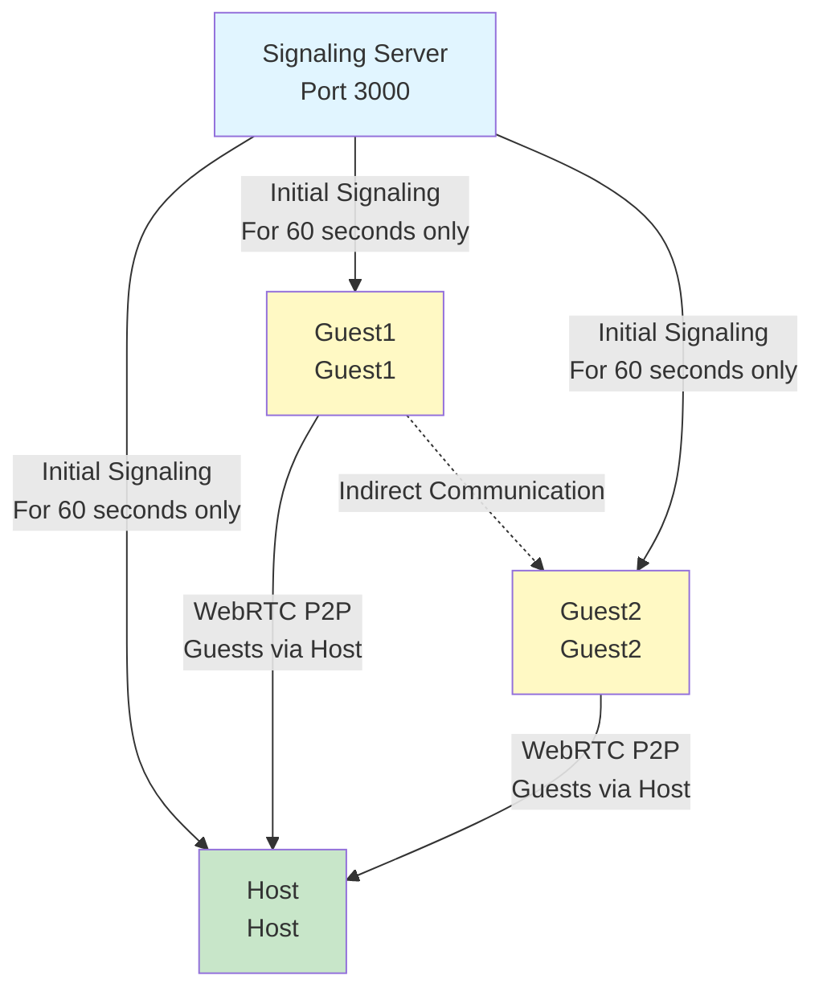
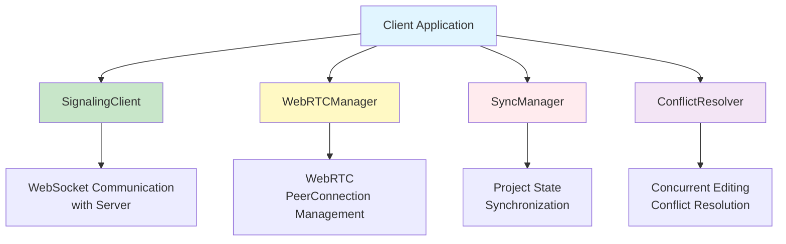

# Architecture

**Document Version**: 1.0  
**Software Version**: 0.1.0  
**Last Updated**: 2026-01-14

---

## Overall Structure (Star Topology)

**Communication Structure:**
- Initial Connection: Signaling through server (for 60 seconds only)
- Subsequent Communication: Star topology P2P (Guest → Host → other guests)
- Server Role: Handles initial signaling only, unnecessary after P2P connection is established

## Component Structure

---

