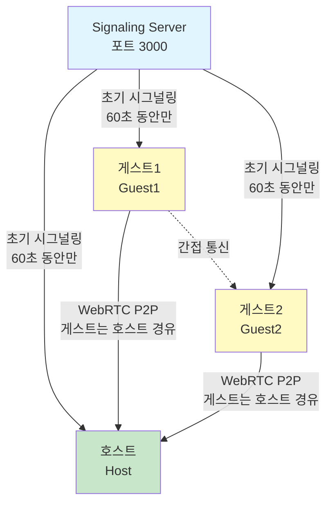
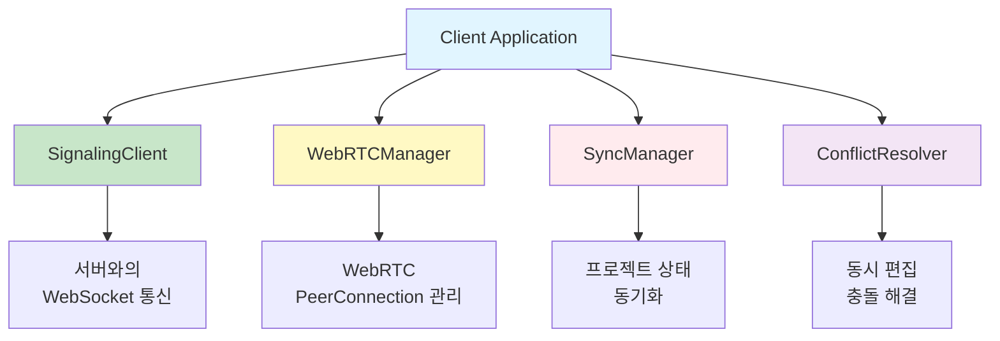

# 아키텍처

**Document Version**: 1.0  
**Software Version**: 0.1.0  
**Last Updated**: 2026-01-14

---

## 전체 구조 (Star 토폴로지)

**통신 구조:**
- 초기 연결: 서버를 통한 시그널링 (60초 동안만)
- 이후 통신: Star 토폴로지 P2P (게스트 → Host → 다른 게스트)
- 서버 역할: 초기 시그널링만 담당, P2P 연결 수립 후 불필요

## 컴포넌트 구조

---
