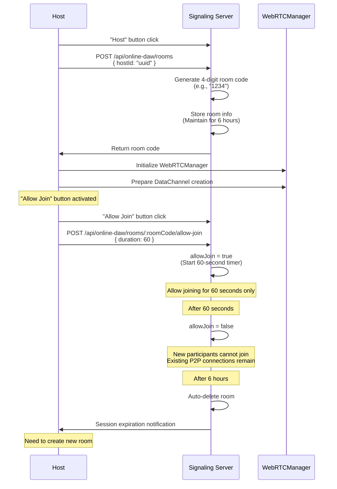
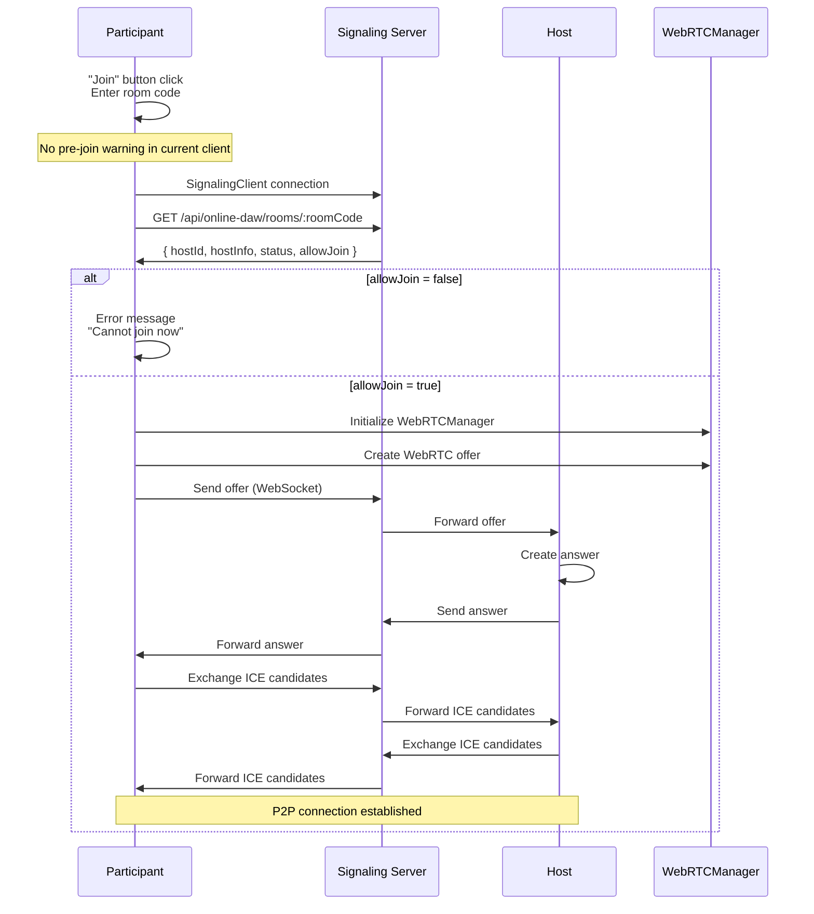

# Connection Flow

**Document Version**: 1.0  
**Software Version**: 0.1.0  
**Last Updated**: 2026-01-14

---

## 1. Host Session Start



**Detailed Steps:**

1. Host clicks "Host" button
   - SignalingClient connects to server
   - Request room registration to server: `POST /api/online-daw/rooms` with `{ hostId: "uuid" }`
   - Server generates and returns available 4-digit room code (e.g., "1234")
   - Server stores room information (maintained for 6 hours)
   - Host receives and displays room code
   - Host initializes WebRTCManager
   - Host prepares DataChannel creation
   - "Allow Join" button activated (disabled by default)

2. Host clicks "Allow Join" button
   - Request join permission to server: `POST /api/online-daw/rooms/:roomCode/allow-join` with `{ duration: 60 }`
   - Server sets room's allowJoin state to true (starts 60-second timer)
   - 60-second countdown begins
   - Participants can join only during this 60 seconds

3. After 60 seconds
   - Server changes room's allowJoin state to false
   - New participants cannot join
   - However, existing P2P connections continue to be maintained (until 6-hour limit)
   - Participants can continue working
   - Host can click "Allow Join" button again anytime to allow joining

4. Host clicks "Allow Join" again (after expiration or before expiration)
   - Request join permission to server (same API)
   - Server sets room's allowJoin state to true (restarts 60-second timer)
   - 60-second countdown restarts
   - New participants can join

5. Room expiration warnings (sent by server)
   - 30 minutes before: "Room will expire in 30 minutes. Please save your work."
   - 5 minutes before: "Room will expire in 5 minutes. Please save your work."
   - 1 minute before: "Room will expire in 1 minute. Please save your work."

6. After 6 hours
   - Server automatically deletes room (resource release)
   - Session expiration notification sent to all participants
   - P2P termination depends on client handling of the server event

**Important Notes:**

1. **If host clicks "Host" button again:**
   - Current client prevents re-hosting while already hosting (must stop hosting first)

2. **Server resource management:**
   - Clicking "Host" creates room on server (maintained for 6 hours)
   - Room code is maintained for 6 hours and can be reused
   - Clicking "Allow Join" allows joining for only 60 seconds
   - After 6 hours, server room expires (P2P termination depends on client handling)
   - Host creates new room when reconnection is needed

3. **Join permission management:**
   - "Allow Join" button allows joining for 60 seconds only
   - After 60 seconds, automatically changes to join-disabled state
   - Host can click "Allow Join" button again anytime to allow joining
   - If host clicks again after expiration, immediately switches to join-allowed state (restarts 60-second timer)

4. **Communication structure:**
   - After room creation: Signaling through server (available for 6 hours)
   - After P2P connection establishment: P2P direct communication (Star topology)

## 2. Participant Session Join



**Detailed Steps:**

1. Participant clicks "Join" button and enters room code
2. No pre-join warning is shown in the current client (join proceeds immediately)
3. SignalingClient connects to server
4. Query host information from server:
   - `GET /api/online-daw/rooms/:roomCode`
   - Response: `{ hostId: "uuid", hostInfo: {...}, status: "active", allowJoin: true/false }`
5. Check join permission:
   - If allowJoin is false, show error message: "Cannot join now. The host must enable 'Allow Join'."
   - If allowJoin is true, proceed
6. Participant initializes WebRTCManager
7. Participant creates WebRTC offer
8. Participant sends offer to host through server:
   - WebSocket: `/api/online-daw/signaling`
   - `{ action: "signaling", type: "offer", from: "clientId", to: "hostId", data: {...} }`
9. Server forwards offer to host (WebSocket)
10. Host creates answer and sends to participant through server
11. Exchange ICE candidates (through server)
12. WebRTC connection establishment completed (Star topology)
13. Guest sends `state-request` when DataChannel opens
14. Host replies with `initial-state` containing the full project state
15. Guest applies the host state (overwrites local state)
15. All subsequent communication switches to P2P (Guest → Host → other guests)
```

**Star Topology Communication:**
- Guest1's changes → Host → Broadcast to Guest2, Guest3
- Guest2's changes → Host → Broadcast to Guest1, Guest3
- All guests connect directly only to Host

## 3. P2P Communication Transition and Server Room Expiration

```
After WebRTC connection establishment:
- Project change and transport sync: Direct transmission via DataChannel (Star topology)

After 60 seconds, join window expires:
- Server changes room's allowJoin state to false
- New participants cannot join
- However, existing P2P connections continue to be maintained (until 6-hour limit)
- Participants can continue working
- Host can click "Allow Join" button again anytime to allow joining
- If host clicks again, immediately switches to join-allowed state (restarts 60-second timer)

Room expiration warnings (sent via WebSocket from server):
- 30 minutes before: "Room will expire in 30 minutes. Please save your work."
- 5 minutes before: "Room will expire in 5 minutes. Please save your work."
- 1 minute before: "Room will expire in 1 minute. Please save your work."

After 6 hours, session expires:
- Server deletes room information (resource release)
- Session expiration notification sent to all participants
- P2P termination depends on client handling of the server event
- Host must create new room to allow new joins
- Work content is stored locally, so no loss
```

## 4. Room Leave Behavior

```
Host leaves room:
- Host clicks "Stop Hosting" or "Leave"
- Request room deletion from server
- Notify all guests of room closure
- Host's project state is maintained (stored locally)
- P2P connection terminates

Guest leaves room:
- Guest clicks "Leave"
- P2P connection terminates
- Host and other guests can continue working
```

**Communication Example:**
```
Guest1 sends a change message
  ↓ (P2P direct)
Host receives and processes
  ↓ (P2P direct)      ↓ (P2P direct)
Broadcast to Guest2    Broadcast to Guest3
```

---

