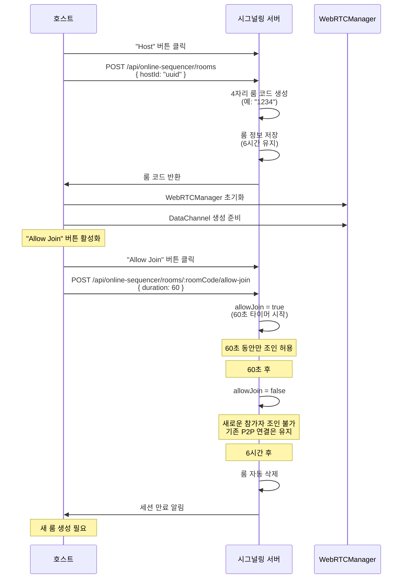
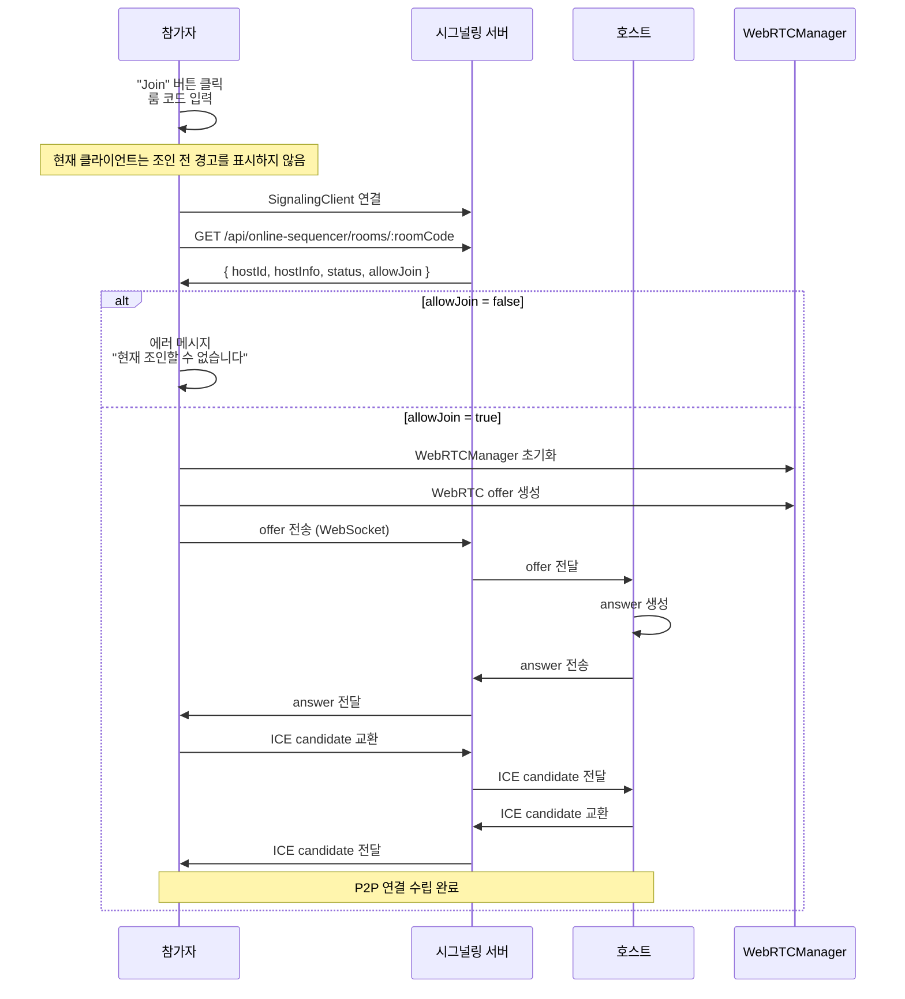

# 연결 플로우

**Document Version**: 1.0  
**Software Version**: 0.1.0  
**Last Updated**: 2026-01-14

---

## 1. 호스트 세션 시작



**상세 단계:**

1. 호스트가 "Host" 버튼 클릭
   - SignalingClient가 서버에 연결
   - 서버에 룸 등록 요청: `POST /api/online-sequencer/rooms` with `{ hostId: "uuid" }`
   - 서버가 비어있는 4자리 룸 코드 생성 및 반환 (예: "1234")
   - 서버가 룸 정보 저장 (6시간 유지)
   - 호스트가 룸 코드 수신 및 표시
   - 호스트가 WebRTCManager 초기화
   - 호스트가 DataChannel 생성 준비
   - "Allow Join" 버튼 활성화 (기본적으로 비활성 상태)

2. 호스트가 "Allow Join" 버튼 클릭
   - 서버에 조인 허용 요청: `POST /api/online-sequencer/rooms/:roomCode/allow-join` with `{ duration: 60 }`
   - 서버가 룸의 allowJoin 상태를 true로 설정 (60초 타이머 시작)
   - 60초 카운트다운 시작
   - 이 60초 동안만 참가자 조인 가능

3. 60초 후
   - 서버가 룸의 allowJoin 상태를 false로 변경
   - 새로운 참가자 조인 불가
   - 하지만 기존 P2P 연결은 계속 유지됨 (6시간 제한 전까지)
   - 참가자들은 계속 작업 가능
   - 호스트는 언제든지 "Allow Join" 버튼을 다시 클릭하여 조인 허용 상태로 만들 수 있음

4. 호스트가 다시 "Allow Join" 클릭 (만료 후 또는 만료 전)
   - 서버에 조인 허용 요청 (동일한 API)
   - 서버가 룸의 allowJoin 상태를 true로 설정 (60초 타이머 재시작)
   - 60초 카운트다운 재시작
   - 새로운 참가자 조인 가능

5. 룸 만료 경고 (서버에서 전송)
   - 30분 전: "Room will expire in 30 minutes. Please save your work."
   - 5분 전: "Room will expire in 5 minutes. Please save your work."
   - 1분 전: "Room will expire in 1 minute. Please save your work."

6. 6시간 후
   - 서버에서 룸 자동 삭제 (리소스 해제)
   - 모든 참가자에게 세션 만료 알림
   - P2P 종료는 클라이언트의 만료 이벤트 처리에 따라 다름
   - 호스트가 새 룸을 생성해야 재조인 가능

**중요 사항:**

1. **호스트가 다시 "Host" 버튼을 누르면:**
   - 현재 클라이언트는 호스팅 중 재호스팅을 허용하지 않음 (먼저 종료 필요)

2. **서버 리소스 관리:**
   - "Host" 클릭 시 서버에 룸 생성 (6시간 유지)
   - 룸 코드는 6시간 동안 유지되어 재사용 가능
   - "Allow Join" 클릭 시 60초 동안만 조인 허용
   - 6시간 후 서버 룸 만료 (P2P 종료는 클라이언트 처리에 따라 다름)
   - 재연결/재조인 필요 시 호스트가 새 룸 생성

3. **조인 허용 관리:**
   - "Allow Join" 버튼으로 60초 동안만 조인 허용
   - 60초 후 자동으로 조인 불가 상태로 변경
   - 호스트는 언제든지 "Allow Join" 버튼을 다시 클릭하여 조인 허용 상태로 만들 수 있음
   - 만료 후에도 호스트가 다시 클릭하면 즉시 조인 허용 상태로 전환 (60초 타이머 재시작)

4. **통신 구조:**
   - 룸 생성 후: 서버를 통한 시그널링 (6시간 동안 가능)
   - P2P 연결 수립 후: P2P 직접 통신 (Star 토폴로지)

### 2. 참가자 세션 참여



**상세 단계:**

1. 참가자가 "Join" 버튼 클릭 및 룸 코드 입력
2. 현재 클라이언트는 조인 전 경고 없이 바로 진행
3. SignalingClient가 서버에 연결
4. 서버에서 호스트 정보 조회:
   - `GET /api/online-sequencer/rooms/:roomCode`
   - 응답: `{ hostId: "uuid", hostInfo: {...}, status: "active", allowJoin: true/false }`
5. 조인 허용 여부 확인:
   - allowJoin이 false이면 에러 메시지 표시: "현재 조인할 수 없습니다. 호스트가 'Allow Join'을 활성화해야 합니다."
   - allowJoin이 true이면 계속 진행
6. 참가자가 WebRTCManager 초기화
7. 참가자가 WebRTC offer 생성
8. 참가자가 서버를 통해 호스트에게 offer 전송:
   - WebSocket: `/api/online-sequencer/signaling`
   - `{ action: "signaling", type: "offer", from: "clientId", to: "hostId", data: {...} }`
9. 서버가 호스트에게 offer 전달 (WebSocket)
10. 호스트가 answer 생성 및 서버를 통해 참가자에게 전송
11. ICE candidate 교환 (서버를 통해)
11. WebRTC 연결 수립 완료 (Star 토폴로지)
12. 게스트가 DataChannel 오픈 시 `state-request` 전송
13. 호스트가 `initial-state`로 프로젝트 전체 상태 전송
14. 참가자가 호스트의 프로젝트 상태를 수신 및 적용 (기존 상태 덮어쓰기)
15. 이후 모든 통신은 P2P로 전환 (게스트 → Host → 다른 게스트)
```

**Star 토폴로지 통신:**
- 게스트1의 변경사항 → Host → 게스트2, 게스트3에게 브로드캐스트
- 게스트2의 변경사항 → Host → 게스트1, 게스트3에게 브로드캐스트
- 모든 게스트는 Host와만 직접 연결

## 3. P2P 통신 전환 및 서버 룸 만료

```
WebRTC 연결 수립 후:
- 프로젝트 변경/재생 동기화: DataChannel을 통한 직접 전송 (Star 토폴로지)

60초 후 조인 허용 만료:
- 서버에서 룸의 allowJoin 상태를 false로 변경
- 새로운 참가자 조인 불가
- 하지만 기존 P2P 연결은 계속 유지 (6시간 제한 전까지)
- 참가자들은 계속 작업 가능
- 호스트는 언제든지 "Allow Join" 버튼을 다시 클릭하여 조인 허용 상태로 만들 수 있음
- 호스트가 다시 클릭하면 즉시 조인 허용 상태로 전환 (60초 타이머 재시작)

룸 만료 경고 (서버에서 WebSocket으로 전송):
- 30분 전: "Room will expire in 30 minutes. Please save your work."
- 5분 전: "Room will expire in 5 minutes. Please save your work."
- 1분 전: "Room will expire in 1 minute. Please save your work."

6시간 후 세션 만료:
- 서버에서 룸 정보 삭제 (리소스 해제)
- 모든 참가자에게 세션 만료 알림
- P2P 종료는 클라이언트 처리에 따라 다름
- 호스트가 새 룸을 생성해야 신규 조인 가능
- 작업 내용은 로컬에 저장되어 있으므로 손실 없음
```

## 4. 룸 나가기 동작

```
호스트가 룸에서 나가기:
- 호스트가 "Stop Hosting" 또는 "Leave" 클릭
- 서버에서 룸 삭제 요청
- 모든 게스트에게 룸 종료 알림
- 호스트의 프로젝트 상태는 유지됨 (로컬에 저장)
- P2P 연결 종료

게스트가 룸에서 나가기:
- 게스트가 "Leave" 클릭
- P2P 연결 종료
- 호스트와 다른 게스트들은 계속 작업 가능
```

**통신 예시:**
```
게스트1이 변경 메시지 전송
  ↓ (P2P 직접)
호스트가 수신 및 처리
  ↓ (P2P 직접)      ↓ (P2P 직접)
게스트2에게 브로드캐스트    게스트3에게 브로드캐스트
```

---

