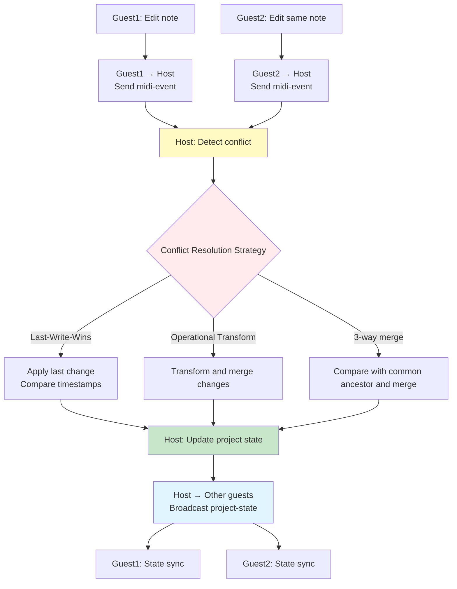

# Error Handling

**Document Version**: 1.0  
**Software Version**: 0.1.0  
**Last Updated**: 2026-01-14

---

## 1. Network Connection Failure

### Scenarios
- Cannot connect to server
- WebSocket connection lost
- P2P connection failure

### Handling

```typescript
// Server connection failure
try {
  await signalingClient.connect();
} catch (error) {
  // Retry logic (exponential backoff)
  let retryCount = 0;
  const maxRetries = 5;
  const baseDelay = 1000; // 1 second
  
  while (retryCount < maxRetries) {
    await sleep(baseDelay * Math.pow(2, retryCount));
    try {
      await signalingClient.connect();
      break;
    } catch (e) {
      retryCount++;
      if (retryCount >= maxRetries) {
        showError("Cannot connect to server. Please check your network connection.");
      }
    }
  }
}

// WebSocket reconnection
signalingClient.on('disconnect', () => {
  // Automatic reconnection attempt
  setTimeout(() => {
    signalingClient.reconnect();
  }, 1000);
});

// P2P connection failure
webRTCManager.onConnectionStateChange((state) => {
  if (state === 'failed' || state === 'disconnected') {
    // Attempt reconnection through server
    attemptReconnection();
  }
});
```

## 2. Room Code Duplication

### Scenarios
- Generated room code already exists
- Room code to join does not exist

### Handling

```typescript
// Room code duplication
async function registerRoomWithRetry(): Promise<string> {
  let attempts = 0;
  const maxAttempts = 10;
  
  while (attempts < maxAttempts) {
    const roomCode = generateRoomCode();
    try {
      await signalingClient.registerRoom(roomCode);
      return roomCode;
    } catch (error) {
      if (error.code === 'ROOM_EXISTS') {
        attempts++;
        continue;
      }
      throw error;
    }
  }
  
  throw new Error("Failed to create room. Please try again.");
}

// Room code does not exist
async function joinRoom(roomCode: string) {
  // Check warning before joining
  const syncManager = new GuestSyncManager(webRTCManager);
  const confirmed = await syncManager.checkBeforeJoin();
  
  if (!confirmed) {
    // User cancelled
    return;
  }
  
  try {
    const roomInfo = await signalingClient.getRoom(roomCode);
    if (!roomInfo) {
      showError("Room code does not exist.");
      return;
    }
    if (roomInfo.status === 'full') {
      showError("Room is full.");
      return;
    }
    // Join logic
    // After P2P connection is established, receive host's initial state
  } catch (error) {
    if (error.status === 404) {
      showError("Room code does not exist.");
    } else {
      showError("Failed to join room.");
    }
  }
}
```

## 3. Host Connection Lost

### Scenarios
- Host network connection lost
- Host app terminated
- Host session ended

### Handling

```typescript
// Host connection lost detection
webRTCManager.onConnectionStateChange((state) => {
  if (state === 'disconnected' || state === 'failed') {
    // Wait for host reconnection
    showNotification("Host connection lost. Waiting for reconnection...");
    
    // Check host status through server
    const checkHostStatus = setInterval(async () => {
      const roomInfo = await signalingClient.getRoom(roomCode);
      if (roomInfo && roomInfo.status === 'active') {
        // Host is back online, attempt reconnection
        clearInterval(checkHostStatus);
        attemptReconnection();
      }
    }, 3000);
    
    // Timeout after 30 seconds
    setTimeout(() => {
      clearInterval(checkHostStatus);
      showError("Cannot restore connection to host.");
      leaveSession();
    }, 30000);
  }
});

// Host ended session
signalingClient.on('room-closed', () => {
  showNotification("Host has ended the session.");
  cleanup();
  returnToIdle();
});
```

## 4. Participant Disconnection and Kicking

### Scenarios
- Participant network connection lost
- Participant app terminated
- Host kicked participant

### Handling

```typescript
// Participant disconnection detection (Host side)
const participants = new Map<string, Participant>();

webRTCManager.onParticipantDisconnected((participantId) => {
  const participant = participants.get(participantId);
  if (participant) {
    showNotification(`${participant.name} has disconnected.`);
    participants.delete(participantId);
    updateParticipantsList();
  }
});

// Host kicks participant
async function kickParticipant(participantId: string) {
  const confirmed = await showConfirmDialog({
    title: 'Kick Participant',
    message: `Do you want to kick ${participant.name}?`,
    confirmText: 'Kick',
    cancelText: 'Cancel'
  });
  
  if (confirmed) {
    // Terminate P2P connection
    webRTCManager.removeGuest(participantId);
    // Notify server of kick (applies only to current room instance)
    await signalingClient.kickParticipant(roomCode, participantId);
    // Remove from participant list
    participants.delete(participantId);
    updateParticipantsList();
    showNotification(`${participant.name} has been kicked.`);
  }
}

**Important:**
- Kick applies only to the current room instance
- Kicked participant can join when a new room is created with the same room code
- Server manages kick list per room instance

// Kicked participant side handling
let kickedFromRoomCode: string | null = null;  // Room code kicked from
let lastKickedAt: number = 0;  // Creation time of kicked room

signalingClient.on('kicked', (data: { roomCode: string, roomCreatedAt: number }) => {
  kickedFromRoomCode = data.roomCode;  // Store current room code
  lastKickedAt = data.roomCreatedAt;  // Store room creation time
  showError("You have been kicked by the host.");
  // Terminate P2P connection
  webRTCManager.disconnect();
  // End session
  leaveSession();
});

// Check kick status when attempting to rejoin
async function joinRoom(roomCode: string) {
  // When attempting to rejoin with the same room code
  if (kickedFromRoomCode === roomCode) {
    // Check current room instance from server
    const roomInfo = await signalingClient.getRoom(roomCode);
    
    // If room is newly created or different instance
    // (Determined by room creation time from server)
    if (roomInfo.createdAt > lastKickedAt) {
      // New room instance, can join
      kickedFromRoomCode = null;  // Clear kick status
      lastKickedAt = 0;
      // Proceed with join
    } else {
      // Same room instance, reject
      showError("You have been kicked from this room. You can join again when the host creates a new room.");
      return;
    }
  }
  
  // Normal join logic
  // ...
}

// Automatic reconnection attempt (Participant side) - Exclude if kicked
webRTCManager.onConnectionStateChange((state) => {
  if (state === 'disconnected' && !kickedFromRoomCode) {
    // Automatic reconnection attempt
    attemptReconnection();
  }
});
```

## 5. NAT/Firewall Issues

### Scenarios
- Failed to obtain public IP with STUN server
- TURN server needed (symmetric NAT)

### Handling

```typescript
// ICE server configuration
const iceServers: RTCConfiguration = {
  iceServers: [
    // STUN servers (free)
    { urls: 'stun:stun.l.google.com:19302' },
    { urls: 'stun:stun1.l.google.com:19302' },
    
    // TURN server (if needed, paid service or self-hosted)
    {
      urls: 'turn:turnserver.example.com:3478',
      username: 'user',
      credential: 'password'
    }
  ],
  iceCandidatePoolSize: 10
};

// ICE connection failure handling
webRTCManager.onIceConnectionStateChange((state) => {
  if (state === 'failed') {
    // Retry with TURN server
    if (!usingTURN) {
      usingTURN = true;
      webRTCManager.reinitializeWithTURN();
    } else {
      showError("Network connection failed. Please check your firewall settings.");
    }
  }
});
```

## 6. Concurrent Editing Conflicts



### Scenarios
- Multiple users editing the same part simultaneously
- Project state version conflicts

### Handling

```typescript
// Conflict resolution strategies
class ConflictResolver {
  // Last-Write-Wins (LWW) strategy
  resolveLWW(localChange: Change, remoteChange: Change): Change {
    if (remoteChange.timestamp > localChange.timestamp) {
      return remoteChange;
    }
    return localChange;
  }
  
  // Operational Transform (OT) strategy
  resolveOT(localChange: Change, remoteChange: Change): Change {
    // Transform and merge changes
    return transform(localChange, remoteChange);
  }
  
  // 3-way merge strategy
  resolve3Way(base: State, local: State, remote: State): State {
    // Compare with common ancestor and merge
    return merge(base, local, remote);
  }
}

// Concurrent editing detection
syncManager.onConflict((conflict) => {
  // Notify user of conflict
  showConflictDialog({
    localChange: conflict.local,
    remoteChange: conflict.remote,
    onResolve: (strategy) => {
      const resolved = conflictResolver.resolve(conflict, strategy);
      syncManager.applyResolvedChange(resolved);
    }
  });
});
```

## 7. Data Loss/Order Issues

### Scenarios
- DataChannel message order guarantee failure
- Message loss

### Handling

```typescript
// DataChannel configuration (order guarantee)
const dataChannel = peerConnection.createDataChannel('sync', {
  ordered: true,        // Order guarantee
  maxRetransmits: 3,    // Retransmission count
  maxPacketLifeTime: 5000  // Packet lifetime (ms)
});

// Add message sequence number
interface SequencedMessage extends P2PMessage {
  sequence: number;
  timestamp: number;
}

// Sequence number management
class MessageSequencer {
  private sendSequence = 0;
  private receiveSequence = 0;
  private buffer: Map<number, SequencedMessage> = new Map();
  
  send(message: P2PMessage): SequencedMessage {
    const sequenced: SequencedMessage = {
      ...message,
      sequence: this.sendSequence++,
      timestamp: Date.now()
    };
    return sequenced;
  }
  
  receive(sequenced: SequencedMessage, callback: (message: P2PMessage) => void) {
    // Process in order
    if (sequenced.sequence === this.receiveSequence) {
      callback(sequenced);
      this.receiveSequence++;
      // Check next message from buffer
      this.processBuffered();
    } else {
      // If order doesn't match, store in buffer
      this.buffer.set(sequenced.sequence, sequenced);
    }
  }
  
  private processBuffered() {
    while (this.buffer.has(this.receiveSequence)) {
      const message = this.buffer.get(this.receiveSequence)!;
      this.buffer.delete(this.receiveSequence);
      // Processing logic
      this.receiveSequence++;
    }
  }
}
```

## 8. Server Overload

### Scenarios
- Excessive concurrent connections
- Insufficient server resources

### Handling

```typescript
// Server-side implementation needed (handled in server project)
// Client-side response:

// Connection queue management
class ConnectionQueue {
  private queue: Array<() => Promise<void>> = [];
  private processing = false;
  
  async enqueue(connectionFn: () => Promise<void>) {
    this.queue.push(connectionFn);
    if (!this.processing) {
      this.processQueue();
    }
  }
  
  private async processQueue() {
    this.processing = true;
    while (this.queue.length > 0) {
      const fn = this.queue.shift()!;
      try {
        await fn();
        await sleep(100); // Interval between requests
      } catch (error) {
        if (error.status === 503) {
          // Server overload, retry
          this.queue.unshift(fn);
          await sleep(5000);
        }
      }
    }
    this.processing = false;
  }
}

// Request limiting
const rateLimiter = {
  requests: 0,
  windowStart: Date.now(),
  maxRequests: 10,
  windowMs: 1000,
  
  async check() {
    const now = Date.now();
    if (now - this.windowStart > this.windowMs) {
      this.requests = 0;
      this.windowStart = now;
    }
    
    if (this.requests >= this.maxRequests) {
      await sleep(this.windowMs - (now - this.windowStart));
      return this.check();
    }
    
    this.requests++;
  }
};
```

## 8-1. Spot Instance Server Termination

### Scenarios
- Spot instance suddenly terminated (AWS Spot instance termination)
- WebSocket connection suddenly lost
- All server room information lost
- P2P connection remains but new participants cannot join

### Handling Strategy

**1. Server-side Strategy (implemented in server project)**

```typescript
// State restoration strategy on server restart
// Option 1: Use persistent storage (recommended)
// - Store room information in Redis, DynamoDB, or file system
// - Restore on server restart

interface RoomStorage {
  // Save room information to persistent storage
  async saveRoom(room: Room): Promise<void>;
  
  // Restore room information on server restart
  async restoreRooms(): Promise<Room[]>;
  
  // Check room expiration and cleanup
  async cleanupExpiredRooms(): Promise<void>;
}

// Option 2: Start without state (simple but room information loss)
// - Initialize all room information on server restart
// - Existing participants can continue working via P2P
// - Only new participants cannot join
```

**2. Client-side Strategy**

```typescript
class SignalingClient {
  private ws: WebSocket | null = null;
  private reconnectAttempts = 0;
  private maxReconnectAttempts = 10;
  private reconnectDelay = 1000; // Start from 1 second
  private isReconnecting = false;
  private roomCode: string | null = null;
  private hostId: string | null = null;
  
  // Detect WebSocket disconnection
  private setupWebSocketHandlers(): void {
    if (!this.ws) return;
    
    this.ws.onclose = (event) => {
      console.log('WebSocket closed', event.code, event.reason);
      
      // If not normal closure (server termination)
      if (event.code !== 1000) {
        this.handleUnexpectedDisconnect();
      }
    };
    
    this.ws.onerror = (error) => {
      console.error('WebSocket error', error);
      this.handleUnexpectedDisconnect();
    };
  }
  
  // Handle unexpected disconnection
  private handleUnexpectedDisconnect(): void {
    if (this.isReconnecting) {
      return; // Already attempting reconnection
    }
    
    this.isReconnecting = true;
    this.attemptReconnection();
  }
  
  // Attempt reconnection (exponential backoff)
  private async attemptReconnection(): Promise<void> {
    while (this.reconnectAttempts < this.maxReconnectAttempts) {
      await sleep(this.reconnectDelay);
      
      try {
        await this.connect();
        
        // Reconnection successful
        if (this.ws?.readyState === WebSocket.OPEN) {
          this.reconnectAttempts = 0;
          this.reconnectDelay = 1000;
          this.isReconnecting = false;
          
          // Attempt to restore room state
          await this.restoreRoomState();
          
          showNotification("Server connection restored.");
          return;
        }
      } catch (error) {
        console.error('Reconnection attempt failed', error);
      }
      
      // Increase retry count and delay
      this.reconnectAttempts++;
      this.reconnectDelay = Math.min(
        this.reconnectDelay * 2, // Exponential backoff
        30000 // Maximum 30 seconds
      );
    }
    
    // Maximum retry attempts exceeded
    this.isReconnecting = false;
    this.handleReconnectionFailure();
  }
  
  // Attempt to restore room state
  private async restoreRoomState(): Promise<void> {
    if (!this.roomCode || !this.hostId) {
      return; // No state to restore
    }
    
    try {
      // Check room information from server
      const roomInfo = await this.getRoom(this.roomCode);
      
      if (roomInfo && roomInfo.hostId === this.hostId) {
        // Room information restored
        showNotification("Room state restored.");
      } else {
        // Room information missing (lost due to server restart)
        this.handleRoomStateLoss();
      }
    } catch (error) {
      // Server not fully recovered yet
      console.warn('Room state restoration failed', error);
    }
  }
  
  // Handle room state loss
  private handleRoomStateLoss(): void {
    if (this.isHost) {
      // Host: Suggest creating new room
      showWarning("Server was restarted. Your room information was lost. P2P connection is still active, but new participants cannot join. Would you like to create a new room?");
      
      // Provide option to create new room to user
      // (Optional: automatically create new room)
    } else {
      // Guest: Request host to create new room
      showWarning("Server was restarted. Room information was lost. P2P connection is still active. Please ask the host to create a new room if you want to allow new participants.");
    }
  }
  
  // Handle reconnection failure
  private handleReconnectionFailure(): void {
    showError("Cannot reconnect to server. P2P connection is still active, but new participants cannot join. Please check your network connection.");
    
    // Check P2P connection status
    if (this.webRTCManager?.isConnected()) {
      showNotification("You can continue working via P2P connection. Server reconnection will be retried in the background.");
      
      // Continue background reconnection attempts
      setTimeout(() => {
        this.reconnectAttempts = 0;
        this.attemptReconnection();
      }, 60000); // Retry after 1 minute
    }
  }
}

// P2P connection status monitoring
class WebRTCManager {
  private connectionState: 'connected' | 'disconnected' | 'failed' = 'disconnected';
  
  onConnectionStateChange(callback: (state: string) => void): void {
    this.peerConnection?.addEventListener('connectionstatechange', () => {
      const state = this.peerConnection?.connectionState;
      this.connectionState = state as any;
      callback(state || 'disconnected');
      
      // If P2P connection is maintained, can continue working even if server reconnection fails
      if (state === 'connected') {
        console.log('P2P connection is active, server reconnection is optional');
      }
    });
  }
  
  isConnected(): boolean {
    return this.connectionState === 'connected';
  }
}
```

**3. User Experience Improvement**

```typescript
// User guidance on server termination
function handleServerDisconnect() {
  // Immediate notification
  showWarning("Server connection lost. Attempting to reconnect...");
  
  // Check P2P connection status
  if (webRTCManager.isConnected()) {
    showNotification("P2P connection is still active. You can continue working.");
  }
  
  // Show reconnection progress
  const reconnectStatus = {
    attempts: 0,
    maxAttempts: 10,
    updateUI: () => {
      showReconnectDialog({
        message: `Reconnecting to server... (${reconnectStatus.attempts}/${reconnectStatus.maxAttempts})`,
        canCancel: true
      });
    }
  };
}
```

**4. Automatic Restoration After Server Recovery**

```typescript
// Automatically attempt room state restoration when server recovers
class SignalingClient {
  // Periodically check server status (when P2P is connected)
  private startServerHealthCheck(): void {
    if (!this.webRTCManager?.isConnected()) {
      return; // Unnecessary if no P2P connection
    }
    
    setInterval(async () => {
      if (this.ws?.readyState === WebSocket.OPEN) {
        return; // Already connected
      }
      
      try {
        // Check if server has recovered
        const response = await fetch(`${this.serverUrl}/health`);
        if (response.ok) {
          // Server recovered, attempt reconnection
          await this.attemptReconnection();
        }
      } catch (error) {
        // Server not yet recovered
        console.log('Server not yet recovered');
      }
    }, 30000); // Check every 30 seconds
  }
}
```

**5. Room Information Persistent Storage (Server-side)**

```typescript
// Server-side: Store room information in persistent storage
// Example: Redis, DynamoDB, or file system

interface RoomPersistence {
  // Save on room creation
  async saveRoom(room: Room): Promise<void> {
    await redis.setex(
      `room:${room.roomCode}`,
      room.expiresAt - Date.now(),
      JSON.stringify(room)
    );
  }
  
  // Restore on server restart
  async restoreRooms(): Promise<Room[]> {
    const keys = await redis.keys('room:*');
    const rooms: Room[] = [];
    
    for (const key of keys) {
      const data = await redis.get(key);
      if (data) {
        rooms.push(JSON.parse(data));
      }
    }
    
    return rooms;
  }
  
  // Check room expiration
  async cleanupExpiredRooms(): Promise<void> {
    // Rooms with expired TTL are automatically deleted (Redis)
  }
}
```

**6. Strategy Summary**

| Situation | P2P Connection | Server Connection | Response |
|-----------|---------------|------------------|----------|
| Before server termination | Active | Active | Normal operation |
| Immediately after server termination | Active | Lost | Continue working via P2P, attempt reconnection |
| After server recovery (room info exists) | Active | Recovered | Restore room state, new participants can join |
| After server recovery (room info missing) | Active | Recovered | Host needs to create new room |
| Server recovery failed | Active | Failed | Continue working via P2P, background retry |

**7. Implementation Priority**

1. **Immediate Implementation (Required)**
   - WebSocket reconnection logic (exponential backoff)
   - P2P connection status check
   - User guidance messages

2. **Short-term Implementation (Recommended)**
   - Periodic server status check
   - Room state restoration attempt
   - Automatic reconnection UI

3. **Long-term Implementation (Optional)**
   - Server-side persistent storage (Redis/DynamoDB)
   - Automatic room information restoration
   - Server recovery notification

## 9. Join Permission Expiration and Server Room Expiration

### Scenario 1: Join Permission Expiration (After 60 Seconds)
- 60 seconds elapsed after "Allow Join" click
- Server changes room's allowJoin state to false
- New participants cannot join
- However, existing P2P connections continue to be maintained (until 6-hour limit)

### Handling

```typescript
// Join permission expiration notification (sent by server)
signalingClient.on('allow-join-expired', () => {
  if (isHost) {
    showNotification("Join window has expired. New participants cannot join.");
    // "Allow Join" button is always active (host can click anytime)
    // Button state change unnecessary - host can reactivate anytime
  }
});

// When participant attempts to join
async function joinRoom(roomCode: string) {
  const roomInfo = await signalingClient.getRoom(roomCode);
  if (!roomInfo.allowJoin) {
    showError("Cannot join now. The host must enable 'Allow Join' first.");
    return;
  }
  // Proceed with join
}
```

### Scenario 2: Session Expiration Warning and Expiration (After 6 Hours)
- 6 hours elapsed after room creation
- Server sends warning messages 30 minutes, 5 minutes, and 1 minute before
- Server deletes room information
- P2P connections also automatically terminate (resource saving)

### Handling

```typescript
// Session expiration warning notification (sent via WebSocket from server)
signalingClient.on('room-expiring', (data: { minutesLeft: number }) => {
  const { minutesLeft } = data;
  
  if (minutesLeft === 30) {
    showWarning("Room session will expire in 30 minutes. Please save your work.");
  } else if (minutesLeft === 5) {
    showWarning("Room session will expire in 5 minutes. Please save your work.");
  } else if (minutesLeft === 1) {
    showWarning("Room session will expire in 1 minute. Please save your work.");
  }
});

// Session expiration notification (sent by server)
signalingClient.on('room-session-expired', () => {
  // Both server room and P2P connections terminate
  showWarning("Room session has expired after 6 hours. Connection will be closed.");
  
  // Terminate P2P connection
  webRTCManager.disconnect();
  
  // Session termination handling
  if (isHost) {
    showNotification("Session expired. Please create a new room to continue.");
    setMode('idle');
  } else {
    showNotification("Session expired. Please ask the host to create a new room.");
    setMode('idle');
  }
  
  // Project state is stored locally, so no loss
  // Can reconnect when host creates new room
});

// Host side: Automatic session termination after 6 hours
// Handled automatically by server
if (isHost) {
  // Set 6-hour warning timers
  const sessionDuration = 6 * 60 * 60 * 1000; // 6 hours
  setTimeout(() => {
    showWarning("Room session will expire soon. Please save your work.");
  }, sessionDuration - 30 * 60 * 1000); // 30 minutes before
  
  setTimeout(() => {
    showWarning("Room session will expire in 5 minutes.");
  }, sessionDuration - 5 * 60 * 1000); // 5 minutes before
  
  setTimeout(() => {
    showWarning("Room session will expire in 1 minute.");
  }, sessionDuration - 60 * 1000); // 1 minute before
}
```

## 10. Room Leave Behavior

### Scenarios
- Host leaves room
- Guest leaves room

### Handling

```typescript
// Host leaves room
async function handleHostLeave() {
  const confirmed = await showConfirmDialog({
    title: 'Stop Hosting',
    message: 'Stopping hosting will disconnect all participants. Do you want to continue?',
    confirmText: 'Stop',
    cancelText: 'Cancel'
  });
  
  if (confirmed) {
    // Delete room from server
    await signalingClient.deleteRoom(roomCode);
    
    // Notify all guests of room closure
    webRTCManager.broadcastToAll({
      type: 'room-closed',
      message: 'Host has closed the room.'
    });
    
    // Terminate P2P connection
    webRTCManager.disconnect();
    
    // Host's project state is maintained (stored locally)
    // No additional save logic needed (already local state)
    
    // Change UI state
    setMode('idle');
    showNotification("Hosting has been stopped.");
  }
}

// Guest leaves room
async function handleGuestLeave() {
  const confirmed = await showConfirmDialog({
    title: 'Leave Session',
    message: 'Leaving the session will restore your project to its initial state. Do you want to continue?',
    confirmText: 'Leave',
    cancelText: 'Cancel'
  });
  
  if (confirmed) {
    // Terminate P2P connection
    webRTCManager.disconnect();
    
    // Restore guest's project state to initial state
    // Initial state: Empty project (only 1 track, BPM 120, 4/4)
    const initialProject = createInitialProject();
    setProject(initialProject);
    notifyProjectChange({ type: 'project-reset' });
    
    // Change UI state
    setMode('idle');
    showNotification("You have left the session. Project has been restored to initial state.");
  }
}

// Host room closure notification received (Guest side)
webRTCManager.onMessageFromHost((message) => {
  if (message.type === 'room-closed') {
    showError("Host has closed the room.");
    // Restore project state to initial state
    const initialProject = createInitialProject();
    setProject(initialProject);
    notifyProjectChange({ type: 'project-reset' });
    // Terminate P2P connection
    webRTCManager.disconnect();
    // Change UI state
    setMode('idle');
  }
});

// Initial project creation function
function createInitialProject(): Project {
  return {
    version: 2,
    timing: createSimpleTiming(120, [4, 4]),
    tracks: [
      {
        id: 'track-1',
        name: 'Track 1',
        instrument: 'piano',
        volume: 100 / 120,
        pan: 0.0,
        effects: [],
        solo: false,
        mute: false,
        mutedBySolo: false,
      },
    ],
    midiParts: [],
    masterVolume: 100 / 120,
    masterPan: 0.0,
    masterEffects: [],
  };
}
```

## 11. Browser/Platform Compatibility

### Scenarios
- Browser without WebRTC support
- Differences in Electron environment

### Handling

```typescript
// Check WebRTC support
function checkWebRTCSupport(): boolean {
  return !!(
    window.RTCPeerConnection &&
    window.RTCDataChannel &&
    navigator.mediaDevices?.getUserMedia
  );
}

if (!checkWebRTCSupport()) {
  showError("This browser does not support WebRTC.");
  return;
}

// Electron environment handling
const isElectron = window.electron !== undefined;

if (isElectron) {
  // Electron-specific settings
  // Example: nodeIntegration, contextIsolation, etc.
}
```

## 12. Software Conflicts During P2P Communication

### 12.1 Concurrent Editing Conflict (Same Resource)

**Scenario:**
- Guest1 and Guest2 simultaneously modify the same MIDI note
- Host receives both changes
- Need to decide which change to apply

**Handling:**

```typescript
// Host-side conflict detection
class HostSyncManager {
  private pendingChanges = new Map<string, Change[]>();
  
  onGuestChange(guestId: string, change: RemoteChange) {
    const key = `${change.partId}-${change.noteId}`;
    const existing = this.pendingChanges.get(key);
    
    if (existing && existing.length > 0) {
      // Conflict detected
      const conflict = {
        local: existing[0],
        remote: change,
        timestamp: Date.now()
      };
      
      // Apply conflict resolution strategy
      const resolved = this.resolveConflict(conflict);
      this.pendingChanges.delete(key);
      
      // Broadcast resolved change to all guests
      this.broadcastResolvedChange(resolved);
    } else {
      // No conflict, apply immediately
      this.pendingChanges.set(key, [change]);
      this.applyChange(change);
    }
  }
  
  resolveConflict(conflict: Conflict): Change {
    // Last-Write-Wins (most recent timestamp)
    if (conflict.remote.timestamp > conflict.local.timestamp) {
      return conflict.remote;
    }
    return conflict.local;
  }
}
```

### 12.2 Project State Version Conflict

**Scenario:**
- Host and guest have different project versions
- Host is v5, guest sends change from v3
- Synchronization fails due to version mismatch

**Handling:**

```typescript
interface ProjectStateMessage {
  type: 'project-state';
  version: number;  // Version number
  state: ProjectState;
  baseVersion: number;  // Base version
}

// Version conflict detection
class SyncManager {
  private localVersion = 0;
  
  onRemoteState(message: ProjectStateMessage) {
    if (message.baseVersion !== this.localVersion) {
      // Version conflict
      this.handleVersionConflict(message);
    } else {
      // Version match, apply normally
      this.applyState(message.state);
      this.localVersion = message.version;
    }
  }
  
  handleVersionConflict(message: ProjectStateMessage) {
    // Request full project state re-synchronization
    this.requestFullStateSync();
  }
}
```

### 12.3 Message Order Issue

**Scenario:**
- Guest1: Add note → Delete note (sent in order)
- Delete message arrives first due to network delay
- Host processes delete first → Attempts to add when note doesn't exist

**Handling:**

```typescript
// Order messages by sequence number
class MessageSequencer {
  private receiveBuffer = new Map<number, SequencedMessage>();
  private expectedSequence = 0;
  
  receive(sequenced: SequencedMessage, handler: (msg: P2PMessage) => void) {
    if (sequenced.sequence === this.expectedSequence) {
      // Order matches, process immediately
      handler(sequenced);
      this.expectedSequence++;
      this.processBuffered();
    } else if (sequenced.sequence > this.expectedSequence) {
      // Message ahead of expected, store in buffer
      this.receiveBuffer.set(sequenced.sequence, sequenced);
    }
    // Messages behind expected are ignored (already processed)
  }
  
  private processBuffered() {
    while (this.receiveBuffer.has(this.expectedSequence)) {
      const msg = this.receiveBuffer.get(this.expectedSequence)!;
      this.receiveBuffer.delete(this.expectedSequence);
      handler(msg);
      this.expectedSequence++;
    }
  }
}
```

### 12.4 Resource Delete/Modify Conflict

**Scenario:**
- Guest1: Modifying Part A
- Guest2: Deleting Part A
- Host receives both messages
- Attempts to apply modify message to deleted part

**Handling:**

```typescript
class ConflictResolver {
  resolveDeleteModifyConflict(
    deleteChange: Change,
    modifyChange: Change
  ): Change | null {
    // Check if delete was processed first
    if (deleteChange.timestamp < modifyChange.timestamp) {
      // Delete first, ignore modify
      return null; // Ignore modify
    } else {
      // Modify first, apply delete
      return deleteChange;
    }
  }
  
  // Resource existence validation
  validateChange(change: Change): boolean {
    const resource = this.getResource(change.resourceId);
    if (!resource && change.action !== 'create') {
      // Attempting to change non-existent resource
      console.warn('Resource not found for change:', change);
      return false;
    }
    return true;
  }
}
```

### 12.5 Timestamp Conflict (Same Time)

**Scenario:**
- Guest1 and Guest2 change at exactly the same time
- Timestamps are identical, cannot resolve with LWW strategy
- Need additional priority

**Handling:**

```typescript
interface Change {
  timestamp: number;
  clientId: string;  // Determine priority by client ID
  sequence: number;  // Internal client sequence
}

class ConflictResolver {
  resolveSameTimestampConflict(
    change1: Change,
    change2: Change
  ): Change {
    // If timestamps are equal, decide by client ID
    if (change1.timestamp === change2.timestamp) {
      // Host has higher priority
      if (change1.clientId === 'host') return change1;
      if (change2.clientId === 'host') return change2;
      
      // String comparison of client IDs (consistency)
      return change1.clientId < change2.clientId ? change1 : change2;
    }
    
    // Normal LWW
    return change1.timestamp > change2.timestamp ? change1 : change2;
  }
}
```

### 12.6 Message Duplicate Reception

**Scenario:**
- Same message arrives multiple times due to network retransmission
- Same change applied multiple times
- Project state becomes incorrect

**Handling:**

```typescript
class MessageDeduplicator {
  private processedMessages = new Set<string>();
  private TTL = 60000; // 60 seconds
  
  isDuplicate(message: P2PMessage): boolean {
    const messageId = `${message.clientId}-${message.sequence}-${message.timestamp}`;
    
    if (this.processedMessages.has(messageId)) {
      return true; // Duplicate
    }
    
    this.processedMessages.add(messageId);
    
    // Remove after TTL (memory management)
    setTimeout(() => {
      this.processedMessages.delete(messageId);
    }, this.TTL);
    
    return false;
  }
}
```

### 12.7 Circular Reference Issue

**Scenario:**
- Guest1 → Host → Guest2 → Host → Guest1
- Same change circulates and continues to propagate
- Possible infinite loop

**Handling:**

```typescript
class SyncManager {
  private messageHistory = new Map<string, Set<string>>(); // clientId -> messageIds
  
  shouldProcess(message: P2PMessage, senderId: string): boolean {
    const history = this.messageHistory.get(senderId) || new Set();
    const messageId = `${message.clientId}-${message.sequence}`;
    
    if (history.has(messageId)) {
      // Already received this message from this client
      return false; // Ignore
    }
    
    history.add(messageId);
    this.messageHistory.set(senderId, history);
    
    // Clean up old history
    if (history.size > 1000) {
      const oldest = Array.from(history).slice(0, 500);
      oldest.forEach(id => history.delete(id));
    }
    
    return true;
  }
}
```

### 12.8 Partial State Mismatch

**Scenario:**
- Guest1: Modifies note 1 of Part A
- Guest2: Modifies note 2 of Part A
- Two changes are independent but entire part state is inconsistent
- Host needs to merge both changes

**Handling:**

```typescript
class ConflictResolver {
  mergeIndependentChanges(
    change1: Change,
    change2: Change
  ): Change[] {
    // If modifying different resources, apply both
    if (change1.resourceId !== change2.resourceId) {
      return [change1, change2];
    }
    
    // Same resource but different fields modified
    if (change1.field !== change2.field) {
      // Can merge
      return [this.mergeChanges(change1, change2)];
    }
    
    // Same field modified → Conflict
    return [this.resolveConflict(change1, change2)];
  }
}
```

### 12.9 Host Broadcast During Guest Change

**Scenario:**
- Host broadcasting Guest1's change to other guests
- Guest1 sends another change
- Order gets mixed up

**Handling:**

```typescript
class HostSyncManager {
  private broadcastQueue: Change[] = [];
  private isBroadcasting = false;
  
  async broadcastChange(change: Change) {
    this.broadcastQueue.push(change);
    
    if (!this.isBroadcasting) {
      this.processBroadcastQueue();
    }
  }
  
  private async processBroadcastQueue() {
    this.isBroadcasting = true;
    
    while (this.broadcastQueue.length > 0) {
      const change = this.broadcastQueue.shift()!;
      
      // Broadcast to all guests sequentially
      await this.broadcastToAllGuests(change);
    }
    
    this.isBroadcasting = false;
  }
}
```

### 12.10 Undo/History Policy

**Important Principle:**
- Undo is unique to each user (editor)
- Cannot undo content edited by others
- Content edited by others is not stored in history

**Scenario:**
- User A adds note (local change)
- User B modifies different note (remote change)
- User A can undo only the note they added
- Content modified by User B is not stored in User A's history

**Handling:**

```typescript
class SyncManager {
  private localUndoStack: Change[] = [];  // Store only local changes
  private localRedoStack: Change[] = [];
  private clientId: string;  // Current user ID
  
  // Apply local change (store in history)
  applyLocalChange(change: Change): void {
    // Store only local changes in history
    change.clientId = this.clientId;
    this.localUndoStack.push(change);
    this.localRedoStack = [];  // Clear Redo stack
    
    // Apply to project
    this.applyChange(change);
    
    // Send to remote users
    this.sendToRemote(change);
  }
  
  // Apply remote change (do not store in history)
  applyRemoteChange(change: RemoteChange): void {
    // Remote changes are not stored in history
    // Apply only to project immediately
    this.applyChange(change);
    
    // Do not affect undo/redo stacks
  }
  
  // Execute undo (local changes only)
  undo(): void {
    if (this.localUndoStack.length === 0) {
      return;  // No local changes to undo
    }
    
    const lastChange = this.localUndoStack.pop()!;
    
    // Only local changes can be undone
    if (lastChange.clientId !== this.clientId) {
      // Cannot undo other users' changes
      this.localUndoStack.push(lastChange);  // Put back on stack
      return;
    }
    
    // Execute undo
    this.revertChange(lastChange);
    this.localRedoStack.push(lastChange);
    
    // Notify remote users of undo (optional)
    // Or handle only locally without notifying remote users
  }
  
  // Execute redo (local changes only)
  redo(): void {
    if (this.localRedoStack.length === 0) {
      return;
    }
    
    const change = this.localRedoStack.pop()!;
    
    // Only local changes can be redone
    if (change.clientId !== this.clientId) {
      this.localRedoStack.push(change);
      return;
    }
    
    // Execute redo
    this.applyChange(change);
    this.localUndoStack.push(change);
  }
  
  // When receiving remote change
  onRemoteChange(change: RemoteChange): void {
    // Remote changes are not stored in history
    // Apply only to project immediately
    this.applyRemoteChange(change);
    
    // Do not affect undo/redo stacks
    // Users cannot undo other people's changes
  }
}
```

**Guest Side:**

```typescript
class GuestSyncManager {
  private localHistory: LocalChange[] = [];
  
  // Local edit (store in history)
  onLocalEdit(change: LocalChange): void {
    // Store only local changes in history
    this.localHistory.push({
      ...change,
      clientId: this.clientId,
      timestamp: Date.now()
    });
    
    // Send to host
    this.sendToHost(change);
  }
  
  // Receive remote change (do not store in history)
  onHostChange(change: RemoteChange): void {
    // Remote changes are not stored in history
    // Apply only to project immediately
    this.applyChange(change);
  }
  
  // Undo (local changes only)
  undo(): void {
    const lastLocalChange = this.localHistory.pop();
    if (!lastLocalChange) {
      return;
    }
    
    // Only local changes can be undone
    this.revertChange(lastLocalChange);
    
    // Notify host of undo (optional)
    // Or handle only locally without notifying host
  }
}
```

**Host Side:**

```typescript
class HostSyncManager {
  private localHistory: LocalChange[] = [];
  
  // Local edit (store in history)
  onLocalEdit(change: LocalChange): void {
    // Store only local changes in history
    this.localHistory.push({
      ...change,
      clientId: this.clientId,
      timestamp: Date.now()
    });
    
    // Broadcast to guests
    this.broadcastToGuests(change);
  }
  
  // Receive guest change (do not store in history)
  onGuestChange(guestId: string, change: RemoteChange): void {
    // Guest changes are not stored in host's history
    // Apply to project after conflict resolution
    const resolved = this.resolveConflict(change);
    this.applyChange(resolved);
    
    // Broadcast to other guests
    this.broadcastToOthers(guestId, resolved);
  }
  
  // Undo (local changes only)
  undo(): void {
    const lastLocalChange = this.localHistory.pop();
    if (!lastLocalChange) {
      return;
    }
    
    // Only local changes can be undone
    this.revertChange(lastLocalChange);
    
    // Notify guests of undo (optional)
    // Or handle only on host without notifying guests
  }
}
```

**Summary:**
- Local changes: Stored in history, undo/redo possible
- Remote changes: Not stored in history, undo/redo not possible
- Each user can undo only what they edited
- Changes by other users are applied immediately but not stored in history

## 12.11 Conflict Resolution Strategy Summary

**Key Strategies:**

1. **Last-Write-Wins (LWW)**: Most recent timestamp takes priority
2. **Client ID Priority**: If timestamps are equal, host takes priority
3. **Message Order Guarantee**: Order by sequence number
4. **Duplicate Removal**: Prevent duplicates with message ID
5. **Cycle Prevention**: Block cycles with message history
6. **Independent Change Merge**: Merge different resources/fields
7. **Version-based Synchronization**: Maintain state consistency with project version

---


