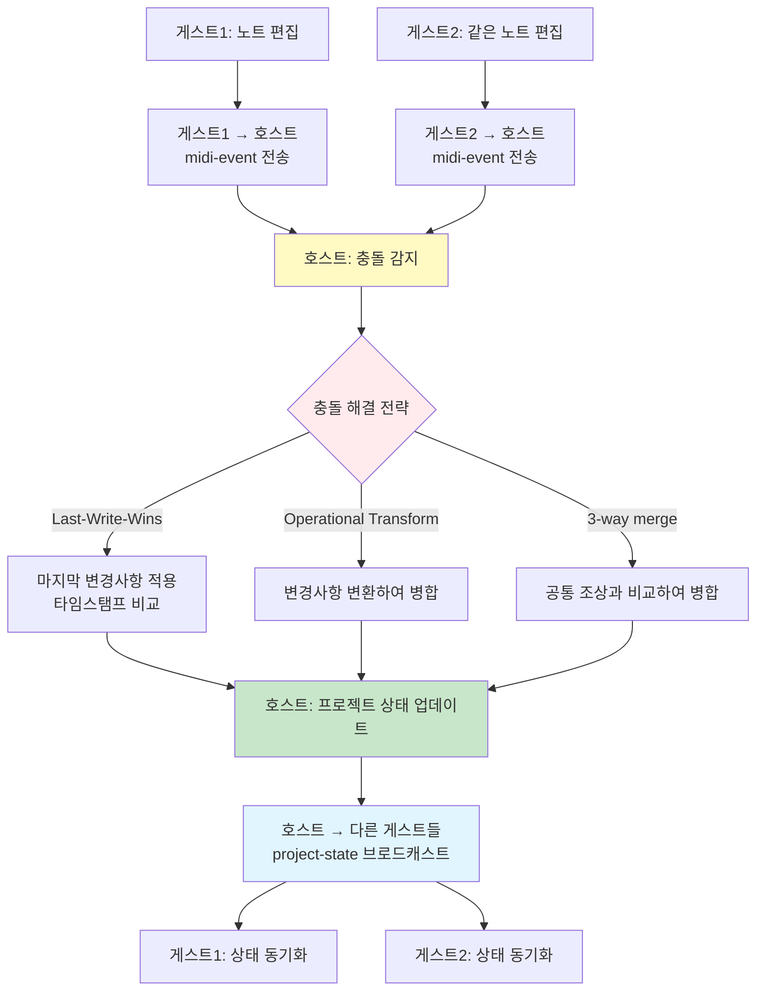

# 예외 상황 및 핸들링

**Document Version**: 1.0  
**Software Version**: 0.1.0  
**Last Updated**: 2026-01-14

---

### 1. 네트워크 연결 실패

#### 시나리오
- 서버에 연결할 수 없음
- WebSocket 연결 끊김
- P2P 연결 실패

#### 핸들링

```typescript
// 서버 연결 실패
try {
  await signalingClient.connect();
} catch (error) {
  // 재시도 로직 (지수 백오프)
  let retryCount = 0;
  const maxRetries = 5;
  const baseDelay = 1000; // 1초
  
  while (retryCount < maxRetries) {
    await sleep(baseDelay * Math.pow(2, retryCount));
    try {
      await signalingClient.connect();
      break;
    } catch (e) {
      retryCount++;
      if (retryCount >= maxRetries) {
        showError("Cannot connect to server. Please check your network connection.");
      }
    }
  }
}

// WebSocket 재연결
signalingClient.on('disconnect', () => {
  // 자동 재연결 시도
  setTimeout(() => {
    signalingClient.reconnect();
  }, 1000);
});

// P2P 연결 실패
webRTCManager.onConnectionStateChange((state) => {
  if (state === 'failed' || state === 'disconnected') {
    // 서버를 통한 재연결 시도
    attemptReconnection();
  }
});
```

### 2. 룸 코드 중복

#### 시나리오
- 생성한 룸 코드가 이미 존재함
- 참여하려는 룸 코드가 존재하지 않음

#### 핸들링

```typescript
// 룸 코드 중복
async function registerRoomWithRetry(): Promise<string> {
  let attempts = 0;
  const maxAttempts = 10;
  
  while (attempts < maxAttempts) {
    const roomCode = generateRoomCode();
    try {
      await signalingClient.registerRoom(roomCode);
      return roomCode;
    } catch (error) {
      if (error.code === 'ROOM_EXISTS') {
        attempts++;
        continue;
      }
      throw error;
    }
  }
  
  throw new Error("룸 생성에 실패했습니다. 다시 시도해주세요.");
}

// 룸 코드 없음
async function joinRoom(roomCode: string) {
  // 조인 전 경고 확인
  const syncManager = new GuestSyncManager(webRTCManager);
  const confirmed = await syncManager.checkBeforeJoin();
  
  if (!confirmed) {
    // 사용자가 취소
    return;
  }
  
  try {
    const roomInfo = await signalingClient.getRoom(roomCode);
    if (!roomInfo) {
      showError("Room code does not exist.");
      return;
    }
    if (roomInfo.status === 'full') {
      showError("Room is full.");
      return;
    }
    // 참여 로직
    // P2P 연결 수립 후 호스트의 초기 상태를 받음
  } catch (error) {
    if (error.status === 404) {
      showError("Room code does not exist.");
    } else {
      showError("Failed to join room.");
    }
  }
}
```

### 3. 호스트 연결 끊김

#### 시나리오
- 호스트가 네트워크 연결 끊김
- 호스트가 앱 종료
- 호스트가 세션 종료

#### 핸들링

```typescript
// 호스트 연결 끊김 감지
webRTCManager.onConnectionStateChange((state) => {
  if (state === 'disconnected' || state === 'failed') {
    // 호스트 재연결 대기
    showNotification("Host connection lost. Waiting for reconnection...");
    
    // 서버를 통해 호스트 상태 확인
    const checkHostStatus = setInterval(async () => {
      const roomInfo = await signalingClient.getRoom(roomCode);
      if (roomInfo && roomInfo.status === 'active') {
        // 호스트가 다시 온라인, 재연결 시도
        clearInterval(checkHostStatus);
        attemptReconnection();
      }
    }, 3000);
    
    // 30초 후 타임아웃
    setTimeout(() => {
      clearInterval(checkHostStatus);
      showError("Cannot restore connection to host.");
      leaveSession();
    }, 30000);
  }
});

// 호스트가 세션 종료
signalingClient.on('room-closed', () => {
  showNotification("Host has ended the session.");
  cleanup();
  returnToIdle();
});
```

### 4. 참가자 연결 끊김 및 강퇴

#### 시나리오
- 참가자가 네트워크 연결 끊김
- 참가자가 앱 종료
- 호스트가 참가자 강퇴

#### 핸들링

```typescript
// 참가자 연결 끊김 감지 (호스트 측)
const participants = new Map<string, Participant>();

webRTCManager.onParticipantDisconnected((participantId) => {
  const participant = participants.get(participantId);
  if (participant) {
    showNotification(`${participant.name} has disconnected.`);
    participants.delete(participantId);
    updateParticipantsList();
  }
});

// 호스트가 참가자 강퇴
async function kickParticipant(participantId: string) {
  const confirmed = await showConfirmDialog({
    title: 'Kick Participant',
    message: `Do you want to kick ${participant.name}?`,
    confirmText: 'Kick',
    cancelText: 'Cancel'
  });
  
  if (confirmed) {
    // P2P 연결 종료
    webRTCManager.removeGuest(participantId);
    // 서버에 강퇴 알림 (현재 룸 인스턴스에만 적용)
    await signalingClient.kickParticipant(roomCode, participantId);
    // 참가자 목록에서 제거
    participants.delete(participantId);
    updateParticipantsList();
    showNotification(`${participant.name} has been kicked.`);
  }
}

**중요:**
- 강퇴는 현재 룸 인스턴스에만 적용됩니다
- 같은 룸 코드로 새 룸을 만들면 강퇴된 참가자도 참가 가능합니다
- 서버는 룸 인스턴스별로 강퇴 목록을 관리합니다

// 강퇴된 참가자 측 처리
let kickedFromRoomCode: string | null = null;  // 강퇴된 룸 코드
let lastKickedAt: number = 0;  // 강퇴된 룸의 생성 시간

signalingClient.on('kicked', (data: { roomCode: string, roomCreatedAt: number }) => {
  kickedFromRoomCode = data.roomCode;  // 현재 룸 코드 저장
  lastKickedAt = data.roomCreatedAt;  // 룸 생성 시간 저장
  showError("You have been kicked by the host.");
  // P2P 연결 종료
  webRTCManager.disconnect();
  // 세션 종료
  leaveSession();
});

// 재조인 시도 시 강퇴 여부 확인
async function joinRoom(roomCode: string) {
  // 같은 룸 코드로 재조인 시도하는 경우
  if (kickedFromRoomCode === roomCode) {
    // 서버에서 현재 룸 인스턴스 확인
    const roomInfo = await signalingClient.getRoom(roomCode);
    
    // 룸이 새로 생성되었거나 다른 인스턴스인 경우
    // (서버에서 룸 생성 시간으로 판단)
    if (roomInfo.createdAt > lastKickedAt) {
      // 새 룸 인스턴스이므로 참가 가능
      kickedFromRoomCode = null;  // 강퇴 상태 해제
      lastKickedAt = 0;
      // 조인 진행
    } else {
      // 같은 룸 인스턴스이므로 거부
      showError("You have been kicked from this room. You can join again when the host creates a new room.");
      return;
    }
  }
  
  // 일반 조인 로직
  // ...
}

// 자동 재연결 시도 (참가자 측) - 강퇴된 경우 제외
webRTCManager.onConnectionStateChange((state) => {
  if (state === 'disconnected' && !kickedFromRoomCode) {
    // 자동 재연결 시도
    attemptReconnection();
  }
});
```

### 5. NAT/방화벽 문제

#### 시나리오
- STUN 서버로 공인 IP 획득 실패
- TURN 서버 필요 (대칭형 NAT)

#### 핸들링

```typescript
// ICE 서버 구성
const iceServers: RTCConfiguration = {
  iceServers: [
    // STUN 서버 (무료)
    { urls: 'stun:stun.l.google.com:19302' },
    { urls: 'stun:stun1.l.google.com:19302' },
    
    // TURN 서버 (필요시, 유료 서비스 또는 자체 구축)
    {
      urls: 'turn:turnserver.example.com:3478',
      username: 'user',
      credential: 'password'
    }
  ],
  iceCandidatePoolSize: 10
};

// ICE 연결 실패 처리
webRTCManager.onIceConnectionStateChange((state) => {
  if (state === 'failed') {
    // TURN 서버로 재시도
    if (!usingTURN) {
      usingTURN = true;
      webRTCManager.reinitializeWithTURN();
    } else {
      showError("Network connection failed. Please check your firewall settings.");
    }
  }
});
```

### 6. 동시 편집 충돌



#### 시나리오
- 여러 사용자가 동시에 같은 파트 편집
- 프로젝트 상태 버전 충돌

#### 핸들링

```typescript
// 충돌 해결 전략
class ConflictResolver {
  // Last-Write-Wins (LWW) 전략
  resolveLWW(localChange: Change, remoteChange: Change): Change {
    if (remoteChange.timestamp > localChange.timestamp) {
      return remoteChange;
    }
    return localChange;
  }
  
  // Operational Transform (OT) 전략
  resolveOT(localChange: Change, remoteChange: Change): Change {
    // 변경사항을 변환하여 병합
    return transform(localChange, remoteChange);
  }
  
  // 3-way merge 전략
  resolve3Way(base: State, local: State, remote: State): State {
    // 공통 조상과 비교하여 병합
    return merge(base, local, remote);
  }
}

// 동시 편집 감지
syncManager.onConflict((conflict) => {
  // 사용자에게 충돌 알림
  showConflictDialog({
    localChange: conflict.local,
    remoteChange: conflict.remote,
    onResolve: (strategy) => {
      const resolved = conflictResolver.resolve(conflict, strategy);
      syncManager.applyResolvedChange(resolved);
    }
  });
});
```

### 7. 데이터 손실/순서 문제

#### 시나리오
- DataChannel 메시지 순서 보장 실패
- 메시지 손실

#### 핸들링

```typescript
// DataChannel 설정 (순서 보장)
const dataChannel = peerConnection.createDataChannel('sync', {
  ordered: true,        // 순서 보장
  maxRetransmits: 3,    // 재전송 횟수
  maxPacketLifeTime: 5000  // 패킷 수명 (ms)
});

// 메시지 순서 번호 추가
interface SequencedMessage extends P2PMessage {
  sequence: number;
  timestamp: number;
}

// 순서 번호 관리
class MessageSequencer {
  private sendSequence = 0;
  private receiveSequence = 0;
  private buffer: Map<number, SequencedMessage> = new Map();
  
  send(message: P2PMessage): SequencedMessage {
    const sequenced: SequencedMessage = {
      ...message,
      sequence: this.sendSequence++,
      timestamp: Date.now()
    };
    return sequenced;
  }
  
  receive(sequenced: SequencedMessage, callback: (message: P2PMessage) => void) {
    // 순서대로 처리
    if (sequenced.sequence === this.receiveSequence) {
      callback(sequenced);
      this.receiveSequence++;
      // 버퍼에서 다음 메시지 확인
      this.processBuffered();
    } else {
      // 순서가 맞지 않으면 버퍼에 저장
      this.buffer.set(sequenced.sequence, sequenced);
    }
  }
  
  private processBuffered() {
    while (this.buffer.has(this.receiveSequence)) {
      const message = this.buffer.get(this.receiveSequence)!;
      this.buffer.delete(this.receiveSequence);
      // 처리 로직
      this.receiveSequence++;
    }
  }
}
```

### 8. 서버 과부하

#### 시나리오
- 동시 접속자 수 과다
- 서버 리소스 부족

#### 핸들링

```typescript
// 서버 측 구현 필요 (서버 프로젝트에서 처리)
// 클라이언트 측 대응:

// 연결 큐 관리
class ConnectionQueue {
  private queue: Array<() => Promise<void>> = [];
  private processing = false;
  
  async enqueue(connectionFn: () => Promise<void>) {
    this.queue.push(connectionFn);
    if (!this.processing) {
      this.processQueue();
    }
  }
  
  private async processQueue() {
    this.processing = true;
    while (this.queue.length > 0) {
      const fn = this.queue.shift()!;
      try {
        await fn();
        await sleep(100); // 요청 간 간격
      } catch (error) {
        if (error.status === 503) {
          // 서버 과부하, 재시도
          this.queue.unshift(fn);
          await sleep(5000);
        }
      }
    }
    this.processing = false;
  }
}

// 요청 제한
const rateLimiter = {
  requests: 0,
  windowStart: Date.now(),
  maxRequests: 10,
  windowMs: 1000,
  
  async check() {
    const now = Date.now();
    if (now - this.windowStart > this.windowMs) {
      this.requests = 0;
      this.windowStart = now;
    }
    
    if (this.requests >= this.maxRequests) {
      await sleep(this.windowMs - (now - this.windowStart));
      return this.check();
    }
    
    this.requests++;
  }
};
```

### 8-1. Spot 인스턴스 서버 중단

#### 시나리오
- Spot 인스턴스가 갑자기 종료됨 (AWS Spot 인스턴스 중단)
- WebSocket 연결이 갑자기 끊김
- 서버의 룸 정보가 모두 손실됨
- P2P 연결은 유지되지만 새로운 참가자 조인 불가

#### 핸들링 전략

**1. 서버 측 전략 (서버 프로젝트에서 구현)**

```typescript
// 서버 재시작 시 상태 복원 전략
// 옵션 1: 영구 스토리지 사용 (권장)
// - 룸 정보를 Redis, DynamoDB, 또는 파일 시스템에 저장
// - 서버 재시작 시 복원

interface RoomStorage {
  // 룸 정보를 영구 스토리지에 저장
  async saveRoom(room: Room): Promise<void>;
  
  // 서버 재시작 시 룸 정보 복원
  async restoreRooms(): Promise<Room[]>;
  
  // 룸 만료 시간 확인 및 정리
  async cleanupExpiredRooms(): Promise<void>;
}

// 옵션 2: 상태 없이 시작 (간단하지만 룸 정보 손실)
// - 서버 재시작 시 모든 룸 정보 초기화
// - 기존 참가자는 P2P로 계속 작업 가능
// - 새로운 참가자만 조인 불가
```

**2. 클라이언트 측 전략**

```typescript
class SignalingClient {
  private ws: WebSocket | null = null;
  private reconnectAttempts = 0;
  private maxReconnectAttempts = 10;
  private reconnectDelay = 1000; // 1초부터 시작
  private isReconnecting = false;
  private roomCode: string | null = null;
  private hostId: string | null = null;
  
  // WebSocket 연결 끊김 감지
  private setupWebSocketHandlers(): void {
    if (!this.ws) return;
    
    this.ws.onclose = (event) => {
      console.log('WebSocket closed', event.code, event.reason);
      
      // 정상 종료가 아닌 경우 (서버 중단)
      if (event.code !== 1000) {
        this.handleUnexpectedDisconnect();
      }
    };
    
    this.ws.onerror = (error) => {
      console.error('WebSocket error', error);
      this.handleUnexpectedDisconnect();
    };
  }
  
  // 예상치 못한 연결 끊김 처리
  private handleUnexpectedDisconnect(): void {
    if (this.isReconnecting) {
      return; // 이미 재연결 시도 중
    }
    
    this.isReconnecting = true;
    this.attemptReconnection();
  }
  
  // 재연결 시도 (지수 백오프)
  private async attemptReconnection(): Promise<void> {
    while (this.reconnectAttempts < this.maxReconnectAttempts) {
      await sleep(this.reconnectDelay);
      
      try {
        await this.connect();
        
        // 재연결 성공
        if (this.ws?.readyState === WebSocket.OPEN) {
          this.reconnectAttempts = 0;
          this.reconnectDelay = 1000;
          this.isReconnecting = false;
          
          // 룸 정보 복원 시도
          await this.restoreRoomState();
          
          showNotification("Server connection restored.");
          return;
        }
      } catch (error) {
        console.error('Reconnection attempt failed', error);
      }
      
      // 재시도 횟수 증가 및 지연 시간 증가
      this.reconnectAttempts++;
      this.reconnectDelay = Math.min(
        this.reconnectDelay * 2, // 지수 백오프
        30000 // 최대 30초
      );
    }
    
    // 최대 재시도 횟수 초과
    this.isReconnecting = false;
    this.handleReconnectionFailure();
  }
  
  // 룸 상태 복원 시도
  private async restoreRoomState(): Promise<void> {
    if (!this.roomCode || !this.hostId) {
      return; // 복원할 상태 없음
    }
    
    try {
      // 서버에 룸 정보 확인
      const roomInfo = await this.getRoom(this.roomCode);
      
      if (roomInfo && roomInfo.hostId === this.hostId) {
        // 룸 정보가 복원됨
        showNotification("Room state restored.");
      } else {
        // 룸 정보가 없음 (서버 재시작으로 인한 손실)
        this.handleRoomStateLoss();
      }
    } catch (error) {
      // 서버가 아직 완전히 복구되지 않음
      console.warn('Room state restoration failed', error);
    }
  }
  
  // 룸 상태 손실 처리
  private handleRoomStateLoss(): void {
    if (this.isHost) {
      // 호스트: 새 룸 생성 제안
      showWarning("Server was restarted. Your room information was lost. P2P connection is still active, but new participants cannot join. Would you like to create a new room?");
      
      // 사용자에게 새 룸 생성 옵션 제공
      // (선택사항: 자동으로 새 룸 생성)
    } else {
      // 게스트: 호스트에게 새 룸 생성 요청
      showWarning("Server was restarted. Room information was lost. P2P connection is still active. Please ask the host to create a new room if you want to allow new participants.");
    }
  }
  
  // 재연결 실패 처리
  private handleReconnectionFailure(): void {
    showError("Cannot reconnect to server. P2P connection is still active, but new participants cannot join. Please check your network connection.");
    
    // P2P 연결 상태 확인
    if (this.webRTCManager?.isConnected()) {
      showNotification("You can continue working via P2P connection. Server reconnection will be retried in the background.");
      
      // 백그라운드 재연결 시도 계속
      setTimeout(() => {
        this.reconnectAttempts = 0;
        this.attemptReconnection();
      }, 60000); // 1분 후 다시 시도
    }
  }
}

// P2P 연결 상태 모니터링
class WebRTCManager {
  private connectionState: 'connected' | 'disconnected' | 'failed' = 'disconnected';
  
  onConnectionStateChange(callback: (state: string) => void): void {
    this.peerConnection?.addEventListener('connectionstatechange', () => {
      const state = this.peerConnection?.connectionState;
      this.connectionState = state as any;
      callback(state || 'disconnected');
      
      // P2P 연결이 유지되면 서버 재연결 실패해도 계속 작업 가능
      if (state === 'connected') {
        console.log('P2P connection is active, server reconnection is optional');
      }
    });
  }
  
  isConnected(): boolean {
    return this.connectionState === 'connected';
  }
}
```

**3. 사용자 경험 개선**

```typescript
// 서버 중단 시 사용자 안내
function handleServerDisconnect() {
  // 즉시 알림
  showWarning("Server connection lost. Attempting to reconnect...");
  
  // P2P 연결 상태 확인
  if (webRTCManager.isConnected()) {
    showNotification("P2P connection is still active. You can continue working.");
  }
  
  // 재연결 진행 상황 표시
  const reconnectStatus = {
    attempts: 0,
    maxAttempts: 10,
    updateUI: () => {
      showReconnectDialog({
        message: `Reconnecting to server... (${reconnectStatus.attempts}/${reconnectStatus.maxAttempts})`,
        canCancel: true
      });
    }
  };
}
```

**4. 서버 복구 후 자동 복원**

```typescript
// 서버가 복구되면 자동으로 룸 상태 복원 시도
class SignalingClient {
  // 주기적으로 서버 상태 확인 (P2P 연결 중일 때)
  private startServerHealthCheck(): void {
    if (!this.webRTCManager?.isConnected()) {
      return; // P2P 연결이 없으면 불필요
    }
    
    setInterval(async () => {
      if (this.ws?.readyState === WebSocket.OPEN) {
        return; // 이미 연결됨
      }
      
      try {
        // 서버가 복구되었는지 확인
        const response = await fetch(`${this.serverUrl}/health`);
        if (response.ok) {
          // 서버 복구됨, 재연결 시도
          await this.attemptReconnection();
        }
      } catch (error) {
        // 서버 아직 복구 안 됨
        console.log('Server not yet recovered');
      }
    }, 30000); // 30초마다 확인
  }
}
```

**5. 룸 정보 영구 저장 (서버 측)**

```typescript
// 서버 측: 룸 정보를 영구 스토리지에 저장
// 예: Redis, DynamoDB, 또는 파일 시스템

interface RoomPersistence {
  // 룸 생성 시 저장
  async saveRoom(room: Room): Promise<void> {
    await redis.setex(
      `room:${room.roomCode}`,
      room.expiresAt - Date.now(),
      JSON.stringify(room)
    );
  }
  
  // 서버 재시작 시 복원
  async restoreRooms(): Promise<Room[]> {
    const keys = await redis.keys('room:*');
    const rooms: Room[] = [];
    
    for (const key of keys) {
      const data = await redis.get(key);
      if (data) {
        rooms.push(JSON.parse(data));
      }
    }
    
    return rooms;
  }
  
  // 룸 만료 확인
  async cleanupExpiredRooms(): Promise<void> {
    // TTL이 만료된 룸은 자동 삭제됨 (Redis)
  }
}
```

**6. 전략 요약**

| 상황 | P2P 연결 | 서버 연결 | 대응 |
|------|---------|---------|------|
| 서버 중단 전 | 활성 | 활성 | 정상 작동 |
| 서버 중단 직후 | 활성 | 끊김 | P2P로 계속 작업, 재연결 시도 |
| 서버 복구 후 (룸 정보 있음) | 활성 | 복구 | 룸 상태 복원, 새 참가자 조인 가능 |
| 서버 복구 후 (룸 정보 없음) | 활성 | 복구 | 호스트가 새 룸 생성 필요 |
| 서버 복구 실패 | 활성 | 실패 | P2P로 계속 작업, 백그라운드 재시도 |

**7. 구현 우선순위**

1. **즉시 구현 (필수)**
   - WebSocket 재연결 로직 (지수 백오프)
   - P2P 연결 상태 확인
   - 사용자 안내 메시지

2. **단기 구현 (권장)**
   - 서버 상태 주기적 확인
   - 룸 상태 복원 시도
   - 자동 재연결 UI

3. **장기 구현 (선택)**
   - 서버 측 영구 스토리지 (Redis/DynamoDB)
   - 룸 정보 자동 복원
   - 서버 복구 알림

### 9. 조인 허용 만료 및 서버 룸 만료

#### 시나리오 1: 조인 허용 만료 (60초 후)
- "Allow Join" 클릭 후 60초 경과
- 서버에서 룸의 allowJoin 상태를 false로 변경
- 새로운 참가자 조인 불가
- 하지만 기존 P2P 연결은 계속 유지 (6시간 제한 전까지)

#### 핸들링

```typescript
// 조인 허용 만료 알림 (서버에서 전송)
signalingClient.on('allow-join-expired', () => {
  if (isHost) {
    showNotification("Join window has expired. New participants cannot join.");
    // "Allow Join" 버튼은 항상 활성화 상태 (호스트가 언제든지 다시 클릭 가능)
    // 버튼 상태 변경 불필요 - 호스트가 언제든지 다시 활성화할 수 있음
  }
});

// 참가자 조인 시도 시
async function joinRoom(roomCode: string) {
  const roomInfo = await signalingClient.getRoom(roomCode);
  if (!roomInfo.allowJoin) {
    showError("Cannot join now. The host must enable 'Allow Join' first.");
    return;
  }
  // 조인 진행
}
```

#### 시나리오 2: 세션 만료 경고 및 만료 (6시간 후)
- 룸 생성 후 6시간 경과
- 서버에서 30분 전, 5분 전, 1분 전에 경고 메시지 전송
- 서버에서 룸 정보 삭제
- P2P 연결도 자동 종료 (리소스 절약)

#### 핸들링

```typescript
// 세션 만료 경고 알림 (서버에서 WebSocket으로 전송)
signalingClient.on('room-expiring', (data: { minutesLeft: number }) => {
  const { minutesLeft } = data;
  
  if (minutesLeft === 30) {
    showWarning("Room session will expire in 30 minutes. Please save your work.");
  } else if (minutesLeft === 5) {
    showWarning("Room session will expire in 5 minutes. Please save your work.");
  } else if (minutesLeft === 1) {
    showWarning("Room session will expire in 1 minute. Please save your work.");
  }
});

// 세션 만료 알림 (서버에서 전송)
signalingClient.on('room-session-expired', () => {
  // 서버 룸과 P2P 연결 모두 종료
  showWarning("Room session has expired after 6 hours. Connection will be closed.");
  
  // P2P 연결 종료
  webRTCManager.disconnect();
  
  // 세션 종료 처리
  if (isHost) {
    showNotification("Session expired. Please create a new room to continue.");
    setMode('idle');
  } else {
    showNotification("Session expired. Please ask the host to create a new room.");
    setMode('idle');
  }
  
  // 프로젝트 상태는 로컬에 저장되어 있으므로 손실 없음
  // 호스트가 새 룸을 만들면 재연결 가능
});

// 호스트 측: 6시간 후 세션 자동 종료
// 서버에서 자동으로 처리
if (isHost) {
  // 6시간 경고 타이머 설정
  const sessionDuration = 6 * 60 * 60 * 1000; // 6시간
  setTimeout(() => {
    showWarning("Room session will expire soon. Please save your work.");
  }, sessionDuration - 30 * 60 * 1000); // 30분 전
  
  setTimeout(() => {
    showWarning("Room session will expire in 5 minutes.");
  }, sessionDuration - 5 * 60 * 1000); // 5분 전
  
  setTimeout(() => {
    showWarning("Room session will expire in 1 minute.");
  }, sessionDuration - 60 * 1000); // 1분 전
}
```

### 10. 룸 나가기 동작

#### 시나리오
- 호스트가 룸에서 나가기
- 게스트가 룸에서 나가기

#### 핸들링

```typescript
// 호스트가 룸에서 나가기
async function handleHostLeave() {
  const confirmed = await showConfirmDialog({
    title: 'Stop Hosting',
    message: 'Stopping hosting will disconnect all participants. Do you want to continue?',
    confirmText: 'Stop',
    cancelText: 'Cancel'
  });
  
  if (confirmed) {
    // 서버에서 룸 삭제
    await signalingClient.deleteRoom(roomCode);
    
    // 모든 게스트에게 룸 종료 알림
    webRTCManager.broadcastToAll({
      type: 'room-closed',
      message: 'Host has closed the room.'
    });
    
    // P2P 연결 종료
    webRTCManager.disconnect();
    
    // 호스트의 프로젝트 상태는 유지 (로컬에 저장)
    // 추가 저장 로직 불필요 (이미 로컬 상태)
    
    // UI 상태 변경
    setMode('idle');
    showNotification("Hosting has been stopped.");
  }
}

// 게스트가 룸에서 나가기
async function handleGuestLeave() {
  const confirmed = await showConfirmDialog({
    title: 'Leave Session',
    message: 'Leaving the session will restore your project to its initial state. Do you want to continue?',
    confirmText: 'Leave',
    cancelText: 'Cancel'
  });
  
  if (confirmed) {
    // P2P 연결 종료
    webRTCManager.disconnect();
    
    // 게스트의 프로젝트 상태를 초기 상태로 복원
    // 초기 상태: 빈 프로젝트 (트랙 1개만 있는 상태, BPM 120, 4/4)
    const initialProject = createInitialProject();
    setProject(initialProject);
    notifyProjectChange({ type: 'project-reset' });
    
    // UI 상태 변경
    setMode('idle');
    showNotification("You have left the session. Project has been restored to initial state.");
  }
}

// 호스트가 룸 종료 알림 수신 (게스트 측)
webRTCManager.onMessageFromHost((message) => {
  if (message.type === 'room-closed') {
    showError("Host has closed the room.");
    // 프로젝트 상태를 초기 상태로 복원
    const initialProject = createInitialProject();
    setProject(initialProject);
    notifyProjectChange({ type: 'project-reset' });
    // P2P 연결 종료
    webRTCManager.disconnect();
    // UI 상태 변경
    setMode('idle');
  }
});

// 초기 프로젝트 생성 함수
function createInitialProject(): Project {
  return {
    version: 2,
    timing: createSimpleTiming(120, [4, 4]),
    tracks: [
      {
        id: 'track-1',
        name: 'Track 1',
        instrument: 'piano',
        volume: 100 / 120,
        pan: 0.0,
        effects: [],
        solo: false,
        mute: false,
        mutedBySolo: false,
      },
    ],
    midiParts: [],
    masterVolume: 100 / 120,
    masterPan: 0.0,
    masterEffects: [],
  };
}
```

### 11. 브라우저/플랫폼 호환성

#### 시나리오
- WebRTC 미지원 브라우저
- Electron 환경에서의 차이점

#### 핸들링

```typescript
// WebRTC 지원 확인
function checkWebRTCSupport(): boolean {
  return !!(
    window.RTCPeerConnection &&
    window.RTCDataChannel &&
    navigator.mediaDevices?.getUserMedia
  );
}

if (!checkWebRTCSupport()) {
  showError("This browser does not support WebRTC.");
  return;
}

// Electron 환경 대응
const isElectron = window.electron !== undefined;

if (isElectron) {
  // Electron 전용 설정
  // 예: nodeIntegration, contextIsolation 등
}
```


### 12. P2P 통신 중 소프트웨어 충돌

#### 11.1 동시 편집 충돌 (같은 리소스)

**시나리오:**
- 게스트1과 게스트2가 동시에 같은 MIDI 노트 수정
- 호스트가 두 변경사항을 모두 받음
- 어떤 변경사항을 적용할지 결정 필요

**핸들링:**

```typescript
// 호스트 측 충돌 감지
class HostSyncManager {
  private pendingChanges = new Map<string, Change[]>();
  
  onGuestChange(guestId: string, change: RemoteChange) {
    const key = `${change.partId}-${change.noteId}`;
    const existing = this.pendingChanges.get(key);
    
    if (existing && existing.length > 0) {
      // 충돌 감지
      const conflict = {
        local: existing[0],
        remote: change,
        timestamp: Date.now()
      };
      
      // 충돌 해결 전략 적용
      const resolved = this.resolveConflict(conflict);
      this.pendingChanges.delete(key);
      
      // 모든 게스트에게 해결된 변경사항 브로드캐스트
      this.broadcastResolvedChange(resolved);
    } else {
      // 충돌 없음, 즉시 적용
      this.pendingChanges.set(key, [change]);
      this.applyChange(change);
    }
  }
  
  resolveConflict(conflict: Conflict): Change {
    // Last-Write-Wins (가장 최근 타임스탬프)
    if (conflict.remote.timestamp > conflict.local.timestamp) {
      return conflict.remote;
    }
    return conflict.local;
  }
}
```

#### 11.2 프로젝트 상태 버전 충돌

**시나리오:**
- 호스트와 게스트의 프로젝트 버전이 다름
- 호스트가 v5, 게스트가 v3에서 변경사항 전송
- 버전 불일치로 동기화 실패

**핸들링:**

```typescript
interface ProjectStateMessage {
  type: 'project-state';
  version: number;  // 버전 번호
  state: ProjectState;
  baseVersion: number;  // 기준 버전
}

// 버전 충돌 감지
class SyncManager {
  private localVersion = 0;
  
  onRemoteState(message: ProjectStateMessage) {
    if (message.baseVersion !== this.localVersion) {
      // 버전 충돌
      this.handleVersionConflict(message);
    } else {
      // 버전 일치, 정상 적용
      this.applyState(message.state);
      this.localVersion = message.version;
    }
  }
  
  handleVersionConflict(message: ProjectStateMessage) {
    // 전체 프로젝트 상태 재동기화 요청
    this.requestFullStateSync();
  }
}
```

#### 11.3 메시지 순서 문제

**시나리오:**
- 게스트1: 노트 추가 → 노트 삭제 (순서대로 전송)
- 네트워크 지연으로 삭제 메시지가 먼저 도착
- 호스트가 삭제를 먼저 처리 → 노트가 없는 상태에서 추가 시도

**핸들링:**

```typescript
// 순서 번호로 메시지 정렬
class MessageSequencer {
  private receiveBuffer = new Map<number, SequencedMessage>();
  private expectedSequence = 0;
  
  receive(sequenced: SequencedMessage, handler: (msg: P2PMessage) => void) {
    if (sequenced.sequence === this.expectedSequence) {
      // 순서 맞음, 즉시 처리
      handler(sequenced);
      this.expectedSequence++;
      this.processBuffered();
    } else if (sequenced.sequence > this.expectedSequence) {
      // 순서가 앞서는 메시지, 버퍼에 저장
      this.receiveBuffer.set(sequenced.sequence, sequenced);
    }
    // 순서가 뒤처진 메시지는 무시 (이미 처리됨)
  }
  
  private processBuffered() {
    while (this.receiveBuffer.has(this.expectedSequence)) {
      const msg = this.receiveBuffer.get(this.expectedSequence)!;
      this.receiveBuffer.delete(this.expectedSequence);
      handler(msg);
      this.expectedSequence++;
    }
  }
}
```

#### 11.4 리소스 삭제/수정 충돌

**시나리오:**
- 게스트1: 파트 A 수정 중
- 게스트2: 파트 A 삭제
- 호스트가 두 메시지를 모두 받음
- 수정 메시지가 삭제된 파트에 적용 시도

**핸들링:**

```typescript
class ConflictResolver {
  resolveDeleteModifyConflict(
    deleteChange: Change,
    modifyChange: Change
  ): Change | null {
    // 삭제가 먼저 처리되었는지 확인
    if (deleteChange.timestamp < modifyChange.timestamp) {
      // 삭제가 먼저, 수정 무시
      return null; // 수정 무시
    } else {
      // 수정이 먼저, 삭제 적용
      return deleteChange;
    }
  }
  
  // 리소스 존재 확인
  validateChange(change: Change): boolean {
    const resource = this.getResource(change.resourceId);
    if (!resource && change.action !== 'create') {
      // 리소스가 없는데 생성이 아닌 변경 시도
      console.warn('Resource not found for change:', change);
      return false;
    }
    return true;
  }
}
```

#### 11.5 타임스탬프 충돌 (동일 시간)

**시나리오:**
- 게스트1과 게스트2가 정확히 같은 시간에 변경
- 타임스탬프가 동일하여 LWW 전략으로 해결 불가
- 추가 우선순위 필요

**핸들링:**

```typescript
interface Change {
  timestamp: number;
  clientId: string;  // 클라이언트 ID로 우선순위 결정
  sequence: number;  // 클라이언트 내부 시퀀스
}

class ConflictResolver {
  resolveSameTimestampConflict(
    change1: Change,
    change2: Change
  ): Change {
    // 타임스탬프가 같으면 클라이언트 ID로 결정
    if (change1.timestamp === change2.timestamp) {
      // 호스트가 우선순위 높음
      if (change1.clientId === 'host') return change1;
      if (change2.clientId === 'host') return change2;
      
      // 클라이언트 ID 문자열 비교 (일관성)
      return change1.clientId < change2.clientId ? change1 : change2;
    }
    
    // 일반적인 LWW
    return change1.timestamp > change2.timestamp ? change1 : change2;
  }
}
```

#### 11.6 메시지 중복 수신

**시나리오:**
- 네트워크 재전송으로 같은 메시지가 여러 번 도착
- 동일한 변경사항이 중복 적용됨
- 프로젝트 상태가 잘못됨

**핸들링:**

```typescript
class MessageDeduplicator {
  private processedMessages = new Set<string>();
  private TTL = 60000; // 60초
  
  isDuplicate(message: P2PMessage): boolean {
    const messageId = `${message.clientId}-${message.sequence}-${message.timestamp}`;
    
    if (this.processedMessages.has(messageId)) {
      return true; // 중복
    }
    
    this.processedMessages.add(messageId);
    
    // TTL 후 제거 (메모리 관리)
    setTimeout(() => {
      this.processedMessages.delete(messageId);
    }, this.TTL);
    
    return false;
  }
}
```

#### 11.7 순환 참조 문제

**시나리오:**
- 게스트1 → 호스트 → 게스트2 → 호스트 → 게스트1
- 같은 변경사항이 순환하며 계속 전파
- 무한 루프 가능

**핸들링:**

```typescript
class SyncManager {
  private messageHistory = new Map<string, Set<string>>(); // clientId -> messageIds
  
  shouldProcess(message: P2PMessage, senderId: string): boolean {
    const history = this.messageHistory.get(senderId) || new Set();
    const messageId = `${message.clientId}-${message.sequence}`;
    
    if (history.has(messageId)) {
      // 이미 이 클라이언트로부터 받은 메시지
      return false; // 무시
    }
    
    history.add(messageId);
    this.messageHistory.set(senderId, history);
    
    // 오래된 히스토리 정리
    if (history.size > 1000) {
      const oldest = Array.from(history).slice(0, 500);
      oldest.forEach(id => history.delete(id));
    }
    
    return true;
  }
}
```

#### 11.8 부분 상태 불일치

**시나리오:**
- 게스트1: 파트 A의 노트 1 수정
- 게스트2: 파트 A의 노트 2 수정
- 두 변경사항이 독립적이지만 파트 전체 상태가 불일치
- 호스트가 두 변경사항을 병합해야 함

**핸들링:**

```typescript
class ConflictResolver {
  mergeIndependentChanges(
    change1: Change,
    change2: Change
  ): Change[] {
    // 서로 다른 리소스를 수정하면 모두 적용
    if (change1.resourceId !== change2.resourceId) {
      return [change1, change2];
    }
    
    // 같은 리소스지만 다른 필드 수정
    if (change1.field !== change2.field) {
      // 병합 가능
      return [this.mergeChanges(change1, change2)];
    }
    
    // 같은 필드 수정 → 충돌
    return [this.resolveConflict(change1, change2)];
  }
}
```

#### 11.9 호스트 브로드캐스트 중 게스트 변경

**시나리오:**
- 호스트가 게스트1의 변경사항을 다른 게스트들에게 브로드캐스트 중
- 게스트1이 또 다른 변경사항 전송
- 순서가 꼬임

**핸들링:**

```typescript
class HostSyncManager {
  private broadcastQueue: Change[] = [];
  private isBroadcasting = false;
  
  async broadcastChange(change: Change) {
    this.broadcastQueue.push(change);
    
    if (!this.isBroadcasting) {
      this.processBroadcastQueue();
    }
  }
  
  private async processBroadcastQueue() {
    this.isBroadcasting = true;
    
    while (this.broadcastQueue.length > 0) {
      const change = this.broadcastQueue.shift()!;
      
      // 모든 게스트에게 순차적으로 브로드캐스트
      await this.broadcastToAllGuests(change);
    }
    
    this.isBroadcasting = false;
  }
}
```

#### 11.10 언두/히스토리 정책

**중요 원칙:**
- 언두는 각 사용자(편집자)의 고유한 것
- 다른 사람이 편집한 내용에 대해서는 언두를 할 수 없음
- 다른 사람이 편집한 내용은 히스토리에 저장하지 않음

**시나리오:**
- 사용자 A가 노트를 추가 (로컬 변경)
- 사용자 B가 다른 노트를 수정 (원격 변경)
- 사용자 A는 자신이 추가한 노트만 언두 가능
- 사용자 B가 수정한 내용은 사용자 A의 히스토리에 저장되지 않음

**핸들링:**

```typescript
class SyncManager {
  private localUndoStack: Change[] = [];  // 로컬 변경사항만 저장
  private localRedoStack: Change[] = [];
  private clientId: string;  // 현재 사용자 ID
  
  // 로컬 변경사항 적용 (히스토리에 저장)
  applyLocalChange(change: Change): void {
    // 로컬 변경사항만 히스토리에 저장
    change.clientId = this.clientId;
    this.localUndoStack.push(change);
    this.localRedoStack = [];  // Redo 스택 초기화
    
    // 프로젝트에 적용
    this.applyChange(change);
    
    // 원격 사용자에게 전송
    this.sendToRemote(change);
  }
  
  // 원격 변경사항 적용 (히스토리에 저장하지 않음)
  applyRemoteChange(change: RemoteChange): void {
    // 원격 변경사항은 히스토리에 저장하지 않음
    // 즉시 프로젝트에만 적용
    this.applyChange(change);
    
    // 언두/리두 스택에는 영향을 주지 않음
  }
  
  // 언두 실행 (로컬 변경사항만)
  undo(): void {
    if (this.localUndoStack.length === 0) {
      return;  // 언두할 로컬 변경사항 없음
    }
    
    const lastChange = this.localUndoStack.pop()!;
    
    // 로컬 변경사항만 언두 가능
    if (lastChange.clientId !== this.clientId) {
      // 다른 사용자의 변경사항은 언두 불가
      this.localUndoStack.push(lastChange);  // 다시 스택에 넣기
      return;
    }
    
    // 언두 실행
    this.revertChange(lastChange);
    this.localRedoStack.push(lastChange);
    
    // 원격 사용자에게 언두 알림 (선택사항)
    // 또는 원격 사용자에게는 알리지 않고 로컬에서만 처리
  }
  
  // 리두 실행 (로컬 변경사항만)
  redo(): void {
    if (this.localRedoStack.length === 0) {
      return;
    }
    
    const change = this.localRedoStack.pop()!;
    
    // 로컬 변경사항만 리두 가능
    if (change.clientId !== this.clientId) {
      this.localRedoStack.push(change);
      return;
    }
    
    // 리두 실행
    this.applyChange(change);
    this.localUndoStack.push(change);
  }
  
  // 원격 변경사항 수신 시
  onRemoteChange(change: RemoteChange): void {
    // 원격 변경사항은 히스토리에 저장하지 않음
    // 즉시 프로젝트에만 적용
    this.applyRemoteChange(change);
    
    // 언두/리두 스택에는 영향을 주지 않음
    // 사용자는 다른 사람의 변경사항을 언두할 수 없음
  }
}
```

**게스트 측:**

```typescript
class GuestSyncManager {
  private localHistory: LocalChange[] = [];
  
  // 로컬 편집 (히스토리에 저장)
  onLocalEdit(change: LocalChange): void {
    // 로컬 변경사항만 히스토리에 저장
    this.localHistory.push({
      ...change,
      clientId: this.clientId,
      timestamp: Date.now()
    });
    
    // 호스트에게 전송
    this.sendToHost(change);
  }
  
  // 원격 변경사항 수신 (히스토리에 저장하지 않음)
  onHostChange(change: RemoteChange): void {
    // 원격 변경사항은 히스토리에 저장하지 않음
    // 즉시 프로젝트에만 적용
    this.applyChange(change);
  }
  
  // 언두 (로컬 변경사항만)
  undo(): void {
    const lastLocalChange = this.localHistory.pop();
    if (!lastLocalChange) {
      return;
    }
    
    // 로컬 변경사항만 언두 가능
    this.revertChange(lastLocalChange);
    
    // 호스트에게 언두 알림 (선택사항)
    // 또는 호스트에게는 알리지 않고 로컬에서만 처리
  }
}
```

**호스트 측:**

```typescript
class HostSyncManager {
  private localHistory: LocalChange[] = [];
  
  // 로컬 편집 (히스토리에 저장)
  onLocalEdit(change: LocalChange): void {
    // 로컬 변경사항만 히스토리에 저장
    this.localHistory.push({
      ...change,
      clientId: this.clientId,
      timestamp: Date.now()
    });
    
    // 게스트들에게 브로드캐스트
    this.broadcastToGuests(change);
  }
  
  // 게스트 변경사항 수신 (히스토리에 저장하지 않음)
  onGuestChange(guestId: string, change: RemoteChange): void {
    // 게스트의 변경사항은 호스트의 히스토리에 저장하지 않음
    // 충돌 해결 후 프로젝트에 적용
    const resolved = this.resolveConflict(change);
    this.applyChange(resolved);
    
    // 다른 게스트들에게 브로드캐스트
    this.broadcastToOthers(guestId, resolved);
  }
  
  // 언두 (로컬 변경사항만)
  undo(): void {
    const lastLocalChange = this.localHistory.pop();
    if (!lastLocalChange) {
      return;
    }
    
    // 로컬 변경사항만 언두 가능
    this.revertChange(lastLocalChange);
    
    // 게스트들에게 언두 알림 (선택사항)
    // 또는 게스트에게는 알리지 않고 호스트에서만 처리
  }
}
```

**요약:**
- 로컬 변경사항: 히스토리에 저장, 언두/리두 가능
- 원격 변경사항: 히스토리에 저장하지 않음, 언두/리두 불가
- 각 사용자는 자신이 편집한 내용만 언두 가능
- 다른 사용자의 변경사항은 즉시 적용되지만 히스토리에 저장되지 않음

### 12.11 충돌 해결 전략 요약

**주요 전략:**

1. **Last-Write-Wins (LWW)**: 가장 최근 타임스탬프 우선
2. **클라이언트 ID 우선순위**: 타임스탬프가 같으면 호스트 우선
3. **메시지 순서 보장**: 시퀀스 번호로 정렬
4. **중복 제거**: 메시지 ID로 중복 방지
5. **순환 방지**: 메시지 히스토리로 순환 차단
6. **독립 변경 병합**: 서로 다른 리소스/필드는 병합
7. **버전 기반 동기화**: 프로젝트 버전으로 상태 일관성 유지

---
