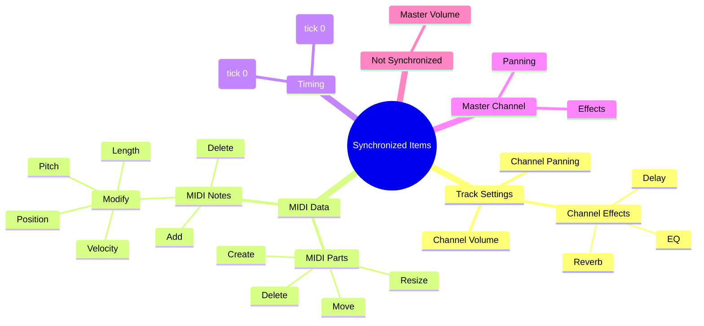

# Overview

**Document Version**: 1.0  
**Software Version**: 0.1.0  
**Last Updated**: 2026-01-14

---

Online DAW's collaboration feature uses a **hybrid architecture**:

- **Initial Connection Phase**: Obtain host information and WebRTC signaling through a signaling server (port 3000)
- **Subsequent Communication**: Real-time data exchange via WebRTC P2P direct communication

## Key Features

- **Server Resource Management**: Room creation when "Host" is clicked (maintained for 6 hours), "Allow Join" allows joining for only 60 seconds
- **Session Time Limit**: Server room expires after 6 hours (P2P termination depends on client handling of the server event)
- **Room Code Reuse**: Room is maintained for 6 hours, allowing reuse of the same room code
- **Star Topology**: Guests communicate through the host (simple implementation, centralized synchronization)
- **Low Latency**: Real-time synchronization via P2P direct communication
- **Scalability**: Multiple participants possible without server (after P2P connection is established)
- **Security**: Minimized data relay through server

## Synchronized Items

The following items are synchronized in real-time during collaboration sessions:

1. **Channel Volume** (track.volume): Volume level of each track
2. **Channel Panning** (track.pan): Panning position of each track (-1.0 ~ 1.0)
3. **Channel Effects** (track.effects): Effects applied to each track (EQ, Delay, Reverb, etc.)
4. **MIDI Parts** (project.midiParts): Creation, deletion, movement, resizing of MIDI parts
5. **MIDI Notes** (midiPart.notes): Addition, deletion, modification of notes (pitch, velocity, position, length, etc.)
6. **Time Signature**: Only the first event (tick 0) is synchronized
7. **BPM/Tempo**: Only the first event (tick 0) is synchronized
8. **Master Panning/Effects**: Master pan and effects are synchronized (master volume is not)

**Note**: Master volume is not synchronized. Each client keeps it locally.

---

