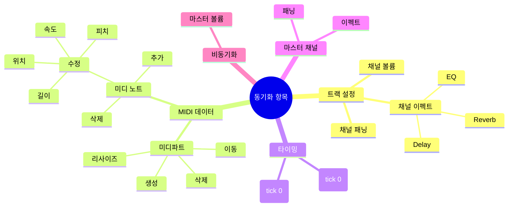

# 개요

**Document Version**: 1.0  
**Software Version**: 0.1.0  
**Last Updated**: 2026-01-14

---

Online DAW의 콜라보레이션 기능은 **하이브리드 아키텍처**를 사용합니다:

- **초기 연결 단계**: 시그널링 서버(포트 3000)를 통해 호스트 정보 획득 및 WebRTC 시그널링
- **이후 통신**: WebRTC P2P 직접 통신으로 실시간 데이터 교환

## 주요 특징

- **서버 리소스 관리**: "Host" 클릭 시 룸 생성 (6시간 유지), "Allow Join"으로 60초 동안만 조인 허용
- **세션 시간 제한**: 6시간 후 서버 룸 만료 (P2P 종료는 클라이언트의 만료 이벤트 처리에 따라 다름)
- **룸 코드 재사용**: 룸이 6시간 동안 유지되어 같은 룸 코드 재사용 가능
- **Star 토폴로지**: 게스트는 호스트를 경유해서 통신 (구현 단순, 중앙 집중식 동기화)
- **낮은 지연시간**: P2P 직접 통신으로 실시간 동기화
- **확장성**: 서버 없이 다수 참여 가능 (P2P 연결 수립 후)
- **보안**: 서버를 통한 데이터 중계 최소화

## 동기화되는 항목

콜라보레이션 세션에서 다음 항목들이 실시간으로 동기화됩니다:

1. **채널 볼륨** (track.volume): 각 트랙의 볼륨 레벨
2. **채널 패닝** (track.pan): 각 트랙의 패닝 위치 (-1.0 ~ 1.0)
3. **채널 이펙트** (track.effects): 각 트랙에 적용된 이펙트 (EQ, Delay, Reverb 등)
4. **미디파트** (project.midiParts): 미디파트의 생성, 삭제, 이동, 리사이즈 등
5. **미디 노트** (midiPart.notes): 노트의 추가, 삭제, 수정 (피치, 속도, 위치, 길이 등)
6. **박자/타임 시그니처**: tick 0의 첫 이벤트만 동기화
7. **BPM/템포**: tick 0의 첫 이벤트만 동기화
8. **마스터 패닝/이펙트**: 마스터 패닝/이펙트는 동기화 (마스터 볼륨은 제외)

**참고**: 마스터 볼륨은 동기화되지 않습니다. 각 클라이언트가 독립적으로 설정합니다.

---
