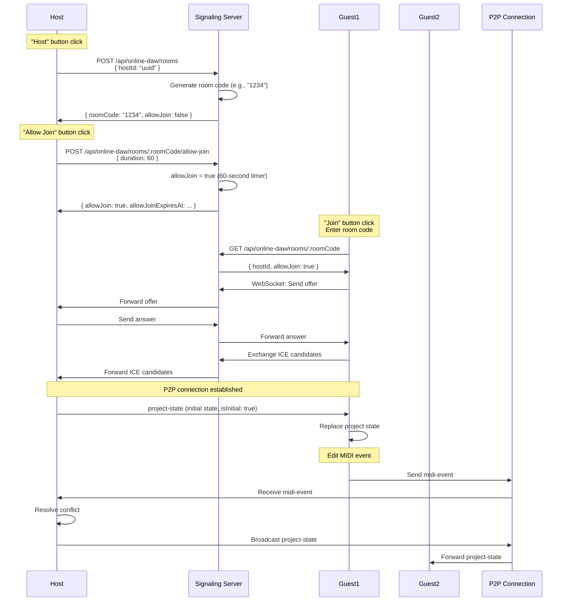

# Server API Specification

**Document Version**: 1.0  
**Software Version**: 0.1.0  
**Last Updated**: 2026-01-14

---

## Basic Information

- **Port**: 3000
- **Protocol**: WebSocket (signaling), HTTP REST (room management)
- **Base URL**: resolved via `VITE_COLLABORATION_SERVER_URL` (default: `http://10.0.0.79:3000`)

## REST API Endpoints

### 1. Room Registration (When Host Clicks "Host")

```
POST /api/online-daw/rooms
Content-Type: application/json
Headers: { "X-Client-Id": "client-uuid", "X-Host-Id": "host-uuid" }

Request Body:
{
  "hostId": "uuid-here"
}

Response 200:
{
  "success": true,
  "roomCode": "1234",  // 4-digit number generated by server
  "hostId": "uuid-here",
  "expiresAt": 1234567890123,  // 6 hours later (21600000ms)
  "allowJoin": false  // Initial: join disabled
}

Response 400:
{
  "success": false,
  "error": "No available room codes"  // When all room codes are in use (very rare)
}

Response 200: (When host already has a room)
{
  "success": true,
  "roomCode": "1234",  // Return existing room code
  "hostId": "uuid",
  "status": "active",
  "allowJoin": false,
  "createdAt": 1234567890
}
```

**Important:**
- Room code is generated and returned by the server
- Server selects one from available 4-digit numbers (0000-9999)
- Excludes room codes that are already in use
- Room is maintained for 6 hours (21600000ms)
- Initial state is allowJoin: false (join disabled)

### 2. Room Query (When Participant Joins)

```
GET /api/online-daw/rooms/:roomCode
Headers: { "X-Client-Id": "client-uuid" }  // Optional, for kick verification

Response 200:
{
  "success": true,
  "roomCode": "1234",
  "hostId": "uuid-here",
  "status": "active",
  "allowJoin": true,  // Join permission status
  "allowJoinExpiresAt": 1234567950123,  // Join permission expiration time (60 seconds later)
  "participantCount": 1,
  "maxParticipants": 4,
  "createdAt": 1234567890123,  // Room creation time (for kick verification)
  "expiresAt": 1234567890123  // Room expiration time (6 hours later)
}

Response 404:
{
  "success": false,
  "error": "Room not found"
}

Response 403:
{
  "success": false,
  "error": "Join not allowed",  // When allowJoin is false or participant has been kicked
  "message": "Host has not allowed joining." or "You have been kicked from this room."
}
```

**Kick Verification:**
- If client ID is provided, server checks kick status
- If kicked from same room instance: 403 Forbidden
- If new room instance: 200 OK (determined by room creation time)

### 2-1. Enable Join Permission (When Host Clicks "Allow Join")

**Important:** Host can call this API anytime to allow joining.
- Can be called again after join window expires
- If already in join-allowed state, timer restarts (extends by 60 seconds)

```
POST /api/online-daw/rooms/:roomCode/allow-join
Headers: { "X-Client-Id": "client-uuid" }
Content-Type: application/json

Request Body:
{
  "duration": 60  // Join permission duration (seconds)
}

Response 200:
{
  "success": true,
  "allowJoin": true,
  "allowJoinExpiresAt": 1234567950123  // Current time + 60 seconds
}

Response 403:
{
  "success": false,
  "error": "Unauthorized"  // When not the host
}
```

**Behavior:**
- If called when join permission has expired: immediately switches to join-allowed state (starts 60-second timer)
- If already in join-allowed state: timer restarts and extends by 60 seconds
- Host can call this API anytime

### 3. Delete Room (When Host Clicks "Stop Hosting", or Automatically After 6 Hours)

```
DELETE /api/online-daw/rooms/:roomCode
Headers: { "X-Client-Id": "client-uuid" }

Response 200:
{
  "success": true
}

Response 403:
{
  "success": false,
  "error": "Unauthorized"
}
```

**Note:** After 6 hours, the server room expires and a session-expired event is emitted. P2P termination depends on client handling.

### 4. Kick Participant (When Host Clicks Kick Button)

```
POST /api/online-daw/rooms/:roomCode/kick
Headers: { "X-Client-Id": "client-uuid" }
Content-Type: application/json

Request Body:
{
  "participantId": "guest-uuid"
}

Response 200:
{
  "success": true,
  "message": "Participant kicked"
}

Response 403:
{
  "success": false,
  "error": "Unauthorized"
}

Response 404:
{
  "success": false,
  "error": "Participant not found"
}
```

**Note:**
- Kick applies only to the current room instance
- Kicked participant can join when a new room is created with the same room code
- Kicked participant can join when a different host uses the same room code
- Kick is based on room instance, not room code or host

### 5. Room Expiration Warnings (Automatically Sent by Server)

Server sends warning messages via WebSocket before room expiration:

```
WebSocket Message (Server → All Clients)
{
  "action": "room-expiring",
  "roomCode": "1234",
  "data": {
    "minutesLeft": 30  // or 5, 1
  }
}
```

**Warning Times:**
- 30 minutes before (5 hours 30 minutes elapsed)
- 5 minutes before (5 hours 55 minutes elapsed)
- 1 minute before (5 hours 59 minutes elapsed)

## WebSocket API

### Connection

```
ws://<host>:3000/api/online-daw/signaling?clientId=<client-uuid>
```

### Message Format

```typescript
// Client → Server
interface ClientToServerMessage {
  action: 'register' | 'join' | 'signaling' | 'leave';
  roomCode: string;
  clientId: string;
  data?: any;
}

// Server → Client
interface ServerToClientMessage {
  action: 'connected' | 'registered' | 'joined' | 'signaling' | 'error' | 'room-closed' | 'kicked' | 'allow-join-expired' | 'room-expiring' | 'room-session-expired' | 'participant-joined' | 'participant-left';
  roomCode: string;
  data?: {
    minutesLeft?: number;  // Minutes remaining until room expiration
    roomCreatedAt?: number;  // Room creation time (for kick verification)
    participantId?: string;
    participantCount?: number;
    [key: string]: any;
  };
  error?: string;
}
```

### Message Flow



**1. Host Registration**
```json
// Client → Server
{
  "action": "register",
  "roomCode": "1234",
  "clientId": "host-uuid",
  "data": {
    "role": "host"
  }
}

// Server → Client
{
  "action": "registered",
  "roomCode": "1234",
  "data": {
    "status": "active"
  }
}
```

**2. Participant Join**
```json
// Client → Server
{
  "action": "join",
  "roomCode": "1234",
  "clientId": "client-uuid",
  "data": {
    "role": "participant"
  }
}

// Server → Client
{
  "action": "joined",
  "roomCode": "1234",
  "data": {
    "hostId": "host-uuid",
    "status": "active"
  }
}
```

**3. Signaling Message Relay**
```json
// Participant → Server → Host
{
  "action": "signaling",
  "roomCode": "1234",
  "clientId": "client-uuid",
  "data": {
    "type": "offer",
    "to": "host-uuid",
    "sdp": {...}
  }
}
```

---

