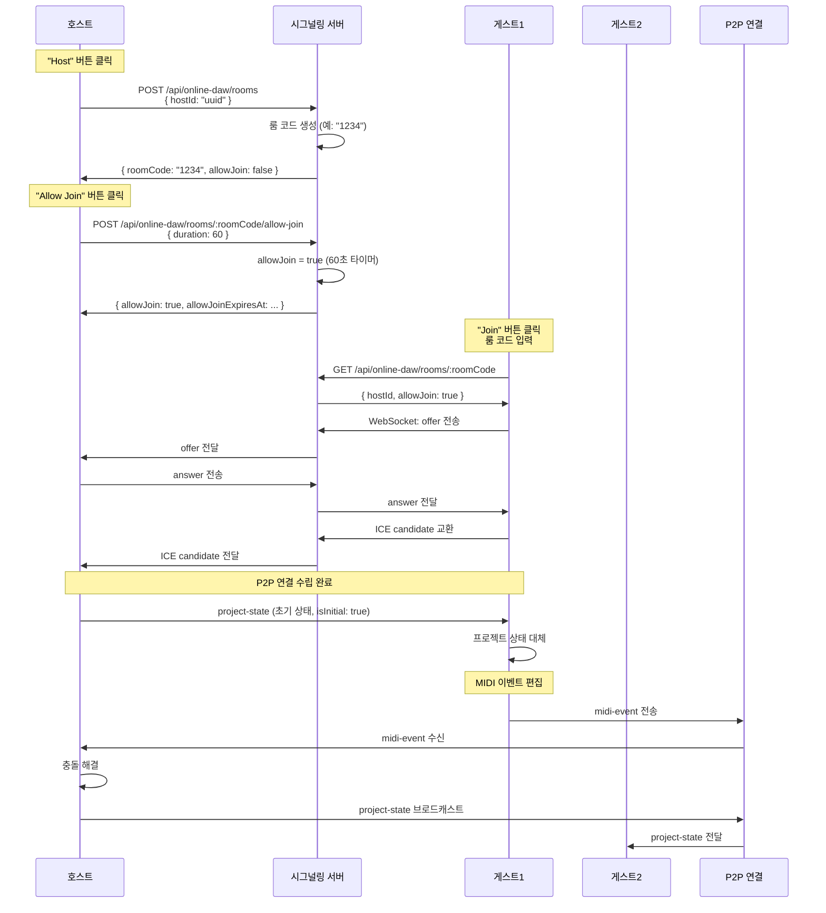

# 서버 API 스펙

**Document Version**: 1.0  
**Software Version**: 0.1.0  
**Last Updated**: 2026-01-14

---

## 기본 정보

- **포트**: 3000
- **프로토콜**: WebSocket (시그널링), HTTP REST (룸 관리)
- **Base URL**: `VITE_COLLABORATION_SERVER_URL` 기준 (기본값: `http://10.0.0.79:3000`)

## REST API 엔드포인트

### 1. 룸 등록 (호스트가 "Host" 클릭 시)

```
POST /api/online-daw/rooms
Content-Type: application/json
Headers: { "X-Client-Id": "client-uuid", "X-Host-Id": "host-uuid" }

Request Body:
{
  "hostId": "uuid-here"
}

Response 200:
{
  "success": true,
  "roomCode": "1234",  // 서버가 생성한 비어있는 4자리 숫자
  "hostId": "uuid-here",
  "expiresAt": 1234567890123,  // 6시간 후 (21600000ms)
  "allowJoin": false  // 초기값: 조인 불가
}

Response 400:
{
  "success": false,
  "error": "No available room codes"  // 모든 룸 코드가 사용 중인 경우 (매우 드묾)
}

Response 200: (호스트가 이미 룸이 있는 경우)
{
  "success": true,
  "roomCode": "1234",  // 기존 룸 코드 반환
  "hostId": "uuid",
  "status": "active",
  "allowJoin": false,
  "createdAt": 1234567890
}
```

**중요:**
- 룸 코드는 서버에서 생성하여 반환합니다
- 서버는 사용 가능한 4자리 숫자(0000-9999) 중 하나를 선택합니다
- 이미 사용 중인 룸 코드는 제외하고 할당합니다
- 룸은 6시간 동안 유지됩니다 (21600000ms)
- 초기 상태는 allowJoin: false (조인 불가)

### 2. 룸 조회 (참가자가 조인 시)

```
GET /api/online-daw/rooms/:roomCode
Headers: { "X-Client-Id": "client-uuid" }  // 선택사항, 강퇴 확인용

Response 200:
{
  "success": true,
  "roomCode": "1234",
  "hostId": "uuid-here",
  "status": "active",
  "allowJoin": true,  // 조인 허용 여부
  "allowJoinExpiresAt": 1234567950123,  // 조인 허용 만료 시간 (60초 후)
  "participantCount": 1,
  "maxParticipants": 4,
  "createdAt": 1234567890123,  // 룸 생성 시간 (강퇴 확인용)
  "expiresAt": 1234567890123  // 룸 만료 시간 (6시간 후)
}

Response 404:
{
  "success": false,
  "error": "Room not found"
}

Response 403:
{
  "success": false,
  "error": "Join not allowed",  // allowJoin이 false이거나 강퇴된 경우
  "message": "Host has not allowed joining." or "You have been kicked from this room."
}
```

**강퇴 확인:**
- 클라이언트 ID가 제공되면 서버가 강퇴 여부 확인
- 같은 룸 인스턴스에서 강퇴된 경우: 403 Forbidden
- 새 룸 인스턴스인 경우: 200 OK (룸 생성 시간으로 판단)

### 2-1. 조인 허용 활성화 (호스트가 "Allow Join" 클릭 시)

**중요:** 호스트는 언제든지 이 API를 호출하여 조인 허용 상태로 만들 수 있습니다.
- 조인 허용이 만료된 후에도 다시 호출 가능
- 이미 조인 허용 상태인 경우 타이머가 재시작됨 (60초 연장)

```
POST /api/online-daw/rooms/:roomCode/allow-join
Headers: { "X-Client-Id": "client-uuid" }
Content-Type: application/json

Request Body:
{
  "duration": 60  // 조인 허용 시간 (초)
}

Response 200:
{
  "success": true,
  "allowJoin": true,
  "allowJoinExpiresAt": 1234567950123  // 현재 시간 + 60초
}

Response 403:
{
  "success": false,
  "error": "Unauthorized"  // 호스트가 아닌 경우
}
```

**동작:**
- 조인 허용이 만료된 상태에서 호출: 즉시 조인 허용 상태로 전환 (60초 타이머 시작)
- 이미 조인 허용 상태인 경우: 타이머가 재시작되어 60초 연장
- 호스트는 언제든지 이 API를 호출할 수 있음

### 3. 룸 삭제 (호스트가 "Stop Hosting" 클릭 시, 또는 6시간 후 자동)

```
DELETE /api/online-daw/rooms/:roomCode
Headers: { "X-Client-Id": "client-uuid" }

Response 200:
{
  "success": true
}

Response 403:
{
  "success": false,
  "error": "Unauthorized"
}
```

**참고:** 6시간 후 서버 룸은 만료되며 만료 이벤트가 전송됩니다. P2P 종료는 클라이언트 처리에 따라 달라집니다.

### 4. 참가자 강퇴 (호스트가 강퇴 버튼 클릭 시)

```
POST /api/online-daw/rooms/:roomCode/kick
Headers: { "X-Client-Id": "client-uuid" }
Content-Type: application/json

Request Body:
{
  "participantId": "guest-uuid"
}

Response 200:
{
  "success": true,
  "message": "Participant kicked"
}

Response 403:
{
  "success": false,
  "error": "Unauthorized"
}

Response 404:
{
  "success": false,
  "error": "Participant not found"
}
```

**참고:** 
- 강퇴된 참가자는 현재 룸 인스턴스에서만 재조인이 거부됩니다
- 같은 호스트가 같은 룸 코드로 새 룸을 만들면 참가 가능합니다
- 다른 호스트가 같은 룸 코드를 사용해도 참가 가능합니다
- 강퇴는 룸 인스턴스 기준이지, 룸 코드나 호스트 기준이 아닙니다

### 5. 룸 만료 경고 (서버에서 자동 전송)

서버는 룸 만료 전에 WebSocket을 통해 경고 메시지를 전송합니다:

```
WebSocket 메시지 (서버 → 모든 클라이언트)
{
  "action": "room-expiring",
  "roomCode": "1234",
  "data": {
    "minutesLeft": 30  // 또는 5, 1
  }
}
```

**경고 시점:**
- 30분 전 (5시간 30분 경과)
- 5분 전 (5시간 55분 경과)
- 1분 전 (5시간 59분 경과)

## WebSocket API

### 연결

```
ws://<host>:3000/api/online-daw/signaling?clientId=<client-uuid>
```

### 메시지 형식

```typescript
// 클라이언트 → 서버
interface ClientToServerMessage {
  action: 'register' | 'join' | 'signaling' | 'leave';
  roomCode: string;
  clientId: string;
  data?: any;
}

// 서버 → 클라이언트
interface ServerToClientMessage {
  action: 'connected' | 'registered' | 'joined' | 'signaling' | 'error' | 'room-closed' | 'kicked' | 'allow-join-expired' | 'room-expiring' | 'room-session-expired' | 'participant-joined' | 'participant-left';
  roomCode: string;
  data?: {
    minutesLeft?: number;  // 룸 만료까지 남은 시간 (분)
    roomCreatedAt?: number;  // 룸 생성 시간 (강퇴 확인용)
    participantId?: string;
    participantCount?: number;
    [key: string]: any;
  };
  error?: string;
}
```

### 메시지 플로우



**1. 호스트 등록**
```json
// 클라이언트 → 서버
{
  "action": "register",
  "roomCode": "1234",
  "clientId": "host-uuid",
  "data": {
    "role": "host"
  }
}

// 서버 → 클라이언트
{
  "action": "registered",
  "roomCode": "1234",
  "data": {
    "status": "active"
  }
}
```

**2. 참가자 참여**
```json
// 클라이언트 → 서버
{
  "action": "join",
  "roomCode": "1234",
  "clientId": "client-uuid",
  "data": {
    "role": "participant"
  }
}

// 서버 → 클라이언트
{
  "action": "joined",
  "roomCode": "1234",
  "data": {
    "hostId": "host-uuid",
    "status": "active"
  }
}
```

**3. 시그널링 메시지 전달**
```json
// 참가자 → 서버 → 호스트
{
  "action": "signaling",
  "roomCode": "1234",
  "clientId": "client-uuid",
  "data": {
    "type": "offer",
    "to": "host-uuid",
    "sdp": {...}
  }
}
```

---
