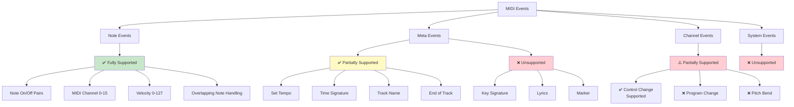
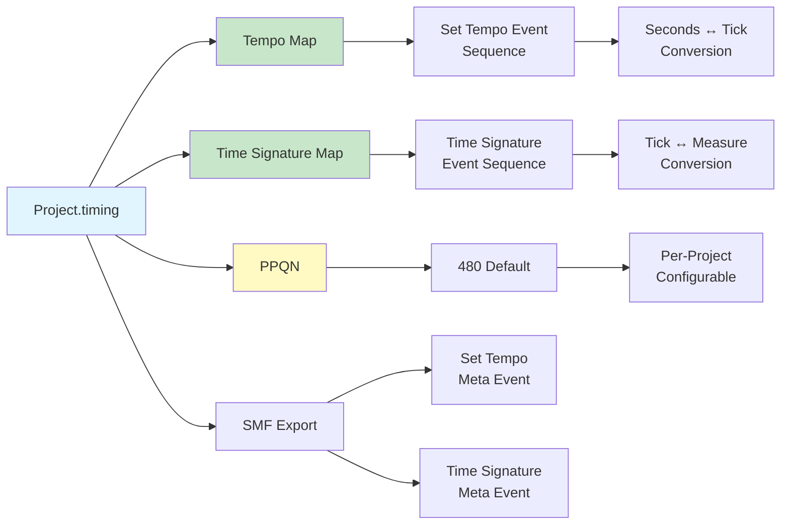
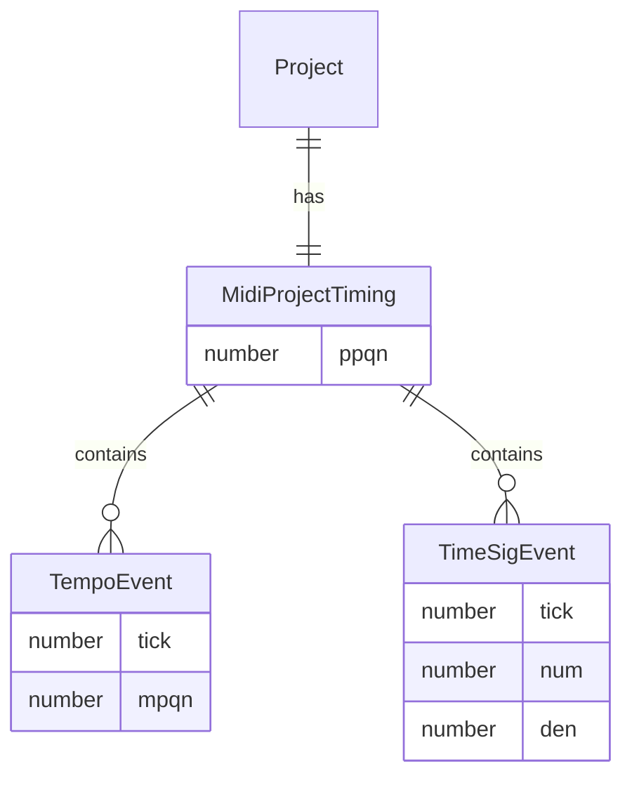

# MIDI Standard Compliance Specification

## Overview

This document defines the MIDI standard compliance specification for the Online DAW project. The project is designed with a **music production focus** and does not support video synchronization features.

**Evaluation Criteria**: Standard MIDI File (SMF) Format 0/1, MIDI 1.0 Specification

**Document Version**: 1.0  
**Software Version**: 0.1.0  
**Last Updated**: 2026-01-14

---

## 1. Time Division

### 1.1 Supported Method: PPQN (Pulses Per Quarter Note)

The project only supports **PPQN (Pulses Per Quarter Note)**.

- **Default**: 480 PPQN (1 quarter note = 480 ticks)
- **Purpose**: Musical time representation (directly related to BPM and time signature)
- **Storage Location**:
  - JSON project: `timing.ppqn`
  - MIDI file: `timeDivision` field in SMF header

### 1.1.1 Implementation Recommendation: Variable PPQN Support

PPQN is always "quarter note based", and changing the beat unit (e.g., 4/8) only changes the number of ticks per beat. Therefore, the following rules apply.

- ✅ **Implementation Complete**: UI/quantize/snap use `timing.ppqn` and 480 constant is only used as default
  - `MeasureRuler.tsx`, `MidiEditor.tsx`, `EventDisplay.tsx` use `getPpqn(getProject())`
  - All quantize calculations reflect the project's actual PPQN value
- Beat/measure tick calculation:
  - `ticksPerBeat = ppqn * 4 / beatUnit`
  - `ticksPerMeasure = ppqn * num * 4 / den`
- Tempo is MPQN (quarter note) based, so when changing only the "beat unit" from 4/4 to 4/8, adjust BPM by 2x if maintaining perceived speed is needed
- Abnormal PPQN handling:
  - Import currently trusts the SMF header value (no explicit validation)
  - Export clamps `timeDivision` to 1..0x7FFF

### 1.2 Unsupported: SMPTE Time Division

**SMPTE (Society of Motion Picture and Television Engineers)** method is not supported.

**Reason:**
- Project is designed for **music production only**
- Video synchronization features are not needed
- Most general MIDI files use PPQN

**Impact:**
- Opening SMPTE format MIDI files will cause errors
- Film/broadcast MIDI files cannot be processed
- No problem for general music production

**Technical Details:**
```typescript
// src/core/midi/MidiParser.ts
if (isSmpte) {
  throw new Error(
    `SMPTE timeDivision is not supported. ` +
    `Only PPQN (Pulses Per Quarter Note) format is supported.`
  );
}
```

---

## 2. Supported MIDI Standard Features



### 2.1 Note Events

✅ **Fully Supported**

- **Note On/Note Off Event Pairs**
  - SMF standard compliance: Notes represented as NoteOn/NoteOff pairs
  - NoteOn velocity=0 treated as NoteOff (SMF compatibility)
- **MIDI Channel (0-15)**
  - Channel information preserved per note
  - Channel information maintained on Import/Export
- **Velocity (0-127)**
  - Note On velocity: Required
  - Release velocity (Note Off): Optionally supported
- **Overlapping Note Handling**
  - Supports overlapping notes of same channel/pitch
  - Matched using FIFO (First In, First Out) method

### 2.2 Meta Events

✅ **Partially Supported** (intentionally limited)

The project **only supports meta events essential for music editing**, and lyrics, markers, key signatures, etc. are not supported in the current version.

#### 2.2.1 Supported Meta Events

**Fully Supported (4):**
- `Set Tempo` (0x51): Tempo change
- `Time Signature` (0x58): Time signature change
- `Track Name` (0x03): Track name
- `End of Track` (0x2F): Track end marker

#### 2.2.2 Unsupported Meta Events

##### Key Signature (0x59) - Key Signature

**Function:**
- Key signature information (e.g., C Major, A Minor, F# Major)
- Data: Key, minor/major flag
- Purpose:
  - Sharp/flat notation in score display
  - Music theory analysis
  - Instrument performance guide

**Current Status:**
- Ignored on import (data loss)
- Not exported

**Impact Example:**
```
Original MIDI file:
Tick 0:    Key Signature (Key: 2 sharps, Major = G Major)
Tick 480:  NoteOn (G4)

After Import:
- Notes are preserved
- Key signature information is lost
- Score display may not show key signature
```

##### Lyrics (0x05) - Lyrics

**Function:**
- Lyric text information
- Synchronized with notes by time
- Purpose:
  - Lyric display
  - Karaoke
  - Vocal track guide

**Current Status:**
- Ignored on import (data loss)
- Not exported

**Impact Example:**
```
Original MIDI file:
Tick 0:    NoteOn (C4)
Tick 100:  Lyrics ("Hello")
Tick 480:  NoteOn (E4)
Tick 580:  Lyrics ("World")
Tick 960:  NoteOff (C4)

After Import:
- Notes are preserved
- Lyric information is lost
- Lyrics cannot be displayed
```

##### Marker (0x06) - Marker

**Function:**
- Timeline markers/bookmarks
- Text labels (e.g., "Verse 1", "Chorus", "Bridge")
- Purpose:
  - Section division
  - Edit reference points
  - Project structure display

**Current Status:**
- Ignored on import (data loss)
- Not exported

**Impact Example:**
```
Original MIDI file:
Tick 0:    Marker ("Intro")
Tick 1920: Marker ("Verse 1")
Tick 7680: Marker ("Chorus")
Tick 11520: Marker ("Verse 2")

After Import:
- Notes are preserved
- Marker information is lost
- Section division information lost
```

##### Cue Point (0x07) - Cue Point

**Function:**
- Cue points/trigger points
- Text labels
- Purpose:
  - Audio/video synchronization
  - Event triggers
  - Production markers

**Current Status:**
- Ignored on import (data loss)
- Not exported

##### Other Meta Events

**Unsupported Examples:**
- Sequence/Track Name (0x03 only supports Track Name, Sequence Name is separate)
- Instrument Name (0x04)
- Copyright Notice (0x02)
- Text Event (0x01)
- Sequencer-Specific (0x7F)
- Other standard/non-standard meta events

**Code Location:**
```typescript
// src/core/midi/MidiParser.ts (lines 157-175)
// Only 4 supported events are processed, rest are ignored
```

#### 2.2.3 Design Decision

**Reasons for Intentional Limitation:**
1. **Music Editing Focus**: Only supports core information like tempo, time signature, track name
2. **Complexity Management**: Lyrics, markers, etc. increase UI/UX complexity
3. **Current Version Scope**: Not included in current version
4. **Sufficient for Basic Editing**: 4 supported events are sufficient for Note editing focus

**Impact Summary:**
- No problem for basic Note editing
- Information loss occurs in MIDI files where lyrics, markers, key signatures are important
- Export after import may differ from original

### 2.3 Tempo & Time Signature Map

✅ **Fully Supported** (tempo map-based conversion improvements completed)



- **Tempo Map**: Sequence of tempo change events
- **Time Signature Map**: Sequence of time signature change events
- **SSOT (Single Source of Truth)**: `Project.timing` field
- **JSON Storage**: `timing.tempoMap`, `timing.timeSigMap`
- **MIDI Export**: Converted to Set Tempo, Time Signature meta events
- **Seconds↔Tick Conversion**: Accurately handles tempo changes based on tempo map
  - `ticksToSeconds()`: Uses entire tempo map to calculate per-segment
  - `secondsToTicks()`: Uses entire tempo map to calculate per-segment
  - Ensures accurate time calculation even for MIDI files with tempo changes

---

## 3. Unsupported MIDI Features

### 3.1 Channel Events

⚠️ **Partially Supported** (Control Change is supported, Program Change/Pitch Bend are unsupported)

The project focuses on **basic music editing centered on Note On/Off events**, and while Control Change is supported, other channel events are not supported in the current version.

#### 3.1.1 Control Change (CC) - Control Change

✅ **Supported**

**Function:**
- Real-time parameter control messages
- Consists of CC number (0-127) and value (0-127)
- Main Uses:
  - **CC#7 (Volume)**: Channel volume control
  - **CC#10 (Pan)**: Left/right panning control
  - **CC#11 (Expression)**: Expression control
  - **CC#64 (Sustain Pedal)**: Sustain pedal
  - **CC#1 (Modulation)**: Modulation wheel
  - **CC#91 (Reverb)**: Reverb effect amount
  - **CC#93 (Chorus)**: Chorus effect amount

**Current Status:**
- ✅ Parsed and stored in project model on import
- ✅ Exported to MIDI file on export
- ⚠️ Playback processing is currently limited to CC64 (Sustain Pedal); other CCs are preserved but not applied to the audio engine
- Operates independently from DAW internal volume/pan settings

**Implementation Location:**
- `src/core/midi/MidiParser.ts`: Control Change parsing
- `src/types/project.ts`: CC events stored in project model
- `src/core/audio/buildPlaybackEvents.ts`: CC processing during playback
- `src/core/midi/MidiExporter.ts`: CC export on export

#### 3.1.2 Program Change - Program Change

**Function:**
- Instrument (sound) change message
- Instrument selection by program number (0-127)
- Examples:
  - 0 = Acoustic Grand Piano
  - 25 = Steel Guitar
  - 40 = Violin
  - 56 = Trumpet

**Current Status:**
- Ignored on import (data loss)
- Not exported
- Only uses DAW's per-track `instrument` setting (independent of Program Change)

**Impact Example:**
```
Original MIDI file:
Tick 0:    Program Change (0 = Piano)
Tick 480:  NoteOn (C4)
Tick 1920: Program Change (40 = Violin)  ← This information is lost
Tick 2400: NoteOn (E4)

After Import:
- Notes are preserved
- Instrument change information is lost
- Can only be controlled by DAW's track instrument setting
```

#### 3.1.3 Pitch Bend - Pitch Bend

**Function:**
- Continuously changes pitch (fine adjustment, not semitone units)
- Value range: -8192 ~ +8191 (center value 0)
- Purpose:
  - Express fine pitch changes in instruments like guitar/violin
  - Glissando (slide) effects

**Current Status:**
- Ignored on import (data loss)
- Not exported
- Currently only supports exact pitch (no pitch bend)

**Impact Example:**
```
Original MIDI file:
Tick 0:    NoteOn (C4)
Tick 480:  Pitch Bend (+2048, about semitone up)  ← This information is lost
Tick 960:  Pitch Bend (0, back to original pitch)  ← This information is lost
Tick 1440: NoteOff (C4)

After Import:
- Notes are preserved
- Pitch changes are lost
- Only exact pitch is played
```

#### 3.1.4 Other Channel Events

**Unsupported Events:**
- Channel Aftertouch (channel pressure)
- Polyphonic Aftertouch (polyphonic pressure)

**Code Location:**
```typescript
// src/core/midi/MidiParser.ts (line 229)
// Other event types are ignored (ControlChange, ProgramChange, etc.)
```

#### 3.1.5 Design Decision

**Reasons for Intentional Unsupport:**
1. **Music Production Focus**: Focuses on basic editing centered on Note On/Off events
2. **Complexity Management**: Supporting advanced channel events increases UI/UX complexity
3. **Current Version Scope**: Not included in current version
4. **Future Extensibility**: Data model is designed to be extensible

**Alternatives:**
- Volume/Pan: Use DAW's per-track `volume`, `pan` fields
- Instrument: Use DAW's per-track `instrument` field
- Pitch Bend: Currently unsupported (can be added in future)

### 3.2 System Events

❌ **Intentionally Unsupported** (not included in current version)

- System Exclusive (SysEx)
- System Common Messages
- System Real-Time Messages

**Design Decision:**
Not needed for general music production and not supported in the current version.

### 3.3 Video Synchronization Features

❌ **Intentionally Unsupported**

- SMPTE Time Division
- MTC (MIDI Time Code)
- Video frame synchronization

**Design Philosophy:**
The project is designed as a **pure music production tool** and does not include video synchronization features.

---

## 4. Data Model

### 4.1 Tick-Based Design

```mermaid
graph TB
    A[Project] --> B[Timing]
    A --> C[Tracks]
    A --> D[MidiParts]
    
    B --> B1[PPQN: 480]
    B --> B2[Tempo Map]
    B --> B3[Time Signature Map]
    
    D --> D1[MidiPart]
    D1 --> D1a[startTick<br/>Absolute Position]
    D1 --> D1b[durationTicks<br/>Length]
    D1 --> D1c[notes: MidiNote[]]
    
    D1c --> E[MidiNote]
    E --> E1[note: 0-127]
    E --> E2[velocity: 0-127]
    E --> E3[channel?: 0-15]
    E --> E4[startTick<br/>Absolute Position]
    E --> E5[durationTicks<br/>Length]
    
    F[UI Notation] --> F1[Measure/Bar<br/>Derived Concept]
    F1 -.Conversion.-> D1a
    F1 -.Conversion.-> E4
    
    G[SMF Import/Export] --> G1[Delta-time<br/>Conversion]
    G1 -.Conversion.-> D1a
    G1 -.Conversion.-> E4
    
    style A fill:#e1f5ff
    style B fill:#c8e6c9
    style D fill:#fff9c4
    style E fill:#ffebee
    style F fill:#f3e5f5
    style G fill:#e8eaf6
```

**Core Principles:**
- All time representation is **absolute Tick** based
- Measure/Bar is for UI notation (derived concept)
- Delta-time conversion only on SMF Import/Export

**Data Structure:**
```typescript
interface MidiNote {
  note: number;              // 0-127
  velocity: number;          // 0-127
  channel?: number;          // 0-15 (SMF standard compliance)
  releaseVelocity?: number;   // NoteOff velocity (SMF standard compliance)
  startTick: number;         // Absolute Tick position
  durationTicks: number;     // Length in Tick units
}

interface MidiControlChange {
  tick: number;              // Absolute Tick position
  controller: number;        // 0-127
  value: number;             // 0-127
  channel?: number;          // 0-15 (SMF standard compliance)
}

interface MidiPart {
  id: string;
  trackId: string;
  startTick: number;         // Absolute Tick position
  durationTicks: number;     // Length in Tick units
  notes: MidiNote[];
  controlChanges?: MidiControlChange[];
}
```

### 4.2 Timing Map Structure



```typescript
interface MidiProjectTiming {
  ppqn: number;              // PPQN (default: 480)
  tempoMap: TempoEvent[];    // Sequence of tempo change events
  timeSigMap: TimeSigEvent[]; // Sequence of time signature change events
}
```

---

## 5. File Format

### 5.1 JSON Project File

**Structure:**
```json
{
  "version": 2,
  "timing": {
    "ppqn": 480,
    "tempoMap": [
      { "tick": 0, "mpqn": 500000 }
    ],
    "timeSigMap": [
      { "tick": 0, "num": 4, "den": 4 }
    ]
  },
  "tracks": [...],
  "midiParts": [...]
}
```

**Features:**
- `timing.ppqn`: Stores PPQN value
- Legacy compatibility: `bpm`, `timeSignature` fields may exist in old files and are only used when `timing` is missing (current saves do not add them explicitly)

### 5.2 MIDI File (.mid)

**SMF Structure:**
```
[MThd] (Header)
  - Format: 0 or 1 (Format 0: single track, Format 1: multi-track)
  - Tracks: Number of tracks
  - Time Division: PPQN value (e.g., 480)

[MTrk] (Track 1)
  - Delta-time event stream
  - NoteOn/NoteOff events
  - Set Tempo, Time Signature meta events

[MTrk] (Track 2) - If Format 1
  ...
```

**Features:**
- ✅ **Format 0 Support**: Can import single-track MIDI files
- ✅ **Format 1 Support**: Can import multi-track MIDI files
- Time Division is always stored in PPQN format
- SMPTE format is not supported

---

## 6. Import/Export Rules

### 6.1 SMF Import

**Supported Formats:**
- ✅ **Format 0**: Single-track MIDI files
- ✅ **Format 1**: Multi-track MIDI files
- ❌ **Format 2**: Unsupported (multiple sequences)

**Processing Order:**
1. Parse SMF header (check Format, Time Division)
2. If Format 2, throw error (unsupported)
3. If SMPTE format, throw error
4. If PPQN format, store in `timing.ppqn`
5. Parse events per track (Format 0 is single track, Format 1 is multi-track)
6. Convert NoteOn/NoteOff pairs to notes (FIFO method)
7. Convert Tempo/Time Signature meta events to Maps
8. Parse and store Control Change events
9. Unsupported events are ignored (however, **event bytes are accurately skipped to maintain track parsing integrity**)

**Parser Integrity Guarantee (Important):**
- Even if unsupported Channel Events (e.g., CC/Program Change/Pitch Bend) are mixed in, **Note event parsing does not break**
- SysEx events (0xF0/0xF7) in SMF read length (VLQ) and safely skip
- Supports Running Status, preventing track desync even when supported/unsupported events are mixed

### 6.2 SMF Export

**Processing Order:**
1. Export always writes **Format 1** with a Conductor Track (tempo/time signature in track 1)
1. Use `timing.ppqn` as `timeDivision` in SMF header
2. Flatten each track's MidiPart to create event stream
3. Convert notes to NoteOn/NoteOff event pairs
4. Convert Tempo/Time Signature Maps to meta events
5. Convert to delta-time and save

**Event Sorting Rules (Compatibility/Standard-Friendly):**
- At the same tick, sort as **Meta events (TrackName/Tempo/TimeSignature) → NoteOff → Control Change → NoteOn**
- Purpose: Prevent stuck notes in some players when retriggering same pitch + clarify meta event application timing

**End of Track Handling (Compatibility/Accuracy):**
- `End of Track` meta event is generally placed at the track's last tick and does not create unnecessary length increase.

--- 

## 10. Validation (Unit Tests)

- `npm run test:unit`: Validates "standard compliance core" such as tempo map-based tick↔seconds conversion, same tick event order
- `npm run test:midi-all`: Regression tests for existing tick/migration/edge cases

---

## 7. Standard Compliance Score

| Item | Score | Notes |
|------|-------|-------|
| PPQN Time Division | 10/10 | Fully supported |
| SMPTE Time Division | 0/10 | Intentionally unsupported |
| Note Events | 10/10 | Fully supported (including channel, velocity) |
| Tempo/Time Signature | 10/10 | Fully supported based on Map |
| Control Change | 10/10 | ✅ Supported (parsing/playback/Export all supported) |
| Program Change, Pitch Bend, etc. | 0/10 | Intentionally unsupported (not included in current version) |
| Other Meta Events | 2/10 | Intentionally limited (not included in current version) |

**Overall Average**: 5.3/10

**Interpretation:**
- **Music Production Core Features**: 10/10 (Perfect support)
- **Advanced MIDI Features**: 0/10 (Intentionally unsupported, not included in current version)
- **Video Synchronization**: 0/10 (Intentionally unsupported)

---

## 8. Limitations Summary

### 8.1 Unsupported Files

- MIDI files using SMPTE Time Division
- MIDI files where Program Change, Pitch Bend, etc. are important (data loss, Control Change is supported)
  - **Note**: Files with these events can still be imported, but the information is lost

### 8.2 Supported Files

- General music production MIDI files (PPQN-based)
- MIDI files centered on Note On/Off events
- MIDI files with Tempo/Time Signature changes

### 8.3 Design Philosophy

1. **Music Production Only**: Excludes video synchronization features
2. **Standard Compliance First**: Supported features strictly comply with SMF standard
3. **Data Preservation**: Data of supported features is perfectly preserved on Import/Export
4. **Clear Limitations**: Unsupported features are clearly documented

---

## 9. References

- [Standard MIDI File Format Specification](https://www.midi.org/specifications-old/item/standard-midi-files-smf)
- [MIDI 1.0 Specification](https://www.midi.org/specifications-old/item/the-midi-1.0-specification)
- [MIDI_REFACTORING_PLAN.md](../../MIDI_REFACTORING_PLAN.md) - Project refactoring plan

---

**Written**: 2024  
**Version**: 1.0  
**Status**: Final Specification

