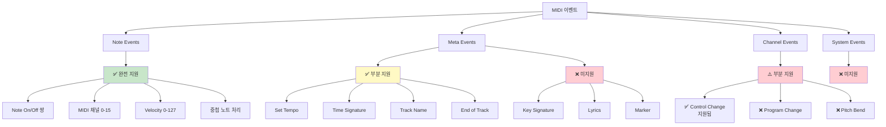
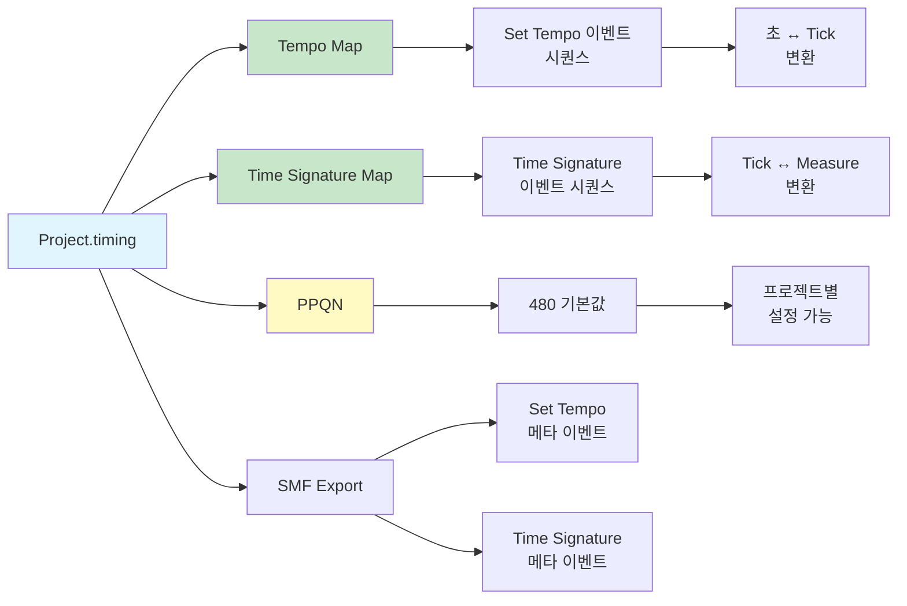
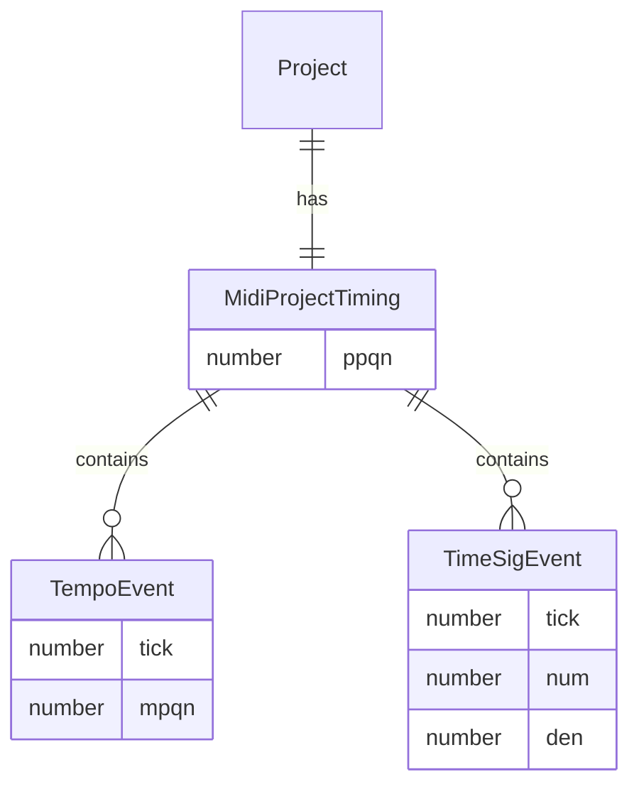

# MIDI 표준 준수 스펙

## 개요

이 문서는 Online DAW 프로젝트의 MIDI 표준 준수 사양을 정의합니다. 프로젝트는 **음악 제작 중심**으로 설계되었으며, 영상 동기화 기능은 지원하지 않습니다.

**평가 기준**: Standard MIDI File (SMF) Format 0/1, MIDI 1.0 Specification

**Document Version**: 1.0  
**Software Version**: 0.1.0  
**Last Updated**: 2026-01-14

---

## 1. Time Division (시간 단위)

### 1.1 지원 방식: PPQN (Pulses Per Quarter Note)

프로젝트는 **PPQN (Pulses Per Quarter Note)** 방식만 지원합니다.

- **기본값**: 480 PPQN (4분음표 1개 = 480 tick)
- **용도**: 음악적 시간 표현 (BPM, 박자표와 직접 연관)
- **저장 위치**:
  - JSON 프로젝트: `timing.ppqn`
  - MIDI 파일: SMF 헤더의 `timeDivision` 필드

### 1.1.1 구현 권장사항: PPQN 가변 지원

PPQN은 항상 "4분음표 기준"이며, 박자 단위(예: 4/8) 변경은 박자당 tick 수만 바뀝니다. 따라서 다음 규칙을 적용합니다.

- ✅ **구현 완료**: UI/퀀타이즈/스냅은 `timing.ppqn`을 사용하고 480 상수는 기본값으로만 사용
  - `MeasureRuler.tsx`, `MidiEditor.tsx`, `EventDisplay.tsx`에서 `getPpqn(getProject())` 사용
  - 모든 퀀타이즈 계산이 프로젝트의 실제 PPQN 값을 반영
- 박자/마디 tick 계산:
  - `ticksPerBeat = ppqn * 4 / beatUnit`
  - `ticksPerMeasure = ppqn * num * 4 / den`
- Tempo는 MPQN(quarter note) 기준이므로, 4분→8분으로 "박자 단위만" 바꿀 때 체감 속도 유지가 필요하면 BPM을 2배로 조정
- 비정상 PPQN 처리:
  - Import 시에는 SMF 헤더 값을 그대로 사용 (명시적 검증 없음)
  - Export 시 `timeDivision`을 1..0x7FFF 범위로 클램프

### 1.2 미지원: SMPTE Time Division

**SMPTE (Society of Motion Picture and Television Engineers)** 방식은 지원하지 않습니다.

**이유:**
- 프로젝트는 **음악 제작 전용**으로 설계됨
- 영상 동기화 기능이 필요하지 않음
- 일반적인 MIDI 파일은 대부분 PPQN 사용

**영향:**
- SMPTE 포맷 MIDI 파일을 열면 에러 발생
- 영화/방송용 MIDI 파일은 처리 불가능
- 일반 음악 제작에는 문제 없음

**기술적 세부사항:**
```typescript
// src/core/midi/MidiParser.ts
if (isSmpte) {
  throw new Error(
    `SMPTE timeDivision is not supported. ` +
    `Only PPQN (Pulses Per Quarter Note) format is supported.`
  );
}
```

---

## 2. 지원하는 MIDI 표준 기능



### 2.1 Note Events (노트 이벤트)

✅ **완전 지원**

- **Note On/Note Off 이벤트 쌍**
  - SMF 표준 준수: NoteOn/NoteOff 쌍으로 노트 표현
  - NoteOn velocity=0을 NoteOff로 처리 (SMF 호환성)
- **MIDI 채널 (0-15)**
  - 노트별 채널 정보 보존
  - Import/Export 시 채널 정보 유지
- **Velocity (0-127)**
  - Note On velocity: 필수
  - Release velocity (Note Off): 선택적 지원
- **중첩 노트 처리**
  - 동일 채널/피치의 중첩 노트 지원
  - FIFO (First In, First Out) 방식으로 매칭

### 2.2 Meta Events (메타 이벤트)

✅ **부분 지원** (의도적으로 제한)

프로젝트는 **음악 편집에 필수적인 메타 이벤트만 지원**하며, 가사, 마커, 조표 등은 현재 버전에서 지원하지 않습니다.

#### 2.2.1 지원하는 메타 이벤트

**완전 지원 (4개):**
- `Set Tempo` (0x51): 템포 변경
- `Time Signature` (0x58): 박자표 변경
- `Track Name` (0x03): 트랙 이름
- `End of Track` (0x2F): 트랙 종료 마커

#### 2.2.2 미지원 메타 이벤트

##### Key Signature (0x59) - 조표

**기능:**
- 조표 정보 (예: C Major, A Minor, F# Major)
- 데이터: 조(key), 마이너/메이저 여부
- 용도:
  - 악보 표시 시 샤프/플랫 표기
  - 음악 이론 분석
  - 악기 연주 가이드

**현재 상태:**
- Import 시 무시됨 (데이터 손실)
- Export 시 내보내지 않음

**영향 예시:**
```
원본 MIDI 파일:
Tick 0:    Key Signature (Key: 2 sharps, Major = G Major)
Tick 480:  NoteOn (G4)

Import 후:
- 노트는 보존됨
- 조표 정보는 사라짐
- 악보 표시 시 조표가 없을 수 있음
```

##### Lyrics (0x05) - 가사

**기능:**
- 가사 텍스트 정보
- 노트와 시간 동기화
- 용도:
  - 가사 표시
  - 카라오케
  - 보컬 트랙 가이드

**현재 상태:**
- Import 시 무시됨 (데이터 손실)
- Export 시 내보내지 않음

**영향 예시:**
```
원본 MIDI 파일:
Tick 0:    NoteOn (C4)
Tick 100:  Lyrics ("Hello")
Tick 480:  NoteOn (E4)
Tick 580:  Lyrics ("World")
Tick 960:  NoteOff (C4)

Import 후:
- 노트는 보존됨
- 가사 정보는 사라짐
- 가사 표시 불가능
```

##### Marker (0x06) - 마커

**기능:**
- 타임라인 마커/북마크
- 텍스트 라벨 (예: "Verse 1", "Chorus", "Bridge")
- 용도:
  - 섹션 구분
  - 편집 참조점
  - 프로젝트 구조 표시

**현재 상태:**
- Import 시 무시됨 (데이터 손실)
- Export 시 내보내지 않음

**영향 예시:**
```
원본 MIDI 파일:
Tick 0:    Marker ("Intro")
Tick 1920: Marker ("Verse 1")
Tick 7680: Marker ("Chorus")
Tick 11520: Marker ("Verse 2")

Import 후:
- 노트는 보존됨
- 마커 정보는 사라짐
- 섹션 구분 정보 손실
```

##### Cue Point (0x07) - 큐 포인트

**기능:**
- 큐 포인트/트리거 포인트
- 텍스트 라벨
- 용도:
  - 오디오/비디오 동기화
  - 이벤트 트리거
  - 프로덕션 마커

**현재 상태:**
- Import 시 무시됨 (데이터 손실)
- Export 시 내보내지 않음

##### 기타 메타 이벤트

**미지원 예시:**
- Sequence/Track Name (0x03은 Track Name만 지원, Sequence Name은 별도)
- Instrument Name (0x04)
- Copyright Notice (0x02)
- Text Event (0x01)
- Sequencer-Specific (0x7F)
- 기타 표준/비표준 메타 이벤트

**코드 위치:**
```typescript
// src/core/midi/MidiParser.ts (157-175줄)
// 지원하는 4개만 처리, 나머지는 무시됨
```

#### 2.2.3 설계 결정

**의도적으로 제한하는 이유:**
1. **음악 편집 중심**: 템포, 박자표, 트랙 이름 등 핵심 정보만 지원
2. **복잡도 관리**: 가사, 마커 등은 UI/UX 복잡도 증가
3. **현재 버전 범위**: 현재 버전에서는 포함하지 않음
4. **기본 편집에 충분**: Note 편집 중심으로는 지원 4개로 충분

**영향 요약:**
- 기본적인 Note 편집에는 문제 없음
- 가사, 마커, 조표 등이 중요한 MIDI 파일에서는 정보 손실 발생
- Import 후 Export 시 원본과 달라질 수 있음

### 2.3 Tempo & Time Signature Map

✅ **완전 지원** (템포맵 기반 변환 개선 완료)



- **Tempo Map**: 템포 변경 이벤트 시퀀스
- **Time Signature Map**: 박자표 변경 이벤트 시퀀스
- **SSOT (Single Source of Truth)**: `Project.timing` 필드
- **JSON 저장**: `timing.tempoMap`, `timing.timeSigMap`
- **MIDI Export**: Set Tempo, Time Signature 메타 이벤트로 변환
- **초↔Tick 변환**: 템포맵 기반으로 변속(tempo change) 정확히 처리
  - `ticksToSeconds()`: 템포맵 전체를 사용하여 각 구간별 계산
  - `secondsToTicks()`: 템포맵 전체를 사용하여 각 구간별 계산
  - 변속이 있는 MIDI 파일도 정확한 시간 계산 보장

---

## 3. 미지원 MIDI 기능

### 3.1 Channel Events (채널 이벤트)

⚠️ **부분 지원** (Control Change는 지원, Program Change/Pitch Bend는 미지원)

프로젝트는 **Note On/Off 이벤트 중심의 기본적인 음악 편집**에 집중하며, Control Change는 지원하지만 다른 채널 이벤트는 현재 버전에서 지원하지 않습니다.

#### 3.1.1 Control Change (CC) - 컨트롤 체인지

✅ **지원됨**

**기능:**
- 실시간 파라미터 제어 메시지
- CC 번호(0-127)와 값(0-127)으로 구성
- 주요 용도:
  - **CC#7 (Volume)**: 채널 볼륨 조절
  - **CC#10 (Pan)**: 좌우 패닝 조절
  - **CC#11 (Expression)**: 표현력 조절
  - **CC#64 (Sustain Pedal)**: 서스테인 페달
  - **CC#1 (Modulation)**: 모듈레이션 휠
  - **CC#91 (Reverb)**: 리버브 효과량
  - **CC#93 (Chorus)**: 코러스 효과량

**현재 상태:**
- ✅ Import 시 파싱 및 프로젝트 모델에 저장됨
- ✅ Export 시 MIDI 파일로 내보내짐
- ⚠️ 재생 처리는 현재 CC64(서스테인 페달)만 적용되며, 그 외 CC는 보존되지만 오디오 엔진에 반영되지 않음
- DAW 내부 볼륨/패닝 설정과는 독립적으로 동작

**구현 위치:**
- `src/core/midi/MidiParser.ts`: Control Change 파싱
- `src/types/project.ts`: 프로젝트 모델에 CC 이벤트 저장
- `src/core/audio/buildPlaybackEvents.ts`: 재생 시 CC 처리
- `src/core/midi/MidiExporter.ts`: Export 시 CC 내보내기

#### 3.1.2 Program Change - 프로그램 체인지

**기능:**
- 악기(음색) 변경 메시지
- 프로그램 번호(0-127)로 악기 선택
- 예시:
  - 0 = Acoustic Grand Piano
  - 25 = Steel Guitar
  - 40 = Violin
  - 56 = Trumpet

**현재 상태:**
- Import 시 무시됨 (데이터 손실)
- Export 시 내보내지 않음
- DAW의 트랙별 `instrument` 설정만 사용 (Program Change와 독립적)

**영향 예시:**
```
원본 MIDI 파일:
Tick 0:    Program Change (0 = Piano)
Tick 480:  NoteOn (C4)
Tick 1920: Program Change (40 = Violin)  ← 이 정보가 손실됨
Tick 2400: NoteOn (E4)

Import 후:
- 노트는 보존됨
- 악기 변경 정보는 사라짐
- DAW의 트랙 악기 설정으로만 제어 가능
```

#### 3.1.3 Pitch Bend - 피치 벤드

**기능:**
- 피치를 연속적으로 변경 (반음 단위가 아닌 미세 조정)
- 값 범위: -8192 ~ +8191 (중앙값 0)
- 용도:
  - 기타/바이올린 같은 악기의 미세한 피치 변화 표현
  - 글로이사운드(슬라이드) 효과

**현재 상태:**
- Import 시 무시됨 (데이터 손실)
- Export 시 내보내지 않음
- 현재는 정확한 피치만 지원 (피치 벤드 없음)

**영향 예시:**
```
원본 MIDI 파일:
Tick 0:    NoteOn (C4)
Tick 480:  Pitch Bend (+2048, 약 반음 위로)  ← 이 정보가 손실됨
Tick 960:  Pitch Bend (0, 원래 피치로)  ← 이 정보가 손실됨
Tick 1440: NoteOff (C4)

Import 후:
- 노트는 보존됨
- 피치 변화는 사라짐
- 정확한 피치만 재생됨
```

#### 3.1.4 기타 채널 이벤트

**미지원 이벤트:**
- Channel Aftertouch (채널 압력)
- Polyphonic Aftertouch (다성 압력)

**코드 위치:**
```typescript
// src/core/midi/MidiParser.ts (229줄)
// 다른 이벤트 타입은 무시 (ControlChange, ProgramChange 등)
```

#### 3.1.5 설계 결정

**의도적으로 미지원하는 이유:**
1. **음악 제작 중심**: Note On/Off 이벤트 중심의 기본적인 편집에 집중
2. **복잡도 관리**: 고급 채널 이벤트 지원은 UI/UX 복잡도 증가
3. **현재 버전 범위**: 현재 버전에서는 포함하지 않음
4. **향후 확장 가능**: 데이터 모델은 확장 가능하도록 설계됨

**대안:**
- 볼륨/패닝: DAW의 트랙별 `volume`, `pan` 필드 사용
- 악기: DAW의 트랙별 `instrument` 필드 사용
- 피치 벤드: 현재는 미지원 (향후 추가 가능)

### 3.2 System Events (시스템 이벤트)

❌ **의도적으로 미지원** (현재 버전에서 포함하지 않음)

- System Exclusive (SysEx)
- System Common Messages
- System Real-Time Messages

**설계 결정:**
일반적인 음악 제작에서는 필요하지 않으며, 현재 버전에서는 지원하지 않습니다.

### 3.3 영상 동기화 기능

❌ **의도적으로 미지원**

- SMPTE Time Division
- MTC (MIDI Time Code)
- 영상 프레임 동기화

**설계 철학:**
프로젝트는 **순수 음악 제작 도구**로 설계되었으며, 영상 동기화 기능은 포함하지 않습니다.

---

## 4. 데이터 모델

### 4.1 Tick 기반 설계

```mermaid
graph TB
    A[Project] --> B[Timing]
    A --> C[Tracks]
    A --> D[MidiParts]
    
    B --> B1[PPQN: 480]
    B --> B2[Tempo Map]
    B --> B3[Time Signature Map]
    
    D --> D1[MidiPart]
    D1 --> D1a[startTick<br/>절대 위치]
    D1 --> D1b[durationTicks<br/>길이]
    D1 --> D1c[notes: MidiNote[]]
    
    D1c --> E[MidiNote]
    E --> E1[note: 0-127]
    E --> E2[velocity: 0-127]
    E --> E3[channel?: 0-15]
    E --> E4[startTick<br/>절대 위치]
    E --> E5[durationTicks<br/>길이]
    
    F[UI 표기] --> F1[Measure/Bar<br/>파생 개념]
    F1 -.변환.-> D1a
    F1 -.변환.-> E4
    
    G[SMF Import/Export] --> G1[Delta-time<br/>변환]
    G1 -.변환.-> D1a
    G1 -.변환.-> E4
    
    style A fill:#e1f5ff
    style B fill:#c8e6c9
    style D fill:#fff9c4
    style E fill:#ffebee
    style F fill:#f3e5f5
    style G fill:#e8eaf6
```

**핵심 원칙:**
- 모든 시간 표현은 **절대 Tick** 기반
- Measure/Bar는 UI 표기용 (파생 개념)
- SMF Import/Export 시에만 delta-time 변환

**데이터 구조:**
```typescript
interface MidiNote {
  note: number;              // 0-127
  velocity: number;          // 0-127
  channel?: number;          // 0-15 (SMF 표준 준수)
  releaseVelocity?: number;   // NoteOff velocity (SMF 표준 준수)
  startTick: number;         // 절대 Tick 위치
  durationTicks: number;     // Tick 단위 길이
}

interface MidiControlChange {
  tick: number;              // 절대 Tick 위치
  controller: number;        // 0-127
  value: number;             // 0-127
  channel?: number;          // 0-15 (SMF 표준 준수)
}

interface MidiPart {
  id: string;
  trackId: string;
  startTick: number;         // 절대 Tick 위치
  durationTicks: number;     // Tick 단위 길이
  notes: MidiNote[];
  controlChanges?: MidiControlChange[];
}
```

### 4.2 Timing Map 구조



```typescript
interface MidiProjectTiming {
  ppqn: number;              // PPQN (기본값: 480)
  tempoMap: TempoEvent[];    // 템포 변경 이벤트 시퀀스
  timeSigMap: TimeSigEvent[]; // 박자표 변경 이벤트 시퀀스
}
```

---

## 5. 파일 포맷

### 5.1 JSON 프로젝트 파일

**구조:**
```json
{
  "version": 2,
  "timing": {
    "ppqn": 480,
    "tempoMap": [
      { "tick": 0, "mpqn": 500000 }
    ],
    "timeSigMap": [
      { "tick": 0, "num": 4, "den": 4 }
    ]
  },
  "tracks": [...],
  "midiParts": [...]
}
```

**특징:**
- `timing.ppqn`: PPQN 값 저장
- 레거시 호환: `bpm`, `timeSignature` 필드는 과거 파일에 존재할 수 있으며 `timing`이 없을 때만 사용됨 (현재 저장 시에는 별도로 추가하지 않음)

### 5.2 MIDI 파일 (.mid)

**SMF 구조:**
```
[MThd] (헤더)
  - Format: 0 또는 1 (Format 0: 단일 트랙, Format 1: 멀티 트랙)
  - Tracks: 트랙 개수
  - Time Division: PPQN 값 (예: 480)

[MTrk] (트랙 1)
  - Delta-time 이벤트 스트림
  - NoteOn/NoteOff 이벤트
  - Set Tempo, Time Signature 메타 이벤트

[MTrk] (트랙 2) - Format 1인 경우
  ...
```

**특징:**
- ✅ **Format 0 지원**: 단일 트랙 MIDI 파일 Import 가능
- ✅ **Format 1 지원**: 멀티 트랙 MIDI 파일 Import 가능
- Time Division은 항상 PPQN 형식으로 저장
- SMPTE 형식은 지원하지 않음

---

## 6. Import/Export 규칙

### 6.1 SMF Import

**지원 형식:**
- ✅ **Format 0**: 단일 트랙 MIDI 파일
- ✅ **Format 1**: 멀티 트랙 MIDI 파일
- ❌ **Format 2**: 미지원 (다중 시퀀스)

**처리 순서:**
1. SMF 헤더 파싱 (Format, Time Division 확인)
2. Format 2이면 에러 발생 (미지원)
3. SMPTE 형식이면 에러 발생
4. PPQN 형식이면 `timing.ppqn`에 저장
5. 트랙별 이벤트 파싱 (Format 0은 단일 트랙, Format 1은 멀티 트랙)
6. NoteOn/NoteOff 쌍을 노트로 변환 (FIFO 방식)
7. Tempo/Time Signature 메타 이벤트를 Map으로 변환
8. Control Change 이벤트 파싱 및 저장
9. 미지원 이벤트는 무시 (단, **트랙 파싱 정합을 위해 이벤트 바이트는 정확히 스킵**)

**파서 정합성 보장 (중요):**
- 미지원 Channel Events(예: CC/Program Change/Pitch Bend)가 섞여 있어도 **Note 이벤트 파싱이 깨지지 않음**
- SMF 내 SysEx 이벤트(0xF0/0xF7)는 길이(VLQ)를 읽어 안전하게 스킵함
- Running Status를 지원하며, 지원/미지원 이벤트가 섞여도 트랙 디싱크를 방지함

### 6.2 SMF Export

**처리 순서:**
1. Export는 항상 **Format 1**로 저장하며 Conductor Track(템포/타임시그니처 전용)을 포함
1. `timing.ppqn`을 SMF 헤더의 `timeDivision`으로 사용
2. 각 트랙의 MidiPart를 flatten하여 이벤트 스트림 생성
3. 노트를 NoteOn/NoteOff 이벤트 쌍으로 변환
4. Tempo/Time Signature Map을 메타 이벤트로 변환
5. Delta-time으로 변환하여 저장

**이벤트 정렬 규칙 (호환성/표준 친화):**
- 동일 tick에서 **Meta 이벤트(TrackName/Tempo/TimeSignature) → NoteOff → Control Change → NoteOn** 순으로 정렬
- 목적: 동일 피치 재트리거 시 일부 플레이어의 stuck note 방지 + 메타 이벤트 적용 시점 명확화

**End of Track 처리 (호환성/정확도):**
- `End of Track` 메타 이벤트는 일반적으로 트랙의 마지막 tick에 위치시키며, 불필요한 길이 증가를 만들지 않습니다.

---

## 7. 표준 준수 점수

| 항목 | 점수 | 비고 |
|------|------|------|
| PPQN Time Division | 10/10 | 완전 지원 |
| SMPTE Time Division | 0/10 | 의도적으로 미지원 |
| Note Events | 10/10 | 완전 지원 (채널, velocity 포함) |
| Tempo/Time Signature | 10/10 | Map 기반 완전 지원 |
| Control Change | 10/10 | ✅ 지원됨 (파싱/재생/Export 모두 지원) |
| Program Change, Pitch Bend 등 | 0/10 | 의도적으로 미지원 (현재 버전 미포함) |
| 기타 Meta Events | 2/10 | 의도적으로 제한 (현재 버전 미포함) |

**전체 평균**: 5.3/10

**해석:**
- **음악 제작 중심 기능**: 10/10 (완벽 지원)
- **고급 MIDI 기능**: 0/10 (의도적으로 미지원, 현재 버전 미포함)
- **영상 동기화**: 0/10 (의도적으로 미지원)

---

## 8. 제한사항 요약

### 8.1 지원하지 않는 파일

- SMPTE Time Division을 사용하는 MIDI 파일
- Program Change, Pitch Bend 등이 중요한 MIDI 파일 (데이터 손실, Control Change는 지원됨)
  - **주의**: 이러한 이벤트가 있는 파일도 Import는 가능하지만, 해당 정보는 손실됨

### 8.2 지원하는 파일

- 일반적인 음악 제작 MIDI 파일 (PPQN 기반)
- Note On/Off 이벤트 중심의 MIDI 파일
- Tempo/Time Signature 변경이 있는 MIDI 파일

### 8.3 설계 철학

1. **음악 제작 전용**: 영상 동기화 기능 제외
2. **표준 준수 우선**: 지원하는 기능은 SMF 표준에 정확히 준수
3. **데이터 보존**: 지원하는 기능의 데이터는 Import/Export 시 완벽히 보존
4. **명확한 제한**: 미지원 기능은 명확히 문서화

---

## 9. 참고 자료

- [Standard MIDI File Format Specification](https://www.midi.org/specifications-old/item/standard-midi-files-smf)
- [MIDI 1.0 Specification](https://www.midi.org/specifications-old/item/the-midi-1.0-specification)
- [MIDI_REFACTORING_PLAN.md](../../MIDI_REFACTORING_PLAN.md) - 프로젝트 리팩토링 계획

---

## 10. 검증 (유닛테스트)

- `npm run test:unit`: 템포맵 기반 tick↔seconds 변환, 동일 tick 이벤트 순서 등 "표준 정합 핵심" 검증
- `npm run test:midi-all`: 기존 tick/마이그레이션/엣지 케이스 회귀 테스트

---

**작성일**: 2024  
**버전**: 1.0  
**상태**: 최종 스펙

