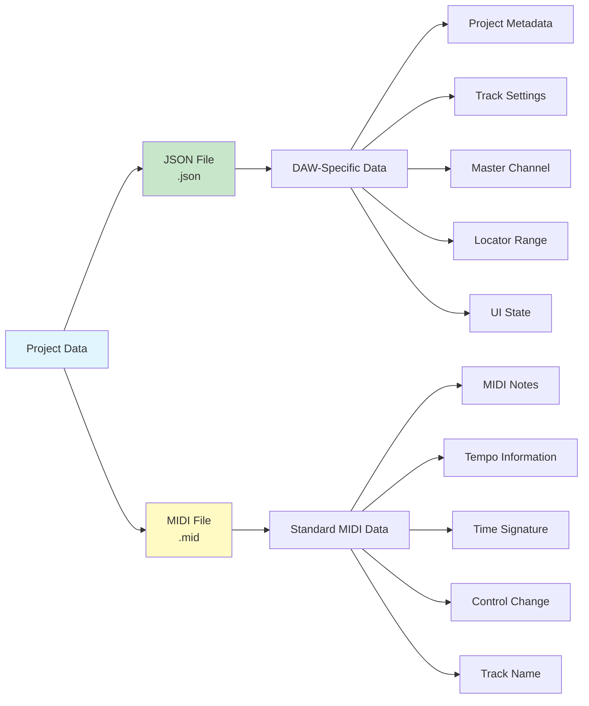
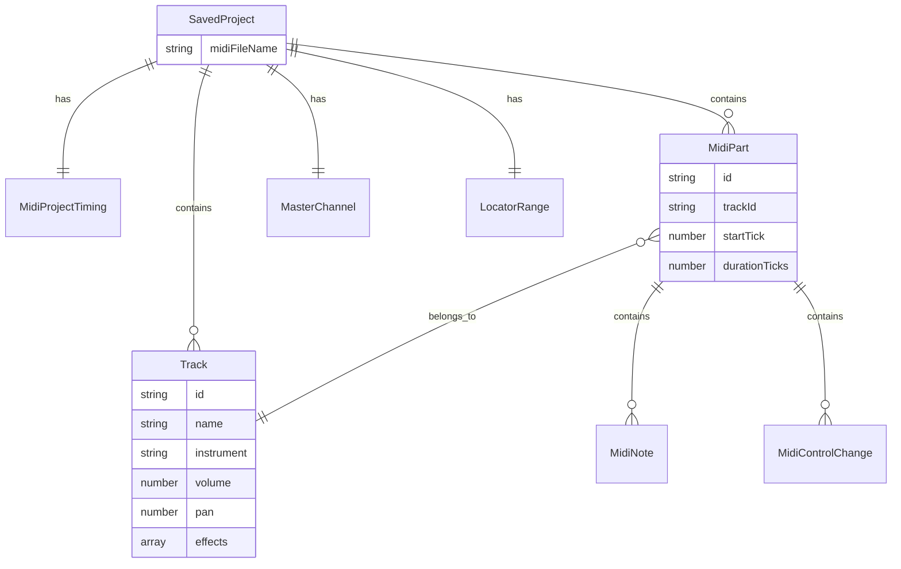
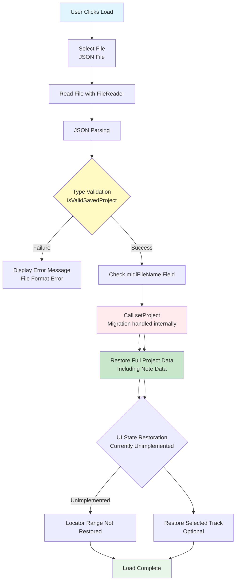

# Project Save/Load Specification

**Document Version**: 1.0  
**Software Version**: 0.1.0  
**Last Updated**: 2026-01-14

---

## Overview

This document is a design specification for the project save/load functionality of Online DAW. Projects are saved in two formats: JSON files and MIDI files, each serving different purposes.

## File Formats



### 1. JSON File (`.json`)
- **Purpose**: Store DAW-specific data not included in MIDI standard
- **Filename**: `project.json` (or user-specified)
- **Contains**:
  - Project metadata (version information)
  - Track settings (volume, panning, effects)
  - Master channel settings (volume, panning, effects)
  - Locator range (in seconds)
- UI state is not persisted (except export/locator range stored in JSON)

### 2. MIDI File (`.mid`)
- **Purpose**: Store music data in standard MIDI file format
- **Filename**: `project.mid` (or user-specified)
- **Contains**:
  - MIDI note data
  - Tempo information (BPM)
  - Time signature
  - Control Change events (e.g., Sustain CC64)
  - Track name (meta event)

## Data Classification

### Data Stored in JSON (Cannot be stored in MIDI)

#### 1. Track Settings
```typescript
interface Track {
  id: string;
  name: string;
  instrument: string;
  volume: number;        // 0.0 ~ 1.0
  pan: number;           // -1.0 ~ 1.0
  effects: Effect[];     // Effect chain
  solo: boolean;
  mute: boolean;
  mutedBySolo: boolean;
  previousMute?: boolean;
}
```

#### 2. Master Channel Settings
```typescript
{
  masterVolume: number;    // 0.0 ~ 1.0
  masterPan: number;       // -1.0 ~ 1.0
  masterEffects: Effect[]; // Master effect chain
}
```

#### 3. Locator Range
```typescript
{
  locatorStart: number;    // In seconds (initial value: null)
  locatorEnd: number;      // In seconds (initial value: null)
}
```

#### 4. Project Metadata
```typescript
{
  version: number;        // Project format version (current: 2)
  savedAt?: string;       // Save time in ISO 8601 format (optional)
  savedBy?: string;       // User information who saved (optional)
}
```

### Data Stored in MIDI

#### 1. Music Data
- MIDI notes (pitch, velocity, position, length)
- Control Change events
- Tempo events (BPM)
- Time signature events

#### 2. Track Information (Limited)
- Track name (Track Name meta event)

## Project Save Structure



### JSON File Structure

```typescript
interface SavedProject extends Project {
  // Related MIDI file information (optional)
  midiFileName?: string;  // MIDI filename saved together (e.g., "project.mid")

  // Export/locator range (in seconds)
  locatorStart?: number | null;
  locatorEnd?: number | null;
}
```

**Note:** In the current implementation, `midiParts` include full note data and optional `controlChanges`. The MIDI file is an optional export artifact, not a required storage source.

### Save Process

```mermaid
flowchart TD
    A[User Clicks Save] --> B[Collect Project Data]
    B --> B1[getProject: Project State]
    B --> B2[useUIState: Export Range (seconds)]
    
    B1 --> C[Determine Filename]
    B2 --> C
    C --> C1[Default Filename: project<br/>User-specifiable]
    
    C1 --> D[Create JSON File]
    D --> D1[Serialize Project Data]
    D1 --> D2[Include Full Project Data<br/>Including Note Data]
    D2 --> D3[Add Locator Values<br/>In Seconds]
    D3 --> D4[Add midiFileName Field<br/>e.g., project.mid]
    
    D4 --> E{Create MIDI File?<br/>Optional}
    E -->|Yes| E1[Call exportProjectToMidiFile]
    E -->|No| F[Download JSON File]
    E1 --> E2{Locator Range<br/>Set?}
    E2 -->|Yes| E3[Include Only That Range]
    E2 -->|No| E4[Include Full Project]
    E3 --> E5[Create MIDI File<br/>project.mid]
    E4 --> E5
    
    E5 --> F
    F --> F1[100ms Delay]
    F1 --> G[Download MIDI File<br/>Optional]
    
    style A fill:#e1f5ff
    style D fill:#c8e6c9
    style E fill:#fff9c4
    style F fill:#ffebee
```

1. **Collect Project Data**
   - Get current project state with `getProject()`
   - Get UI state with `useUIState()` (locator values)

2. **Determine Filename**
   - Default filename: `project` (user-specifiable)
   - JSON filename: `{filename}.json`
   - MIDI filename: `{filename}.mid`

3. **Create JSON File**
   - Serialize project data to JSON format
   - **Include full project data** (including note data)
   - Add export/locator range (in seconds)
   - Add `midiFileName` field with MIDI filename (e.g., "project.mid")
   - Filename: `{filename}.json`

4. **Create MIDI File** (Optional)
   - Use `exportProjectToMidiFile()`
   - If locator range is set, include only that range
   - Filename: `{filename}.mid` (matches `midiFileName` in JSON)
   - **Note**: In current implementation, JSON contains all data, so MIDI file is optional

5. **File Download**
   - Download JSON file first
   - Download MIDI file after 100ms delay (considering browser download limitations)
   - Both files use the same base filename and are saved together

## Project Load Structure

### Load Process



1. **Read JSON File**
   - Read JSON file with FileReader
   - JSON parsing and type validation
   - Check `midiFileName` field

2. **Restore Project**
   - Restore project state with `setProject()`
   - Migration processing (version compatibility)
   - **Note**: Automatic MIDI file loading is not implemented as JSON contains all project data (including notes)

3. **UI State Restoration**
   - **Note**: Current implementation has no locator range UI restoration logic
   - Restore selected track (optional)

### JSON File Validation

```typescript
// Actual implementation: only validates tracks, midiParts, timing
function isValidProject(obj: unknown): obj is Project {
  if (typeof obj !== 'object' || obj === null) {
    return false;
  }
  
  const project = obj as Record<string, unknown>;
  
  // Required field validation (based on actual implementation)
  const hasTracks = Array.isArray(project.tracks);
  const hasMidiParts = Array.isArray(project.midiParts);
  const hasTiming = project.timing !== undefined;
  
  return hasTracks && hasMidiParts && hasTiming;
}

// Note: version, midiFileName, etc. are currently excluded from validation
```

## Implementation Status

- Save/load is implemented in `src/components/Toolbar/SaveLoadButtons.tsx` (web + Electron).
- JSON save uses the in-memory `Project` plus `midiFileName` and `locatorStart`/`locatorEnd`.
- MIDI export uses `exportProjectToMidiFile` in `src/core/midi/MidiExporter.ts`.
- `src/core/midi/ProjectSaver.ts` and `src/core/midi/ProjectLoader.ts` are placeholders and not used yet.

## Data Migration

### Version Management

- **Version 1**: Legacy format (measure-based)
- **Version 2**: Current format (tick-based, SMF standard compliant)

### Migration Strategy

1. **Version Check**
   - Check `version` field in JSON file
   - If absent, treat as version 1

2. **Automatic Migration**
   - Use `migrateProjectAtLoad()` function
   - Convert measure → tick
   - Remove legacy fields

3. **Compatibility Maintenance**
   - Previous version files can still be loaded
   - Automatically converted to latest version

## Error Handling

### Errors on Save

- JSON serialization failure
- MIDI generation failure
- File download failure

### Errors on Load

- File format error
- JSON parsing failure
- Type validation failure
- Migration failure

### Error Messages

- Display user-friendly error messages
- Detailed error logs in console
- Automatic handling of recoverable errors

## Security Considerations

1. **File Validation**
   - File size limits
   - JSON structure validation
   - Prevent malicious code injection

2. **Data Integrity**
   - Type validation
   - Range validation (volume, panning, etc.)
   - Required field validation

## Performance Considerations

1. **Large Projects**
   - Optimize JSON file size
   - Exclude unnecessary data
   - Consider compression (optional)

2. **Loading Time**
   - Progressive loading (optional)
   - Loading indicator
   - Background processing

## Future Expansion Plans

1. **Cloud Storage**
   - Browser local storage
   - IndexedDB
   - Remote server synchronization

2. **Version Management**
   - Automatic backup
   - History management
   - Change tracking

3. **Collaboration Features**
   - Real-time synchronization
   - Conflict resolution
   - Permission management

## References

- [MIDI 1.0 Specification](../reference/midi-1.0-specification.en.md)
- [Standard MIDI File Format](../reference/standard-midi-file-format.en.md)
- [Project Type Definition](../../src/types/project.ts)

