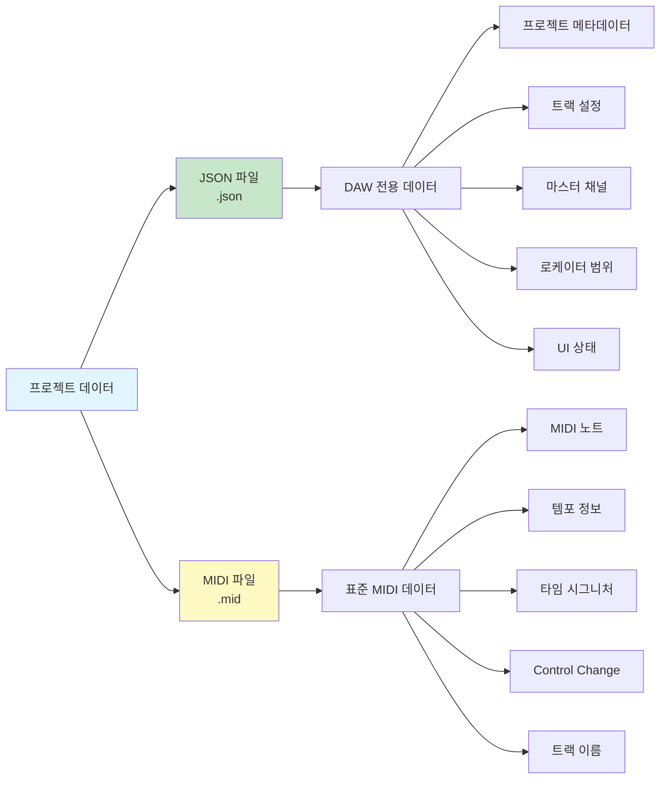
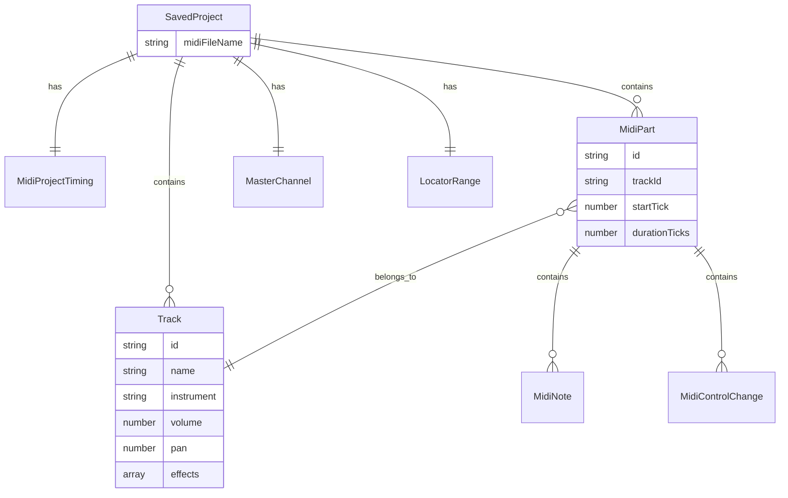
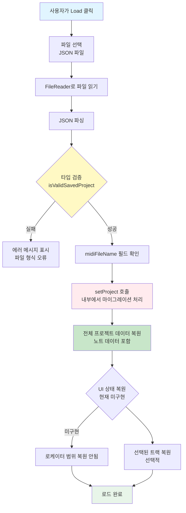

# 프로젝트 세이브/로드 명세서

**Document Version**: 1.0  
**Software Version**: 0.1.0  
**Last Updated**: 2026-01-14

---

## 개요

이 문서는 Online DAW의 프로젝트 세이브/로드 기능에 대한 설계 명세서입니다. 프로젝트는 JSON 파일과 MIDI 파일 두 가지 형식으로 저장되며, 각각 다른 목적을 가집니다.

## 파일 형식



### 1. JSON 파일 (`.json`)
- **목적**: MIDI 표준에 포함되지 않는 DAW 전용 데이터 저장
- **파일명**: `project.json` (또는 사용자 지정)
- **포함 데이터**:
  - 프로젝트 메타데이터 (버전 정보)
  - 트랙 설정 (볼륨, 패닝, 이펙트)
  - 마스터 채널 설정 (볼륨, 패닝, 이펙트)
  - 로케이터 범위 (초 기준)
- UI 상태는 저장되지 않음 (내보내기/로케이터 범위만 저장)

### 2. MIDI 파일 (`.mid`)
- **목적**: 표준 MIDI 파일 형식으로 음악 데이터 저장
- **파일명**: `project.mid` (또는 사용자 지정)
- **포함 데이터**:
  - MIDI 노트 데이터
  - 템포 정보 (BPM)
  - 타임 시그니처
  - Control Change 이벤트 (예: Sustain CC64)
  - 트랙 이름 (메타 이벤트)

## 데이터 분류

### JSON에 저장되는 데이터 (MIDI에 저장 불가능)

#### 1. 트랙 설정
```typescript
interface Track {
  id: string;
  name: string;
  instrument: string;
  volume: number;        // 0.0 ~ 1.0
  pan: number;           // -1.0 ~ 1.0
  effects: Effect[];     // 이펙트 체인
  solo: boolean;
  mute: boolean;
  mutedBySolo: boolean;
  previousMute?: boolean;
}
```

#### 2. 마스터 채널 설정
```typescript
{
  masterVolume: number;    // 0.0 ~ 1.0
  masterPan: number;       // -1.0 ~ 1.0
  masterEffects: Effect[]; // 마스터 이펙트 체인
}
```

#### 3. 로케이터 범위
```typescript
{
  locatorStart: number;    // 초 단위 (초기값: null)
  locatorEnd: number;      // 초 단위 (초기값: null)
}
```

#### 4. 프로젝트 메타데이터
```typescript
{
  version: number;        // 프로젝트 포맷 버전 (현재: 2)
  savedAt?: string;       // ISO 8601 형식의 저장 시간 (선택적)
  savedBy?: string;       // 저장한 사용자 정보 (선택적)
}
```

### MIDI에 저장되는 데이터

#### 1. 음악 데이터
- MIDI 노트 (피치, 속도, 위치, 길이)
- Control Change 이벤트
- 템포 이벤트 (BPM)
- 타임 시그니처 이벤트

#### 2. 트랙 정보 (제한적)
- 트랙 이름 (Track Name 메타 이벤트)

## 프로젝트 저장 구조



### JSON 파일 구조

```typescript
interface SavedProject extends Project {
  // 관련 MIDI 파일 정보 (선택적)
  midiFileName?: string;  // 함께 저장된 MIDI 파일명 (예: "project.mid")

  // 내보내기/로케이터 범위 (초 단위)
  locatorStart?: number | null;
  locatorEnd?: number | null;
}
```

**참고:** 현재 구현에서는 `midiParts`에 노트 데이터와 선택적 `controlChanges`가 모두 포함됩니다. MIDI 파일은 선택적으로 내보내는 산출물이며, 저장의 필수 소스가 아닙니다.

### 저장 프로세스

```mermaid
flowchart TD
    A[사용자가 Save 클릭] --> B[프로젝트 데이터 수집]
    B --> B1[getProject: 프로젝트 상태]
    B --> B2[useUIState: 내보내기 범위 (초)]
    
    B1 --> C[파일명 결정]
    B2 --> C
    C --> C1[기본 파일명: project<br/>사용자 지정 가능]
    
    C1 --> D[JSON 파일 생성]
    D --> D1[프로젝트 데이터 직렬화]
    D1 --> D2[전체 프로젝트 데이터 포함<br/>노트 데이터 포함]
    D2 --> D3[로케이터 값 추가<br/>초 단위]
    D3 --> D4[midiFileName 필드 추가<br/>예: project.mid]
    
    D4 --> E{MIDI 파일 생성?<br/>선택적}
    E -->|Yes| E1[exportProjectToMidiFile 호출]
    E -->|No| F[JSON 파일 다운로드]
    E1 --> E2{로케이터 범위<br/>설정됨?}
    E2 -->|Yes| E3[해당 범위만 포함]
    E2 -->|No| E4[전체 프로젝트 포함]
    E3 --> E5[MIDI 파일 생성<br/>project.mid]
    E4 --> E5
    
    E5 --> F
    F --> F1[100ms 지연]
    F1 --> G[MIDI 파일 다운로드<br/>선택적]
    
    style A fill:#e1f5ff
    style D fill:#c8e6c9
    style E fill:#fff9c4
    style F fill:#ffebee
```

1. **프로젝트 데이터 수집**
   - `getProject()`로 현재 프로젝트 상태 가져오기
   - `useUIState()`로 UI 상태 가져오기 (로케이터 값)

2. **파일명 결정**
   - 기본 파일명: `project` (사용자 지정 가능)
   - JSON 파일명: `{filename}.json`
   - MIDI 파일명: `{filename}.mid`

3. **JSON 파일 생성**
   - 프로젝트 데이터를 JSON 형식으로 직렬화
   - **전체 프로젝트 데이터 포함** (노트 데이터 포함)
   - 내보내기/로케이터 범위 (초 단위) 추가
   - `midiFileName` 필드에 MIDI 파일명 추가 (예: "project.mid")
   - 파일명: `{filename}.json`

4. **MIDI 파일 생성** (선택적)
   - `exportProjectToMidiFile()` 사용
   - 로케이터 범위가 설정되어 있으면 해당 범위만 포함
   - 파일명: `{filename}.mid` (JSON의 `midiFileName`과 일치)
   - **참고**: 현재 구현에서는 JSON에 모든 데이터가 포함되므로 MIDI 파일은 선택적

5. **파일 다운로드**
   - JSON 파일 먼저 다운로드
   - 100ms 지연 후 MIDI 파일 다운로드 (브라우저 다운로드 제한 고려)
   - 두 파일은 같은 기본 파일명을 사용하여 함께 저장됨

## 프로젝트 로드 구조

### 로드 프로세스



1. **JSON 파일 읽기**
   - FileReader로 JSON 파일 읽기
   - JSON 파싱 및 타입 검증
   - `midiFileName` 필드 확인

2. **프로젝트 복원**
   - `setProject()`로 프로젝트 상태 복원
   - 마이그레이션 처리 (버전 호환성)
   - **참고**: JSON에 모든 프로젝트 데이터(노트 포함)가 포함되어 있으므로 MIDI 파일 자동 로드는 구현되지 않음

3. **UI 상태 복원**
   - **참고**: 현재 구현에서는 로케이터 범위 UI 복원 로직이 없음
   - 선택된 트랙 복원 (선택적)

### JSON 파일 검증

```typescript
// 실제 구현: tracks, midiParts, timing만 검증
function isValidProject(obj: unknown): obj is Project {
  if (typeof obj !== 'object' || obj === null) {
    return false;
  }
  
  const project = obj as Record<string, unknown>;
  
  // 필수 필드 검증 (실제 구현 기준)
  const hasTracks = Array.isArray(project.tracks);
  const hasMidiParts = Array.isArray(project.midiParts);
  const hasTiming = project.timing !== undefined;
  
  return hasTracks && hasMidiParts && hasTiming;
}

// 참고: version, midiFileName 등은 현재 검증에서 제외됨
```

## 구현 현황

- 저장/로드는 `src/components/Toolbar/SaveLoadButtons.tsx`에서 구현됨 (웹 + Electron).
- JSON 저장은 메모리상의 `Project`에 `midiFileName`, `locatorStart`/`locatorEnd`를 추가해 저장함.
- MIDI Export는 `src/core/midi/MidiExporter.ts`의 `exportProjectToMidiFile`을 사용함.
- `src/core/midi/ProjectSaver.ts`와 `src/core/midi/ProjectLoader.ts`는 현재 플레이스홀더이며 사용되지 않음.

## 데이터 마이그레이션

### 버전 관리

- **버전 1**: 레거시 포맷 (measure 기반)
- **버전 2**: 현재 포맷 (tick 기반, SMF 표준 정합)

### 마이그레이션 전략

1. **버전 확인**
   - JSON 파일의 `version` 필드 확인
   - 없으면 버전 1로 간주

2. **자동 마이그레이션**
   - `migrateProjectAtLoad()` 함수 사용
   - measure → tick 변환
   - 레거시 필드 제거

3. **호환성 유지**
   - 이전 버전 파일도 로드 가능
   - 자동으로 최신 버전으로 변환

## 에러 처리

### 저장 시 에러

- JSON 직렬화 실패
- MIDI 생성 실패
- 파일 다운로드 실패

### 로드 시 에러

- 파일 형식 오류
- JSON 파싱 실패
- 타입 검증 실패
- 마이그레이션 실패

### 에러 메시지

- 사용자 친화적인 에러 메시지 표시
- 콘솔에 상세 에러 로그
- 복구 가능한 에러는 자동 처리

## 보안 고려사항

1. **파일 검증**
   - 파일 크기 제한
   - JSON 구조 검증
   - 악성 코드 주입 방지

2. **데이터 무결성**
   - 타입 검증
   - 범위 검증 (볼륨, 패닝 등)
   - 필수 필드 검증

## 성능 고려사항

1. **대용량 프로젝트**
   - JSON 파일 크기 최적화
   - 불필요한 데이터 제외
   - 압축 고려 (선택적)

2. **로딩 시간**
   - 점진적 로딩 (선택적)
   - 로딩 인디케이터
   - 백그라운드 처리

## 향후 확장 계획

1. **클라우드 저장**
   - 브라우저 로컬 스토리지
   - IndexedDB
   - 원격 서버 동기화

2. **버전 관리**
   - 자동 백업
   - 히스토리 관리
   - 변경 추적

3. **협업 기능**
   - 실시간 동기화
   - 충돌 해결
   - 권한 관리

## 참고 자료

- [MIDI 1.0 Specification](../reference/midi-1.0-specification.ko.md)
- [Standard MIDI File Format](../reference/standard-midi-file-format.ko.md)
- [Project Type Definition](../../src/types/project.ts)

